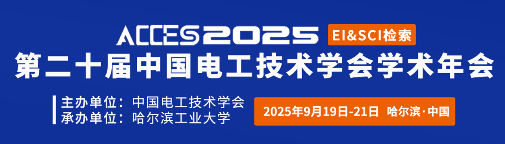

**阅读提示：本文约 2200 字** 
> 构建以电、氢为能量载体的耦合系统，是实现能源低碳转型的重要手段。现有研究主要考虑氢能以气态或液体的方式运输，但受限于氢能本身特性，气态运氢的储运密度低、储运容量有限；液态运氢需保持超低温环境，运输能耗高。此外，氢气在加压和运输过程中存在爆炸和泄漏等风险。
> 
> 
> 
> 三峡大学研究团队提出了基于氢能固态运输的电-氢综合能源系统运行架构，通过建立氢气的气-固两相转换模型和固态运氢车运输模型，提出基于氢能固态运输的电-氢综合能源系统调度方法。所提方法能有效地提升氢能运输效率和系统运行经济性。
**研究背景**
在全球能源低碳转型背景下，电-氢耦合系统作为清洁能源利用的重要形式备受关注。然而，现有研究面临两个关键挑战：首先，传统氢能储运方式存在明显缺陷，气态储运密度低、液态储运能耗高，且两种方式均存在泄漏和爆炸的安全隐患；其次，在不确定性处理方面，尽管信息间隙决策理论因其无需概率分布和波动范围的优势而备受关注，但其也存在无法量化评估随机变量波动对系统运行经济性影响的固有局限。因此，亟需针对上述挑战开展研究。
**论文所解决的问题及意义**
提出基于氢能固态运输的电-氢综合能源系统运行架构，能解决氢能储运密度低、运输过程存在的爆炸和泄漏风险等问题。采用隶属度信息间隙决策理论建立电-氢能源系统双层调度模型，能够解决传统信息间隙决策理论不能评估随机变量波动对运行经济性影响的问题。
**论文方法及创新点**
1、氢能固态运输模型
提出如图1所示的基于氢能固态运输的系统运行架构。通过Van’t Hoff方程建立气-固两相转换过程中压强和反应温度的关系，并根据改进含时间窗车辆路径问题构建氢能固态运输模型。
图1 基于氢能固态运输的EHIES运行架构
2、基于隶属度信息间隙决策理论的双层调度模型
上层模型优化目标为系统整体优化成本，下层模型优化目标为最小化风险寻求策略模型中联合不确定变量的波动范围或最大化风险规避策略模型中联合不确定变量的波动范围。双层调度模型结构如图2所示。
图2 基于M-IGDT的EHIES双层调度模型
3、算例分析
图3和图4分别表示隶属度信息间隙决策理论风险寻求策略和风险规避策略下的调度结果。在风险规避策略模型中，由于决策者对光照强度和风电出力不确定性呈悲观态度，与风险寻求策略和确定性模型相比，制氢厂在光照强度和风电出力较多的时刻大量制氢以应对可再生能源的波动，决策者以更加保守的调度策略牺牲了系统的经济性来保证系统的稳定运行。
图3风险寻求策略下EHIES调度结果
图4 风险规避策略下EHIES调度结果
**结论**
1）本文提出的调度策略能耦合电力、氢能、交通网络以及可再生能源发电，能够协同优化电力系统和氢能系统运行，提高系统经济性。
2）固态运氢车载氢容量大，是目前高压长管拖车的4-5倍。氢能固态运输在氢能输运方面具有显著经济优势，能降低系统运行成本10.15%。
3）隶属度信息间隙决策理论能够从经济性与鲁棒性两种角度量化评估可再生能源的不确定性，对系统的经济、可靠运行具有积极作用。
**团队介绍**
三峡大学电气与新能源学院新型电力系统智能运行与安全防御科研团队，依托新能源微电网湖北省协同创新中心于2020年创立，主要开展大规模可再生能源并网与消纳、新能源微电网运行与控制、复杂大电网的优化运行与安全防御等方面的研究。团队现有教授3名、副教授5名、博士后1名。团队成立以来，已获批国家级项目9项，发表SCI/EI论文100余篇，授权发明专利60余项，获省部级科研成果奖励5项。
谭洪
博士，“香江学者计划”博士后，硕士研究生导师，研究方向为综合能源系统优化运行与规划、虚拟电厂聚合调控、梯级水电站协同优化。
王宇炜
硕士研究生，研究方向为电氢综合能源系统协同优化。
王秋杰
副教授，博士，硕士研究生导师，一级建造师，研究方向为配电网故障诊断、配电网弹性提升、综合能源系统优化、需求侧响应等。