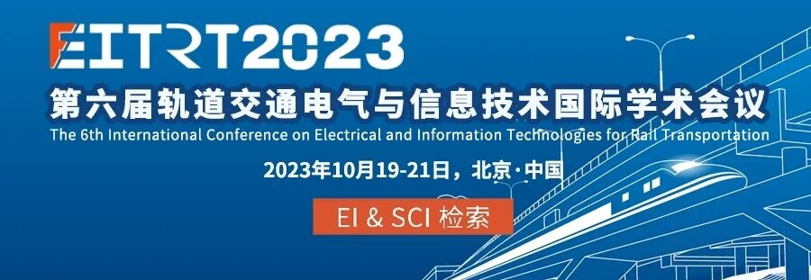
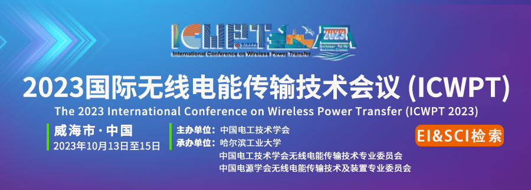

阅读提示：本文约2600 字
> 东北电力大学蔡国伟教授团队针对园区电-氢-热多能耦合系统低碳、经济、高效优化运行问题，将分布式与集中式能源相结合，提出了一种基于交替方向乘子法（ADMM）的园区电-氢-热能源双层能量优化调度方法，上层基于交替方向乘子法求解园区各建筑自身最小运行成本，下层基于混合整数规划求解全园区最小运行成本，实现了园区内多主体能源点对点能量精准最优交互和电-氢-热能源系统优化运行。
**研究背景**
随着能源低碳化转型和“双碳”目标的推进，减少煤炭资源利用，充分利用太阳能、风能等清洁能源已成为社会能源发展的共识。氢能具有无碳排放且可实现热电联供等的特点，可与电能、热能等多种能源形式互补，是实现“双碳”目标的重要途径。
以可再生能源为基础的电氢多能互补的园区能源系统将作为我国能源低碳化转型的重要支点，而开展园区电-氢-热低碳化能源系统经济优化调度研究，提高用户用能的灵活性与协调性、提升园区综合能源利用率已成为目前该领域研究中的重点。
**论文所解决的问题及意义**
本论文利用所提出的园区电-氢-热系统双层优化调度方法，能够精准求解各建筑可用于能量共享的交互功率值、各建筑间交互功率以及园区内各可控能源出力、园区碳减排量以及碳收益、园区对外灵活支撑能力。可有效解决目前存在的无法真正实现各主体并行求解、多主体系统无法做出点对点交互功率的精准调控、无法满足用户需求的多样性、未考虑园区对外的支撑能力和碳减排收益等问题，实现园区电-氢-热低碳化能源系统经济优化调度。
**论文方法及创新点**
**1）园区电-氢-热能源双层能量优化调度方法**
图1  双层优化调度模型示意图
上层优化基于交替方向乘子法，以园区建筑i与电网之间功率交互成本、设备运行维护成本、各建筑间功率交互成本及碳收益为综合成本最小为目标；下层优化基于混合整数规划数学模型，以园区与电网之间功率交互成本，设备运行维护成本、各建筑间功率交互成本及碳收益为综合成本最小为目标，构建双层优化调度模型，双层优化调度模型示意图如图1所示。
**2）基于ADMM的模型求解**
图2  基于ADMM的模型求解算法流程
基于ADMM的模型求解算法流程如图2所示，园区上层优化采取分布式算法根据系统输入的原始数据，各建筑自治求解优化问题得出建筑i在t时段与其他建筑的互济功率，并将建筑i在t时段在功率交互后的剩余功率和建筑i在t时段与其他建筑的互济功率作为输入传递给园区下层集中式优化，求取各设备最优出力以及各建筑交互功率精确值。
**3）算例分析**
图3  电氢园区能源系统结构
以吉林市某低碳产业园能源结构为例（如图3所示），进行算例分析。园区各建筑均装设有屋顶光伏，建筑1-4为工业建筑，铺设光伏容量400kWp，建筑5-8为办公/公寓建筑，铺设光伏容量50kWp，调度周期T为24h，以15min为一个时段，共96个。
图4(a) 园区内建筑1优化调度结果
图4(b) 园区内建筑2优化调度结果
图4(c) 建筑3优化调度结果
图4(d) 建筑4优化调度结果
图4(e) 建筑5优化调度结果
图4(f) 建筑6优化调度结果
图4(g) 建筑7优化调度结果
图4(h) 建筑8优化调度结果
图4(a)~(h)为园区内建筑1-8优化调度结果，经过分析可知，在各建筑无富余电能时，其负荷由电池储能、燃料电池、以及电网满足。在光伏资源充足时，其富余电能用于功率交互的同时，剩余功率由园区各能源设备和电网消纳。
园区内各集中能源设备除满足自身负荷外，在留有相应裕度的前提下应具有对外输出电能的能力，本文设置电池储能荷电状态和储氢罐氢水平在留有40%裕度的前提下，园区对外最大功率支撑为1000kW，最大电量支撑1200kWh。园区能源系统24小时碳减排总量为4.56吨，可获得的碳收益为547.2元。
**结论**
本文提出了一种基于交替方向乘子法的电氢系统双层优化调度方法。所提方法上层在交替方向乘子法的支持下，求解各建筑可用于能量共享的交互功率值，下层基于混合整数规划模型，根据系统运行经济性精准求解各建筑间交互功率以及园区内各可控能源出力。
算例分析表明，所提方法不但能够实现园区电-氢-热能源系统分布与集中联合优化调度、真正实现各主体并行求解、多主体系统点对点交互功率的精准调控，而且还可实现园区对外的电力/电量支撑和获得碳减排收益。
**团队介绍**
蔡国伟教授团队依托东北电力大学新能源电网智能化运行与控制吉林省工程实验室，团队成员20人，其中教授7人（包括国家百千万人才工程人选、青年长江学者等），副教授8人。团队始终面向国家能源战略重大需求，围绕重大科学问题和关键核心技术，开展多元研究：包括新型电力系统安全运行与稳定控制、大规模可再生能源接入、交直流电网电力电子技术、电力系统多形态储能技术、新型电力系统高电压与电磁兼容等。近年来，团队主持国家自然科学基金项目11项、国家重点研发计划课题6项、省部级项目20余项；获国家科技进步二等奖2项，吉林省科技进步一等奖2项、二等奖9项，发表高水平学术论文580余篇，获授权发明专利70余项。
孔令国
副教授，博士生导师，国家留学基金委“2019国际清洁能源拔尖创新人才培养项目”入选者，IEEE PES储能技术委员会氢储能技术分委会理事，中国能源研究会氢能专委会委员，电工技术学会氢能专委会委员，《中国电力》期刊首届青年编委。主要研究方向为电氢耦合理论与关键技术、氢储能在新型电力系统中的应用等。主持国家自然基金项目1项、国家重点研发计划项目子课题1项、省部级科研项目3项，获吉林省科技进步一等奖1项、二等奖3项，电氢耦合方面发表高水平学术论文40余篇，获授权发明专利7件、软件著作权1件。
史立昊
硕士研究生，研究方向为基于电氢耦合的园区系统优化运行。
石振宇
助理实验师，主要研究方向为低碳配电系统、电氢耦合经济性等。
蔡国伟
一级教授，博士生导师，吉林省政协副主席、东北电力大学校长、国家百千万人才工程人选、国务院政府特殊津贴获得者、全国先进工作者、全国优秀教师。主要研究方向为新型电力系统安全分析与运行控制、新能源电网接入、多形态储能技术等。主持国家自然科学基金项目4项，承担国家重点研发计划项目课题1项，获国家科技进步奖二等奖2项，吉林省科技进步一等奖2项、二等奖6项，发表高水平论文200余篇，授权发明专利50余项。