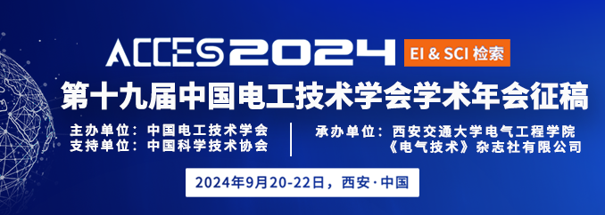

阅读提示：本文约 2000 字
> 电氢区域综合能源系统可靠性评估方法是电氢区域综合能源系统规划理论的关键组成部分，具有重要的理论研究价值和工程应用前景。现有可靠性评估方法未充分考虑氢能设备故障机理及其多状态运行特性、缺乏供氢可靠性水平量化评估指标。重庆大学电力和能源可靠性研究中心研究人员剖析了氢能设备运行特性与故障机理，建立了氢能设备多状态可靠性评估模型，提出了基于氢能设备多状态模型的电氢区域综合能源系统可靠性评估方法，实现了对电氢异质能源供给可靠性水平的准确量化。
**研究背景**
“双碳”战略目标下，我国能源系统清洁低碳转型迫在眉睫。电氢区域综合能源系统能够充分发挥氢能系统零碳、灵活、高效运行等优势，被认为是实现电力能源系统绿色低碳转型的关键路径之一。电氢区域综合能源系统可靠性评估方法可为系统规划与运行等提供科学的理论支撑与决策依据，指导氢能有序、健康发展。
**论文所解决的问题及意义**
氢能系统包含制氢、储氢、用氢、加氢等环节，涉及电解槽、储氢罐、燃料电池、加氢机等关键设备，且氢能设备故障机理复杂，而现有可靠性模型没有深入挖掘其多状态运行特征，难以准确评估系统的供能可靠性水平。
此外，电、氢、热等异质能源系统之间存在强耦合关系，目前尚缺乏有效的电氢区域综合能源系统可靠性评估方法及供氢可靠性评估指标，无法量化氢负荷供给可靠性水平，难以确定影响供氢可靠性的关键因素。因此，如何构建氢能设备可靠性模型，准确量化氢能等异质能源的供给可靠性成为电氢综合能源系统可靠性评估方法亟待解决的关键难题。
**论文方法及创新点**
氢能设备的故障状态将直接影响系统的运行状态。因此，首先在氢能设备层面，根据氢能设备运行特性与故障机理，建立氢能设备多状态可靠性评估模型。
氢能设备建模包括：1）揭示换热器管程故障对制氢效率的影响机理，建立考虑降额运行状态的碱性电解槽多状态模型；2）分析燃料电池组件故障与热电转化效率关系，建立考虑热电联产模式的燃料电池多状态模型；3）基于加氢机组故障和加氢机台数，建立加氢机组的多状态模型。
图1 碱性电解槽结构示意图及其多状态Markov模型
图2 质子交换膜燃料电池结构示意图及其多状态Markov模型
图3  加氢机组化简前后的多状态Markov模型+
在评估系统可靠性层面，基于氢能设备的可靠性评估模型，以弃风弃光惩罚成本和氢能等异质能源负荷削减惩罚成本之和最小为目标，综合考虑异质能量流约束和氢能设备运行约束等，建立了系统的最优负荷削减模型，以模拟设备故障状态下系统运行状态及氢能等负荷的缺供量，并基于马尔科夫链蒙特卡洛法，建立了电氢区域综合能源系统可靠性评估方法。
图4 电氢区域综合能源系统结构示意图
仿真结果表明，本文所提碱性电解槽和加氢机组的多状态模型能够充分考虑其降额运行状态造成的氢负荷削减，避免过高地估计供氢可靠性水平；所提燃料电池多状态模型能够充分考虑燃料电池热电联产模式对供热可靠性的贡献，避免过低地估计供热可靠性水平。
表1  不同方法下电氢区域综合能源系统可靠性评估指标
此外，通过计算得到典型算例中各类设备的供氢贡献度指标，从中可以看出：电力线路和风光机组对系统供氢贡献度之和达到了32.61%，这是因为电力设备的随机故障会导致电解槽缺乏电能制氢，从而导致氢负荷的供应不足。
而电解槽对系统供氢贡献度指标高达53.72%，这是因为电解槽作为系统中唯一的制氢设备，其降额运行状态和故障停运状态均会造成较大的氢能供应缺额。由此说明电力设备和电解槽是影响供氢可靠性的关键因素。
图5 设备供氢贡献度指标
**结论**
本文建立了碱性电解槽、热电联产燃料电池和加氢机组的多状态模型，提出了供氢可靠性评估指标及电氢区域综合能源系统可靠性评估方法，并通过算例仿真验证了本文模型及方法的有效性和适应性。
**作者介绍**
任洲洋
副教授，博士生导师，研究方向为电氢综合能源系统、电力系统概率分析与人工智能。承担国家级、省部级及横向项目30余项，发表SCI/EI论文80余篇，申请/授权国家发明专利50余项。先后担任IEEE Trans. on Smart Grid、IEEE Trans. on Sustainable Energy等6本国际知名期刊副编辑，获省部级奖励3项，入选重庆英才-青年拔尖人才计划，获IEEE Trans. on Sustainable Energy Outstanding Associate Editor of 2022等荣誉。
王皓
硕士研究生，研究方向为配电网运行与规划、电氢区域综合能源系统可靠性评估。
姜云鹏
博士研究生，研究方向为配电网新能源消纳、区域综合能源系统等。
李文沅
中国工程院外籍院士、加拿大工程院院士、IEEE Life Fellow。研究方向为电力系统可靠性与规划、电力系统大数据。发表论文300余篇，完成技术报告100余个，出版中英文专著6本。先后荣获IEEE PES Roy Billinton 电力可靠性奖、国际PMAPS成就奖、加拿大IEEE杰出工程师奖、加拿大IEEE电力勋章奖等。