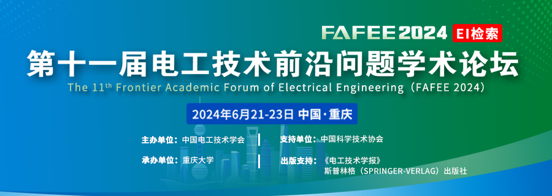

阅读提示：本文约 1800 字
> 以电氢为核心的区域综合能源系统被认为是最具前景的区域终端能源系统形态，对促进能源系统低碳转型具有重要意义，但目前尚未系统性地考虑氢能系统热回收利用对氢能产、储、用等过程以及综合能源系统运行的影响。重庆大学电力和能源可靠性研究中心低碳电力能源系统课题组考虑氢能设备变效率、多工况的运行特征，研究不同类型氢能设备的产热特性和热回收原理，提出了考虑氢能系统热回收的电氢区域综合能源系统日前优化运行方法。仿真实验结果验证了所提方法的有效性。
**研究背景**
随着“双碳”目标的提出，我国能源系统清洁低碳转型迫在眉睫。以电氢为核心的区域综合能源系统被认为是最具前景的区域终端能源系统形态，对促进能源系统低碳转型具有重要意义，而电氢区域综合能源系统优化运行方法是保障电、氢系统安全、经济、高效运行的关键基础。
**论文所解决的问题及意义**
目前鲜有研究分析氢能系统产热特性及其对综合能源系统运行的影响，因此，难以充分挖掘氢能系统的灵活、经济运行潜力，而仅有的对氢能系统热回收的研究主要停留在设备层级，尚未系统性地考虑氢能系统热回收利用对氢能产、储、用等过程以及综合能源系统运行的影响。另外，对氢能设备多工况运行等特性的刻画不足，无法准确表征氢能系统与电力系统、供热系统的协调互动能力。因此，亟需深入研究氢能系统层级的热回收模型与利用机制，充分挖掘氢能系统的灵活运行潜能，大幅提高电氢区域综合能源系统经济运行水平。
**论文方法及创新点**
氢能系统运行过程中的电化学反应和甲烷化反应均为放热反应，会产生大量余热。为准确刻画氢能系统的热回收利用能力，重庆大学电力和能源可靠性研究中心低碳电力能源系统课题组基于热力学方程和设备工作原理，考虑多工况和变效率运行特征建立低温电解水、高温电解水、甲烷化设备和氢燃料电池的热回收运行模型。
图1 低温电解水与高温电解水热回收机理图
图2 甲烷化设备与氢燃料电池热回收机理图
基于氢能系统热回收模型，建立电氢区域综合能源系统运行架构。本文以日运行成本最小为目标，综合考虑氢能系统热回收下的电、氢、热耦合运行特征，电、氢、热异质能量平衡约束以及各类设备安全运行约束，建立电氢区域综合能源系统日前优化运行方法，促进电、氢、热多种能源协同运行，提高电氢区域综合能源系统的运行效率。
图3 电氢区域综合能源系统运行架构
仿真结果表明，氢能系统通过热能回收利用，降低了CHP机组的热能输出压力，从而有效提高CHP机组发电功率的调节范围，为风电消纳提供空间。可见，氢能系统热回收能够有效促进电、热协同运行，缓解CHP机组电、热耦合运行特征，促进风电消纳。
图4 不考虑氢能系统热回收与考虑氢能系统热回收
考虑氢能系统热回收后，系统运行成本大幅降低。含低温电解水的综合能源系统运行成本降低了24.9%，含高温电解水的综合能源系统运行成本降低了18.6%。氢能系统热回收降低了CHP机组的供热需求和弃风量，从而减少了购气成本和购电成本，大幅提高系统运行的经济性。此外，热回收可以显著提升氢能设备能效，低温电解水、高温电解水、氢燃料电池和甲烷化的绝对能效增量分别达到23.8%、14.1%、33.3%、12.6%。
表1 不同场景下的系统运行结果（单位：万元）
**结论**
本文基于热力学方程和物理反应原理建立氢能系统热回收模型；提出了电-热-氢多能协同运行架构，建立了考虑氢能系统热回收的电氢区域综合能源系统日前优化运行模型。最后，通过算例仿真验证了所提方法的优越性。
**团队介绍**
重庆大学电力和能源可靠性研究中心低碳电力能源系统课题组长期致力于低碳电力能源系统的控制、运行、规划；结合人工智能技术、大数据分析技术，在电力系统负荷预测、风光预测领域开展了基础研究以及工程应用。近年来，该团队完成了多个国家，省和电网企业的研究项目。
罗潇
硕士研究生，研究方向为低碳电力能源系统。
任洲洋
副教授，博士生导师，研究方向为电氢综合能源系统、电力系统概率分析与人工智能。承担国家级、省部级及企业横向项目30余项，发表SCI/EI论文80余篇，申请/授权国家发明专利50余项。先后担任IEEE Trans. on Smart Grid、IEEE Trans. on Sustainable Energy等6本国际知名期刊副编辑，获省部级奖励3项，入选重庆英才-青年拔尖人才计划，获IEEE Trans. on Sustainable EnergyOutstanding Associate Editor of 2022等荣誉。
温紫豪
硕士研究生，研究方向为低碳电力能源系统。