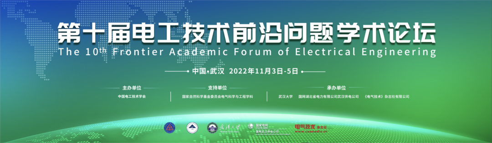
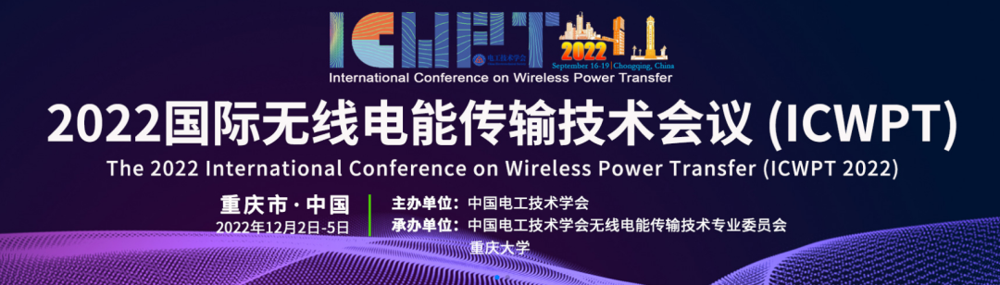
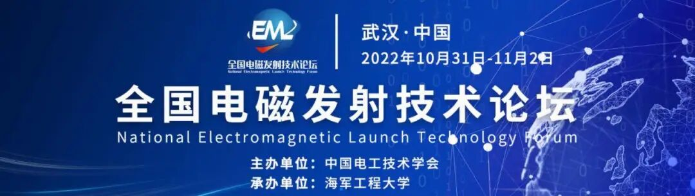

中国电工技术学会活动专区
CES Conference
 

中国电工技术学会团体标准T/CES 141-2022《电化学储能用锂离子电池系统》由中国电工技术学会储能技术专业分会提出，北京海博思创科技股份有限公司、新源智储能源发展（北京）有限公司等单位起草编制完成。该标准规范了电化学储能用锂离子电池系统，含适用范围、技术条件、试验方法、出厂检验要求以及标志、包装、运输。
**1\. 标准起草单位及主要起草人**
**（1）起草单位**
北京海博思创科技股份有限公司、新源智储能源发展（北京）有限公司、北方工业大学、国网综合能源服务集团有限公司、北京卫蓝新能源科技有限公司、中国北方车辆研究所、北京理工大学、中国华能集团清洁能源技术研究院、国网智能电网研究院有限公司、中国长江三峡集团有限公司、南方电网科学研究院有限责任公司、天目湖先进储能技术研究院有限公司、上海兰钧新能源科技有限公司、北京海博思创工程技术有限公司、北京凌碳检测科技有限公司。
**（2）主要起草人**
钱昊、王垒、戚送送、吕喆、刘骁、李建林、马速良、王楠、李振、王慧、俞会根、向晋、胡道中、田君、刘琦、刘明义、曹曦、徐丽、李慧、王倩、雷博、龚文明、郑杰允、程威、张春园、陈喆、阴朝阳。
**2\. 标准制定背景**
电池簇是储能系统中非常重要的组成部分，其产品质量对于整个系统性能的发挥，以及安全性有着重要的影响。随着行业的发展，各个层级均存在以商品型式出现的可能，目前已有标准涉及产品簇产品的检测规范较少。
《电化学储能用锂离子电池系统》的编制根据行业的相关特点，同业界专家、相关单位进行多次讨论研究，，可以为电池系统方面的检测提供必要的规范依据，有利于给各企业在实际检验中起到指导的作用。
**3\. 标准主要内容**
**（1）范围**
本标准规定了电化学储能用锂离子电池系统，含适用范围、技术条件、试验方法、出厂检验要求以及标志、包装、运输。本标准适用于固定式电化学储能用锂离子电池系统，包括大规模储能电站、分布式储能电站的储能系统电池系统。
**（2）规范性引用文件**
本导则主要引用的文件主要包括：
- GB/T 191 包装储运图示标志
- GB/T 2828.1 计数抽样检验程序 第1部分：按接收质量限（AQL）检索的逐批检验抽样计划
- GB/T 31467.2-2015 电动汽车用锂离子动力蓄电池包和系统 第2部分：高能量应用测试规程
- GB/T 36276-2018 电力储能用锂离子电池
- GB/T 36548-2018 电化学储能系统接入电网测试规范
- GB 38031-2020 电动汽车用动力蓄电池安全要求
**（3）术语及定义**
主要包括电池单体、电池模块、电池系统、电池管理系统等26项术语的定义。
**（4）技术要求**
主要包括一般要求、基本性能、安全性能、BMS功能要求。
**（5）试验方法**
主要包括试验条件、电池系统试验、BMS功能试验。
**（6）检验规则**
主要包括检验分类、检验项目及样品数量、出厂检验要求及抽检方法、型式试验。
**（7）标志、包装、运输和储存**
主要包括标志、包装、运输、储存。
 **4. 标准制定效益**
该标准规范了电化学储能用锂离子电池系统的要求。目前储能系统相关企业采用“GB/T 36276-2018 电力储能用锂离子电池”标准对电化学储能用锂离子电池系统进行检验，具体包括外观检验、初始充放电能量试验、绝缘性能试验和耐压性能试验这四项测试，此标准缺少更为详细的安全及BMS等要求。
本标准的制定重点是建立了电化学储能用锂离子电池系统的专项规范要求，补充完善和扩展了基本性能、安全性能和BMS功能要求。为电池系统方面的检测提供必要的规范依据，促进储能产品的质量保证，对行业的发展具有十分积极的意义。
******************************以上标准购买请联系中国电工技术学会  010-63256997******************************
诚聘英才
**一、单位简介**
中国电工技术学会是经民政部注册登记，由电气工程领域科技工作者自愿组成的全国性、学术性、非营利性法人社团。学会行政主管为国务院国有资产监督管理委员会，业务主管为中国科学技术协会。学会主要业务包括国内外学术交流、期刊出版、科技咨询、团体标准研制、国际合作、科技展览、会员发展与服务管理等。
学会标准化工作办公室主要开展的团体标准项目工作，立足于电气工程技术前沿，以服务行业技术进步为宗旨，围绕环境保护、节能减排、智能电网、新能源发电、核能发电、电动汽车充换电设施、特高压等急需标准制修订的重点领域、新兴领域，以快速高效满足市场需求和响应技术创新为目标，及时吸纳科技创新成果，促进科技成果的市场化和产业化。
**二、岗位及人员需求**：标准化工作办公室1-2人。
**三、应聘条件**
- 电气工程相关专业本科及以上学历；
- 热爱学会工作，珍惜工作的荣誉感和成就感；
- 工作态度认真负责，有服务意识和团队精神，具有较强的沟通能力和写作能力；
- 勤于思考，善于总结，具有较强的学习意识和学习能力。
有意应聘者请将个人简历（附照片）发送至**sunyi@ces.org.cn**邮箱。如需了解更多信息，欢迎访问中国电工技术学会网站http://www.ces.org.cn
**中国电工技术学会**
**新媒体平台**
学会官方微信
电工技术学报
CES电气
学会官方B站
CES TEMS
今日头条号
学会科普微信
新浪微博
抖音号