> 
> 
> 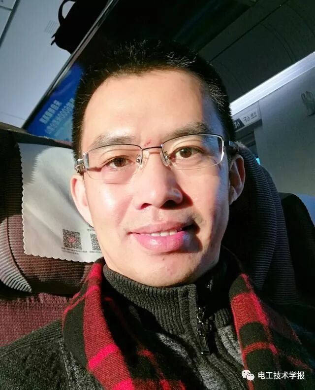
> 
> **陈永翀**，中国科学院电工研究所研究员、储能技术研究组组长
> 
> 
> 
> 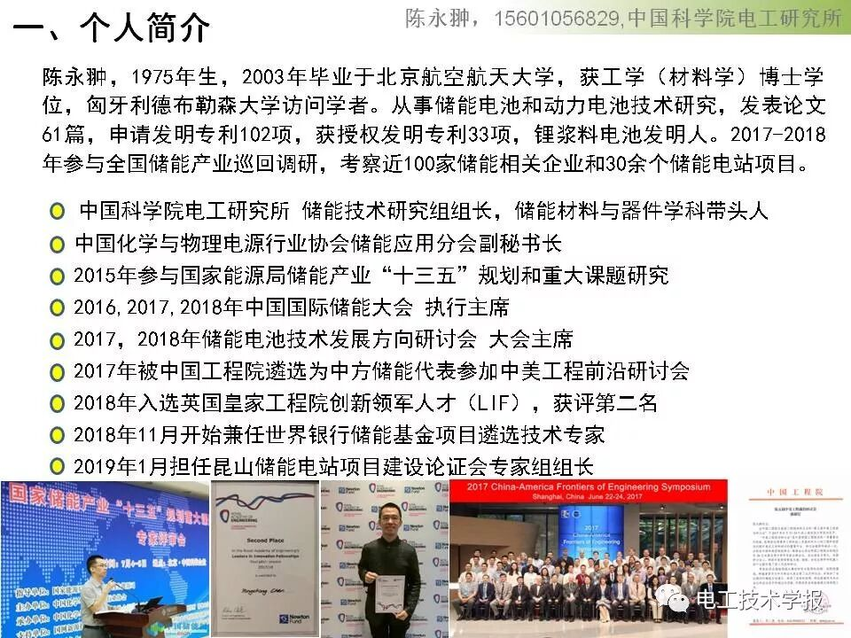 
> 
> 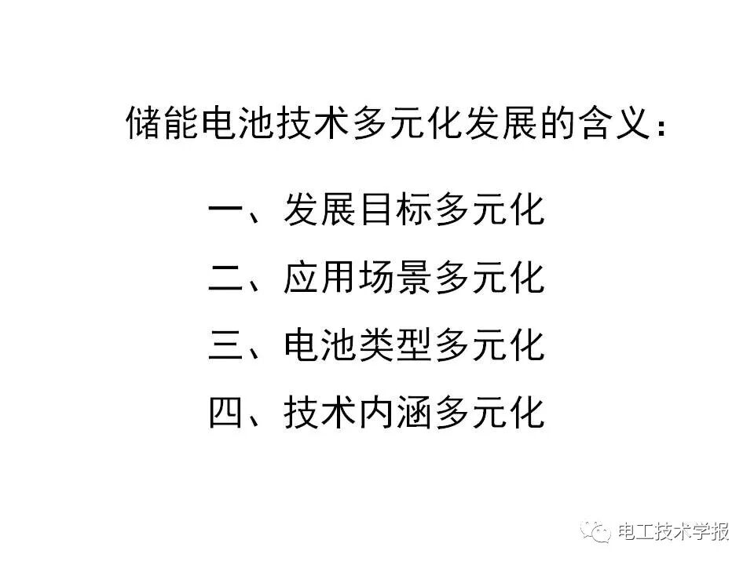
> 
> 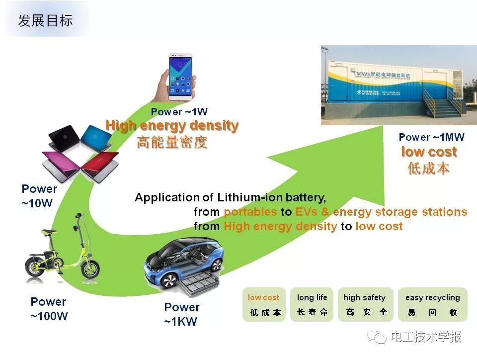
> 
> 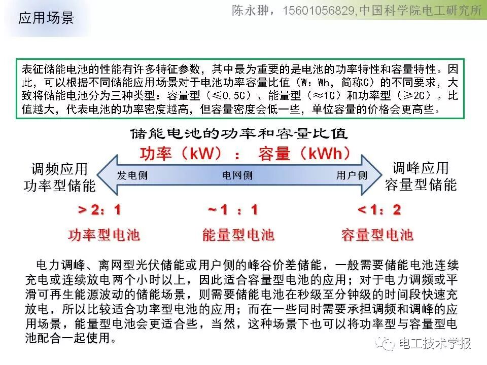
> 
> 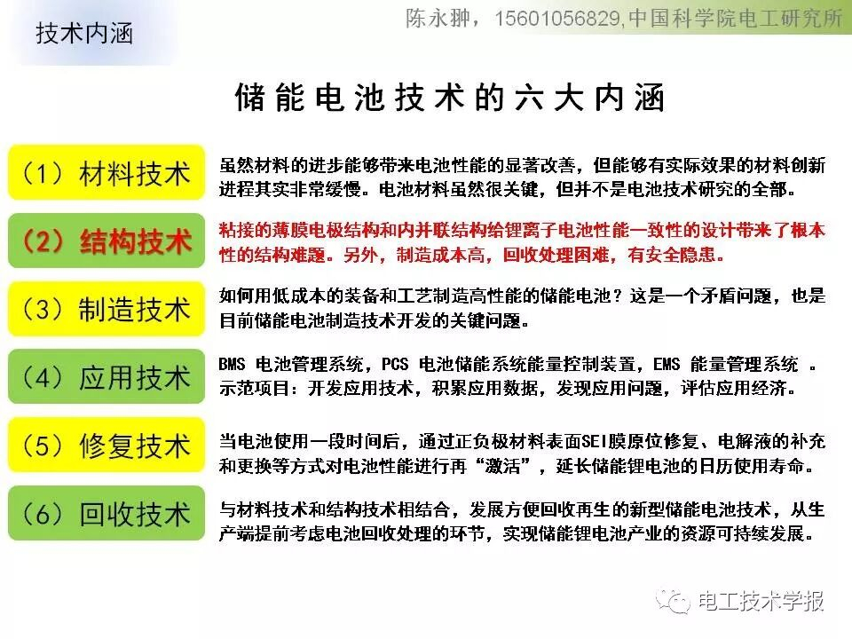
> 
> 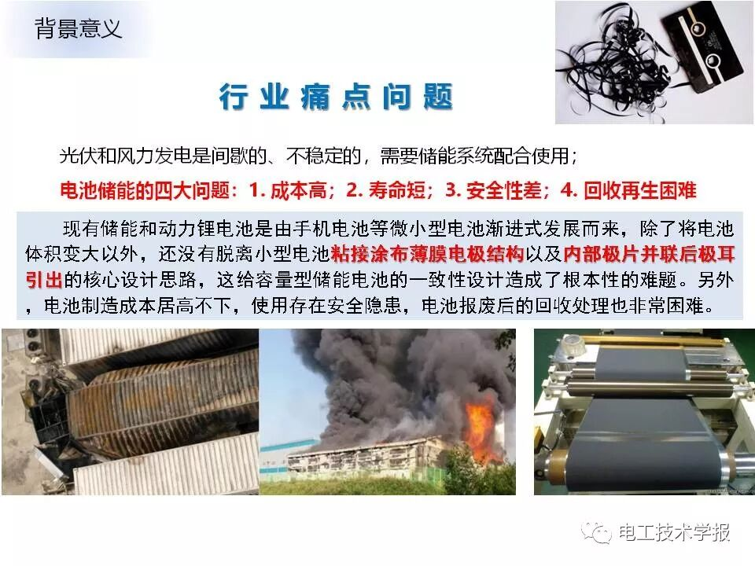
> 
> 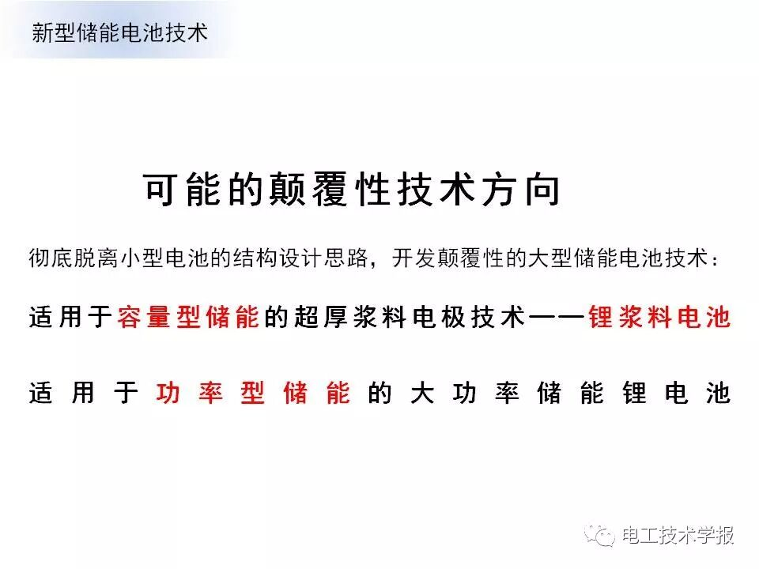
> 
> 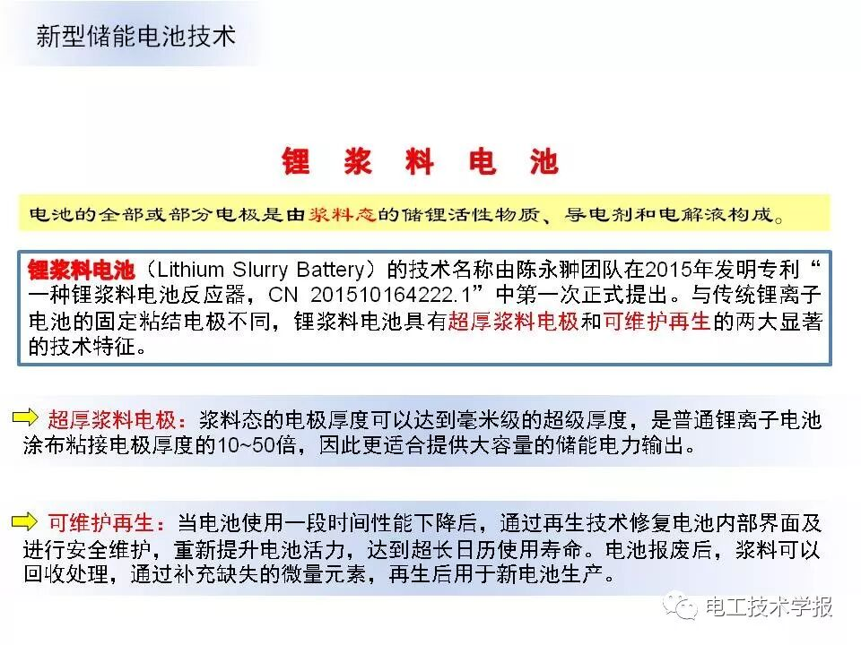
> 
> 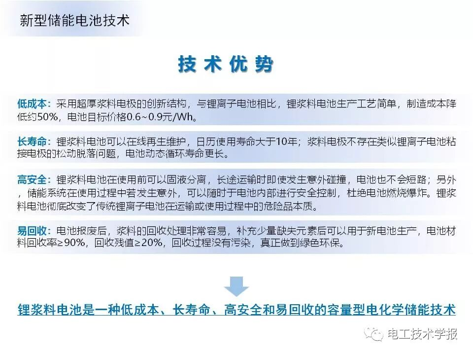
> 
> 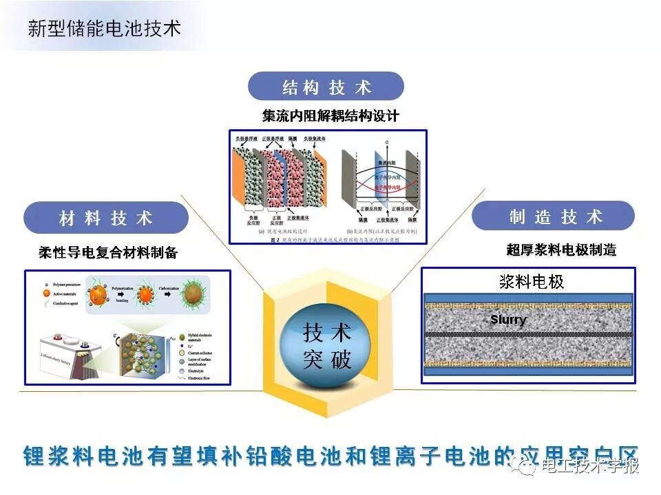
> 
> 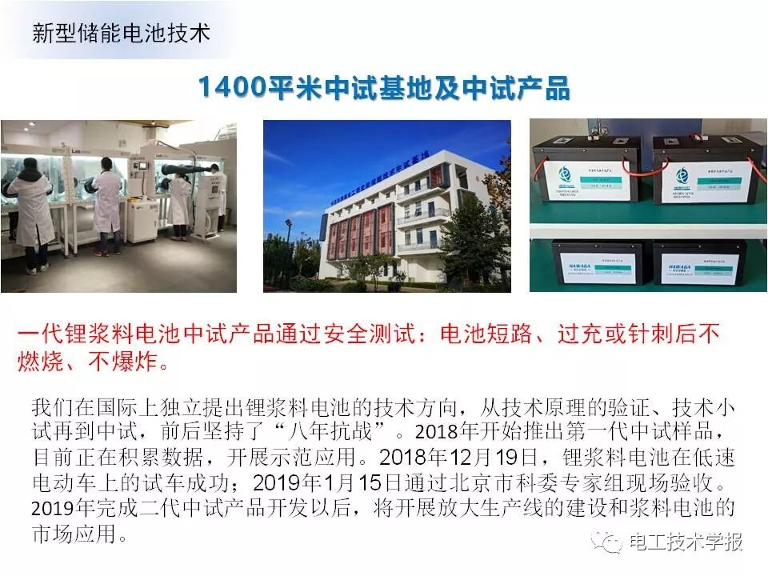
> 
> 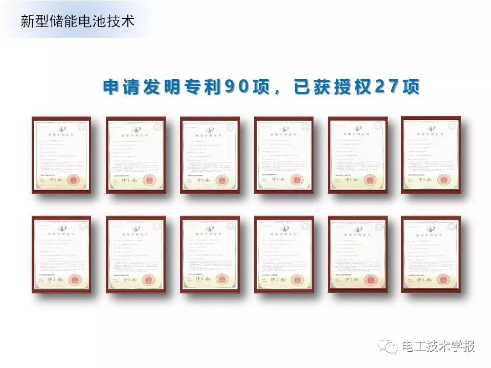
> 
> 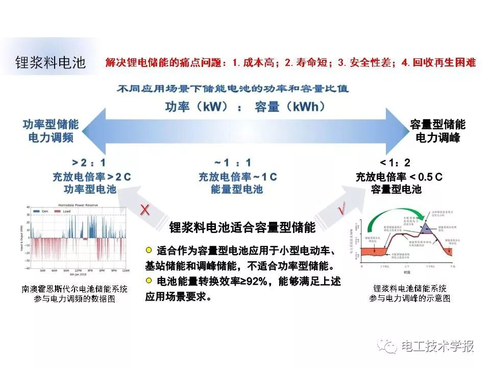
> 
> 
> 
> 
> 
> 总  结
> 
> 
> 
> 一、储能的春天已经来临，但产业蓬勃发展的夏季还远未到来。各类储能技术已经开展商业或示范应用，在应用中展现了储能的优势，也逐渐暴露了一些问题，尤其是电化学储能技术，距离“低成本、长寿命、高安全、易回收”的发展目标还有相当的差距，有待技术的颠覆性创新和突破。
> 
> 
> 
> 二、有必要彻底脱离原有小型电池的设计思路，开发颠覆性的大型储能电池结构技术，在此基础上结合材料研究，创新开发低成本的制造技术、安全延寿的修复技术和绿色环保的回收技术，以满足不同储能应用场景的需求，支撑储能产业的创新突破发展。
电工技术学报
010-63256949/6981（编辑）
010-63256994（编务）
010-63256817（订阅）
邮箱：dgjsxb@vip.126.com
电气技术
010-63256943（编辑）
010-63256994（编务）
010-63256817（订阅）
邮箱：dianqijishu@126.com
索取样刊
长按左侧二维码