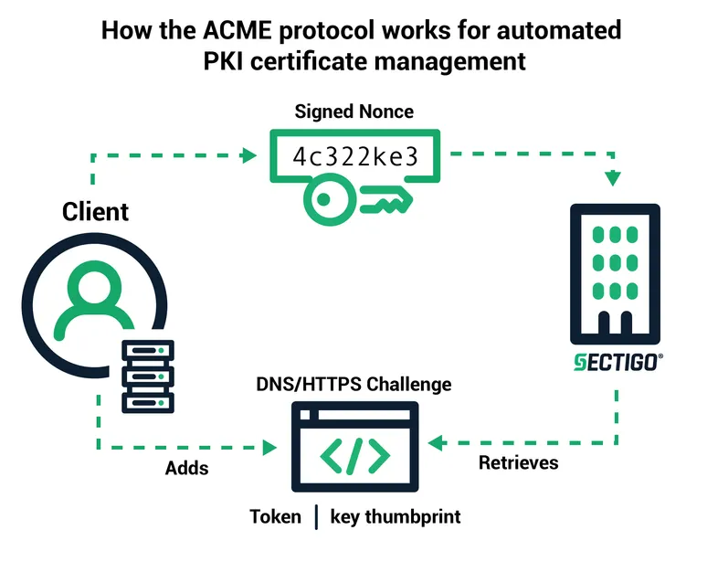

# ACME 协议是什么


> 原文地址: [https://mp.weixin.qq.com/s/b0iwQdWTfmOjWn\_atbINAw](https://mp.weixin.qq.com/s/b0iwQdWTfmOjWn_atbINAw)

   
编辑

这张图在讲 **ACME（Automatic Certificate Management Environment）协议**：一种让客户端（你的服务器/脚本）用**标准化 API** 自动向 CA（证书颁发机构，比如图里的 Sectigo，也可以是 Let’s Encrypt 等）申请、验证域名控制权、签发、续期、吊销证书的协议。

* * *

## 1) ACME 协议是什么（解决什么问题）

传统申请 HTTPS 证书要人手操作：生成 CSR、提交、验证域名、下载证书、定期续期。  
**ACME 把这整套流程变成自动化的“机器对机器”交互**，特点是：

-   自动化：申请/续期/替换证书可无人值守
    
-   安全：所有请求都用账号私钥签名（JWS），防篡改、防冒名
    
-   可验证：CA 通过 Challenge（挑战）确认你确实控制了域名
    
-   标准协议：不同 CA 都能用同一套交互逻辑（细节略有差异）
    

  

* * *

## 2) 图里各元素代表什么

图里有三个核心点：

### A. Client（客户端）

就是 ACME Client，例如：Certbot、acme.sh、lego、Caddy 内置 ACME 客户端等。它负责：

-   管理你的 **ACME 账户私钥**（account key）
    
-   发起申请、处理挑战、生成 CSR、拉取证书、续期
    

### B. CA（证书机构，图示 Sectigo）

提供 ACME 服务端：

-   下发挑战任务（DNS/HTTPS Challenge）
    
-   主动“取证”验证你是否控制域名
    
-   验证通过后签发证书
    

### C. Signed Nonce（签名用随机数）

图上“Signed Nonce”很关键：  
ACME 要求每个请求带一个 **nonce（一次性随机数）**，并把请求整体用账号私钥做 **JWS 签名**。作用：

-   防止别人把你之前的请求抓包后**重放**（replay attack）
    
-   确保请求是“新鲜的”、且确实来自持有私钥的一方
    

  

* * *

## 3) 图中流程怎么走（按图的箭头解释）

图里主要描述“验证域名控制权”的那段（Challenge）：

1.  客户端向 CA 获取 Nonce  
      CA 返回一个 nonce（一次性值）。
    
2.  客户端用账号私钥签名请求（JWS）  
      客户端发起“我要给 `example.com` 申请证书”的请求，带 nonce 并签名。
    
3.  CA 返回 Challenge（DNS/HTTPS Challenge）  
      CA 会说：想证明你控制这个域名，请完成一个挑战。常见两种：
    

-   HTTP-01 / HTTPS-01（图里写 DNS/HTTPS）：在网站某个固定路径放一段内容
    
-   DNS-01：在 DNS 里创建一个 TXT 记录
    
      
    

5.  客户端 Adds（按要求“放置证明材料”）  
      图里写 “Adds Token | key thumbprint”：
    

-   HTTP-01：放到 `http://你的域名/.well-known/acme-challenge/<token>`
    
-   DNS-01：写到 `_acme-challenge.你的域名` 的 TXT 记录里
    
-   CA 会给一个 **token**
    
-   客户端要把 `token + 账号公钥指纹(thumbprint)` 组合成 **key authorization**（可理解为“证明串”）
    
-   然后把它放到指定位置：
    
      
    

7.  CA Retrieves（CA 来“取证”）  
      CA 自己去访问你的网站路径或查询你的 DNS，看能否拿到正确的证明串。
    
8.  验证通过 → 签发证书  
      验证通过后，后续 ACME 还会有“finalize + 提交 CSR + 下载证书链”等步骤（图里没画全），最终客户端拿到证书和中间链并部署。
    

  

* * *

## 4) 你需要记住的 ACME 关键概念（面试/实现都常考）

-   Account Key（账户密钥）：你在 CA 那边的“身份”，所有请求靠它签名
    
-   Nonce + JWS：防重放 + 防篡改，ACME 的安全骨架
    
-   Order / Authorization / Challenge：
    

-   Order：一次申请订单（可能包含多个域名 SAN）
    
-   Authorization：每个域名的控制权授权
    
-   Challenge：授权的具体验证方式（HTTP/DNS/TLS 等）
    
      
    

-   验证本质：CA 不是“相信你”，而是“自己去验证你能控制域名的关键入口（HTTP 或 DNS）”。
    

我把“图里的 ACME 流程”扩展成一套**完整的 ACME 时序**（从注册账户到拿到证书），并把每一步在协议里对应的对象、请求/响应要点讲清楚。你看完基本就能自己实现一个 ACME client 了。

* * *

## 0) 先建立整体心智模型：ACME 的 5 个核心对象

-   Directory：入口索引（告诉你各种 API URL 在哪）
    
-   Account：你的 ACME 账户（由 account key 标识）
    
-   Order：一次证书申请“订单”（里面包含要签发的域名列表）
    
-   Authorization：对某个域名的“控制权授权”
    
-   Challenge：授权里的具体验证题（HTTP-01 / DNS-01 / TLS-ALPN-01 等）
    

你可以把它理解成：  
**Order = 申请单**；每个域名要做一次 **Authorization**；授权通过靠 **Challenge**。

* * *

## 1) 入口：拿 Directory + 首个 Nonce

### 1.1 GET Directory

客户端先 GET CA 的 directory URL，拿到：

-   newNonce：获取 nonce 的地址
    
-   newAccount：注册账户
    
-   newOrder：创建订单
    
-   revokeCert / `keyChange` 等
    

  

### 1.2 HEAD newNonce

对 `newNonce` 做一次 HEAD（或 GET）  
CA 在响应头给你 `Replay-Nonce`。

> 图里 “Signed Nonce” 就是这玩意：每个 ACME 请求都要带新的 nonce。

* * *

##   

## 2) 注册/恢复账户：newAccount（JWS 签名）

客户端生成一对 **account key**（RSA/ECDSA 都行），然后发 `newAccount`：

-   请求是 **JWS**（JSON Web Signature），里头包含：
    

-   protected：alg、nonce、url、jwk 或 kid
    
-   payload：请求数据（同意服务条款等）
    
-   signature：用 account private key 对上述签名
    
      
    

CA 返回：

-   账户 URL（以后用 `kid` 引用它）
    
-   账户状态（valid / deactivated …）
    

* * *

##   

## 3) 创建订单：newOrder（申请哪些域名）

用账户身份（kid）发 `newOrder`，payload 里写：

-   identifiers: 例如 `[{type:"dns", value:"example.com"}, {type:"dns", value:"www.example.com"}]`
    

CA 返回一个 Order，其中包括：

-   authorizations: 每个域名一个 authorization URL
    
-   finalize: 最后提交 CSR 的 URL
    
-   status: pending / ready / processing / valid / invalid
    

* * *

##   

## 4) 做域名控制权验证：Authorization → Challenge（图的核心）

对每个 `authorization` URL：

### 4.1 GET Authorization

你会看到：

-   identifier: 域名
    
-   status: pending/valid/invalid
    
-   challenges: 可能给你 HTTP-01、DNS-01、TLS-ALPN-01 多选一
    

###   

### 4.2 选一种 Challenge（最常见两种）

#### A) HTTP-01（网站路径放文件）

CA 给你：

-   token
    
-   challenge url
    

客户端要生成 **keyAuthorization**：

-   形式：`token + "." + base64url(thumbprint(accountKey))`
    
-   然后把它放到：
    

-   http://<domain>/.well-known/acme-challenge/<token>
    
-   内容就是 keyAuthorization 字符串
    
      
    

#### B) DNS-01（DNS TXT 记录）

客户端同样先得到 keyAuthorization，然后算：

-   dnsValue = base64url( SHA256(keyAuthorization) )  
      把 TXT 记录写到：
    
-   \_acme-challenge.<domain> = `dnsValue`
    

> 图里 “Token | key thumbprint” 就是这一步：token + 账户公钥指纹（thumbprint）生成证明材料。

###   

### 4.3 通知 CA：我准备好了（respondToChallenge）

对该 challenge 的 URL 发一个 JWS POST（payload 通常是 `{}` 或空对象），意思是：

-   “我已经把证明材料放好了，你来验证吧。”
    

###   

### 4.4 CA Retrieves（图里右下角）

CA 会主动去：

-   HTTP-01：抓你网站的固定路径
    
-   DNS-01：查你的 TXT 记录
    

然后你轮询：

-   GET Authorization 或 GET Order  
      直到变成 `valid`。
    

* * *

##   

## 5) 提交 CSR：finalize（准备签发）

当所有 authorization 都 `valid` 后，Order 变 `ready`，你就可以：

### 5.1 生成证书私钥 + CSR

-   证书私钥：server key（跟 account key 不同，别混）
    
-   CSR：包含 CN/SAN（example.com, www.example.com…）
    

###   

### 5.2 POST finalize

把 CSR（base64url）提交给 `finalize` URL。

CA 订单状态会变：

-   processing → `valid`
    

并给你 `certificate` URL。

* * *

##   

## 6) 下载证书链：GET certificate

对 `certificate` URL 做 GET：

-   拿到 PEM（leaf + chain）或可选格式  
      然后你部署到 Nginx/Apache/你的服务里。
    

* * *

##   

## 7) 续期/自动化要点（为什么 ACME 能“自动续”）

-   证书快到期时，客户端重复：newOrder → challenge → finalize → 下载
    
-   很多客户端会复用账户（account key 不变）
    
-   DNS-01 特别适合：
    

-   泛域名 `*.example.com`
    
-   没有公网可访问 HTTP 的内网机器
    
      
    

* * *

## 8) 对照图的“最短解释版本”

图实际强调的是这一段闭环：

1.  CA 发 nonce → 2) 客户端签名请求 → 3) CA 下发 challenge（token）
    
2.  客户端把 `token + thumbprint` 生成证明材料并“Add”到 DNS/HTTP
    
3.  CA 来 “Retrieve” 验证 → 6) 验证通过才会签发证书
    

用 **Certbot** 来把图里的 ACME 流程“实操一遍”。我给你按最常见的 3 种场景写成可复制命令，并且每一步都对应到图里的 **nonce → challenge → CA retrieves → 签发**。

* * *

## 场景 A：你有公网网站（80/443 能访问），用 HTTP-01（最常用）

> 对应图里的 **HTTPS/HTTP Challenge**：Certbot 会在 `/.well-known/acme-challenge/` 放 token，CA 来抓取验证。

### 1) 安装（Ubuntu/Debian 示例）

```
sudo apt update sudo apt install -y certbot 
```

  

### 2) 方式 1：Nginx 自动改配置（推荐）

```
sudo apt install -y python3-certbot-nginx sudo certbot --nginx -d example.com -d www.example.com 
```

  

### 3) 方式 2：Apache 自动改配置

```
sudo apt install -y python3-certbot-apache sudo certbot --apache -d example.com -d www.example.com 
```

  

### 4) 方式 3：你的 Web 不想被改配置（standalone）

> 需要 **80 端口空闲**（会临时起一个小 http server）

```
sudo certbot certonly --standalone -d example.com -d www.example.com 
```

  

### 证书输出位置（Debian/Ubuntu）

-   证书：`/etc/letsencrypt/live/example.com/fullchain.pem`
    
-   私钥：`/etc/letsencrypt/live/example.com/privkey.pem`
    

* * *

## 场景 B：你要泛域名 `*.example.com` 或服务器没法开 80/443 —— 用 DNS-01

> 对应图里的 **DNS Challenge**：Certbot 让你加 TXT 记录，CA 去 DNS 查。

### 1) 手动 DNS（最通用）

```
sudo certbot certonly --manual --preferred-challenges dns \ -d example.com -d "*.example.com" 
```

  

它会提示你加一条 TXT：

-   记录名：`_acme-challenge.example.com`
    
-   记录值：一串很长的文本（就是图里 token/thumbprint 派生出来的证明）
    

加好后回车继续，Certbot 会让 CA 去 “Retrieves”。

> 手动模式续期不够自动化；想自动续期，建议用 DNS API 插件（见下一条）。

###   

### 2) DNS API 自动化（以 Cloudflare 举例）

```
sudo apt install -y python3-certbot-dns-cloudflare 
```

  

准备 Cloudflare API Token 文件（示例）：

```
sudo mkdir -p /root/.secrets/certbot sudo nano /root/.secrets/certbot/cloudflare.ini 
```

  

内容类似：

```
dns_cloudflare_api_token = YOUR_TOKEN 
```

  

权限：

```
sudo chmod 600 /root/.secrets/certbot/cloudflare.ini 
```

  

签发：

```
sudo certbot certonly --dns-cloudflare \ --dns-cloudflare-credentials /root/.secrets/certbot/cloudflare.ini \ -d example.com -d "*.example.com" 
```

  

* * *

## 场景 C：你已经有 Web 服务在跑，但不想动 Nginx/Apache，也不想停服务 —— 用 webroot

> Certbot 只往你的网站根目录写验证文件，不改你的配置（前提：该目录能被公网访问到）。

```
sudo certbot certonly --webroot -w /var/www/html \ -d example.com -d www.example.com 
```

  

* * *

## 续期（自动化）怎么验证

Let’s Encrypt 常见有效期 90 天，Certbot 通常会装好定时任务（systemd timer 或 cron）。你可以手动 dry-run 验证一次：

```
sudo certbot renew --dry-run 
```

  

查看定时器（如果是 systemd）：

```
systemctl list-timers | grep certbot 
```

  

* * *

## 把命令和“图里的流程”对上号（你就能真正看懂它在干嘛）

-   Signed Nonce：Certbot 每次请求前会去 ACME 目录拿 nonce，并用账户私钥做 JWS 签名
    
-   DNS/HTTPS Challenge：
    

-   HTTP-01：写入 `/.well-known/acme-challenge/<token>`
    
-   DNS-01：写入 `_acme-challenge` TXT
    
      
    

-   CA Retrieves：CA 会主动访问你的 URL 或查询 DNS 来验证
    
-   验证通过 → 签发：Certbot 生成 CSR → finalize → 下载 fullchain/privkey
    

* * *

## 常见踩坑速查

-   Connection refused / Timeout：80/443 没打通、防火墙/安全组未放行、域名没指到这台机
    
-   Invalid response from .../.well-known/...：站点反代/重写规则把挑战路径拦了；用 `--nginx` 通常能自动处理
    
-   DNS-01 失败：TXT 没生效/TTL 未刷新/写错记录名（必须 `_acme-challenge`）
    
-   standalone 失败：80 端口被占用（nginx/apache 正在监听）
    

  

# 工作原理总结：关键概念和分步流程

ACME 的核心在于通过挑战来证明域控制权，同时使用密码学进行身份验证。您提供的图表与挑战阶段非常吻合，但以下是完整的流程：

1.  客户设置和账户注册 ：
    

-   ACME 客户端（例如 Certbot）为帐户生成密钥对（公钥/私钥）。
    
-   它联系 CA 的目录端点以发现 API 资源。
    
-   客户通过向 CA 发送其公钥来注册帐户。
    
-   为了防止重放攻击（恶意重新发送旧请求），CA 会在其响应中提供一个 **nonce** （一个随机的、一次性使用的数字）。客户端必须使用其私钥在后续请求中包含并签名此 nonce，以证明其对密钥对的所有权并确保其有效性。这就是您图中“签名 nonce”的含义——客户端经过身份验证后发起流程的请求。
    
      
    

3.  证书申请（订单创建） ：
    

-   客户端创建证书签名请求 (CSR)，指定新证书的域和公钥。
    
-   它使用自己的私钥对 CSR 进行签名，并将其连同签名后的 nonce 一起发送给 CA 进行验证。
    
-   CA 验证签名，并根据每个域的需求提供所需的授权。
    
      
    

5.  通过挑战进行领域验证 ：
    
      
      具体挑战类型（与图中的 DNS/HTTPS 相关）：
    

-   客户端在 \_acme-challenge.<domain> 添加一条 TXT 记录，其中包含密钥授权的 base64 编码的 SHA-256 哈希值。
    
-   CA 向 DNS 查询以检索和验证记录。
    
-   对于内部系统来说更安全，但由于 DNS 传播的原因，速度较慢。
    
-   客户端将密钥授权（令牌 + "." + 指纹）放置在 http://<domain>/.well-known/acme-challenge/<token> 的文件中。
    
-   CA 发出 HTTP GET 请求来检索和验证它。
    
-   适用于非通配符域名；速度快，但需要开放 80 端口。
    
-   HTTP-01 挑战 ：证明对 Web 服务器的控制权。
    
-   DNS-01 挑战：证明对 DNS 记录的控制权（对于 \*.example.com 等通配符是必需的）。
    
-   要颁发域名验证证书，证书颁发机构 (CA) 必须确认客户端控制该域名。它会发出质询，客户端选择一个质询（例如，HTTP-01 或 DNS-01）。
    
-   CA 会为挑战提供一个**令牌** （一个随机字符串）。
    
-   客户端计算**密钥授权** ，该授权是将令牌与**账户密钥指纹** （公钥的 base64 编码 SHA-256 哈希值）连接起来。此指纹将挑战与客户端账户关联起来，防止账户被劫持。
    
-   客户通过将此密钥授权放置在适当的位置来“完成”挑战。
    
-   CA 会轮询或检索该令牌以进行验证。这与您图表中的“添加令牌 | 密钥指纹”和“检索”箭头相对应，其中客户端修改 DNS/HTTPS，而 Sectigo（CA）对其进行检查。
    
      
    

7.  证书签发与续期 ：
    

-   验证通过后，CA 会颁发签名证书并将其发送回去。
    
-   客户端将其安装在服务器上。
    
-   续订是自动的：客户检查到期日（例如，30 天前），然后重复该过程，重新使用帐户密钥。
    
      
    

9.  撤销（如有必要） ：客户可以使用账户密钥签署请求来请求撤销；CA 会更新撤销列表。