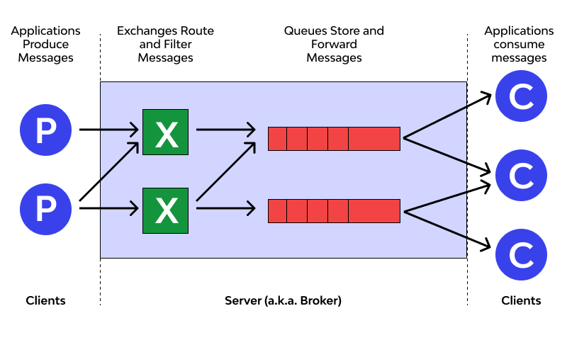
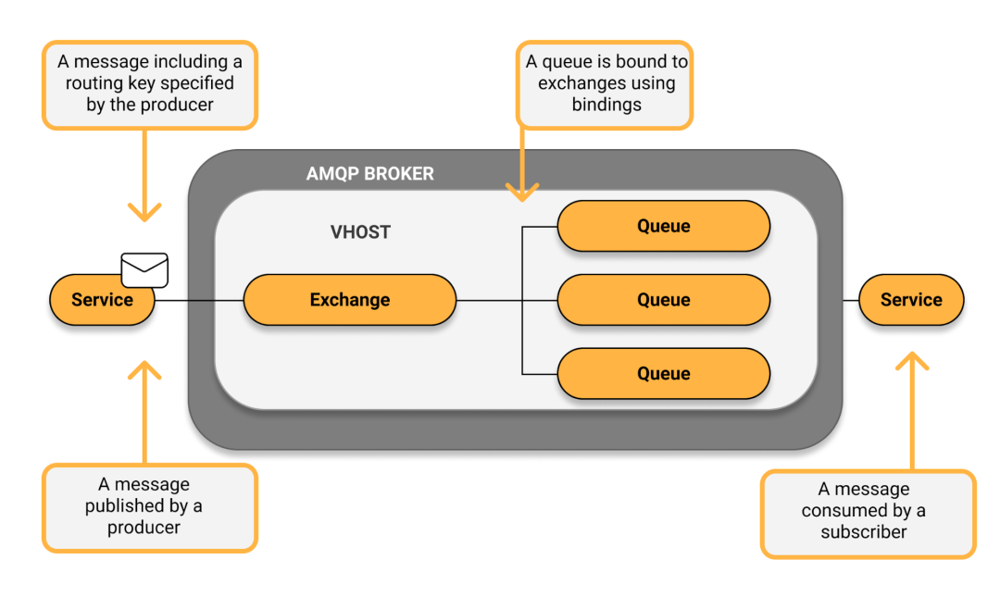

# AMQP协议——（1）基本概念

> 原文地址: [https://mp.weixin.qq.com/s/Vpdn1bFbGbCplAyEifyM7w](https://mp.weixin.qq.com/s/Vpdn1bFbGbCplAyEifyM7w)

从图里可以把 AMQP（更常见落地是 AMQP 0-9-1 / RabbitMQ 的那套）最核心的模型一句话概括出来：

**Producer（生产者 P）把消息发给 Exchange（交换机 X），Exchange 按规则路由到 Queue（队列），Consumer（消费者 C）从队列取走并处理。** Broker（服务器）负责把这套流程可靠地跑起来。

下面按图逐块把 AMQP 的基本概念讲清楚。

* * *

## 1) Broker（消息代理 / 服务器）

图中间大框就是 **Broker**：它不是“传递一次就完事”的转发器，而是负责：

-   接收生产者发布的消息
    
-   依据路由规则分发
    
-   对队列做持久化/堆积/过期/死信等管理
    
-   负责投递给消费者，并处理确认、重投、限流等
    

* * *

## 2) Producer（生产者）

左侧的 **P** 是生产者。AMQP 里生产者通常不会“直接把消息发进某个队列”，而是：

-   publish 到 exchange
    
-   带上一个 **routing key（路由键）** 和一些 **properties/headers（属性与头）**
    

这样生产者和具体队列解耦：队列怎么拆分、怎么扩容、怎么加新消费者，生产者不需要改代码或很少改。

* * *

## 3) Exchange（交换机）：路由与过滤的核心

图里绿色 **X** 写着 “Route and Filter Messages”，这就是交换机的职责：**只做路由，不存消息**（消息存储在队列里）。

交换机通过两样东西决定“往哪儿发”：

-   binding（绑定关系）：exchange 与 queue 之间的连接规则
    
-   routing key / headers：消息携带的路由信息
    

常见交换机类型（理解它们，就理解了 AMQP 的路由能力）：

-   direct：routing key 精确匹配 → 指定队列（点对点/按键分发）
    
-   topic：通配符匹配（如 `order.*.paid`）→ 适合事件总线
    
-   fanout：广播 → 绑定到它的所有队列都收到
    
-   headers：按 headers 条件匹配（较少用）
    

> 图里有两个 Exchange，表达的是：同一 Broker 中可以有多个交换机，各自承担不同业务域的路由规则；也可以把消息按不同规则送入不同队列。

* * *

## 4) Queue（队列）：存储、缓冲与投递

红色长条就是 **Queue**，它负责：

-   缓存消息（消费者来不及处理时在这里堆积）
    
-   按顺序投递（同一队列通常按入队顺序投递，具体受重投/优先级等影响）
    
-   在多个消费者之间做竞争消费（见下一节）
    

队列常见属性/能力（AMQP 系统设计常用）：

-   durable（持久化队列）：Broker 重启队列还在
    
-   message persistence（消息持久化）：消息标记为持久，配合 durable 队列才能“更可靠”
    
-   TTL / expires：消息或队列过期策略
    
-   DLX（死信交换机）：消息被拒收/过期/队列满等可转入死信队列
    
-   max-length / overflow：队列长度上限与溢出策略
    

* * *

## 5) Consumer（消费者）：从队列取消息（而不是从交换机）

右侧三个 **C** 表示消费者客户端。关键点是：

### 竞争消费（Competing Consumers）

图里一个队列连到多个消费者：这表示 **同一个队列上的多消费者是“负载均衡”关系**——一条消息通常只会被其中一个消费者处理，用来横向扩展吞吐。

如果你想让“每个消费者都收到一份”，不是多 consumer 绑同一 queue，而是：

-   用 **fanout/topic exchange + 多个 queue**（每个 consumer 绑定自己的 queue），这样每个队列各得一份。
    

* * *

## 6) 可靠性语义：Ack / 重投 / Confirm

AMQP 之所以常用在“可靠消息”场景，核心机制是确认链路：

### 消费端确认（Consumer Ack）

-   ack：处理成功，Broker 才把这条消息从队列移除
    
-   nack/reject：处理失败，可选择重回队列（重投）或丢弃/死信
    

这带来常见语义：

-   at-least-once（至少一次）：最常见（可能重复，需要业务幂等）
    
-   如果你自动确认或不确认，可能变成 **at-most-once（至多一次）**
    

### 生产端确认（Publisher Confirm）

生产者可以开启 **confirm**：Broker 确认已接收并处理了发布（至少到 exchange/路由层面），生产者才认为发送成功，用来避免“网络卡一半，不知道发没发出去”。

* * *

## 7) 流控与吞吐：Channel、prefetch、backpressure

AMQP 连接模型常见是：

-   一个 TCP **Connection** 里复用多个 **Channel**（轻量逻辑通道）
    
-   消费端用 **prefetch（QoS）** 控制一次最多拿多少未确认消息，避免单个消费者把消息“拿爆内存”或处理不过来
    
-   队列堆积就是天然的 **削峰填谷**（buffer/backpressure）机制
    

* * *

## 8) “一次说清”的映射关系（按图背下来就行）

-   P：Producer 发布消息
    
-   X：Exchange 只路由不存储
    
-   红条：Queue 存储、排队、投递
    
-   C：Consumer 从队列消费（同队列多消费者=负载均衡）
    
-   Broker：承载连接、路由、存储、确认、重投、权限隔离等一切运行机制
    

## 消息流程

  
编辑

这张图把 **AMQP（典型是 RabbitMQ/AMQP 0-9-1）的一次“发布→路由→入队→消费”链路**画得很标准，重点强调了 **routing key、bindings、vhost 隔离** 这三件事。

* * *

## 图中组件对应含义

### 1) Service（左）= Producer（发布者）

-   左侧 Service 产生一条消息（信封图标）。
    
-   发布（publish）时会携带 routing key（图左上气泡：_“a message including a routing key specified by the producer”_）。
    
-   注意：Producer **不是直接把消息发进队列**，而是发给 Exchange。
    

### 2) AMQP Broker（中间大灰框）

Broker 就是消息代理服务器，负责：

-   接入连接、认证授权
    
-   执行交换机路由逻辑
    
-   把消息存入队列、持久化、堆积
    
-   投递给消费者并处理 ack/nack、重投等
    

### 3) VHOST（虚拟主机）

灰框里还有一层 “VHOST”：

-   它是 Broker 内的**逻辑隔离空间**，相当于“同一台 RabbitMQ 里多个独立的命名空间/租户”。
    
-   Exchange、Queue、Binding 都是 **隶属于某个 vhost** 的；权限也通常按 vhost 分配。
    

### 4) Exchange（交换机）

-   图中 vhost 里有一个 Exchange。
    
-   它职责是 **“路由/过滤”**，本身**不存消息**。
    
-   Exchange 会根据：
    

-   Producer 提供的 **routing key**
    
-   以及预先配置好的 **bindings（绑定规则）**  
      来决定把消息投递到哪些队列。
    
      
    

### 5) Bindings（绑定）

图右上气泡写着：_“A queue is bound to exchanges using bindings”_：

-   binding就是“队列和交换机之间的路由规则连接”。
    
-   绑定里通常也会带匹配条件（例如 binding key / pattern，或 headers 条件），用于匹配 routing key。
    

### 6) Queues（队列，右侧三个）

-   同一个 exchange 可以把消息路由到 **多个队列**（图中 3 个 Queue）。
    
-   队列负责 **存储与缓冲**：消费者慢了就堆积在队列里。
    
-   这也表达了一个常见模式：**同一条消息可以被复制到多个队列**（前提是路由规则命中多个 binding），从而让不同下游服务各自消费一份。
    

### 7) Service（右）= Consumer / Subscriber（订阅者/消费者）

-   右侧 Service 从队列中 **consume** 消息（图右下气泡：_“A message consumed by a subscriber”_）。
    
-   现实里消费还会涉及 **ack 确认**、失败重试、死信队列等（图没画，但属于完整投递语义的一部分）。
    

* * *

## 这张图表达的“流程”（按箭头走一遍）

1.  Producer 生成消息，选择一个 Exchange，并携带 **routing key** 发布出去。
    
2.  Exchange 收到消息后，查找它与各个 Queue 之间的 **bindings**。
    
3.  routing key 命中哪些 binding，就把消息投递到对应的 Queue（可以是 0/1/多个）。
    
4.  Consumer 从自己的队列中取消息并处理（通常处理成功后 ack）。
    

* * *

## 图里没写但你从图能“推出来”的关键点

-   解耦：Producer 只面对 Exchange + routing key；Consumer 只面对 Queue。队列怎么新增/拆分/改路由，不必改生产者代码（或改得很少）。
    
-   一对多 vs 负载均衡要区分：
    

-   图里是 **一个 exchange → 多个 queue**：更像“广播/分发到多个下游”。
    
-   如果是 **一个 queue → 多个 consumer**，那是“竞争消费/负载均衡”（这张图没画那个分叉）。
    
      
    

-   vhost 是组织与隔离边界：同名 exchange/queue 在不同 vhost 可以共存，权限也隔离。