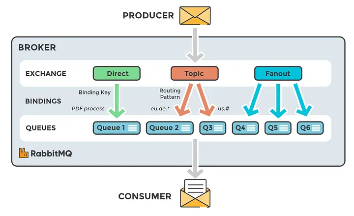

# AMQP协议——（2）binding


> 原文地址: [https://mp.weixin.qq.com/s/Q4a8oINUMjzu\_ffp6bYd6w](https://mp.weixin.qq.com/s/Q4a8oINUMjzu_ffp6bYd6w)



 这张图的核心是在说明：**Producer 把消息发到 Exchange，但消息最终进哪个 Queue，是由“Binding（绑定）”决定的。**  
Binding 就是 **Exchange ↔ Queue 之间的“路由规则连接”**（图中间那一层 BINDINGS）。

* * *

## 1) Binding 是什么？

在 AMQP（RabbitMQ 常用的 0-9-1 模型）里：

-   Exchange：负责“分拣/路由”，不存消息
    
-   Queue：负责“存储/排队”
    
-   Binding：把 Queue 挂到 Exchange 上，并附带一条“匹配规则”
    

可以把 binding 理解成：

> “把某个队列订阅到某个交换机，并声明它想接收哪些 routing key 的消息”。

* * *

## 2) Binding 的三要素（最实用）

1.  source exchange：从哪个交换机来
    
2.  destination queue：投递到哪个队列
    
3.  binding rule：如何匹配（取决于交换机类型）
    

-   direct：binding key（精确匹配）
    
-   topic：pattern（通配匹配）
    
-   fanout：不需要 key（全投递）
    
-   headers：按 header 条件（x-match/键值对）
    
      
    

* * *

## 3) 图里三种 Exchange 下 binding 怎么用

### A) Direct Exchange（左边绿色）

图示：binding key = `PDF_process` → Queue1  
规则：**消息 routing key 必须等于 binding key 才会进队列**

-   binding：`Queue1` 绑定到 `Direct`，key=`PDF_process`
    
-   publish：routingKey=`PDF_process` → 进 Queue1
    
-   publish：routingKey=`pdf.process` → 不进（大小写/字符都要一致）
    

适用：明确的“按任务类型/命令”分发、点对点路由。

* * *

### B) Topic Exchange（中间橙色）

图示：routing pattern 像 `eu.de.*`、`us.#` 分别指向不同队列（Queue2、Q3、Q4 等）

Topic 的 binding pattern 通配符：

-   \*：匹配 **一个**单词（以 `.` 分隔）
    
-   #：匹配 **零个或多个**单词
    

例子（按图的味道）：

-   binding：Queue2 ← Topic，pattern=`eu.de.*`
    

-   routing key `eu.de.berlin` ✅
    
-   routing key `eu.de` ❌（少一段）
    
-   routing key `eu.de.berlin.1` ❌（多一段）
    
      
    

-   binding：Q4 ← Topic，pattern=`us.#`
    

-   us ✅
    
-   us.ca ✅
    
-   us.ca.sf ✅
    
      
    

适用：事件总线、按地区/业务域/层级分类的订阅。

* * *

### C) Fanout Exchange（右边蓝色）

图示：Fanout 的箭头同时指向 Q5、Q6（以及可能更多）

规则：**只要队列绑定到了 fanout exchange，就都会收到一份**（不看 routing key）

适用：广播、发布订阅（每个下游服务一份）、缓存失效通知等。

* * *

## 4) Binding 的几个关键用法/坑点

### ① 一条消息可以进多个队列

只要它命中多个 binding，Exchange 会把消息**复制投递**到多个队列（图里 topic/fanout 都在表达这个能力）。

### ② “多个消费者”≠“广播”

-   广播：fanout/topic → **多个队列**（每个队列各拿一份）
    
-   负载均衡：**同一个队列**挂多个 consumer（竞争消费，一条消息只给其中一个）
    

### ③ Binding 是运行时可变的

你可以不停机：

-   新增队列
    
-   增加/删除 binding  
      从而实现“在线扩展订阅者/灰度分流”。
    

* * *

## 5) 一句话总结

**Binding = 把 Queue 订阅到 Exchange，并定义“哪些 routing key（或 headers）能进这个队列”的规则。**  
Direct 用“精确 key”，Topic 用“通配 pattern”，Fanout 不看 key 全投递。

下面给出一套**可直接落地**的 RabbitMQ（AMQP 0-9-1）绑定/路由键命名规范 + 典型 exchange 组合方案（direct/topic/fanout 各用在什么场景），按“微服务事件总线”最常见的做法来。

* * *

## 1) Routing Key 命名规范（推荐：层级点分 `.`）

把 routing key 当成“事件的分类路径”，建议固定 4~6 段，尽量稳定：

**`<domain>.<service>.<entity>.<event>.<version>.<scope>`**

常用精简版（最实用）：

**`<domain>.<entity>.<event>.<scope>`**

例子：

-   billing.invoice.created.prod
    
-   billing.invoice.paid.prod
    
-   user.account.password\_reset.prod
    
-   doc.pdf.converted.dev
    

字段含义建议：

-   domain：业务域（billing/user/order/doc…）
    
-   entity：实体（invoice/account/order/pdf…）
    
-   event：事件（created/updated/paid/failed…）
    
-   scope：环境或范围（prod/dev/test 或 region）
    

> 小技巧：scope 放最后，方便用 `#.prod` 一把拦住生产事件。

* * *

## 2) Topic Exchange：做“事件总线”（最常用）

### Exchange

-   ex.events（type=topic）
    

### Binding Pattern（通配规则）

-   业务域全部：`billing.#`
    
-   仅 invoice 相关：`billing.invoice.#`
    
-   仅 created：`billing.*.created.*`
    
-   仅生产环境：`#.prod`
    
-   指定区域：`*.order.*.us`（如果你把 region 放最后）
    

### 典型队列划分

每个下游服务**自己的队列**（保证“广播语义”）：

-   q.analytics 绑定 `#.prod`（收集所有生产事件）
    
-   q.billing.notify 绑定 `billing.invoice.paid.prod`
    
-   q.risk 绑定 `billing.#` + `order.#`（多条 binding）
    

* * *

## 3) Direct Exchange：做“命令/任务分发”（点对点）

当你要把“某类任务”明确丢给某个 worker 池，而不是广播订阅，用 direct 很清晰：

### Exchange

-   ex.jobs（type=direct）
    

### 约定 routing key = job name

-   routing key：`pdf_process`
    
-   routing key：`thumbnail_generate`
    
-   routing key：`email_send`
    

### 队列绑定

-   q.pdf\_workers 绑定 key=`pdf_process`
    
-   q.mail\_workers 绑定 key=`email_send`
    

> direct 的好处是“明确、可控、不玩通配”；坏处是扩展订阅维度没 topic 灵活。

* * *

## 4) Fanout Exchange：做“广播通知”（不看 key）

### Exchange

-   ex.broadcast（type=fanout）
    

用途：

-   配置热更新通知
    
-   缓存失效
    
-   集群内“全员到场”的信号（比如 `reload`, `drain`）
    

绑定方式：

-   每个需要接收的服务都绑定一个自己的队列（例如 `q.svcA.broadcast`、`q.svcB.broadcast`）
    
-   发送时 routing key 随便填或为空（AMQP 0-9-1 下 publish 仍会带，但 fanout 不用）
    

* * *

## 5) 组合建议：一套“标准微服务消息拓扑”

你可以默认就建三类 exchange：

1.  事件总线（topic）：`ex.events`
    
2.  任务队列（direct）：`ex.jobs`
    
3.  广播（fanout）：`ex.broadcast`
    

这样设计后：

-   业务事件：统一走 `ex.events`（topic）
    
-   后台任务：统一走 `ex.jobs`（direct）
    
-   全局通知：统一走 `ex.broadcast`（fanout）
    

* * *

## 6) 最重要的落地规则（避免踩坑）

-   “广播”一定是：一个 exchange → 多个 queue（每服务一队列），不要用“一个 queue + 多 consumer”来冒充广播。
    
-   事件命名尽量**稳定**，新增字段放末尾，避免破坏已有 pattern。
    
-   消费者务必做**幂等**（at-least-once 常态）。
    
-   想要“某类消息没人要也别丢”：用 `alternate-exchange` 或 `mandatory + return`（按需要）。
    

下面给出一套**可直接复制执行**的 RabbitMQ 拓扑声明模板（含：topic 事件总线 + direct 任务队列 + fanout 广播 + 标准 DLQ + Retry 延迟重试），用 `rabbitmqadmin` 为例。

> 约定：都建在同一个 vhost（如 `/app`），交换机/队列均 `durable=true`。

* * *

## 0)（可选）创建 vhost + 权限

```
rabbitmqctl add_vhost /apprabbitmqctl add_user app_user 'CHANGE_ME'rabbitmqctl set_permissions -p /app app_user ".*" ".*" ".*"
```

  

  

* * *

## 1) 声明三类 Exchange（events/topic、jobs/direct、broadcast/fanout）

```
rabbitmqadmin -V /app -u app_user -p 'CHANGE_ME' declare exchange name=ex.events    type=topic   durable=truerabbitmqadmin -V /app -u app_user -p 'CHANGE_ME' declare exchange name=ex.jobs      type=direct  durable=truerabbitmqadmin -V /app -u app_user -p 'CHANGE_ME' declare exchange name=ex.broadcast type=fanout  durable=true
```

  

  

* * *

## 2) 声明“死信 + 重试”基础 Exchange

我们用经典的两段式：

-   业务队列失败/拒绝 → 进入 `ex.dlx`（死信交换机）
    
-   重试：死信进入 `q.retry.*`（TTL 到期）→ 再死信回主队列
    
-   终止：超过重试次数后 → `q.dlq.*`（最终死信队列）
    

```
rabbitmqadmin -V /app -u app_user -p 'CHANGE_ME' declare exchange name=ex.dlx   type=direct durable=truerabbitmqadmin -V /app -u app_user -p 'CHANGE_ME' declare exchange name=ex.retry type=direct durable=true
```

  

  

* * *

## 3) 为一个“事件订阅服务”创建：主队列 + 重试队列 + 最终 DLQ

以服务 `svc.notify` 为例（你可以复制改名）：

### 3.1 主队列（绑定到 ex.events 的 topic）

主队列关键参数：

-   x-dead-letter-exchange=ex.dlx：消费失败（reject/nack requeue=false）时进入死信流程
    
-   （可选）`x-queue-type=quorum`：更可靠（需要 RabbitMQ 支持；不想用可删掉）
    

```
rabbitmqadmin -V /app -u app_user -p 'CHANGE_ME' declare queue name=q.svc.notify durable=true \  arguments='{"x-dead-letter-exchange":"ex.dlx","x-queue-type":"quorum"}'# 绑定：只收 billing.invoice.paid.prodrabbitmqadmin -V /app -u app_user -p 'CHANGE_ME' declare binding \  source=ex.events destination=q.svc.notify destination_type=queue routing_key='billing.invoice.paid.prod'
```

  

  

### 3.2 重试队列（TTL 到期后回到主队列）

做一个 30 秒重试队列：

-   x-message-ttl=30000：在重试队列里等 30 秒
    
-   x-dead-letter-exchange=ex.retry：TTL 到期后投递到 ex.retry
    
-   x-dead-letter-routing-key=q.svc.notify：回到主队列（我们让 ex.retry 用 direct 按队列名路由）
    

```
rabbitmqadmin -V /app -u app_user -p 'CHANGE_ME' declare queue name=q.retry.svc.notify durable=true \  arguments='{"x-message-ttl":30000,"x-dead-letter-exchange":"ex.retry","x-dead-letter-routing-key":"q.svc.notify"}'# ex.retry -> 主队列（direct 精确匹配）rabbitmqadmin -V /app -u app_user -p 'CHANGE_ME' declare binding \  source=ex.retry destination=q.svc.notify destination_type=queue routing_key='q.svc.notify'
```

  

  

### 3.3 最终死信队列（DLQ）

```
rabbitmqadmin -V /app -u app_user -p 'CHANGE_ME' declare queue name=q.dlq.svc.notify durable=true
```

  

  

### 3.4 ex.dlx 的分流规则：进“重试”还是进“最终 DLQ”

这里用一个常见约定：所有该服务的死信先进入重试队列；如果你要“超过 N 次才进 DLQ”，消费者需要在 headers 里读 `x-death` 次数并决定 reject 到不同 routing key（下面给两条路由口，方便你扩展）。

```
# 失败先进入重试队列（routing_key 随你约定）rabbitmqadmin -V /app -u app_user -p 'CHANGE_ME' declare binding \  source=ex.dlx destination=q.retry.svc.notify destination_type=queue routing_key='svc.notify.retry'# 终止进入 DLQrabbitmqadmin -V /app -u app_user -p 'CHANGE_ME' declare binding \  source=ex.dlx destination=q.dlq.svc.notify destination_type=queue routing_key='svc.notify.dlq'
```

  

> 消费者逻辑建议：
> 
> -   若 `x-death` 次数 < 5：`nack/reject(requeue=false)` 并把消息重新发布到 `ex.dlx`，routing\_key=`svc.notify.retry`
>     
> -   否则发布到 `ex.dlx`，routing\_key=`svc.notify.dlq`  
>       （AMQP 0-9-1 里“直接改死信 routing\_key”不总是自动可控，所以生产级常用“失败时由消费者显式 re-publish 到 retry/dlq exchange”。）
>     

* * *

## 4) 任务队列（direct）示例：PDF worker

```
rabbitmqadmin -V /app -u app_user -p 'CHANGE_ME' declare queue name=q.pdf_workers durable=true \  arguments='{"x-dead-letter-exchange":"ex.dlx"}'rabbitmqadmin -V /app -u app_user -p 'CHANGE_ME' declare binding \  source=ex.jobs destination=q.pdf_workers destination_type=queue routing_key='pdf_process'
```

  

* * *

## 5) 广播（fanout）示例：缓存失效通知

广播一定要“每服务一队列”：

```
rabbitmqadmin -V /app -u app_user -p 'CHANGE_ME' declare queue name=q.svc.notify.broadcast durable=truerabbitmqadmin -V /app -u app_user -p 'CHANGE_ME' declare binding \  source=ex.broadcast destination=q.svc.notify.broadcast destination_type=queue routing_key=''
```

  

* * *

## 6) 你实际 publish / consume 时怎么用（规则）

-   业务事件：publish 到 `ex.events`，routing key 用你那套规范（如 `billing.invoice.paid.prod`）
    
-   任务下发：publish 到 `ex.jobs`，routing key=`pdf_process`
    
-   广播：publish 到 `ex.broadcast`（routing key 无所谓）
    
-   消费失败重试：推荐消费者捕获异常后 **显式 re-publish** 到 `ex.dlx`（retry/dlq 两个 routing key 二选一），再对原消息 ack（避免无限红elivery 风暴）