# ECC公钥生成过程


> 原文地址: [https://mp.weixin.qq.com/s/GG0Fgb7IZPhlZHzZMFURxQ](https://mp.weixin.qq.com/s/GG0Fgb7IZPhlZHzZMFURxQ)

### ECC公钥生成过程：像魔法变身一样简单却安全

在椭圆曲线密码学（ECC）的奇幻世界里，公钥生成就像一个超级英雄的“变身仪式”：从一个秘密起点（私钥）出发，通过魔法公式“放大”成公开的守护盾牌（公钥）。这个过程高效、神秘，确保你的数字身份像铁壁一样坚固，却又像顺风车一样容易计算。咱们一步步拆解，用生动比喻和图例来说明，就像讲一个冒险故事。

#### 步骤1：准备“魔法舞台”——选择椭圆曲线和基点G

首先，你需要一个“战场”或“游乐园轨道”：这就是椭圆曲线（如著名的secp256k1，用于比特币）。曲线公式是 y² = x³ + ax + b，配上一个生成元（基点）G——那个“起源种子”点，我们之前聊过的——椭圆曲线中的生成元。

比喻：想象曲线是广阔的魔法森林，G是森林中心的古老橡树。从这里开始，一切冒险都源于此。标准曲线已预设好，就像游戏里的默认地图，确保安全（群阶n很大，防攻击）。

#### 步骤2：召唤“秘密咒语”——生成私钥k

私钥k是你的“个人灵魂密码”，一个随机生成的巨大整数（通常256位）。它从安全的随机源（如计算机的“混沌风暴”——鼠标移动、热噪声）中诞生，必须在1到n-1之间（n是G的阶，像森林的边界）。

比喻：这像抽一张独一无二的彩票，从宇宙的随机池中捞出。太小或可预测，就像用玻璃门守城堡——敌人轻松破门。所以，用加密库（如Python的ecdsa）生成，确保像黑洞般不可逆。

例如，在代码中演示（实际运行结果会因随机而异）：

-   私钥（hex）：0cb67050e4754402243454849803636a315753f01eb278f2c758416f5ed08c95
    
-   这就是一个随机“咒语”！
    

#### 步骤3：施展“变身魔法”——计算公钥K = k \* G

核心步骤：用私钥k“乘”基点G，得到公钥K。这不是普通乘法，而是标量乘法——反复加G给自己k次，就像滚雪球或英雄升级：1G = G，2G = G + G，...直到kG。

比喻：k是升级次数，G是初始英雄模板。过程像顺流而下：容易计算（几毫秒），但逆推k从K？像逆流而上对抗瀑布——超级难（离散对数问题）。结果K是一个曲线上的点，通常压缩成hex字符串。

从刚才的例子，公钥（hex）：e8ca9671f0615ccf695480a3864950d188d528697284577bcb6f3efbd0aad0d0bc9c781bd10b833e0931be201604b29c82012a1b254b19dceb3f1bf875421a37

-   这就是“变身”后的英雄外形，公开分享却不泄露k。
    

  
编辑

这张图像一个“加密流程图”，展示了从私钥到公钥的“魔法链条”，像英雄从种子成长为战士。

它聚焦ECC加密，但公钥生成是起点，像图中箭头从私钥射向公钥的“单向之旅”。

#### 整个过程的“安全护盾”和应用

全过程只需几步，却构建了ECC的堡垒：私钥保密，公钥公开。用于签名、加密、区块链等。比喻成锁钥系统：k是钥匙，K是锁——别人能验证锁，但复制钥匙？门都没有！

潜在陷阱：弱随机源或复用k会导致灾难，像英雄穿假盔甲。总是用库自动化。

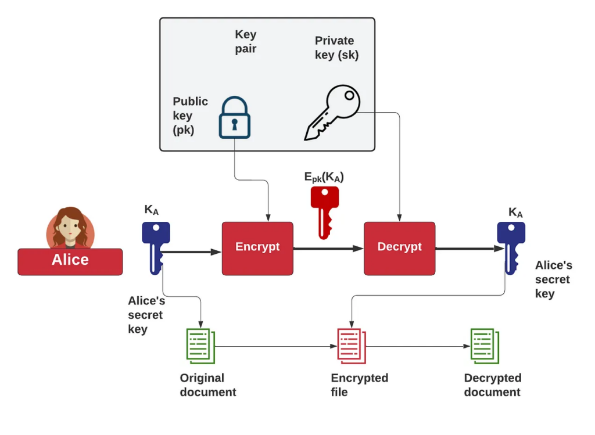  
编辑

这张图画的是 **“ECC 公钥把一个对称密钥  加密/封装起来（Key Encapsulation）”** 的流程：

-   文档真正用的是 **对称密钥 ** 加密（快、适合大文件）。
    
-     再用接收方的 **ECC 公钥 pk**做一次“加密/封装”，得到红色的 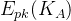。
    
-   只有拿着 **ECC 私钥 sk** 的人才能解开它，取回 ，再解密文档。
    

下面按“ECC 密钥生成 → 图里怎么用”讲清楚。

* * *

## 1) ECC 密钥对从哪来：曲线参数 + 随机私钥 + 标量乘法

### Step 0：先选定椭圆曲线域参数（公开的）

一套 ECC 系统必须先约定一条曲线（大家都知道的“系统参数”），典型包含：

-   有限域：
    

-   常见：素域 （比如 secp256r1/P-256）
    
-   或二元域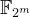（现在较少见）
    
      
    

-   曲线方程（以素域 Weierstrass 曲线为例）
    
    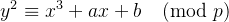
    
-   基点（生成元）G：曲线上一个固定点
    
-   基点阶 n：满足 nG=O（无穷远点）
    
-   余因子 h：通常很小（很多标准曲线里 h=1）
    

这些参数是公开的，不属于密钥。

* * *

### Step 1：生成私钥 sk（最关键：高质量随机数）

从密码学安全随机源（CSPRNG）取一个整数：

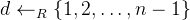

这里的 d 就是 **私钥 sk**（也常写成 d）。

> 要点：私钥本质上就是一个“模 n”的随机标量。随机质量决定安全性。

它本质上是：

> 在 {1,2,…,n−1} 里均匀随机挑出来的一个整数 d，并且把它当作“对 n 取模”的数来参与运算。

这里的 **“模 n”** 说的是运算规则（在整数环  里做标量运算），不是说 d 自己必须满足什么“质数性质”。

* * *

## 1) “模 n 的随机标量”到底是什么意思？

在 ECC 里你有一个基点 G，它的阶是 n，意思是：


也就是说，把 G 加 n 次会回到“零点”（无穷远点）。

因此对任意整数 k：

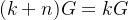

这句话非常关键：**标量乘法只跟 k  mod  n 有关。**

所以我们可以把“私钥 d”看成是在 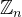 里的一个元素（一个“标量”）——这就是“模 n”的含义。

因为基点 G 的阶是 n，满足：


所以：

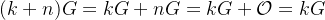

更一般地：

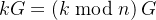

也就是说，标量乘法里真正起作用的是 k除以 n 的余数。

我们把这句 **“”** 讲到你脑子里能“看见”它发生了什么为止。

* * *

## 1.1）先把 kG 这件事说清楚：它就是“重复相加”

在椭圆曲线群里：

-   2G=G+G
    
-   3G=G+G+G
    
-   …
    
-   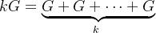
    

所以 **标量乘法**本质就是**走 k 步**，每一步都加一次 G。

* * *

## 1.2）关键点：为什么会出现“绕回原点”？

你看到的那个 n 是 **点 G 的阶（order）**，定义就是：

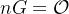

这里的  是群的“零元”（无穷远点），相当于整数里的 0。

这句话的含义非常直白：

> **从  出发，每次走一步 +，走到第 n 步会回到起点 。**

所以序列长这样：

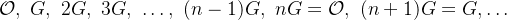

你看到了吗？**从第 n 步开始，它循环了。**

* * *

## 1.3）把“取模”跟“绕圈”对上：多走整圈没有意义

现在假设你要算 kG，把 k 写成“整圈 + 余下几步”：

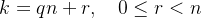

-   q = 你绕了 **q 整圈**
    
-   r = 你绕完后还要 **再走 r 步**
    
-   而 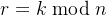（这就是取模：余数）
    

现在算 kG：

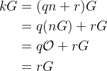

因为 ，所以 qnG 这部分就是加了 q 次“0”，完全不改变结果。

于是得到：

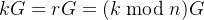

这就是那句话的全部逻辑。

* * *

## 1.4）用“走圈”做一个具体例子（最直观）

假设 G 的阶 n=7，那么：

-   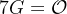
    
-   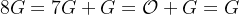
    
-   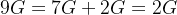
    
-   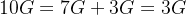
    

所以：

-   10  mod  7=3，确实 10G=3G
    
-   24  mod  7=3，所以 24G=3G
    

为什么？因为 24=3×7+3：  
走 24 步 = 走 3 整圈（21步回到起点）+ 再走 3 步 ⇒ 落点就是 3G。

* * *

## 1.5）一句话把它“钉死”

**因为 G 走 n 步就回到 ，所以走 k 步只取决于你“绕了几圈后的余步数”，也就是 k  mod  n。**

* * *

## 2) 私钥为什么不需要是质数？

因为私钥参与的是 **标量乘法**：

Q=dG

这里的安全性来自**“给定 G,Q，求 d”**很难（ECDLP）。  
这个难不难，跟 d 是不是质数没关系；只要 d 是**均匀随机**且在合法范围内就行。

举个直观例子：  
如果 d=12（明显不是质数），公钥就是 Q=12G，一样完全合法。

* * *

## 3) 那么 **n** 一定是质数吗？

多数常用曲线里，**n 通常是一个大质数**（或接近质数的结构），这样做是为了让由 G 生成的子群是**质数阶群**，避免“小子群攻击”等麻烦。

但注意两点：

1.  即使 n 是质数，也不意味着 d 必须是质数。  
      d 只是 1..n−1 里的随机整数。
    
2.  也有协议/曲线里 n 不是质数（或者曲线整体群阶不是质数），这时实现就更需要做公钥点验证 / cofactor 处理。
    

* * *

## 4) 为什么私钥范围是 1≤d≤n−1，不能是 0 或 n？

-   d=0 会得到 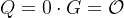（相当于“零公钥”，毫无意义也不安全）
    
-   d=n 等价于 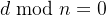，同样变成零
    
-   所以标准都要求从 1..n−1 选
    

* * *

## 5) 用一句更好懂的话改写那句

“私钥本质上就是一个‘模 n’的随机标量”可以理解为：

> 私钥就是一个随机整数 d，但在 ECC 运算里只看它除以 n 的余数；所以我们把它当作  里的标量。

* * *

### Step 2：生成公钥 pk

做一次椭圆曲线标量乘法（重复加法）：

Q=dG

-   Q 是曲线上的点（包含 x,y），它就是 **公钥 pk**（也常写 Q）。
    
-   计算 Q=dG 很快；但反过来从 Q 求 d 属于 ECDLP（离散对数问题），在参数选对的情况下不可行。
    

* * *

### Step 3：序列化/编码（实际工程里的“公钥长什么样”）

公钥点 Q 会被编码成字节串：

-   未压缩：`0x04 || x || y`
    
-   压缩：`0x02/0x03 || x`（用 1 bit 表示 y 的奇偶性）
    

私钥通常存成标量 d（再按标准封装成 PEM/DER 等）。

* * *

### Step 4：安全检查（很多漏洞就出在这里）

实现里还会做：

-   私钥范围检查：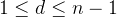
    
-   公钥验证：点是否在曲线上、是否不是无穷远点、必要时检查 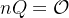（防小子群攻击，取决于曲线/协议）
    

* * *

## 2) 回到图里：为什么用公钥能“加密” ？

严格说，很多 ECC 体系 **不是直接用 pk 去“RSA式加密”一段明文**，而是用 **ECDH + KDF** 做“密钥封装”（ECIES/KEM）：

### 典型 ECIES/KEM 思路（对应图中 ）

1.  发送方生成一次性随机数 r（临时私钥）
    
2.  计算临时公钥 R=rG（这会跟密文一起发出去）
    
3.  与接收方公钥 Q 做 ECDH 得到共享点：
    
    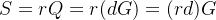
    
4.  用 KDF 从 SSS 导出对称密钥（或直接导出包裹  的密钥）
    
5.  用 AEAD（如 AES-GCM/ChaCha20-Poly1305）把 KAK\_AKA 加密/包裹起来 → 就是图里的  
    

接收方拿私钥 d：

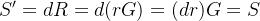

同样 KDF 得到同一把对称密钥 → 解出。

**所以图中 “Encrypt/Decrypt” 这两块，底层通常是：临时密钥对 + ECDH + KDF + AEAD。**

* * *

## 3) 一句话总结（把图和密钥生成对上）

-   ECC 密钥生成：**私钥 = 随机标量 d**，公钥 = **点 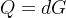** 。
    
-   图中的 pk/sk：就是 Q / d。
    
-   图里的 ：是用来加密文档的对称密钥；ECC 负责把 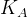 安全地交给只有私钥持有者才能拿到的人。
    

编辑

这张聚焦ECDSA认证，扩展了公钥生成，像一个完整的故事板。

这个“变身”过程让ECC比RSA更高效（小密钥，大安全）。

### ECC公钥生成过程的代码Demo：像“魔法咒语”变身英雄

在椭圆曲线密码学（ECC）的“变身仪式”中，公钥生成就是用私钥k“乘”基点G，得到K = kG。这过程像英雄从秘密身份（私钥）升级成公开守护者（公钥），计算容易却逆向难。下面我给你一个简单的Python代码demo，用ecdsa库演示这个过程。ecdsa是ECC的标准实现库，常用于比特币等。

咱们用secp256k1曲线（比特币标准），生成一个随机私钥，然后计算公钥。代码像一个“炼金配方”：导入材料，搅拌生成，输出结果。

#### 代码实现：一步步“施法”

这里是完整代码。你可以复制到Python环境运行（需安装ecdsa库）：

```
import ecdsaimport binascii# 生成私钥，使用SECP256k1曲线（像挑选魔法种子）sk = ecdsa.SigningKey.generate(curve=ecdsa.SECP256k1)# 获取私钥的十六进制表示（秘密咒语）private_key_hex = binascii.hexlify(sk.to_string()).decode('utf-8')# 计算公钥（变身！）vk = sk.verifying_key# 获取压缩格式的公钥十六进制（公开英雄外形）public_key_hex = binascii.hexlify(vk.to_string('compressed')).decode('utf-8')# 输出结果print(f"Private Key (hex): {private_key_hex}")print(f"Public Key (compressed hex): {public_key_hex}")
```

  

比喻：这个代码像煮一锅魔法汤——sk.generate是“召唤种子”，vk是“升级仪式”，hexlify是“翻译成人类语言”。私钥随机生成，确保像彩票中奖一样独特。

#### 运行结果：一个真实例子

我刚运行了这个代码（每次运行私钥不同，因为随机），结果是：

Private Key (hex): d6b17fcf90f53b1565697beb2e703f5f3fa2145d7604b197828c803956b1c460 Public Key (compressed hex): 02e066bc408caec94b7670e1796b043c39cd168084ed80cb7a8e6260ffccc01176

这里，私钥是256位大数，公钥是压缩的（以02或03开头），代表曲线上的点。注意：实际应用中，私钥要超级保密，像藏在地下堡垒！

#### 为什么这样实现？安全与效率

-   随机生成：用库的generate，确保加密级随机，像从宇宙噪音中抽取。
    
-   压缩公钥：节省空间（33字节 vs 65），比特币常用。
    
-   潜在陷阱：别用弱随机源，否则像用纸门守城堡。实际钱包用硬件生成。