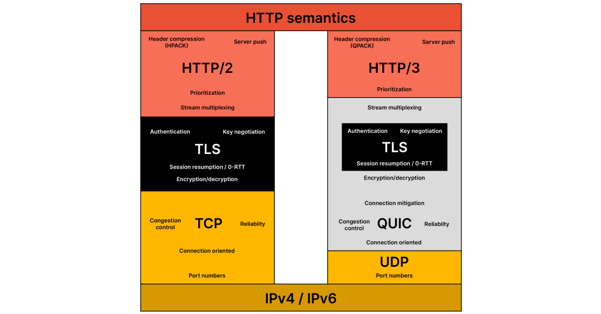
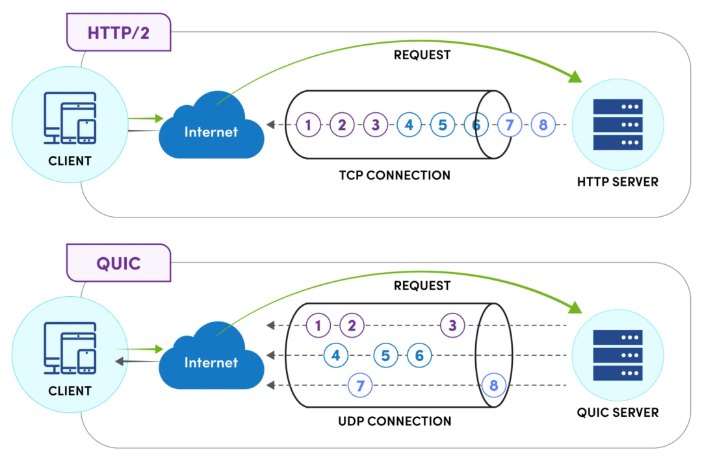
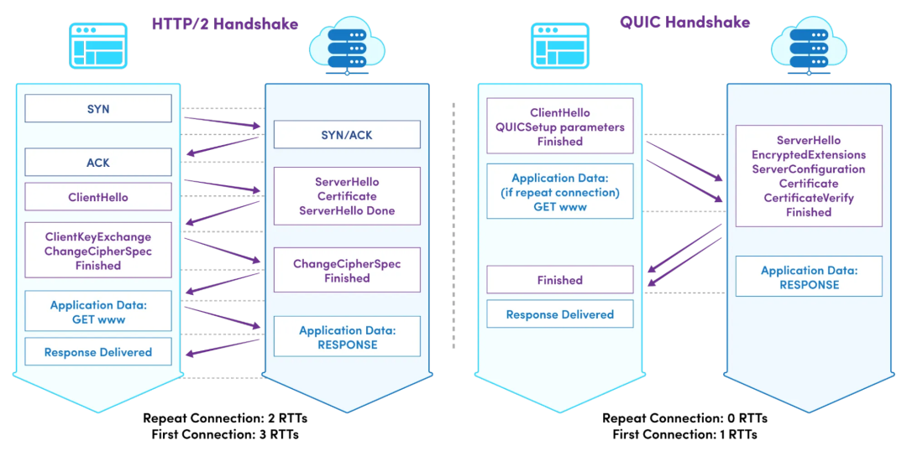

# HTTP1/HTTP2和QUIC


> 原文地址: [https://mp.weixin.qq.com/s/TBE41L9FSEf168uuwFclHA](https://mp.weixin.qq.com/s/TBE41L9FSEf168uuwFclHA)

-   HTTP/1.0 / HTTP/1.1：老牌选手，基于 TCP，“一条路一辆车”，队头阻塞严重。
    
-   HTTP/2：还是基于 TCP，但把一条连接“多路复用”，在协议里自己搞了流、帧、优先级，解决了一部分 HTTP/1 的低效问题。
    
-   QUIC：基于 UDP 实现的“类 TCP + 加密 + 多路复用 + 0-RTT”的综合体。
    
-   HTTP/3：就是跑在 QUIC 上的下一代 HTTP（可以理解为“HTTP/2 over QUIC 的正式版”）。
    

所以：

> 关系大致是：  
> **HTTP/1 → HTTP/2（仍在 TCP 上进化） → HTTP/3（在 QUIC 上进化）**  
> QUIC 是一个传输层协议，HTTP/3 是应用层协议，跑在 QUIC 之上。

下面分开讲，尽量短而清晰。

  
  

* * *

## 一、HTTP/1：简单但粗糙

### 1\. HTTP/1.0（早期）

-   每个请求一个 TCP 连接：  
      浏览器发一个请求，建立 TCP（三次握手），收完数据就断开。
    
-   问题：一张网页几十个资源（JS/CSS/图片）=几十次握手，非常浪费。
    

### 2\. HTTP/1.1（至今还到处在用）

改进主要有：

1.  持久连接（keep-alive）  
      一次 TCP 连接上可以连续发送多个请求，不用每次都重建连接。
    
2.  管道化（pipelining）理论上允许“先发多个，再排队收”
    

-   浏览器可以连发多个请求，不用等前一个回复再发。
    
-   但 **服务器必须按顺序回复**，实际中容易出现兼容性问题，几乎没人用。
    
      
    

4.  队头阻塞（Head-of-line blocking）依然严重
    

-   在一个 TCP 连接里，如果第一个请求慢了，后面的响应都要等它。
    
-   浏览器只好 **多开几个 TCP 连接**（比如每个域名 6 条），勉强并行。
    
      
    

6.  附带一堆头部扩展（Host、Cache-Control 等）  
      更适合现代 Web，但在性能和延迟上已明显不足。
    

* * *

## 二、HTTP/2：在 TCP 上打补丁的“多路复用版”

HTTP/2 的目标：

> “保持应用语义不变（还是 URL、方法、头），但在同一条 TCP 连接上高效地并发很多请求。”

主要特性：

1.  二进制分帧（binary framing）
    

-   HTTP/1 的报文是“纯文本+头”，HTTP/2 引入帧（frame）和流（stream）概念。
    
-   一个 TCP 连接被拆成多个 **逻辑流（stream）**，每个流有自己的 ID。
    
-   请求和响应都是一堆帧，交织在同一条 TCP 连接里。
    
      
    

3.  真正的多路复用（multiplexing）
    

-   同一条 TCP 连接上可以同时发送多个请求的帧。
    
-   不再依赖“排队回复”，理论上解决了 HTTP 层面的队头阻塞（但注意还有 TCP 层面的，后面讲）。
    
      
    

5.  头部压缩（HPACK）
    

-   HTTP 头很长（Cookie、User-Agent 等），重复内容很多。
    
-   HPACK 通过动态表+哈夫曼编码大幅减少头部体积。
    
      
    

7.  服务器推送（Server Push）
    

-   服务器可以在返回 HTML 时“顺便推送” CSS/JS，不等浏览器再发请求。
    
-   实际部署中用得不多（复杂且容易搞错缓存策略），HTTP/3 规范里已经淡化/废弃。
    
      
    

9.  问题：TCP 层队头阻塞依旧存在
    

-   虽然逻辑上多路复用，但底层 **还是一条 TCP 流**。
    
-   一旦丢包，TCP 重传前，后面所有数据会卡住（同一条连接上的所有流都被拖慢）。
    
-   在高丢包网络（移动网络等）上，这个问题很明显。
    
      
    

* * *

## 三、QUIC：基于 UDP 的“新一代传输层”

QUIC（Quick UDP Internet Connections）最初是 Google 提出的实验协议，现在已标准化为 IETF QUIC，并且成为 HTTP/3 的基础。

它的设计目标可以概括成一句话：

> “绕开 TCP 的历史包袱，用 UDP 自己实现一个更灵活的‘加密+可靠传输+多路复用’栈。”

关键特性（比 TCP+TLS+HTTP/2 多出来的）：

1.  基于 UDP，实现“类 TCP 的可靠传输”
    

-   自己处理丢包重传、拥塞控制、流量控制等。
    
-   可以按“流”粒度处理丢包，避免一个流丢包拖死所有流。
    
      
    

3.  内建加密（类似“TLS 1.3 内置在传输层”）
    

-   QUIC 一上来就加密握手和数据，比“TCP + TLS 分层”更紧凑。
    
-   一般基于 TLS 1.3 的机制，在一个握手里同时完成安全与传输协商。
    
      
    

5.  0-RTT / 1-RTT 握手
    

-   首次连接：通常只要 **1-RTT** 就能完成握手并开始传数据，比“TCP 三次握手 + TLS 握手”少一次往返。
    
-   复用连接历史（会话恢复）时，支持 **0-RTT**，可以“带数据”发出第一批包。
    
      
    

7.  多路复用但没有 TCP 层队头阻塞
    

-   每个流独立确认和重传，某个流丢包不影响其他流的读取。
    
-   这是和 HTTP/2 over TCP 的根本区别。
    
      
    

9.  连接迁移（Connection Migration）
    

-   QUIC 的连接由“连接 ID”标识，而不是单纯依赖 {IP, 端口}。
    
-   用户从 WiFi 切到 4G，IP 变了，连接仍可延续，不必重新握手（如果实现支持）。
    
      
    

11.  更灵活的升级空间
     

-   因为跑在 UDP 上，不受内核 TCP 堆栈的限制，协议升级可以在用户态快速迭代。
    
      
    

* * *

## 四、HTTP/3：跑在 QUIC 上的 HTTP

很多介绍会把 HTTP/3 和 QUIC混在一起说，但概念上应分清：

-   QUIC：传输层协议（在 UDP 之上）。
    
-   HTTP/3：应用层协议（在 QUIC 之上），语义类似 HTTP/2，但适配了 QUIC 的流/帧机制。
    

HTTP/3 继承了 HTTP/2 的许多优点：

-   多路复用、头部压缩（但使用 QPACK 替代 HPACK，适应 QUIC 的流模型）。
    
-   单连接并发很多请求，更少的握手时延。
    
-   在高丢包、移动网络中表现更好，因为避免了 TCP 队头阻塞，并支持连接迁移。
    

可以把它理解为：

> **HTTP/2 = HTTP/1 语义 + TCP 上的新二进制帧层 + HPACK**  
> **HTTP/3 = HTTP/2 语义 + QUIC 的多路复用/加密/握手机制 + QPACK**

* * *

## 五、它们之间的“层级关系”

从协议栈视角（简化版）：

### HTTP/1.1

```
应用层：HTTP/1.1（文本协议）传输层：TCP网络层：IP
```

  

  

### HTTP/2

```
应用层：HTTP/2（二进制帧）传输层：TCP（仍然是“一条流”）网络层：IP
```

  

  

### HTTP/3 + QUIC

```
应用层：HTTP/3（二进制帧，基于 QUIC 流）传输层：QUIC（基于 UDP 实现可靠、多路复用、加密）网络层：IP
```

  

所以可以说：

-   HTTP/1.1 & HTTP/2：都依赖 **TCP**；
    
-   HTTP/3：依赖的是 **QUIC（UDP 上的一套新传输层协议）**。
    
-   QUIC 对 HTTP 来说，就有点像当年的 TCP 之于 HTTP/1 —— 只是这次是“新一代传输层 + 内建加密 + 多路复用”。
    

* * *

## 六、简单对比总结（站在 Web 应用角度）

特性

HTTP/1.1 (TCP)

HTTP/2 (TCP)

HTTP/3 (QUIC over UDP)

多路复用

❌ 几乎没有（只靠多连接）

✅ 逻辑多路复用，但有 TCP 队头阻塞

✅ 真正多路复用，无 TCP 队头阻塞

握手延迟

高（TCP + 可能的 TLS）

与 HTTP/1 类似

低（1-RTT/0-RTT 握手）

丢包影响

所有请求都受影响

所有流受影响（底层单 TCP 流）

仅部分流受影响

连接迁移

❌ 不支持

❌ 不支持

✅ 支持，用连接 ID

头部压缩

❌

✅ HPACK

✅ QPACK

部署现状

非常普遍，仍然大量存在

已较普及（浏览器/CDN/大厂都支持）

正在快速普及，但还在逐步替换阶段

* * *

## HTTP/2 的 HPACK vs HTTP/3 的 QPACK 细节

先给一句话版对比，再慢慢拆细节：

  
编辑

> **HPACK（HTTP/2）**：假设“只有一条按顺序的 TCP 流”，用 **同步的动态字典** 压缩头部，编码/解码严格锁步。  
> **QPACK（HTTP/3）**：适应 QUIC 的多流和乱序，改成 **异步可并行的动态字典**，用显式的“插入确认（ack）+ 绝对索引 + 相对索引”等机制，避免“头阻塞（head-of-line blocking）”。

下面分点讲“协议细节和差异”。

* * *

## 一、共同目标：都要解决什么问题？

HTTP/1.x 时代的问题：

-   每个请求都有一堆高度重复的头部：
    

-   Host: example.com
    
-   User-Agent: ...
    
-   Cookie: ...
    
-   Accept-Encoding: gzip, deflate, br
    
      
    

-   这些头几乎在一次连接里的所有请求中重复。
    
-   不压缩的话浪费带宽，增加延迟。
    

所以 **HPACK/QPACK 的共同目标**：

1.  维护一张“头字段表”（静态 + 动态），存常见头。
    
2.  编码时不再重复发完整字符串，而发“索引”或差量。
    
3.  对新头字段则插入到动态表，供后续复用。
    

差异在于：**HTTP/2（HPACK）假设数据流有序；HTTP/3（QPACK）必须在“多路复用 + 乱序 + 无连接级 HoL”的环境下工作。**

* * *

## 二、HPACK（HTTP/2）的核心机制

### 1\. 两张表：静态表 + 动态表

-   静态表：协议内置，定义了一堆常见头字段或“头名+常见值”的组合（例如 `:method: GET`，`:status: 200` 等）。
    
-   动态表：连接级共享，编码器把新出现的头字段插入进去，后续用索引引用。
    

索引空间是连续的：

-   静态表：1..N（协议固定大小，RFC 附录里写死的）
    
-   动态表：从 `N+1` 开始，新的条目插入到动态表头部，旧的往后移，超出大小的被 evict。
    

### 2\. 压缩方式

-   indexed representation：完全相同的“名+值”组合，用一个索引表示。
    
-   literal with indexing：出现新的名/值，编码器发送字面值，同时插入动态表。
    
-   literal without indexing / never indexed：不插入动态表（如隐私敏感字段）。
    

头名/头值本身再用 Huffman 编码压缩。

### 3\. 关键点：编码/解码“锁步”，动态表是同步的

在 HTTP/2 上：

-   所有帧（包括 HEADERS、CONTINUATION）都在 **同一条 TCP 字节流** 按顺序传输。
    
-   解码器的动态表更新顺序 = 编码器的发生顺序，不会乱。
    
-   所以当解码器看到 `index=128` 时，它可以确定：  
      “在此之前我已经按同样顺序处理过所有插入操作，因此我知道 128 对应的条目是什么。”
    

这很好理解，但也埋下了一个坑：**头阻塞（Head-of-Line Blocking）**。

* * *

## 三、HPACK 在 HTTP/2 中的问题：头阻塞

HTTP/2 在一条 TCP 连接中多路复用很多流：

-   每个请求/响应的头部都是 HEADERS 帧（+ 可选 CONTINUATION），其内容经过 HPACK 压缩。
    

一旦出现：

-   某个流（比如 Stream 5）的头压缩数据（HEADERS 帧片段）所在的 TCP 包丢了；
    
-   TCP 必须重传这段数据；
    
-   在这之前，到达的后续字节（其他流的 HEADERS）无法安全解码——因为 HPACK 动态表状态可能还没“追上”。
    

结果就是：

> 只要有一个流的 HEADERS 数据丢包，**整条连接在头解码层面都会卡死**，这就是 HPACK + HTTP/2 下出现的“头阻塞”。

QUIC 想消灭“连接级 HoL”，但如果直接照搬 HPACK，那即使在 QUIC 链路层没 HOL，**在头部压缩这一层又人为造出 HOL** —— 这就与 QUIC 的设计初衷冲突。

* * *

## 四、QPACK（HTTP/3）如何改造 HPACK 的思想

QPACK 设计目标：

> 保留“静态表 + 动态表 + 索引压缩”的好处，但让 **头部解码不再因为某条流的丢包而阻塞其他流**。

它的关键变化可以总结为三条：

1.  头数据和动态表更新分离（两个方向、两种流）。
    
2.  绝对索引 + 相对索引（基于“已确认插入位置”），避免对“未来的动态表状态”产生依赖。
    
3.  显式的“插入确认”（ack）机制，解码器告诉编码器“我已经知道并可安全使用哪些动态表条目”。
    

下面稍微展开。

* * *

## 五、QPACK 的具体机制细节

### 1\. 三类流：请求流 + 2 组单向 QPACK 控制流

在 HTTP/3/QUIC 中：

-   请求/响应头部 不再直接携带动态表更新指令，而是：
    

-   请求流/响应流上的 HEADERS 帧，携带的是 **引用现有表项的索引**；
    
-   真正的“插入/更新动态表”操作通过 **单独的 QPACK Encoder Stream / Decoder Stream** 传输。
    
      
    

通俗一点：

-   QPACK 把“表更新”和“实际使用头字段”拆成两条不同轨道：
    

-   “更新轨道”可以慢一点，无妨；
    
-   “使用轨道”只引用已经确保到达/可用的表项。
    
-   2\. 绝对索引、相对索引和“已确认插入点”
    

为了保证解码不会阻塞，QPACK 的索引设计比 HPACK 复杂一些：

-   静态表：仍是固定索引。
    
-   动态表：
    

-   每次插入一个新条目都会有一个 **绝对索引**；
    
-   同时在 HEADERS 中引用时，往往用 **相对“最大已知插入索引”的距离** 表示。
    
      
    

这里引入一个重要概念：

-   解码器维护一个 “最大已知插入索引”（Largest Known Received Index, 类似说法）：
    

-   表示“我已经收到并处理完所有编号 ≤ X 的动态表更新”。
    
      
    

-   编码器 **只能使用 ≤ 这个值的动态表条目来压缩那些“不允许被阻塞”的头**；
    

-   或者如果一定要用更“新”的条目，则必须接受可能会造成该流阻塞（阻塞范围被严格限定）。
    
      
    

换句话说：

> HPACK：编码时“假定解码器一定已经按顺序处理了所有更新”；  
> QPACK：编码时必须显式检查“解码器已经 ACK 到哪个插入位置”，再决定用哪些动态表条目。

### 3\. 插入确认（ack）机制

-   Decoder Stream 上，解码器会发回指令告诉编码器：
    

-   “我已经成功接收并处理了插入到索引 i 的条目”；
    
-   甚至可以告诉它“不再使用哪些条目，可以安全淘汰”。
    
      
    

这样：

-   编码器知道现在“安全可用”的动态表前缀；
    
-   对重要请求头，它只会引用这些（保证不会阻塞）；
    
-   对不那么重要的流/请求，可以冒险引用未来条目，最多只阻塞这一个流。
    

### 4\. 无 HoL 的核心：**HEADERS 不再依赖“还没到达”的更新**

当某一个动态表更新包丢失时：

-   QPACK 的设计允许：  
      已经送达的 HEADERS 里 **不会引用那条“未来的更新”**（如果显式禁止），因此可以照常解码。
    
-   即使有 HEADERS 引用了“尚未到达的更新”，协议也保证：
    

-   只有那些特定流会在头解码时等待；
    
-   其他流的 HEADERS 解码不受影响。
    
      
    

从“连接级 HoL”变成了“特定流级的可控阻塞”。

这就是 QPACK 相对于 HPACK，在多路复用/丢包场景下的关键改进。

* * *

## 六、两者的编码风格上的一些细节对比（简化版）

  
编辑

维度

HPACK（HTTP/2）

QPACK（HTTP/3）

运行环境

单调有序的 TCP 字节流

QUIC 多流 + 乱序 + 无连接级 HoL

表类型

静态表 + 连接级动态表

静态表 + 连接级动态表

表更新 & 头帧

HEADERS 帧中就包含更新指令，和头一起顺序出现

表更新在专门的 Encoder Stream；HEADERS 只引用现有表项

索引

连续整数，相对/绝对索引简单

引入绝对索引 + 相对“最大已知索引”；引用需要考虑 ack 进度

同步/异步性

编码器和解码器动态表完全同步（锁步）

动态表异步更新，需要插入确认（ack）机制来同步“可用前缀”

HoL 行为

一条流丢包 → 所有流头解码都会被阻塞

最多阻塞引用了“未来更新”的那些流；其他流不受影响

实现复杂度

逻辑相对简单

协议更复杂，需实现额外控制流和阻塞管理

和 QUIC 设计的契合度

如果移植到 QUIC 会重新引入连接级 HOL

专门为 HTTP/3/QUIC 设计，避免复活连接级 HOL

* * *

## 七、从“开发者”角度，你需要记住的关键点

1.  HPACK 和 QPACK 在本质上都是“字典压缩 + Huffman”的变体。  
      重要差异不在于“压缩效果”，而在于 **如何与底层传输的有序/乱序语义配合**。
    
2.  HPACK 假定“一定按顺序”，所以实现简单但在 HTTP/2 上会造成头阻塞。
    
3.  QPACK 必须在 QUIC 的“多流/乱序/无连接级 HOL”环境下工作，因此：
    

-   把表更新和头使用拆到不同流；
    
-   用 ack 来告诉编码器“你的哪些插入已经安全可用”；
    
-   允许对单个流可控阻塞，但避免影响整个连接。
    
      
    

5.  对协议栈、隧道来说：
    

-   HPACK/QPACK 流量在 TLS/QUIC 之上都是加密的，看到的多是长度模式和帧边界；
    
-   QPACK 因为多了控制流，头部模式和行为上会有些特征差异（比如额外的单向控制流）。
    
      
    

## 总结：

### 为什么 HPACK 在 HTTP/2 上有严重队头阻塞？

1.  Header Block 是顺序发送的字节流。
    
2.  解码过程中如果遇到“添加新条目到动态表”的指令，必须立刻执行。
    
3.  如果这个 Header Block 所在 TCP 包丢了，后面的所有 Header Block 都无法解码（因为动态表状态不一致）。
    
4.  结果：一个图片流丢包，会把整个页面的 CSS/JS 头部解码都卡住。
    

### QPACK 是怎么彻底解决这个问题的？

QPACK 的天才设计在于：**把动态表的“写操作”和“读操作”彻底解耦**。

操作

发生在哪条 QUIC 流

是否会阻塞其他流

发送压缩后的 Header Block

请求/响应所在的普通 Data Stream

不会（即使这个流丢包，其他流头部照样能解）

通知对方“我已经成功解码了你的这个头部”

专用的 Control Stream（Header Acknowledgement）

单向、不阻塞

通知对方“我新增了动态表条目”

专用的 Encoder Stream（Insert Count Increment）

单向、不阻塞

关键点：

-   接收方（客户端或服务器）**只依赖自己本地的动态表状态**来解码头部。
    
-   即使 Encoder Stream 的指令丢了或延迟，接收方会保守地认为“动态表还没更新”，顶多用静态表或 Literal 方式解码（慢一点但绝不阻塞）。
    
-   一旦 Encoder Stream 指令到达，再同步更新动态表，用于后续头部。
    

### 实际影响总结（开发者视角）

项目

HPACK (HTTP/2)

QPACK (HTTP/3)

压缩效果

几乎一样好

几乎一样好

移动网络表现

丢包时头部解码全卡（灾难性）

丢包只影响单个流，体验极好

实现复杂度

相对简单

显著更复杂（需要维护 Encoder Stream 等）

中间盒子（CDN/代理）兼容性

很好

早期较差（现在主流 CDN 都已支持）

一句话结论：

**HPACK 是“同步有状态压缩”，在 TCP 上完美但有致命队头阻塞； QPACK 是“异步解耦有状态压缩”，专为 QUIC 设计，牺牲一点实现复杂度，彻底消灭了头部压缩的队头阻塞问题。**

目前（2025 年 11 月），所有主流浏览器和服务器（Chrome、Firefox、Safari、Cloudflare、Nginx、LiteSpeed 等）都已完整实现 QPACK，HTTP/3 的头部压缩性能已经全面超越 HTTP/2。