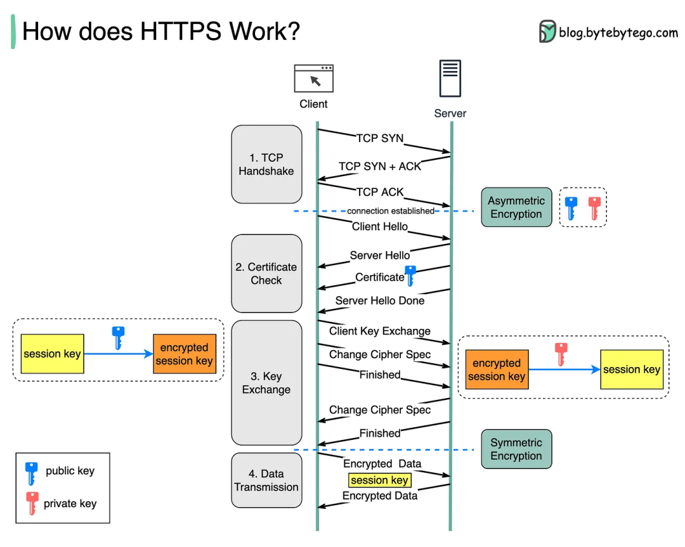
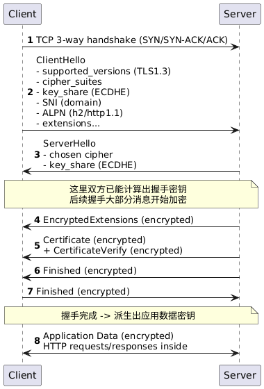

# HTTPS 的工作原理是什么?

> 原文地址: [https://mp.weixin.qq.com/s/lm0xnDL\_NQYYivZhZTuUwA](https://mp.weixin.qq.com/s/lm0xnDL_NQYYivZhZTuUwA)

HTTPS 本质上是 **“HTTP + TLS（以前叫 SSL）”**：用 TLS 在客户端和服务器之间先建立一条加密且可认证的安全通道，然后再在这条通道里传输 HTTP 请求/响应。

下面按“发生了什么”把它讲清楚（以最常见的 TLS 1.3 为主）。

* * *

## 1) HTTPS 解决什么问题？

如果只用 HTTP（明文）：

-   窃听：路上的人能直接看到你访问的 URL、Cookie、表单内容等
    
-   篡改：能替你改页面、插广告、改下载包
    
-   冒充：能假装成网站把你骗过去（中间人攻击）
    

HTTPS 提供三件核心能力：

1.  机密性：内容加密，别人看不懂
    
2.  完整性：内容被改过能检测出来
    
3.  身份认证：确认你连到的是“真网站”（基于证书体系）
    

* * *

## 2) TLS 握手：先“谈好怎么加密、你是谁”，再传 HTTP

一次典型连接大致是：

### A. ClientHello（客户端先打招呼）

浏览器发给服务器一些信息，比如：

-   支持哪些 TLS 版本（TLS 1.3/1.2）
    
-   支持哪些加密套件（cipher suites）
    
-   随机数、扩展字段
    
-   SNI：告诉服务器要访问的域名（同一 IP 多站点时很关键）
    
-   ALPN：协商用 HTTP/2 还是 HTTP/1.1（甚至 HTTP/3 是另一套走 QUIC）
    

> 注意：在未启用 ECH 时，SNI 通常是明文的，所以“你访问哪个域名”可能会被旁观者看到，但**具体内容**仍然是加密的。

### B. ServerHello + 证书（服务器回应）

服务器会：

-   选择最终的 TLS 版本、加密算法
    
-   给出自己的 **证书链**（包含公钥，签发者信息等）
    
-   发送密钥协商相关参数（TLS 1.3 基本都是 ECDHE）
    

### C. 浏览器验证证书（身份认证关键点）

浏览器会检查：

-   证书的域名是否匹配（CN/SAN）
    
-   是否在有效期内、是否被撤销（OCSP/CRL，或 OCSP stapling）
    
-   签发链能否一路验证到本机信任的根证书（Root CA）
    
-   是否满足用途（key usage / extended key usage）
    

如果验证失败，浏览器会强提示甚至拦截。

### D. 生成会话密钥（对称加密开跑）

握手的核心是：双方通过 **非对称/椭圆曲线密钥交换** 得到同一个共享秘密，进而派生出若干 **对称密钥**。

之后真正传输数据用的是 **对称加密 + AEAD**（如 AES-GCM 或 ChaCha20-Poly1305），因为它快。

\*\*结果：\*\*握手结束后，进入“加密通道”，HTTP 请求/响应都在里面传。

* * *

## 3) HTTPS 里 HTTP 具体传什么？（HTTP/1.1 vs HTTP/2）

-   HTTP/1.1 over TLS：仍然是文本格式请求行/头/体，只是外面包了一层 TLS 加密
    
-   HTTP/2 over TLS：HTTP 变成二进制帧、多路复用（一个连接同时跑多个请求），通常更省连接更高效
    

* * *

## 4) 为什么“证书=网站身份”？

证书相当于：**CA（证书机构）签字担保“这个公钥属于这个域名”**。

你访问 `example.com` 时，服务器把证书拿出来，浏览器用操作系统/浏览器内置的信任根列表去验证签名链。验证通过，你才敢用它来协商密钥。

* * *

## 5) 常见误解澄清

-   HTTPS 不等于匿名：你的 IP、访问的域名（SNI / DNS）可能仍可被观察到；HTTPS主要保护“内容”。
    
-   仅加密不等于安全：如果你电脑被恶意软件控制、或装了受控根证书（企业/恶意代理），仍可能被解密拦截。
    
-   TLS 证书不负责“网站内容是否可信”：它证明“你连的是这个域名的持有者”，而不是保证网站不钓鱼。
    

我把 HTTPS/TLS 的“握手流程图 + 哪些明文/密文 + TLS1.3/1.2差异 + 会话复用/0-RTT + HTTP/2/HTTP/3关系”一次讲透。

* * *

## 1) 一张握手流程图（TLS 1.3，最常见）

下面是典型 **TLS 1.3 Full Handshake（首次连接）** 的消息顺序（忽略少量可选项）：

  
编辑

关键点：

-   ClientHello 基本是明文（所以 SNI/ALPN 往往可见，除非启用 ECH）。
    
-   从 ServerHello 之后，TLS 1.3 会尽快进入“加密握手消息”。
    

* * *

## 2) 到底哪些是“明文可见”，哪些一定是“密文”？

### 通常旁观者能看到（取决于协议/配置）：

-   IP、端口
    
-   TCP层特征（比如握手、包大小/时序等元数据）
    
-   DNS 查询的域名（除非你用 DoH/DoT 或系统/网络在做加密 DNS）
    
-   SNI（域名）：TLS 1.2/1.3 默认大多仍可见（除非用 ECH）
    
-   证书本身：在 TLS 1.2 基本明文；TLS 1.3 一般在握手密钥下加密发送（但网络中仍可通过别的方式推断站点）
    

### 一定是密文（HTTPS保护的核心）：

-   HTTP 请求/响应的 **header/body**（比如 Cookie、Authorization、POST 内容）
    
-   绝大部分握手后的 TLS Record payload
    

所以 HTTPS 解决的是“内容机密性/完整性/防篡改/认证”，但**不保证访问行为完全不可见**（尤其是域名层面）。

* * *

## 3) 为啥 TLS 要用“非对称 + 对称”两套加密？

-   非对称（RSA/ECDSA/…）：主要用于“身份认证”和/或“密钥交换”，但很慢。
    
-   对称（AES-GCM / ChaCha20-Poly1305）：用于真正传数据，极快。
    
-   TLS 会在握手里通过 **ECDHE** 协商出共享秘密，再派生对称密钥。
    

> ECDHE 带来的重要属性叫 **前向保密（Forward Secrecy）**：即使将来服务器私钥泄露，过去抓到的流量也不容易被回溯解密（前提是用的是临时密钥交换而不是老式 RSA 静态交换）。

* * *

## 4) 证书验证到底在验证什么？

浏览器主要验证：

-   证书声明的域名（SAN）是否匹配你访问的域名
    
-   签名链能否一路验证到本机信任的 Root CA
    
-   有效期、撤销状态（OCSP/CRL；很多站点会用 OCSP stapling）
    
-   用途（EKU 里是否允许 TLS server auth）
    

验证通过后：浏览器才相信“这个公钥确实属于该域名”，从而放心建立加密通道。

* * *

## 5) TLS 1.2 vs TLS 1.3：你最该记住的差异

### TLS 1.3（现代、推荐）

-   握手更短：通常 **1-RTT** 完成（更快）
    
-   加密更彻底：握手阶段更多消息被加密
    
-   算法更“精简强制”：砍掉很多旧的不安全/复杂选项
    
-   支持 **0-RTT（早期数据）**：复用会话时可“先发请求再补握手”，但有**重放风险**，不适合带副作用操作（如转账）
    

### TLS 1.2（仍然常见）

-   握手一般更长，协商更复杂
    
-   很多遗留加密套件要小心禁用
    
-   证书等握手消息更容易被旁观者看到
    

* * *

## 6) 会话恢复（Resumption）是怎么让第二次更快的？

你第一次握手成功后，双方会缓存某种“会话票据/会话状态”（TLS 1.3 常用 ticket）。  
下次连接时：

-   客户端带上 ticket，服务器验证后可以走更快的路径
    
-   可能还能启用 0-RTT（看配置）
    

实际效果：网页打开更快、握手开销更低。

# HTTP/1.1、HTTP/2 和 QUIC 的演进关系