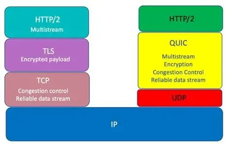

# HTTP/1.1、HTTP/2 和 QUIC 的演进关系

> 原文地址: [https://mp.weixin.qq.com/s/5HW2WIUCvU71LtVd0PylTw](https://mp.weixin.qq.com/s/5HW2WIUCvU71LtVd0PylTw)

HTTP/1.1、HTTP/2 和 QUIC 的详细对比和它们之间的演进关系。

特性

HTTP/1.1 (1997~至今)

HTTP/2 (2015)

QUIC + HTTP/3 (2018~2022正式标准化)

底层传输协议

TCP + TLS（可选）

TCP + TLS（推荐）

QUIC（基于 UDP）+ 内置 TLS 1.3

连接方式

每请求通常一个 TCP 连接（早期），后来支持 Keep-Alive 复用一个连接

单个 TCP 连接上多路复用（Multiplexing）

基于 UDP 的单个连接上多路复用（同样支持）

队头阻塞（Head-of-Line Blocking）

有（TCP 层）

有（TCP 层），但 HTTP/2 本身已解决应用层队头阻塞

无（UDP + QUIC 自己的流控制，每个流独立）

连接建立延迟

1\. TCP 三次握手 2. TLS 握手（1~2 RTT） 总计 3~4 RTT

相同（仍基于 TCP）

0~1 RTT（QUIC 把传输+加密握手合并了）

加密

可选（HTTPS）

强烈推荐，几乎所有浏览器只支持加密的 HTTP/2

强制加密（TLS 1.3 内置在 QUIC 里）

优先级与流控制

无

有（Stream Priority & Flow Control）

更精细的优先级机制

服务器推送

无

有（Server Push）

有（HTTP/3 继续支持，但实际使用率降低）

移动网络表现

较差（丢包导致 TCP 重传会卡住整个连接）

比 HTTP/1.1 好，但仍受 TCP 丢包影响

优秀（QUIC 支持连接迁移，切换 Wi-Fi/4G/5G 不重连）

浏览器支持情况（2025 年）

100%

99%+

主流浏览器全部支持（Chrome、Edge、Firefox、Safari 都已默认开启）

### 它们之间的演进关系

1.  **HTTP/1.1 → HTTP/2**
    
    （2015 年）
    

-   主要目标：解决 HTTP/1.1 的性能瓶颈（文本协议、队头阻塞、大量连接开销）。
    
-   核心改进：二进制分帧、多路复用、头部压缩（HPACK）、服务器推送。
    
-   仍然跑在 TCP 上，所以 TCP 本身的队头阻塞问题没有解决。
    

3.  **HTTP/2 → QUIC + HTTP/3**
    
    （2022 年正式成为标准）
    

-   Google 在 2013 年就开始实验 gQUIC（基于 UDP），后来和 IETF 一起标准化成 QUIC（RFC 9000）。
    
-   QUIC 把“可靠传输 + 加密 + HTTP 语义”全部搬到用户态 UDP 上实现，彻底摆脱了 TCP 和 TLS 的限制。
    
-   HTTP/3 就是“HTTP over QUIC”，协议语义基本和 HTTP/2 一致（二进制分帧、多路复用等），只是底层换成了 QUIC。
    

简单一句话总结关系：

**HTTP/1.1 → HTTP/2 → HTTP/3（QUIC）是 HTTP 协议语义的逐步演进，而 QUIC 是彻底重写了传输层，把 TCP+TLS+HTTP/2 的功能合并成了一个更快的协议。**

### 实际使用现状（2025 年 11 月）

-   全球约 60~70% 的网站流量已经跑在 HTTP/3（QUIC）上（Cloudflare、Google、Facebook 等大厂默认开启）。
    
-   HTTP/2 仍然是最常见的（很多 CDN 同时支持 H2 和 H3，浏览器优先选 H3）。
    
-   HTTP/1.1 只在一些老系统或非加密流量中存在。
    

### 一句话口诀记忆

-   HTTP/1.1：一个连接排队等（慢）
    
-   HTTP/2：一个连接并行跑，但 TCP 丢包全卡住
    
-   QUIC/HTTP/3：一个连接并行跑，丢包只卡一个流，还能 0~1RTT 快速建连，换网络不掉线
    

这就是目前 HTTP 协议家族的完整演进路径。

HTTP/2 的 HPACK vs HTTP/3 的 QPACK 细节

下面是 HTTP/2 的 **HPACK** 和 HTTP/3 的 **QPACK** 最核心的细节对比，它们都是为了解决 HTTP 头部冗余的问题（Header Compression），但因为底层传输从 TCP 变成了 QUIC，带来了队头阻塞问题，因此 QPACK 必须重新设计。

特性

HPACK (HTTP/2)

QPACK (HTTP/3)

所属 RFC

RFC 7541 (2015)

RFC 9204 (2022)

核心数据结构

静态表 + 动态表（Dynamic Table）

静态表 + 动态表（但动态表更新机制完全不同）

动态表更新方式

每收到一个带新头部的响应，就直接同步更新动态表

动态表更新是**单向、异步**的，使用两条独立指令流

动态表更新指令

直接在 Header Block 中混杂编码和表更新

分离：① Header Acknowledgement ② Insert Count Increment ③ Stream Cancellation

是否会产生队头阻塞

**会严重产生**

（Header Block 必须按顺序解码，动态表依赖前面的更新，如果前面一个流丢包，整个连接所有流的头部解码都会卡住）

**完全避免**

（即使某个流丢包或延迟，也不会阻塞其他流的头部解码）

编码类型

Huffman + 索引 + Literal（带/不带索引）

基本相同，但增加了更多防阻塞指令

防 CRIME 攻击

Huffman 可选 + 静态表

同 HPACK，但强制要求实现防压缩侧信道攻击措施

最大动态表大小

通过 SETTINGS\_HEADER\_TABLE\_SIZE 协商

同样协商，但客户端和服务端各自维护自己的动态表（双向独立）

实际压缩率

非常优秀（通常 80~90% 压缩）

与 HPACK 几乎完全相同（差异 < 1%）

### 为什么 HPACK 在 HTTP/2 上有严重队头阻塞？

1.  Header Block 是顺序发送的字节流。
    
2.  解码过程中如果遇到“添加新条目到动态表”的指令，必须立刻执行。
    
3.  如果这个 Header Block 所在 TCP 包丢了，后面的所有 Header Block 都无法解码（因为动态表状态不一致）。
    
4.  结果：一个图片流丢包，会把整个页面的 CSS/JS 头部解码都卡住。
    

### QPACK 是怎么彻底解决这个问题的？

QPACK 的天才设计在于：**把动态表的“写操作”和“读操作”彻底解耦**。

操作

发生在哪条 QUIC 流

是否会阻塞其他流

发送压缩后的 Header Block

请求/响应所在的普通 Data Stream

不会（即使这个流丢包，其他流头部照样能解）

通知对方“我已经成功解码了你的这个头部”

专用的 Control Stream（Header Acknowledgement）

单向、不阻塞

通知对方“我新增了动态表条目”

专用的 Encoder Stream（Insert Count Increment）

单向、不阻塞

关键点：

-   接收方（客户端或服务器）**只依赖自己本地的动态表状态**来解码头部。
    
-   即使 Encoder Stream 的指令丢了或延迟，接收方会保守地认为“动态表还没更新”，顶多用静态表或 Literal 方式解码（慢一点但绝不阻塞）。
    
-   一旦 Encoder Stream 指令到达，再同步更新动态表，用于后续头部。
    

### 实际影响总结（开发者视角）

项目

HPACK (HTTP/2)

QPACK (HTTP/3)

压缩效果

几乎一样好

几乎一样好

移动网络表现

丢包时头部解码全卡（灾难性）

丢包只影响单个流，体验极好

实现复杂度

相对简单

显著更复杂（需要维护 Encoder Stream 等）

中间盒子（CDN/代理）兼容性

很好

早期较差（现在主流 CDN 都已支持）

一句话结论：

**HPACK 是“同步有状态压缩”，在 TCP 上完美但有致命队头阻塞； QPACK 是“异步解耦有状态压缩”，专为 QUIC 设计，牺牲一点实现复杂度，彻底消灭了头部压缩的队头阻塞问题。**

目前（2025 年 11 月），所有主流浏览器和服务器（Chrome、Firefox、Safari、Cloudflare、Nginx、LiteSpeed 等）都已完整实现 QPACK，HTTP/3 的头部压缩性能已经全面超越 HTTP/2。