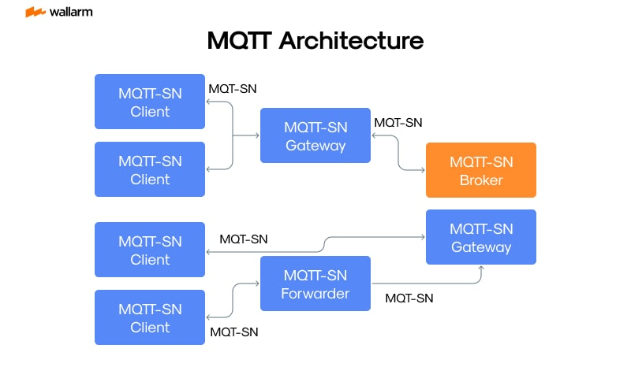

# MQTT引入邮件订阅的思想


> 原文地址: [https://mp.weixin.qq.com/s/kSwaeIU-7xD6NSGYO8oN0g](https://mp.weixin.qq.com/s/kSwaeIU-7xD6NSGYO8oN0g)

**MQTT（Message Queuing Telemetry Transport）确实借鉴了邮件订阅（或更准确地说，“发布-订阅”）的思想**，但它与传统的邮件系统（如SMTP）并不相同，而是采用了\*\*“发布-订阅（Publish/Subscribe）”模型\*\*，这种模型也被用于邮件列表系统中，所以二者在**通信模式上有相似之处**。

* * *

### MQTT 借鉴的“邮件订阅”思想体现在：

类比元素

MQTT

邮件订阅系统

发送者

Publisher（发布者）

发件人

接收者

Subscriber（订阅者）

邮件订阅用户

中间人

Broker（消息代理）

邮件服务器（如Mailman、Listserv）

通信机制

基于主题（Topic）路由消息

基于邮件列表分发

解耦

发布者与订阅者不直接通信

发件人与订阅人不直接通信

* * *

### 主要相似点：

1.  主题/频道的概念：
    

-   MQTT 中通过 _Topic_（主题）区分消息类别；
    
-   邮件系统中通过 _邮件列表名_ 或 _邮件主题_ 分发到特定用户群体。
    
      
    

3.  松耦合机制：
    

-   发布者不关心谁会接收消息，订阅者也不知道是谁发送的；
    
-   邮件系统中的发件人也不直接知道所有订阅者是谁。
    
      
    

5.  中心化中转机制：
    

-   MQTT 使用 _Broker_，邮件系统使用 _邮件服务器_ 来中转消息。
    
      
    

* * *

### 不同之处：

对比点

MQTT

邮件系统

实时性

高，面向 IoT 和低带宽环境

相对低，异步邮件传递

协议层

TCP/IP 上的轻量协议

SMTP/POP/IMAP 协议

消息格式

二进制或文本，结构灵活

邮件格式固定，含头部、正文等

用途

IoT、消息传输、传感器网络

人与人交流、通知、邮件通信

* * *

### 总结：

✅ **MQTT 引入了类似“邮件订阅”的发布-订阅思想**，但它被优化为一种轻量级、低延迟、适用于物联网（IoT）等场景的消息传输协议，**其实现目标和技术手段远超传统邮件系统的“订阅”功能**。

### 发往Broker的消息以什么方式来存储呢？

MQTT 发布者发往 **Broker（消息代理）** 的消息，并不是永久保存的，而是**根据多种因素“临时性地”或“条件性地”进行存储**。这取决于：

* * *

## 🧩 决定 MQTT Broker 是否存储消息的关键因素：

### 1. **QoS 等级（消息服务质量）**

MQTT 定义了三种 QoS（Quality of Service）等级，影响 Broker 如何处理消息：

QoS

含义

是否存储

**0**

最多一次（At most once）

不存储，直接转发

**1**

至少一次（At least once）

会暂存消息，直到接收到客户端 ACK

**2**

只有一次（Exactly once）

会暂存多步握手过程的状态和消息，直到事务完成

👉 QoS 等级越高，Broker 临时存储消息的概率越大。

* * *

### 2. **Retain 标志**

发布时设置 `retain=true`，Broker 会：

-   将这条消息保存在 _“主题 -> 最新保留消息”_ 的映射中；
    
-   当有新订阅者订阅该主题时，Broker 会立即推送这条保留消息。
    

💡 只保存**每个主题最后一条 Retained 消息**，覆盖旧的。

* * *

### 3. **持久会话（Clean Session / Clean Start）**

MQTT 客户端连接时会指定是否是“干净会话”：

-   Clean Session = true：断开后，Broker 不保留任何订阅信息或离线消息。
    
-   Clean Session = false（持久会话）：
    

-   Broker 会保存订阅信息；
    
-   断线期间发布到订阅主题的 QoS 1/2 消息会被**缓存起来**；
    
-   客户端重连后再推送。
    
      
    

* * *

### 4. **消息是否设置为“Will”（遗嘱消息）**

如果客户端异常断开，Broker 会自动向指定主题发布一条“遗嘱消息”，这条消息会被临时保存至连接断开检测超时。

* * *

## 🧱 消息的存储方式（技术层面）

不同 MQTT Broker 的实现不同，存储方式有差异：

Broker

存储方式

**Mosquitto**

默认内存存储，可配置持久化（如文件/数据库）

**EMQX**

支持内存 + RocksDB 持久化，适配 QoS 1/2 离线消息

**HiveMQ**

企业版支持集群+持久存储

**VerneMQ**

支持基于 LevelDB/RocksDB 的存储

* * *

## ✅ 总结一句话：

> **MQTT 消息并非一律持久存储，而是依据 QoS 等级、Retain 标志、Clean Session 以及 Broker 设置等动态决定是否缓存、持久或直接丢弃。**

## ✅ 各主流 MQTT Broker 的存储方式一览：

### 1. **Mosquitto**

-   默认行为：**内存存储**，**非持久化**。
    
-   持久化方式：
    

-   启用 `persistence true` 后，持久化到文件。
    
-   存储文件：
    
    ```
    osquitto.db （默认位置为 /var/lib/mosquitto/mosquitto.db） 
    ```
    
      
    
-   文件格式：**自定义二进制格式**，不是 SQLite，不可直接读写。
    
      
    

-   可选项（配置文件）：
    
    ```
    persistence truepersistence_location /var/lib/mosquitto/persistence_file mosquitto.db
    ```
    
      
    
      
    

* * *

### 2. **EMQX**

-   高性能企业级 Broker，支持插件化存储。
    
-   存储机制：
    

-   默认使用内存 + **RocksDB**（一个高效的持久化键值数据库）
    
-   消息、会话、离线消息等都可持久化
    
      
    

-   数据文件位置：
    
    ```
    emqx/data/mnesia/         → 元数据（Erlang Mnesia 数据库）emqx/data/rocksdb/        → 消息持久化（QoS 1/2 消息）
    ```
    
      
    
      
    
-   数据格式：**二进制结构化存储**，不是 SQLite、不是文本。
    

* * *

### 3. **HiveMQ**

-   商业产品，面向企业级分布式部署。
    
-   持久化：
    

-   使用自定义高性能数据库格式（非公开标准）
    
-   插件系统支持连接 MySQL、PostgreSQL 等外部数据库（用于认证、日志等）
    
      
    

* * *

### 4. **VerneMQ**

-   基于 Erlang，分布式特性强。
    
-   存储：
    

-   使用 **LevelDB 或 RocksDB**。
    
-   可配置不同后端用于持久化消息与会话。
    
      
    

* * *

## 🔍 举例：Mosquitto 的持久化文件结构

启用后会生成如下一类文件：

```
var/lib/mosquitto/mosquitto.db ← 所有持久化数据都在这里 
```

  

内容包括：

-   Retain 消息
    
-   持久化的客户端会话信息（CleanSession=false）
    
-   QoS 1/2 消息缓存
    

无法直接用 SQLite 浏览器或文本编辑器打开。

* * *

## ✅ 总结

Broker

存储格式

是否使用 SQLite/Text

说明

Mosquitto

自定义二进制 `.db` 文件

❌ 否

可启用持久化，但格式封闭

EMQX

RocksDB + Mnesia

❌ 否

高性能键值存储

HiveMQ

私有格式或插件对接 DB

✅ 插件支持 SQL

企业可定制

VerneMQ

LevelDB/RocksDB

❌ 否

分布式友好

  
编辑

图中所展示的是 **MQTT-SN（MQTT for Sensor Networks）架构**，其中的“MQTT-SN”并不是普通的 MQTT，而是为 **传感器网络**（如 Zigbee、LoRa、蓝牙低功耗 BLE 等低带宽、低功耗环境）特别设计的一个协议版本。

* * *

## ✅ 什么是 MQTT-SN？

**MQTT-SN = MQTT for Sensor Networks**  
是标准 MQTT 协议的一个**变种/子集**，专为**资源受限的设备（如嵌入式传感器）和非 TCP/IP 网络**设计。

* * *

## 🧩 MQTT 与 MQTT-SN 的主要区别：

特性

MQTT

MQTT-SN

网络层

基于 TCP/IP

**支持非 TCP 网络**

（如 UDP、串口、BLE）

协议复杂度

相对更完整

更简化，帧头更小

Topic 名字传输

直接传字符串

使用 **Topic ID（编号）**，减少传输开销

连接方式

直接连接到 Broker

需通过 **Gateway 中转**

消息大小

较大，适合网络良好的环境

优化为适应低带宽、低功耗传输

用途

IoT、边缘计算

**传感器网络、工业场景、低功耗终端**

* * *

## 📊 图中架构说明：

你上传的图是典型的 **MQTT-SN 系统架构图**，解释如下：

-   MQTT-SN Client：终端传感器或设备，使用简化版协议，连接到 Gateway。
    
-   MQTT-SN Gateway：网关设备，将 MQTT-SN 协议转换为标准 MQTT 协议，桥接到 Broker。
    
-   MQTT-SN Broker：标准 MQTT Broker（如 Mosquitto/EMQX），最终管理 Topic 和消息路由。
    
-   MQTT-SN Forwarder：可选组件，用于在 Client 和 Gateway 之间转发 MQTT-SN 消息，适合层级化传感器部署。
    

* * *

## ✅ MQTT-SN 应用场景

-   无线传感器网络（Wireless Sensor Network, WSN）
    
-   工业控制系统
    
-   LoRa/LoRaWAN
    
-   蓝牙 Mesh 网络
    
-   边缘设备与网关间的通信
    

* * *

## 🔧 举个应用例子：

-   农田的多个传感器（MQTT-SN Client）通过 LoRa 连接到一个网关（MQTT-SN Gateway）；
    
-   网关将其数据转换成标准 MQTT 消息，发给数据中心的 MQTT Broker；
    
-   中心服务器订阅相关 Topic 接收数据。