# SM3哈希算法详解


> 原文地址: [https://mp.weixin.qq.com/s/IQ3bEgO4\_7VPQqKJKVp7Uw](https://mp.weixin.qq.com/s/IQ3bEgO4_7VPQqKJKVp7Uw)

 今天我们来聊聊SM3哈希算法。这是一种中国国家密码标准，由国家密码管理局在2016年正式发布（GB/T 32905-2016），主要用于数据完整性验证、数字签名和密钥派生等场景。简单来说，哈希算法就像一个“数据指纹机”：把任意长度的输入（如文件、密码）转化成固定长度的“指纹”（哈希值），这个指纹独特、不可逆转。如果输入变一点点，指纹就大变样，但你没法从指纹倒推原数据。这让它超级适合检测篡改或存储密码。

SM3输出256位（32字节）哈希值，安全性相当于SHA-256，但有中国本土优化，避免潜在后门风险。它广泛用于金融、政务和区块链系统，比如和SM2算法搭配使用。

#### SM3的基本原理：像榨汁机一样处理数据

SM3基于Merkle-Damgård结构（MD结构），类似于SHA-2家族。整个过程分成三个大步：消息填充、初始化和压缩迭代。想象成榨汁：输入是水果（消息），先切块（填充），然后榨汁机层层压榨（压缩），最后得出汁（哈希值）。

1.  消息填充（Padding）：输入消息M长度不固定，先补位让它成为512位（64字节）块的整数倍。具体：加一个'1'位，然后补'0'，最后加64位长度表示。确保均匀处理。
    
2.  初始化向量（IV）：用固定常量初始化8个32位寄存器（A到H），总256位。这是起点，就像榨汁机的初始设置。SM3的标准IV是：
    

A = 0x7380166f

B = 0x4914b2b9

C = 0x172442d7

D = 0xda8a0600

E = 0xa96f30bc

F = 0x163138aa

G = 0xe38dee4d

H = 0xb0fb0e4e

1.  压缩函数（Compression）：核心部分！每个512位块被处理成新的寄存器值。分成两子部分：
    

-   SS1 = ((A <<< 12) + E + (Tj <<< j)) <<< 7
    
-   SS2 = SS1 ⊕ (A <<< 12)
    
-   TT1 = FFj(A, B, C) + D + SS2 + W'j
    
-   TT2 = GGj(E, F, G) + H + SS1 + Wj 然后移位更新寄存器。 所有块处理完后，最终寄存器值异或初始IV，得出哈希。
    
-   消息扩展（Message Expansion）：把512位块（16个32位字，W0到W15）扩展成132个字（68个W + 64个W'）。用异或、移位和P1函数（一种置换）计算。公式如：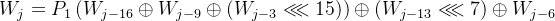等。
    
-   迭代压缩（Iteration）：64轮循环，每轮更新寄存器A到H。使用布尔函数FF和GG（根据轮数不同，FF是异或或多数函数），加上常量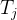（前16轮0x79cc4519，后48轮0x7a879d8a）。 每轮计算SS1、SS2、TT1、TT2，然后更新：
    
      
    

这个过程确保碰撞抵抗（难找两个输入同哈希）和抗预像攻击（难从哈希找输入）。

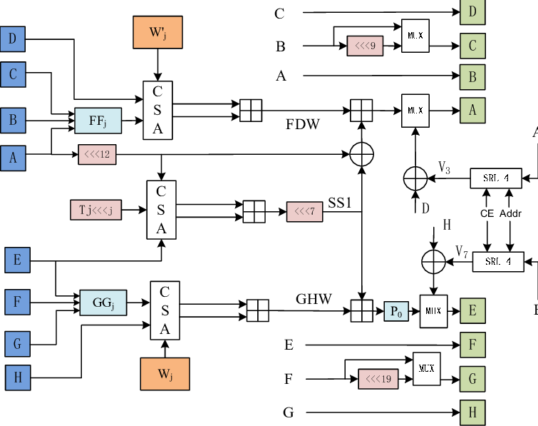  
编辑

上图是SM3的紧凑架构示意图（来自研究论文），展示了寄存器、扩展和压缩模块的整体结构。你可以看到消息如何流入扩展器，然后进入64轮压缩循环，最后输出哈希。

#### SM3的数学函数：简单但强大

-   布尔函数：
    

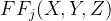\= X ⊕ Y ⊕ Z (j<16) 或 (X&Y) | (X&Z) | (Y&Z) (j>=16)

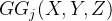\= X ⊕ Y ⊕ Z (j<16) 或 (X&Y) | (~X&Z) (j>=16)

-   置换函数：
    

P0(X) = X ⊕ (X <<< 9) ⊕ (X <<< 17)

P1(X) = X ⊕ (X <<< 15) ⊕ (X <<< 23)

这些操作用位移（<<<）和逻辑运算，确保扩散和混淆。通俗说，像洗牌：位移打乱位置，异或/与或混杂比特。

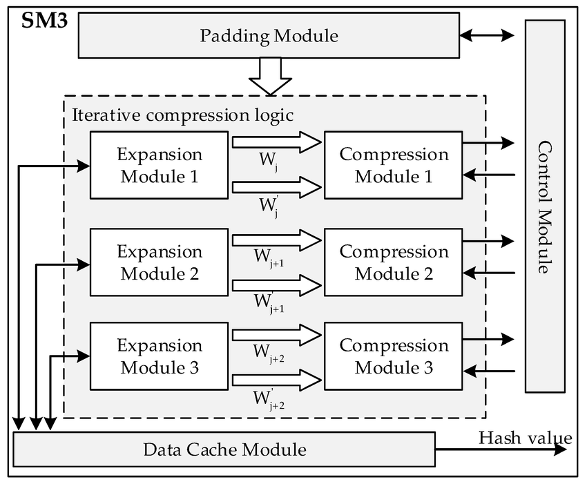编辑

这张图是SM3算法加速器的整体架构（硬件实现），突出输入缓冲、扩展单元和压缩单元的流程。可以看到数据从左到右流动，经过扩展和迭代。

#### SM3的优势与应用

-   优势：安全性高（256位抗暴力破解），效率好（比MD5/SHA-1快、安全），适合硬件实现（如IoT设备）。抗侧信道攻击版本也在研究中。
    
-   应用：中国标准，必用于政务、金融。国际上，IETF有草案，支持全球使用。比如区块链（如Hyperledger）、证书签名。
    
-   与SHA-256比较：结构类似，但常量和函数不同。SM3更注重本土安全。
    

如果想试试，用Python的gmssl库或纯实现代码计算哈希。比如，空消息的SM3哈希是1ab21d8355cfa17f8e61194831e81a8f22bec8c728fefb747ed035eb5082aa2b。

总之，SM3是中国密码学的关键一环，让数据更安全可靠！

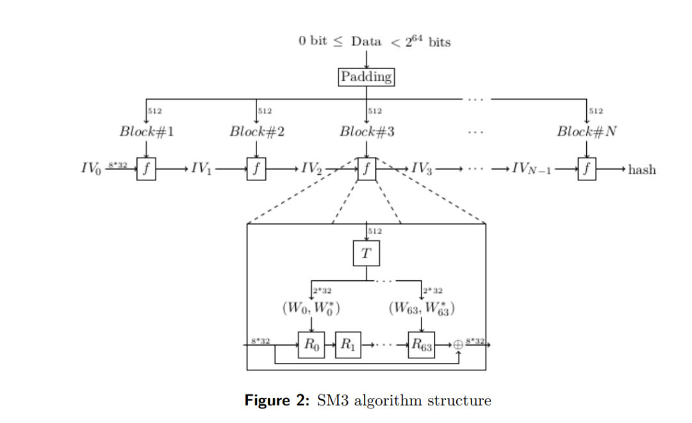  
编辑

这张图其实把 \*\*SM3 的整体“流水线”\*\*画得很清楚：它是典型的 **Merkle–Damgård 结构**（分块 + 迭代压缩），每个 512-bit 消息分组都喂给一个**压缩函数 `f`**，把上一次的链值 `IV` 更新成新的链值，最后输出 256-bit 的哈希。

下面按图从上到下、从外到内拆开讲。

* * *

## 1) 外层：分块 + 链式迭代（图上半部分）

### (1) 输入长度限制与 Padding

图最上面写着：`0 bit ≤ Data < 2^64 bits`  
意思是：消息长度用 64-bit 表示，最多到 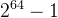 bit。

\*\*Padding（填充）\*\*规则跟 SHA-256 很像：

1.  先补一个 `1` bit
    
2.  再补若干个 `0` bit，使得长度 ≡ 448 (mod 512)
    
3.  最后追加 **64-bit 的原始长度**（big-endian）
    

这样就保证消息被切成整数个 **512-bit 分组**：`Block#1 ... Block#N`（图中每块上方标 512）。

### (2) 链值 IV 的迭代

图里从左到右是：

-   初始向量 `IV0`（图中写了 `8*32`，表示 8 个 32-bit 字，共 256-bit）
    
-   每个分组 `Block#i` 进入压缩函数 `f`
    
-   输出新的链值 `IVi`
    
-   最后一块输出最终 `hash`
    

可以把它想象成：

> “同一台搅拌机（压缩函数 f），每次倒进一块 512-bit 的料（Block），再把上次搅拌结果（IV）当作‘酵母/引子’，搅完得到新的 IV；最后一次搅拌的结果就是 digest。”

* * *

## 2) 内层：压缩函数 f（图下半部分放大框）

放大框对应 **处理一个 512-bit 分组**时，`f(IV, B)` 内部做什么。

### (1) 消息扩展 T：把 512-bit “拉伸”成两条 64 轮用的序列

图中间的 `T` 模块，把一个分组拆成 16 个 32-bit 字（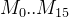），然后扩展出：

-   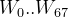（很多资料会写到 68 个）
    
-   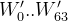
    

图里只标了轮用到的端点 `(W0, W'0)` … `(W63, W'63)`，意思是\*\*每一轮 r 都会取一对 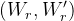\*\*喂给轮函数。

SM3 的扩展不是简单递推，而是用了**置换函数**（Permutation）来“搅乱比特”，核心是：

-   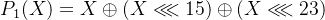
    
-   再配合若干轮转与 XOR，把前面的字混进去
    

直觉上：

> 这一步的目的就是让“相邻的输入位”迅速扩散到“很多轮的很多位置”，为雪崩效应打基础。

### (2) 64 轮迭代 R0…R63：像“加密算法的轮函数”

图里从 `R0 → R1 → ... → R63`，就是 **64 轮压缩**。

SM3 的内部状态是 8 个 32-bit 寄存器：  
(A,B,C,D,E,F,G,H)

每一轮会用到：

-   常量 （图里的 `T` 也暗示常量参与；标准里前 16 轮用一个常量，后 48 轮用另一个常量）
    
-   布尔函数（非线性）：
    

-   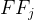：前 16 轮偏“异或型”，后 48 轮偏“多数表决/条件选择型”
    
-   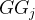：同理，后 48 轮更像“选择器”
    
      
    

-   置换函数 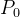（用于把 32-bit 再次扩散）：
    

-   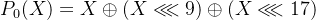
    
      
    

-   大量操作：**模 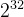 加法、XOR、循环左移（<<<）**
    

所以你可以把每轮理解成：

> “把 8 个寄存器用非线性布尔函数‘揉’一下，再加上常量和消息扩展字‘拌’一下，最后做循环移位让扩散更快。”

### (3) Feedforward（喂回）：最后再跟旧 IV 异或

图右侧有一个 `⊕`，并标了 `8*32`：  
表示 **把 64 轮结束后的 (A..H)** 与 **输入的旧链值 IV** 做逐字 XOR，得到新的 IV′。

这一步很关键，它让结构成为典型的链式压缩：

-   没有它，攻击者更容易构造某些内部碰撞
    
-   有它，分组之间的“历史”被牢牢绑定在一起
    

* * *

## 3) SM3 为什么“难伪造/难逆”——核心机制一句话版

-   不可逆：轮函数里有大量非线性布尔函数 + 模加法 + 置换扩散，信息被压进 256-bit，想倒推输入几乎等价于暴力。
    
-   抗碰撞：消息扩展让每一位影响很多轮；feedforward 让每块都绑定到前史；整体设计目标是达到接近理想哈希的碰撞复杂度（约 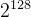 级别）。
    
-   雪崩效应：输入改 1 bit，经扩展 + 64 轮扩散后，输出通常会有接近一半 bit 翻转。
    

* * *

## 4) 用“图对应的伪流程”把整体串起来

1.  Pad(M) → 得到若干 512-bit 分组 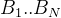 
    
2.  IV = IV0
    
3.  对每个分组：
    

-   计算消息扩展 W,W′
    
-   初始化 (A..H)=IV
    
-   跑 64 轮 R0..R63
    
-   IV = IV XOR (A..H)（feedforward）
    
      
    

5.  输出 `IV`（256-bit）就是 hash
    

下面我用 **UTF-8/ASCII 字节串**`"dorje"`（全小写）把 **SM3** 按你图里的链路 **Padding → 分组 → T(消息扩展) → R0..R63 → ⊕** 完整走一遍，并给出关键数字（十六进制为主，全部是 32-bit word）。

* * *

## 0) 输入 Data（图最上面 “0 bit ≤ Data < 2^64 bits”）

字符串：`"dorje"`  
ASCII/UTF-8 字节：`64 6f 72 6a 65`  
长度：5 字节 = **40 bits**

* * *

## 1) Padding（对应图里的 “Padding”）

SM3 填充规则（和 SHA-256 类似）：

1.  追加 `0x80`（二进制就是追加一个 `1` 再跟若干 `0`）
    
2.  追加 `k` 个 `0x00`，使得总长度 ≡ 448 (mod 512)
    
3.  最后追加 64-bit 的原始长度（big-endian），这里是 `0x0000000000000028`（40 = 0x28）
    

所以 `"dorje"` 填充后正好 **1 个 512-bit 块（64 字节）**：

**Block#1（64字节，按 8 字节分组展示）**

```
646f726a658000000000000000000000000000000000000000000000000000000000000000000000000000000000000000000000000000000000000000000028
```

  

把这个块按 **16 个 32-bit 大端字 W0..W15** 解释（这就是图里每个 Block 进入压缩函数 f 的 “512”）：

```
W00=646f726a  W01=65800000  W02=00000000  W03=00000000W04=00000000  W05=00000000  W06=00000000  W07=00000000W08=00000000  W09=00000000  W10=00000000  W11=00000000W12=00000000  W13=00000000  W14=00000000  W15=00000028
```

  

  

## 2) 分组（对应图里的 Block#1..Block#N）

本例只有 **N=1**，因此：

-   输入链值：`IV0`
    
-   处理 Block#1 得到：`IV1`（也就是最终 hash）
    

SM3 的初始向量（标准固定常量）：

```
IV0:A=7380166f B=4914b2b9 C=172442d7 D=da8a0600E=a96f30bc F=163138aa G=e38dee4d H=b0fb0e4e
```

  

## 3) T(消息扩展)（对应图中大框里的 “T”，输出 (Wj, W'j)）

### 3.1 先扩展得到 W0..W67

公式（j=16..67）：

-   Wj = P1(Wj-16 ⊕ Wj-9 ⊕ ROTL(Wj-3,15)) ⊕ ROTL(Wj-13,7) ⊕ Wj-6
    
-   P1(x) = x ⊕ ROTL(x,15) ⊕ ROTL(x,23)
    

一个“对上图”的直观理解：**T 就是把 512-bit 块“揉面”揉成 68 个 32-bit 调度字 W**。

举个最关键、最好算的例子（因为很多项是 0）：

-   W16 = P1(W0)（因为 W7,W13,W3,W10 都是 0）
    
-   W0 = 646f726a
    
-   P1(646f726a) = e86877e4  
      所以：`W16 = e86877e4` ✅
    

本例完整的 **W0..W67**（每行 4 个）：

```
00:646f726a  01:65800000  02:00000000  03:0000000004:00000000  05:00000000  06:00000000  07:0000000008:00000000  09:00000000  10:00000000  11:0000000012:00000000  13:00000000  14:00000000  15:0000002816:e86877e4  17:65b2f2c0  18:00140a0a  19:1bf590f720:00000000  21:000a0505  22:70cc85c9  23:00140a4a24:65800000  25:e0b42061  26:c672107d  27:89eb7fe828:000a0505  29:00000028  30:ec50a945  31:ae2914b332:51f735b9  33:80106055  34:2e33b68f  35:0d25bb9636:018145ac  37:63c26ec5  38:d5cc3f37  39:104c41c240:f304c1ef  41:1e6d79b9  42:330478cf  43:d5cc38f744:a2702868  45:c9328000  46:ca2e27f7  47:88cebc0048:1130abf8  49:08ca78cd  50:ef4d2e5b  51:f1a9bcf652:bf17ac82  53:6d019c13  54:4cabf82d  55:8d0a72b456:02395c00  57:d3d39c2a  58:08d86515  59:55a5d25560:0cc2168f  61:455e1081  62:32f1c743  63:b898f31564:0cc2168f  65:6f72c895  66:6f72c895  67:6f72c895
```

  

  

### 3.2 再得到 W'0..W'63（图里标的 W\*，也常写 W′）

公式：

-   W′j = Wj ⊕ Wj+4（j=0..63）
    

比如：

-   W′0 = W0 ⊕ W4 = 646f726a ⊕ 00000000 = 646f726a
    

本例完整 **W′0..W′63**：

```
00:646f726a  01:65800000  02:00000000  03:0000000004:00000000  05:00000000  06:00000000  07:0000000008:00000000  09:00000000  10:00000000  11:0000002812:e86877e4  13:65b2f2e8  14:00140a0a  15:1bff95f216:65800000  17:65b8f7c5  18:700c8fce  19:1bf590df20:65800000  21:e0be2564  22:b6be95b4  23:00140a7924:345f35b9  25:801a6550  26:c92c1c28  27:6536db4528:51f735b9  29:8cf3c85d  30:4246edc9  31:2301ad3c32:f2f66fcd  33:8b5500b2  34:083b4a8c  35:4cb2bc1436:f2b3f6ee  37:3caff0b7  38:feac11d0  39:65b8f7c540:515a4b98  41:96a3c5b9  42:2234d3ce  43:dd06803a44:4d3d0633  45:38b4d2f6  46:7539cb75  47:2dce20a848:bd2ef0be  49:dbcbeae7  50:e7d54b4e  51:b4f30d7752:bbd5ba0d  53:38774e46  54:4053dfba  55:d83e62c156:0e1b7a81  57:6b7f5b3f  58:5d7dc610  59:5d7dc61060:4b62a194  61:1b75c757  62:bbe27c47  63:2a2cd814
```

  

> 到这里，你图里 **T** 的输出 `(W0, W′0)` … `(W63, W′63)` 就齐活了。

* * *

## 4) R0..R63（压缩函数 64 轮，对应图里 R0..R63）

每一轮 j 用到：

-   常量：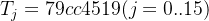；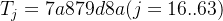 
    
-   本轮消息：`Wj` 和 `W′j`
    
-   以及当前工作寄存器 `A..H`
    

关键公式（通俗解释：每轮都“搅一搅 + 换位”）：

-   SS1 = ROTL( (ROTL(A,12) + E + ROTL(Tj, j)) mod 2^32, 7 )
    
-   SS2 = SS1 ⊕ ROTL(A,12)
    
-   TT1 = (FFj(A,B,C) + D + SS2 + W′j) mod 2^32
    
-   TT2 = (GGj(E,F,G) + H + SS1 + Wj ) mod 2^32
    
-   更新（换位）：
    

-   D=C; C=ROTL(B,9); B=A; A=TT1
    
-   H=G; G=ROTL(F,19); F=E; E=P0(TT2)
    
      
    

-   P0(x)= x ⊕ ROTL(x,9) ⊕ ROTL(x,17)
    
-   FF/GG：前 16 轮是异或型，后 48 轮是“多数/选择”型（增强非线性）
    

### 4.1 给你第 0 轮（R0）把数字对上（示范）

初始（来自 IV0）：

```
A=7380166f B=4914b2b9 C=172442d7 D=da8a0600E=a96f30bc F=163138aa G=e38dee4d H=b0fb0e4eW0 =646f726a  W′0=646f726a  T0=79cc4519
```

  

算出来（本例真实结果）：

-   SS1=51368692
    
-   SS2=505071aa
    
-   TT1=bcfad015
    
-   TT2=c374eda5  
      更新后（也就是图里 R0 盒子出来的状态）：
    

```
A=bcfad015 B=7380166f C=29657292 D=172442d7E=f1e420ca F=a96f30bc G=c550b189 H=e38dee4d
```

  

#### Round 0:

-   W0: 646f726a, W'0: 646f726a
    
-   : 79cc4519
    
-   当前: A=7380166f, B=4914b2b9, C=172442d7, D=da8a0600, E=a96f30bc, F=163138aa, G=e38dee4d, H=b0fb0e4e
    
-   a\_rot12 = 0166f738
    
-   SS1 = 51368692
    
-   SS2 = 505071aa
    
-   TT1 = bcfad015 (FF = 2db0e601)
    
-   TT2 = c374eda5 (GG = 5cd3e65b)
    
-   更新: A=bcfad015, B=7380166f, C=29657292, D=172442d7, E=f1e420ca, F=a96f30bc, G=c550b189, H=e38dee4d
    

以下是以 Round 0 为例，从 a\_rot12 到 TT2 的计算细节。所有值均为 32 位十六进制表示，操作基于 SM3 算法的定义（模 2^32，无符号整数）。我将逐步列出每个计算公式、输入值、操作过程和结果。旋转操作（<<< 或 rol）定义为：rol(x, n) = (x << n) | (x >> (32 - n)) & 0xFFFFFFFF。

初始状态（Round 0 开始时）：

-   A = 0x7380166f
    
-   B = 0x4914b2b9
    
-   C = 0x172442d7
    
-   D = 0xda8a0600
    
-   E = 0xa96f30bc
    
-   F = 0x163138aa
    
-   G = 0xe38dee4d
    
-   H = 0xb0fb0e4e
    
-   Wj = 0x646f726a
    
-   W'j = 0x646f726a
    
-   Tj = 0x79cc4519
    
-   j = 0（因此 Tj <<< (j % 32) = Tj <<< 0 = Tj 本身）
    

#### 步骤 1: 计算 a\_rot12

-   公式：a\_rot12 = A <<< 12（即 rol(A, 12)）
    
-   输入：A = 0x7380166f
    
-   计算过程：将 0x7380166f 的二进制左移 12 位，高位移出部分右移到低位（循环旋转）。
    
-   结果：a\_rot12 = 0x0166f738
    

#### 步骤 2: 计算 rol(Tj, j % 32)

-   公式：rol(Tj, j % 32)（由于 j=0，%32=0，因此无旋转）
    
-   输入：Tj = 0x79cc4519
    
-   计算过程：rol(0x79cc4519, 0) = 0x79cc4519（不变）
    
-   结果：0x79cc4519
    

#### 步骤 3: 计算 temp（SS1 的中间值）

-   公式：temp = (a\_rot12 + E + rol(Tj, j % 32)) & 0xFFFFFFFF
    
-   输入：a\_rot12 = 0x0166f738, E = 0xa96f30bc, rol(Tj, 0) = 0x79cc4519
    
-   计算过程：
    

-   0x0166f738 + 0xa96f30bc = 0xaad627f4（中间和，可能有进位，但保持 32 位）
    
-   0xaad627f4 + 0x79cc4519 = 0x24a26d0d（总和，& 0xFFFFFFFF 确保 32 位）
    
      
    

-   结果：temp = 0x24a26d0d
    

#### 步骤 4: 计算 SS1

-   公式：SS1 = temp <<< 7（即 rol(temp, 7)）
    
-   输入：temp = 0x24a26d0d
    
-   计算过程：将 0x24a26d0d 的二进制左移 7 位，高位移出部分右移到低位。
    
-   结果：SS1 = 0x51368692
    

#### 步骤 5: 计算 SS2

-   公式：SS2 = SS1 ⊕ a\_rot12（位异或）
    
-   输入：SS1 = 0x51368692, a\_rot12 = 0x0166f738
    
-   计算过程：逐位异或（1 如果不同，0 如果相同）。
    

-   二进制示例（简化）：0x51368692 ^ 0x0166f738 = 0x505071aa
    
      
    

-   结果：SS2 = 0x505071aa
    

#### 步骤 6: 计算 FFj

-   公式：由于 j=0 < 16，FFj = A ⊕ B ⊕ C（位异或）
    
-   输入：A = 0x7380166f, B = 0x4914b2b9, C = 0x172442d7
    
-   计算过程：
    

-   A ⊕ B = 0x7380166f ^ 0x4914b2b9 = 0x3a94a4d6（中间结果）
    
-   0x3a94a4d6 ⊕ C = 0x3a94a4d6 ^ 0x172442d7 = 0x2db0e601
    
      
    

-   结果：FFj = 0x2db0e601
    

#### 步骤 7: 计算 TT1

-   公式：TT1 = (FFj + D + SS2 + W'j) & 0xFFFFFFFF
    
-   输入：FFj = 0x2db0e601, D = 0xda8a0600, SS2 = 0x505071aa, W'j = 0x646f726a
    
-   计算过程：
    

-   FFj + D = 0x2db0e601 + 0xda8a0600 = 0x083aec01（中间和）
    
-   0x083aec01 + SS2 = 0x083aec01 + 0x505071aa = 0x588b5dab（中间和）
    
-   0x588b5dab + W'j = 0x588b5dab + 0x646f726a = 0xbcfad015（总和，& 0xFFFFFFFF 确保 32 位）
    
      
    

-   结果：TT1 = 0xbcfad015
    

#### 步骤 8: 计算 GGj

-   公式：由于 j=0 < 16，GGj = E ⊕ F ⊕ G（位异或）
    
-   输入：E = 0xa96f30bc, F = 0x163138aa, G = 0xe38dee4d
    
-   计算过程：
    

-   E ⊕ F = 0xa96f30bc ^ 0x163138aa = 0xbf5e0836（中间结果）
    
-   0xbf5e0836 ⊕ G = 0xbf5e0836 ^ 0xe38dee4d = 0x5cd3e65b
    
      
    

-   结果：GGj = 0x5cd3e65b
    

#### 步骤 9: 计算 TT2

-   公式：TT2 = (GGj + H + SS1 + Wj) & 0xFFFFFFFF
    
-   输入：GGj = 0x5cd3e65b, H = 0xb0fb0e4e, SS1 = 0x51368692, Wj = 0x646f726a
    
-   计算过程：
    

-   GGj + H = 0x5cd3e65b + 0xb0fb0e4e = 0x0dcef4a9（中间和）
    
-   0x0dcef4a9 + SS1 = 0x0dcef4a9 + 0x51368692 = 0x5f057b3b（中间和）
    
-   0x5f057b3b + Wj = 0x5f057b3b + 0x646f726a = 0xc374eda5（总和，& 0xFFFFFFFF 确保 32 位）
    
      
    

-   结果：TT2 = 0xc374eda5
    

这些计算基于 SM3 的压缩函数，确保了算法的非线性性和扩散性。

后面 R1..R63 完全同理，只是 W/W′ 在变、Tj 在变、FF/GG 的形式在 j=16 处分界。

### 4.2 64 轮完整状态表（每行就是一个 Rj）

列含义：`j, Wj, W′j, A..H(该轮更新后)`  
（这就是把图里 **R0..R63** 一行不落地“跑完”）

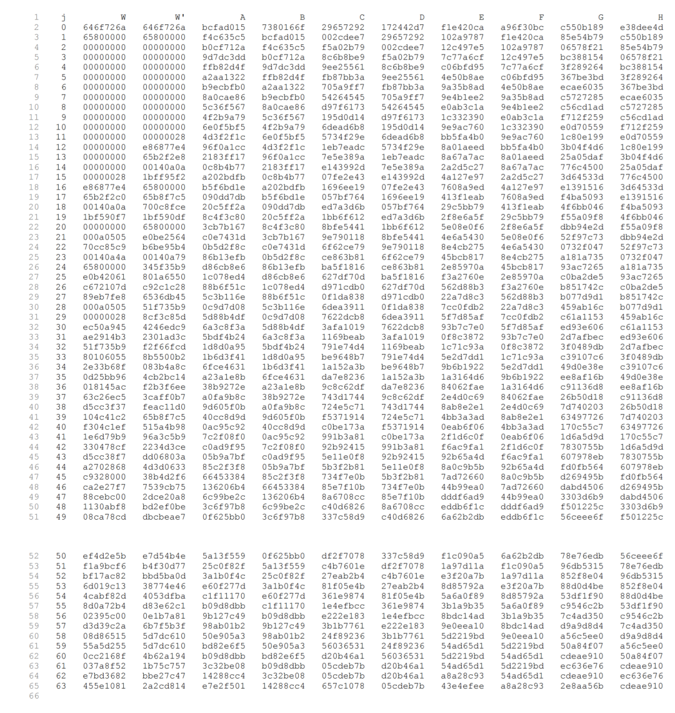

```

```

  

> 看到最后一行（j=63）这组 `A..H`，它就是图里 R63 出来的 8×32 状态。

* * *

## 5) ⊕（对应图右侧的 “⊕”，也叫 feed-forward）

图里从 `IV2`（上一链值）那条线绕到 ⊕，意思是：

-   64 轮结束得到 `(A,B,C,D,E,F,G,H)`
    
-   输出链值 `IV1 = IV0 ⊕ (A..H)`
    

本例最后一轮得到：

```
A..H_end =A=e7e2f501 B=14288cc4 C=657c1078 D=05cdeb7bE=43e4efee F=a8a28c93 G=2e8aa56b H=cdeae910
```

  

做一次逐 word 异或（⊕）：

```
IV1 = IV0 ⊕ A..H_end =9462e36e 5d3c3e7d 725852af df47ed7bea8bdf52 be93b439 cd074b26 7d11e75e
```

  

* * *

## 最终 SM3("dorje") 摘要

**9462e36e5d3c3e7d725852afdf47ed7bea8bdf52be93b439cd074b267d11e75e**