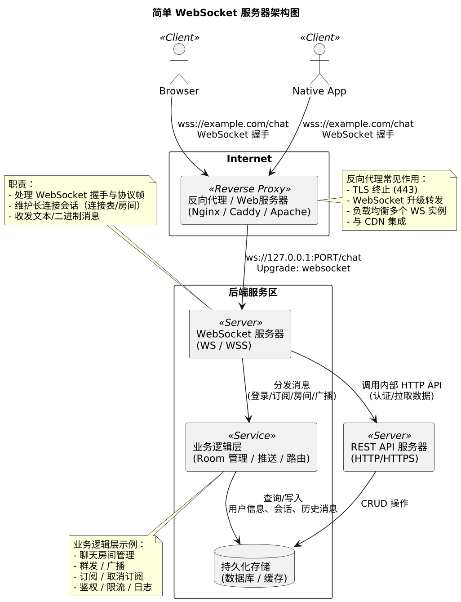

# WebSocket 服务器的工作原理，特性，应用场景


> 原文地址: [https://mp.weixin.qq.com/s/IeapupVlExmrZyXoNmqaEQ](https://mp.weixin.qq.com/s/IeapupVlExmrZyXoNmqaEQ)



  

先给一个整体直觉：**WebSocket 服务器 = 一种“长期在线的 HTTP 连接管理器 + 全双工消息管道”**。它和传统 HTTP 最大的区别就是：**连接一旦升级成功，就不再是“请求-响应一次就结束”，而是双方随时都能发消息，直到一方主动断开为止**。

下面我分几块说：

-   工作原理：握手 → 升级协议 → 持续收发消息
    
-   WebSocket 服务器的典型特性
    
-   常见应用场景（以及为什么要用它而不是轮询 / 长轮询）
    

* * *

## 一、WebSocket 服务器的工作原理

### 1\. 从 HTTP 握手开始

WebSocket 设计时就是“复用 HTTP 端口”的，所以**建立连接时走的是标准 HTTP 请求**，只是加了一些特殊头，让服务器知道“我要升级为 WebSocket”。

典型握手（客户端 → 服务器）大概长这样：

```
GET /chat HTTP/1.1Host: example.comUpgrade: websocketConnection: UpgradeSec-WebSocket-Key: dGhlIHNhbXBsZSBub25jZQ==Sec-WebSocket-Version: 13Origin: https://example.com
```

  

服务器收到后如果接受升级，会返回：

```
HTTP/1.1 101 Switching ProtocolsUpgrade: websocketConnection: UpgradeSec-WebSocket-Accept: s3pPLMBiTxaQ9kYGzzhZRbK+xOo=
```

  

关键点：

-   Upgrade: websocket / `Connection: Upgrade`：告诉对方“我们切换协议了，不再是普通 HTTP。”
    
-   Sec-WebSocket-Key：客户端发一个随机 base64 字符串。
    
-   服务器用这个 Key + 固定 GUID 做一次 SHA1 → base64，得到 `Sec-WebSocket-Accept`，用来防止中间人假冒和一些误用场景。
    

**一旦 101 返回成功，双方就不再说 HTTP，而是说 WebSocket 帧格式**。

* * *

### 2\. 协议升级后：长连接 + 全双工

从服务器视角看，升级成功后，做的事情和一个“长连接 TCP 服务器”很像：

1.  把这个 socket 从 HTTP 处理模块“移交”给 WebSocket 会话管理模块。
    
2.  为每个连接维护会话状态（用户 ID、房间、订阅主题等）。
    
3.  循环处理：
    

-   解析客户端发来的 WebSocket 帧（opcode、fin、mask、payload 等）
    
-   处理文本 / 二进制消息
    
-   发送服务器主动推送的消息（比如广播、心跳、通知）
    
      
    

5.  连接断开时，清理资源，通知业务层（例如从聊天室移除、广播“用户下线”等）。
    

**WebSocket 帧基本结构：**

-   FIN 位：是否是一个消息的最后一帧（支持拆包发送）。
    
-   opcode：0x1 文本，0x2 二进制，0x8 关闭，0x9 ping，0xA pong 等。
    
-   mask：客户端发送给服务器的帧必须带 mask（出于浏览器安全考虑）。
    
-   payload length：数据长度，可变长编码。
    
-   payload data：真正的业务数据（文本 / 二进制）。
    

服务器要做的是：

-   从 socket 中不断读取字节流。
    
-   组装成完整帧 → 还原 payload。
    
-   业务处理 →（可能）给一个 / 多个客户端发送新帧。
    

* * *

### 3\. 连接生命周期（从服务器的角度）

可以简单总结为几个阶段：

  

1.  **TCP 连接建立**（三次握手）
    
      
    
2.  **HTTP 协议 + WebSocket 握手**
    

-   验证 `Sec-WebSocket-Version`、`Origin`（可选）等
    
-   根据 URL / Header 决定是否接受连接（鉴权）
    
      
    

4.  升级成功→进入 WebSocket 会话
    

-   服务器登记这个连接（加入某个房间 / 订阅某些主题）
    
-   可立刻给客户端发一条欢迎 / 初始化数据
    
      
    

6.  持续收发消息
    

-   客户端 → 服务器：业务消息、心跳、关闭帧
    
-   服务器 → 客户端：推送数据、广播、心跳、关闭帧
    
      
    

8.  连接关闭
    

-   正常关闭：双方先发 close 帧，然后 TCP 关闭
    
-   异常关闭：网络中断、超时、进程崩溃等，服务器需要清理状态
    
      
    

* * *

### 4\. WebSocket 服务器在实现层面会做的事情

一般一个成熟的 WebSocket 服务器（比如你用 Node.js、Go、Java 写的）会有这些组件：

1.  监听端口 / 接入层
    

-   直接监听 80/443，或在 Nginx/Caddy 等反代后面监听本地端口（常见）
    
      
    

3.  握手处理
    

-   校验 HTTP 请求头、计算 `Sec-WebSocket-Accept`、做权限/鉴权（JWT、Cookie、Token 等）
    
      
    

5.  连接管理
    

-   维护一个连接表（可能是 map：connId → connection）
    
-   支持分组 / 房间：比如聊天室 room → 一组连接
    
      
    

7.  消息路由 / 广播
    

-   单播：给特定用户发
    
-   组播：给一个房间里所有人发
    
-   广播：所有连接都发
    
      
    

9.  心跳与超时
    

-   利用 ping/pong 或业务层消息做心跳
    
-   一段时间没收到心跳则断开 / 清理
    
      
    

11.  流量控制 / backpressure
     

-   防止发送缓冲区撑爆：客户端来不及收，就要限速 / 丢弃 / 断开
    
      
    

13.  扩展与压缩
     

-   支持 permessage-deflate 等扩展，对文本进行压缩
    
      
    

15.  日志与监控
     

-   连接数，消息频率，错误统计，方便排障和扩容
    
      
    

* * *

## 二、WebSocket 的主要特性（从服务器视角看）

总结几个关键特性和它们对服务器的意义：

1.  全双工、低延迟
    

-   一条连接上，客户端和服务器可以随时互相发消息，不用像 HTTP 那样每次发请求。
    
-   适合需要“瞬时变化立刻推送”的场景（聊天、行情、游戏状态）。
    
      
    

3.  长连接，状态化
    

-   服务器和客户端间可以保留会话状态（玩家信息、订阅列表等）。
    
-   和 REST 那种“无状态请求”不同，更接近“session + 长连接”的模型。
    
      
    

5.  跨域友好
    

-   只要握手阶段通过 Origin 校验，浏览器就能发起跨域 WebSocket 连接，不需要 CORS 那种复杂 OPTIONS。
    
-   对服务器来说，多一层安全校验：决定是否允许某些域连接。
    
      
    

7.  数据格式灵活
    

-   文本：一般是 JSON、XML、自定义协议文本。
    
-   二进制：可以直接传 protobuf、MessagePack、自定义二进制协议，非常适合性能敏感场景。
    
      
    

9.  运行在常规端口（80/443）
    

-   对于复杂网络环境（公司内网）更友好，配合 HTTPS（wss://）可以做到安全防护。
    
      
    

11.  和 HTTP 基础设施兼容
     

-   proxy\_http\_version 1.1
    
-   Upgrade / `Connection` 头透传
    
-   可以放在 Nginx / Caddy / HAProxy 后面，利用它们做 TLS 终止、负载均衡。
    
-   反代中只需要正确设置：
    
-   服务器端真正处理的是已经升级后的纯 WS 流量。
    
      
    

##     特性总结：

-   持久连接 
    
    ：WebSocket 连接保持打开状态，允许根据需要来回发送数据。
    
-   实时通信 
    
    ：数据一旦可用，即可立即推送给客户端，无需客户端请求。
    
-   低延迟 
    
    ：WebSocket 提供低延迟通信，非常适合对时间要求较高的应用程序。
    
-   全双工 
    
    ：客户端和服务器可以同时发送和接收数据，使通信更加高效。
    

实际上，WebSocket 服务器通常使用 WebSocket 协议（ws:// 或 wss:// 用于安全通信），并且已在各种服务器端技术中实现，包括 Node.js、Python（使用 Django 或 Flask 等框架）、Java 等。

## WebSocket 连接处理程序

**WebSocket 连接处理程序**负责管理服务器和特定客户端之间的 WebSocket 连接。

当发生特定的 WebSocket 事件时，将调用 **WebSocket 连接处理函数** ：

1.  连接成功时 (on\_open)
    
     — 当客户端成功连接时触发。用于初始化资源、验证用户身份等。
    
2.  On Message (on\_message)
    
     — 当服务器收到来自客户端的消息时调用。用于处理请求、发送响应或广播数据。
    
3.  错误处理 (on\_error)
    
     — 当 WebSocket 连接发生错误时调用。有助于日志记录和错误处理。
    
4.  On Close (on\_close)
    
     — 当连接关闭时触发，无论是客户端还是服务器关闭连接。用于清理和资源管理。
    

* * *

## 三、WebSocket 的典型应用场景

场景

为什么适合用 WebSocket

典型技术栈示例

即时聊天（IM）

需要实时推送消息，双向低延迟

Socket.IO、WebSocket + Node.js、Go、Java

实时协作编辑

多用户同时编辑，操作需要实时同步

ShareDB、Y.js + WebSocket

在线多人游戏

位置、动作需要毫秒级同步

Colyseus、Socket.IO、Elixir Phoenix

实时监控大屏/仪表盘

服务器主动推送最新数据（如股票、服务器状态、日志）

Spring WebSocket、NestJS、Python asyncio

直播间弹幕与互动

高并发、服务器推送到所有观众

WebSocket + Redis Pub/Sub、Kafka

金融交易/行情推送

要求极低延迟、可靠推送

WebSocket + 二进制协议（如 protobuf）

IoT 设备实时控制与状态上报

设备与云端需要双向长连接

MQTT over WebSocket、原生 WebSocket

客服系统、远程桌面

需要持续交互和画面传输

WebRTC + WebSocket 信令

### 与其他实时技术的对比

技术

实时性

双工性

浏览器支持

服务器开销

适用场景

HTTP 轮询

差

单向

好

高

简单场景，不推荐

Long Polling

中

单向（伪双向）

好

中高

过渡方案，已基本被淘汰

Server-Sent Events

好

服务器→客户端

好

低

纯推送（如通知、行情）

WebSocket

极好

全双工

好

中

绝大多数实时双向交互场景

WebTransport

更好

全双工+多路复用

逐步支持

更低

未来替代方案（基于 QUIC）

  

### 1\. 实时聊天 / IM / 弹幕系统

-   用户上线保持一个 WebSocket 连接。
    
-   所有消息经服务器转发：
    

-   A → 服务器 → B
    
-   或 服务器广播到一个房间 / 房间里所有人
    
      
    

-   优点：
    

-   延迟极低，消息几乎“秒到”。
    
-   连接数多时可以按房间、用户分组，方便扩展。
    
      
    

### 2\. 实时行情推送 / 实时监控面板

-   股票 / 外汇行情、K 线图。
    
-   服务器监控 CPU、内存、请求 QPS 的实时 Dashboard。
    
-   WebSocket 非常适合这种“服务器主动往客户端推数据”的场景，避免轮询带来的延迟和浪费。
    

### 3\. 在线游戏 / 协同编辑

-   多人在线游戏（棋类、卡牌、轻量动作游戏）：
    

-   玩家位置、动作、技能释放等频繁变化，需要及时同步。
    
      
    

-   文档 / 代码协同编辑（类似VSCode Live Share）：
    

-   一人修改，所有人立刻看到更新。
    
      
    

-   需要的就是**低延迟 & 高频小消息**，WebSocket 很适配。
    

### 4\. 通知 / 消息推送（替代长轮询）

-   像后台管理系统中的“新订单提醒”、“新消息通知”。
    
-   以前常用长轮询（long polling）或短轮询：
    

-   请求数量多，浪费带宽、CPU。
    
      
    

-   WebSocket 只需要一次握手，之后一直在线，有消息就推送，资源利用更合理。
    

### 5\. IoT / 设备管理面板

-   智能设备、传感器通过 WebSocket 撑起一条长连接。
    
-   服务器可以主动“发命令”给设备，比如重启、升级、调整参数。
    
-   设备可以随时报告状态，云端面板就能实时看到。
    

### 6\. 隧道 / 代理 / 反向代理

-   像 frp 这类工具：
    

-   客户端和服务器之间用 WebSocket 做“数据载体”。
    
-   WebSocket 之上再承载TCP 流量。
    
      
    

-   优点：
    

-   利用 wss:// ，实现类似HTTPS的安全。
    
-   可以叠加 CDN、前置 Nginx / Caddy 做 TLS 终止。
    
      
    

* * *

  

## 四、适合 / 不适合 WebSocket 的情况

最后简单给一个“什么时候适合用 WebSocket”的判断：

**优先考虑 WebSocket 的场景：**

-   需要**服务器主动推送**（而不是客户端轮询）的。
    
-   需要**低延迟、频繁交互**的（聊天、行情、推送、协作编辑、游戏状态同步）。
    
-   需要**双向实时流**的（例如隧道、远程控制）。
    

**不一定要 WebSocket 的场景：**

-   简单的 CRUD 接口（增删改查），请求少且不要求实时。
    
-   只需偶尔轮询一下状态，比如每 5 分钟刷新一次数据。
    
-   重前台、轻后端交互，传统 REST/HTTP + 短轮询已足够。