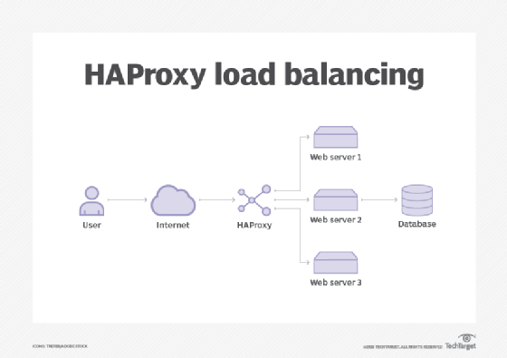
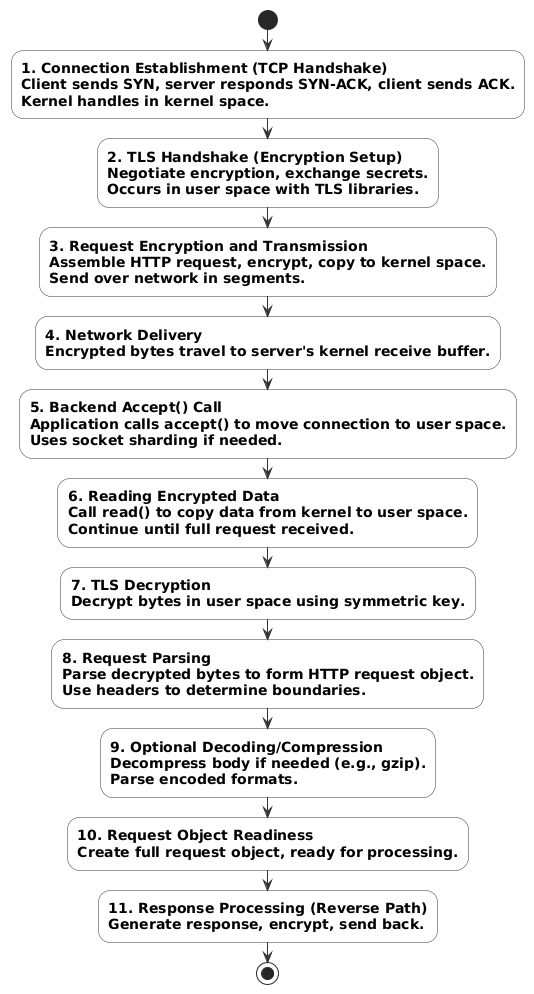
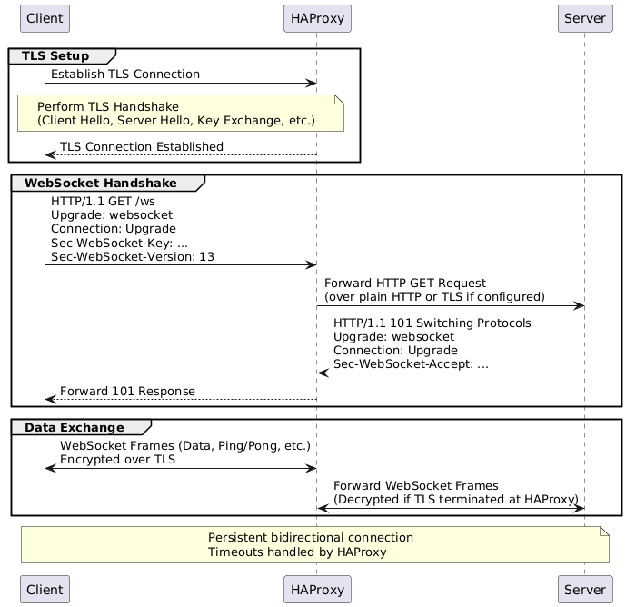

# websocket + TLS如何搭配HAProxy使用？


> 原文地址: [https://mp.weixin.qq.com/s/yP69CVG8yPtszi2ew-C6RA](https://mp.weixin.qq.com/s/yP69CVG8yPtszi2ew-C6RA)

###  HAProxy 的架构设计概述

HAProxy 是一个开源的高性能负载均衡器和代理服务器，主要用于 TCP 和 HTTP 应用的代理、高可用性和负载均衡。它被设计为高效的数据转发工具，专注于以最小操作快速移动数据。

#### 核心架构特点

HAProxy 采用**事件驱动、非阻塞引擎**，结合了快速 I/O 层和基于优先级的多线程调度器。这种设计允许它处理大量并发连接，而无需阻塞线程。

-   单进程模型
    
    ：默认运行在单个进程中，支持多线程（每个 CPU 核心一个线程），以实现高吞吐量（如超过 40 Gbps 或处理重型 SSL）。这避免了多进程间的通信开销，大多数用户（>99%）无需多线程。
    
-   非阻塞 I/O
    
    ：使用事件循环（如 Linux 的 epoll 或 BSD 的 kqueue）处理 I/O 操作，内核负责大部分 TCP 处理，HAProxy 只进行最小用户空间操作（约 15% 用户空间，85% 内核）。
    
-   分层架构
    
    ：数据仅在需要时通过层级传递，优化 CPU 缓存效率，并将连接固定到特定 CPU 以减少上下文切换。
    

以下是一个典型的 HAProxy 负载均衡架构示意图，展示了用户请求如何通过 HAProxy 分发到后端服务器：

编辑

#### 关键组件

HAProxy 的架构围绕以下核心组件构建：

-   Frontend（前端）
    
    ：监听传入连接，应用客户端侧规则（如 ACL、头部修改），并转发到后端。支持 TCP、HTTP 和 SSL/TLS 终止。
    
-   Backend（后端）
    
    ：代表服务器群组，定义负载均衡算法（如 round-robin、leastconn）和服务器列表。处理健康检查和故障服务器剔除。
    
-   Full Proxy
    
    ：用于 TCP 代理，结合前端和后端实现端到端代理。
    
-   Stick-tables
    
    ：内存表，用于会话持久性和客户端跟踪，支持集群复制。
    
-   Maps
    
    ：键值文件，用于运行时查找（如地理位置映射）。
    
-   ACLs（访问控制列表）
    
    ：基于请求内容（如 URL、头部）进行条件处理和路由。
    

#### 请求处理流程

### HAProxy 处理传入连接的 9 个步骤

HAProxy 处理传入连接是一个事件驱动的过程，涉及前端（frontend）和后端（backend）的规则应用、负载均衡以及日志记录。根据官方文档，该过程可以总结为以下 9 个步骤：

1.  接受来自属于“frontend”的监听套接字的传入连接
    
    ： HAProxy 在配置为 frontend 的套接字上接受传入连接，这些套接字引用一个或多个监听地址。这是客户端连接的初始接收点。
    
2.  应用 frontend 特定的处理规则
    
    ： 接受连接后，HAProxy 应用 frontend 中定义的规则。这些规则可能阻塞连接、修改头部，或拦截连接以执行内部功能，如提供统计页面或 CLI 命令。
    
3.  将传入连接传递给“backend”
    
    ： 处理后的连接被传递到 backend，后者代表一个服务器群组，包含服务器列表和负载均衡策略。
    
4.  应用 backend 特定的处理规则
    
    ： HAProxy 对连接应用 backend 特定的规则，进一步配置或操作连接的处理方式，在负载均衡决策前进行。
    
5.  决定将连接转发到哪个服务器
    
    ： 使用 backend 中定义的负载均衡策略，HAProxy 选择具体的服务器进行转发，基于算法如轮询（round-robin）、最小连接（least connections）或源哈希（source hashing）。
    
6.  对响应数据应用 backend 特定的处理规则
    
    ： 一旦服务器响应，HAProxy 对响应数据应用 backend 特定的规则，如修改头部或应用转换，然后再发送回客户端。
    
7.  对响应数据应用 frontend 特定的处理规则
    
    ： backend 处理后，HAProxy 对响应数据应用 frontend 特定的规则，确保一致性或进一步修改（如头部重写），然后返回给客户端。
    
8.  发出日志报告发生的情况
    
    ： HAProxy 生成详细的日志条目，记录整个过程，包括源 IP、前端、后端、服务器、计时、连接状态，以及任何粘性或错误操作。这对故障排除和监控至关重要。
    
9.  循环等待新请求或关闭连接
    
    ： 在 HTTP 模式下，HAProxy 循环返回以等待来自同一连接的新请求（如 keep-alive 模式）。否则，它关闭连接。对于非 HTTP（如 TCP），连接在此步骤后终止。
    

这些步骤突出了 HAProxy 作为灵活、有状态代理的核心机制，集成了前端和后端的逻辑。

  

  
编辑

### HAProxy 配置示例：基本负载均衡与 WebSocket 支持

以下是一个典型的 HAProxy 配置示例，展示了其架构中的关键组件：全局设置（global）、默认设置（defaults）、前端（frontend）和后端（backend）。这个示例假设您有一个 Web 应用，需要处理 HTTP 和 WebSocket 流量，并启用 TLS 终止。配置基于 HAProxy 2.x 版本，适用于生产环境的基本负载均衡场景。

#### 示例配置文件（haproxy.cfg）

text

```
global    log /dev/log local0 notice  # 日志设置    log /dev/log local1 notice    chroot /var/lib/haproxy     # 安全隔离    stats socket /run/haproxy/admin.sock mode 660 level admin    stats timeout 30s    user haproxy    group haproxy    daemon    # TLS 默认设置，提高安全性    ssl-default-bind-ciphers ECDHE-ECDSA-AES256-GCM-SHA384:ECDHE-RSA-AES256-GCM-SHA384:...（根据需要配置完整列表）    ssl-default-bind-options ssl-min-ver TLSv1.2 no-tls-ticketsdefaults    log global    mode http  # HTTP 模式，支持头部检查和 WebSocket    option httplog    option dontlognull    timeout connect 5000ms    timeout client 50000ms    timeout server 50000ms    errorfile 400 /etc/haproxy/errors/400.http    errorfile 403 /etc/haproxy/errors/403.http    errorfile 408 /etc/haproxy/errors/408.http    errorfile 500 /etc/haproxy/errors/500.http    errorfile 502 /etc/haproxy/errors/502.http    errorfile 503 /etc/haproxy/errors/503.http    errorfile 504 /etc/haproxy/errors/504.httpfrontend http-in    bind *:80  # HTTP 监听端口，重定向到 HTTPS    redirect scheme https code 301 if !{ ssl_fc }frontend https-in    bind *:443 ssl crt /etc/haproxy/certs/yourdomain.com.pem  # TLS 终止，指定证书路径    mode http    option http-server-close    # ACL 示例：检测 WebSocket    acl is_websocket hdr(Upgrade) -i WebSocket    acl is_websocket hdr(Connection) -i Upgrade    # 路由规则    use_backend websocket_backend if is_websocket    default_backend web_backendbackend web_backend    balance roundrobin  # 负载均衡算法：轮询    option forwardfor   # 转发客户端 IP    http-request set-header X-Forwarded-Port %[dst_port]    http-request add-header X-Forwarded-Proto https if { ssl_fc }    server server1 192.168.1.10:80 check  # 后端服务器1，启用健康检查    server server2 192.168.1.11:80 check  # 后端服务器2backend websocket_backend    timeout tunnel 3600s  # 长超时，支持 WebSocket 持久连接    server ws_server1 192.168.1.10:3000 check# 统计页面（可选，用于监控）listen stats    bind *:8404    stats enable    stats uri /stats    stats hide-version    stats admin if LOCALHOST
```

  

#### 配置说明

-   Global 部分
    
    ：定义全局参数，如日志、用户权限和 TLS 默认设置。这体现了 HAProxy 的安全性设计（如 chroot 和权限丢弃）。
    
-   Defaults 部分
    
    ：设置默认行为，如超时和错误文件处理，适用于所有 frontend 和 backend。
    
-   Frontend 部分
    
    ：处理传入连接（步骤1-2）。这里有两个 frontend：一个用于 HTTP 重定向到 HTTPS，另一个用于 TLS 监听。使用 ACL（访问控制列表）检测 WebSocket 并路由（步骤3）。
    
-   Backend 部分
    
    ：定义服务器群组和负载均衡（步骤3-5）。web\_backend 用于普通 HTTP 流量，websocket\_backend 专用于 WebSocket，支持长连接。健康检查自动剔除故障服务器。
    
-   处理流程体现
    
    ：这个配置展示了请求从 frontend 接受（步骤1）、应用规则（步骤2）、传递到 backend（步骤3）、选择服务器（步骤5）、处理响应（步骤6-7）、日志记录（步骤8），并支持 keep-alive 循环（步骤9）。
    

#### 部署和测试提示

-   证书准备
    
    ：使用 Let's Encrypt 生成 /etc/haproxy/certs/yourdomain.com.pem（包含私钥、证书和链）。
    
-   启动 HAProxy
    
    ：sudo haproxy -f /etc/haproxy/haproxy.cfg -D（后台运行）。
    
-   测试
    
    ：访问 https://yourdomain.com 测试 HTTP；使用 wscat -c wss://yourdomain.com/ws 测试 WebSocket。查看日志：tail -f /var/log/syslog | grep haproxy。
    
-   常见优化
    
    ：对于高负载，启用多线程（在 global 添加 nbproc 1 和 nbthread 4）。如果需要 sticky sessions，添加 cookie JSESSIONID prefix 到 backend。
    

### HAProxy 配置 WebSocket +TLS 的基本原理

HAProxy 可以作为反向代理和负载均衡器，支持 WebSocket 协议（通过 HTTP Upgrade 机制）和 TLS 终止（SSL offloading）。WebSocket 连接通常从 HTTP/HTTPS 开始，然后升级为持久连接。HAProxy 在 HTTP 模式下处理这种升级，而 TLS 则在 frontend 部分启用，以确保客户端到 HAProxy 的连接是加密的，后端可以是明文（推荐）或加密的。

关键点：

-   使用 mode http 以检查 HTTP 头并处理 Upgrade。
    
-   定义 ACL 来检测 WebSocket 头（如 Upgrade: websocket 和 Connection: Upgrade）。
    
-   设置较长的超时（如 timeout tunnel 或 timeout server）以保持 WebSocket 连接。
    
-   TLS 配置：在 bind 指令中添加 ssl crt 指定证书路径。
    
-   HAProxy 无需特殊插件即可支持 WebSocket，通常只需正确配置 ACL 和超时。
    

如果后端应用硬编码使用 ws:// 而非 wss://，HAProxy 无法直接强制升级为安全连接；需修改应用或使用内容重写工具（如 Nginx）。

### 示例配置 1：简单 WebSocket + TLS（通用场景）

这是一个基本的配置，适用于将 WebSocket 流量路由到专用后端，同时在 frontend 终止 TLS。

text

```
global    log /dev/log local0    log /dev/log local1 notice    user haproxy    group haproxy    daemon    # TLS 默认设置（可选，提高安全性）    ssl-default-bind-ciphers ECDHE-ECDSA-AES128-GCM-SHA256:ECDHE-RSA-AES128-GCM-SHA256:...（根据需要配置）    ssl-default-bind-options ssl-min-ver TLSv1.2defaults    mode http    timeout connect 5s    timeout client 50s    timeout server 50sfrontend fe_https    bind *:443 ssl crt /etc/haproxy/certs/yourdomain.com.pem  # 指定证书（包含私钥和证书链）    option http-server-close    # 检测 WebSocket    acl is_websocket hdr(Upgrade) -i WebSocket    acl is_websocket hdr(Connection) -i Upgrade    use_backend be_websocket if is_websocket    default_backend be_http  # 普通 HTTP 后端backend be_websocket    timeout tunnel 1h  # 长超时以支持持久连接    server app1 192.168.1.10:3000 check  # 后端服务器（明文）backend be_http    server app1 192.168.1.10:80 check
```

  

-   说明
    
    ：客户端通过 wss://yourdomain.com 连接。HAProxy 在 443 端口监听 TLS 流量，检测到 WebSocket 头后路由到专用后端。使用 timeout tunnel 处理隧道模式下的持久连接。
    

### 示例配置 2：高级配置（带路径检测和认证，支持 WebSocket 如 /ws/）

这是一个更复杂的示例，适用于应用如 Paperless-ngx 或类似，需要路径-based 路由和基本认证。

text

```
frontend fe_https    bind *:443 ssl crt /etc/haproxy/certs/yourdomain.com.combined ssl-min-ver TLSv1.3    mode http  # HTTP 模式以处理头    # WebSocket ACL（路径以 /ws/ 开头且有正确头）    acl path_ws path_beg -i /ws/    acl hdr_is_websocket hdr(Upgrade) -i websocket    acl hdr_is_upgrade hdr(Connection) -i upgrade    # 拒绝无效 WebSocket 请求    http-request reject if path_ws !hdr_is_websocket !hdr_is_upgrade    use_backend be_websocket if path_ws hdr_is_websocket hdr_is_upgrade    default_backend be_httpbackend be_http    server app 127.0.0.1:8000 check    # 可选：添加认证    http-request auth realm YourRealm unless { http_auth_group(your_users) }backend be_websocket    timeout server 600s    server app 127.0.0.1:8000 check    # 额外 WebSocket 头验证    acl hdr_connection_upgrade hdr(Connection) -i upgrade    acl hdr_upgrade_websocket hdr(Upgrade) -i websocket    acl hdr_websocket_key hdr_cnt(Sec-WebSocket-Key) eq 1    acl hdr_websocket_version hdr_cnt(Sec-WebSocket-Version) eq 1    http-request reject if !hdr_connection_upgrade !hdr_upgrade_websocket !hdr_websocket_key !hdr_websocket_version
```

  

-   说明
    
    ：此配置在 TLS 基础上添加了路径检测（/ws/），并验证 WebSocket 特定头以防止滥用。适合需要分离 HTTP 和 WebSocket 流量的场景。
    

### 额外提示

-   证书管理
    
    ：使用 Let's Encrypt 或自签名证书。证书文件通常是 PEM 格式（私钥 + 证书 + 中间链）。
    
-   测试
    
    ：使用工具如 wscat -c wss://yourdomain.com/ws 测试连接。检查 HAProxy 日志（/var/log/haproxy.log）以调试。
    
-   HTTP/2 支持
    
    ：如果启用 HTTP/2（在 bind 添加 alpn h2,http/1.1），WebSocket 仍兼容，但需确保配置不冲突。
    
-   常见问题
    
    ：如果连接失败，确保后端支持 WebSocket Upgrade，且防火墙允许流量。如果使用 TCP 模式（passthrough），无法检查头，需全链路 TLS。
    

  
编辑