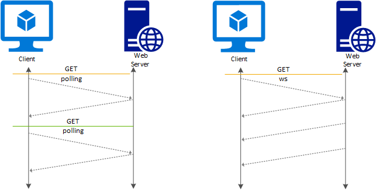
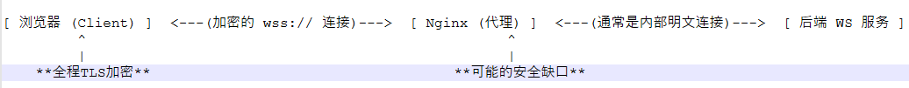
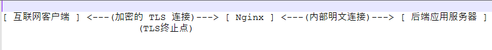

# websocket和传统socket有何差别？


> 原文地址: [https://mp.weixin.qq.com/s/N83Iih3bYR-IaDyQLsyxGg](https://mp.weixin.qq.com/s/N83Iih3bYR-IaDyQLsyxGg)

这是一个非常经典的问题。我们来详细拆解一下 WebSocket 和传统 Socket 的区别与关系。

###   
编辑

### 核心结论

**WebSocket 是构建在传统 Socket 之上的一种高级应用层协议。** 你可以把它们的关系理解为“特制的高速铁路（WebSocket）”和“普通的土地/路基（传统 Socket）”的关系。

-     
    
-   **传统 Socket**：是传输层（如 TCP/UDP）提供给应用程序进行网络通信的**底层编程接口**。它非常基础、灵活，但需要你自己处理很多细节。
    
-     
    
-   **WebSocket**：是一个完整的**应用层通信协议**（基于 TCP），它建立在 Socket 接口之上，提供了更高级、更易用的功能，特别是全双工通信。
    

所以，它们**不是子集关系，而是不同层级的关系**。WebSocket 协议的实现依赖于底层的 Socket API。

* * *

### 详细对比表格

特性

传统 Socket

WebSocket

**协议层级**

是操作系统提供的**编程接口**，位于传输层（TCP/UDP）之上。

是一个完整的**应用层协议**（基于 TCP）。

**通信模式**

非常原始。你可以用它实现任何模式（如单向、半双工、全双工），但都需要自己编码控制。

原生支持**全双工通信**。建立连接后，客户端和服务器可以随时、独立地向对方发送数据。

**通信协议**

**无协议**。你通过 Socket 发送和接收的是原始的字节流，应用层协议（如数据格式、含义）需要完全自己定义和解析。

**有协议**。WebSocket 有自己的协议标准（RFC 6455），包括开头的握手、数据帧格式（包含帧类型、掩码等）。通信双方都遵循这个标准。

**数据格式**

纯字节流。你需要自己处理粘包、拆包等问题。

基于消息（Message）或帧（Frame）。协议本身帮你处理了消息边界。

**连接建立**

直接通过 IP 和端口进行连接。

连接建立过程复杂。必须首先以一个**标准的 HTTP 请求**（Upgrade 请求）开始，协商升级为 WebSocket 协议。

**开销**

开销极小，只有你发送的原始数据本身。

有少量的协议头开销（几个字节），用于封装每一帧数据。

**典型用途**

任何网络通信，如游戏、P2P、自定义服务器、SSH、FTP等。

需要**实时性**的 Web 应用，如在线聊天、实时游戏、股票行情、协同编辑等。

**与 HTTP 关系**

与 HTTP 无关。

设计上与 HTTP 兼容，利用 HTTP 端口（80/443）以便穿透防火墙，并以 HTTP 请求开始。

* * *

### 一个生动的比喻：普通公路 vs. 特制高速铁路

为了更好地理解，我们可以用一个比喻：

-   传统 Socket 就像政府批给你的一块**土地和修路的权利**。
    

-   你想在上面建什么路都行（HTTP 路、FTP 路、还是你自己的私有道路）。
    
-   但你需要自己规划路线、铺设路基、设立交通信号灯（定义协议），非常灵活但也非常麻烦。
    
      
    

-   HTTP 协议 就像一条建好的**单向、请求-响应式公路**。
    

-   你开车（发送请求）到超市（服务器），买完东西再开回来（接收响应）。
    
-   每次去超市都要重新走一遍这个流程。效率低，实时性差（比如你无法实时知道超市某个商品是否刚卖完）。
    
      
    

-   WebSocket 协议 就像一条建好的**双向、实时高速铁路**。
    

-   首先，你需要按照规矩，坐上一辆特殊的“协商列车”（HTTP Upgrade 请求）到达车站。
    
-   一旦车站同意，铁路就修通了。之后，火车（数据）可以在铁轨上随时、双向地高速行驶，无需再每次“协商”。
    
-   这条路是专门为实时、频繁的数据传输设计的。
    
      
    

* * *

### 关键区别详解

#### 1\. 连接建立：最直观的区别

-   传统 Socket (TCP) 连接：
    
    ```
    客户端 -> [SYN] -> 服务器客户端 <- [SYN-ACK] <- 服务器客户端 -> [ACK] -> 服务器# 连接建立完成，可以发送自定义数据了
    ```
    
      
    
      
    
-   WebSocket 连接：
    
    ```
    # 1. 先建立一个普通的 TCP 连接（三次握手）# 2. 然后客户端发送一个特殊的 HTTP 请求GET /chat HTTP/1.1Host: server.example.comUpgrade: websocketConnection: UpgradeSec-WebSocket-Key: dGhlIHNhbXBsZSBub25jZQ==Sec-WebSocket-Version: 13# 3. 服务器返回同意的响应HTTP/1.1 101 Switching ProtocolsUpgrade: websocketConnection: UpgradeSec-WebSocket-Accept: s3pPLMBiTxaQ9kYGzzhZRbK+xOo=# 4. 从此以后，通信不再使用 HTTP，而是使用 WebSocket 协议帧
    ```
    
      
    
      
    

#### 2\. 数据交换模式

-   传统 Socket：在 TCP Socket 中，你调用 `send`和 `recv`函数。它们只是操作一个字节流管道。如果客户端连续发送两次 `Hello`和 `World`，服务器的一次 `recv`可能会收到 `HelloWorld`（粘包），你需要自己定义规则（如用换行符分隔）来区分两条消息。
    
-   WebSocket：它本身是基于消息的。你发送一个消息 “Hello”，再发送一个消息 “World”。在接收端，你会清晰地收到两条独立的消息 “Hello” 和 “World”，协议帮你处理好了消息边界。
    

### 总结

角度

传统 Socket

WebSocket

**本质**

**底层工具/API**

**高层协议**

**灵活性**

**极高**，可以构建任何协议

**较低**，但满足了特定（实时双向）场景

**易用性**

**低**，需处理所有底层细节

**高**，浏览器和服务器都有现成 API

**关系**

**基础**，WebSocket 建立在它之上

**上层建筑**，是 Socket 的一种具体应用

因此，当你的需求是**在 Web 环境下实现高效的实时双向通信**时，WebSocket 是完美的选择。而当你要构建一个全新的、不基于浏览器的服务，或者有非常特殊的协议需求时，你可能会选择从传统 Socket 开始自己构建。

### 用nginx做为websocket的代理，并设置了tls证书，是否如同访问https那样具有数据安全性？

**通过配置了 TLS 的 Nginx 来代理 WebSocket 连接，其数据安全性与普通的 HTTPS 网站是完全相同的**。这是一个非常正确且推荐的做法。

### 核心原理：安全发生在传输层

WebSocket 的安全模型与 HTTPS 共享同一个基础：

1.  协议结构：安全的 WebSocket 协议被称为 **WebSocket Secure**，其 URL 方案是 `wss://`，正如 HTTPS 是 `https://`。
    
2.  连接建立：一个 `wss://`连接实际上是分两步建立的：
    

-   第一步：建立安全的 TLS 隧道。客户端（浏览器）首先与 Nginx 服务器完成标准的 TLS 握手。这个过程与建立一个 HTTPS 连接**完全一样**。握手成功后，客户端和 Nginx 之间的所有通信都将在 TLS 隧道中进行加密。
    
-   第二步：在 TLS 隧道内进行 WebSocket 握手。接着，客户端通过这个已加密的 TLS 隧道，向上文提到的那样，发送一个 HTTP Upgrade 请求，请求切换到 WebSocket 协议。Nginx 代理这个请求到后端 WebSocket 服务，并完成握手。
    
      
    

一旦 `wss://`连接建立，**此后所有的 WebSocket 数据帧（包括您发送的消息）都会通过这个 TLS 隧道进行传输**，从而受到 TLS 协议的完整保护。

### 图解安全路径



```

```

-   路径 A (浏览器 <-> Nginx)：这部分是绝对安全的，得益于 TLS 加密。它抵御了中间人攻击、数据窃听和篡改。
    
-   路径 B (Nginx <-> 后端服务)：这部分的安全性取决于你的内部网络架构。通常，在一个受信任的内部网络（如同一台服务器、同一个 Docker 网络或安全的 VPC 内），这段通信可能是明文的，风险较低。如果你有更高的安全需求，可以在 Nginx 和后端服务之间也启用 TLS（即代理到 `wss://backend-internal`），但这在大多数内部部署中不是必需的。
    

### Nginx 关键配置示例

一个启用了 TLS 的 WebSocket 代理配置大致如下：

```
server {    listen 443 ssl http2; # 监听 HTTPS 端口    server_name yourdomain.com;    # TLS 证书配置（与 HTTPS 网站完全相同）    ssl_certificate /path/to/your/fullchain.pem;    ssl_certificate_key /path/to/your/privkey.pem;    ssl_protocols TLSv1.2 TLSv1.3;    ssl_ciphers ECDHE-RSA-AES128-GCM-SHA256:...;    # ... 其他 TLS 优化配置 ...    location /websocket-path/ {        # 核心代理配置        proxy_pass http://backend_ws_server; # 代理到后端 WS 服务地址        proxy_http_version 1.1;        # 以下是为支持 WebSocket 必须设置的头部        proxy_set_header Upgrade $http_upgrade;        proxy_set_header Connection $connection_upgrade;        # 其他重要代理设置        proxy_set_header Host $host;        proxy_set_header X-Real-IP $remote_addr;        proxy_set_header X-Forwarded-For $proxy_add_x_forwarded_for;        proxy_set_header X-Forwarded-Proto $scheme;        # 代理超时设置，对于长连接的 WebSocket 很重要        proxy_read_timeout 86400s; # 例如设置为一天        proxy_send_timeout 86400s;    }}
```

  

### 总结

-   安全性等同：从客户端（浏览器）到 Nginx 服务器的 `wss://`连接，其安全性与 `https://`连接**完全等同**。它们使用相同的 TLS 协议和证书进行加密和身份验证。
    
-   角色清晰：Nginx 在这里扮演了一个优秀的 **TLS 终端**和**反向代理**的角色。它负责处理复杂的 TLS 加密解密，并将解密后的 WebSocket 流量转发给后端的专业服务。
    
-   最佳实践：使用 Nginx（或类似的反向代理，如 Caddy, HAProxy）来终止 TLS 并代理 WebSocket，是业界标准的最佳实践。它简化了后端服务的逻辑，并可以利用 Nginx 的高性能、负载均衡、限流等高级功能。
    

因此，你可以放心，通过正确配置的 Nginx TLS 代理来访问 WebSocket 服务，你的通信数据是安全的。

### 终止 TLS ——该怎么理解？

“终止 TLS”是一个非常重要的网络架构概念。你可以把它理解为一个**安全信使的交接过程**。

### 核心比喻：安全信使与内部员工

假设你是一家公司的CEO，你要从外部接收一份机密文件：

1.  没有终止TLS（原始模式）：一个安全信使（TLS加密连接）拿着加密的文件，直接穿过公司大堂、走廊，送到你办公室的秘书手里，由秘书解密。这要求你的秘书（后端应用）必须懂解密规则，并且整个路径都要求是安全的。
    
2.  终止TLS（标准模式）：安全信使（TLS加密连接）只走到公司的**前台（Nginx）**。前台保安验证信使身份后，接收加密文件，**当场拆开（终止TLS）**，取出里面的明文文件。然后，前台让一位**内部员工（内部明文连接）** 把这份现在已经解密的文件送到你秘书的办公室。
    

在这个比喻中：

-   安全信使 = 来自互联网的 TLS 加密流量（`https://`或 `wss://`）
    
-   前台 (Nginx) = **TLS 终止代理**
    
-   拆开/解密 = **终止 TLS**
    
-   内部员工 = 后端服务器之间的**内部网络连接**（通常是明文的）
    
-   秘书（后端应用） = 你的实际 Web 应用（如 Node.js, Python, Go 服务）
    

* * *

### 技术过程详解

“终止 TLS”指的是**由一台设备（通常是反向代理/负载均衡器，如 Nginx）来负责完成 TLS 握手，并将加密的流量解密成明文**，然后再将明文流量转发给后端的服务器。

这个过程如下图所示：



```

```

  

**具体步骤：**

1.  客户端发起 TLS 握手：客户端（浏览器）向 Nginx 发送 `ClientHello`消息。
    
2.  Nginx 完成 TLS 握手：Nginx 提供证书、协商密钥，最终建立安全的 TLS 连接。**至此，TLS 连接的任务就“终止”在 Nginx 这里了。**
    
3.  Nginx 解密流量：Nginx 使用协商好的密钥，将接收到的加密数据包解密，还原出原始的 HTTP 请求或 WebSocket 握手请求。
    
4.  Nginx 转发明文请求：Nginx 将解密后的明文请求，通过内部网络（如局域网）转发给后端的应用服务器（例如运行在 8080 端口的 Node.js 服务）。
    
5.  后端服务器处理业务逻辑：后端服务器收到的是普通的、未加密的 HTTP 请求。它无需处理任何 TLS 相关的复杂计算，只需专注于业务逻辑（如查询数据库、生成动态页面），然后返回明文响应。
    
6.  Nginx 加密响应：Nginx 收到后端的明文响应后，再通过之前建立的 TLS 连接，将其加密，发回给客户端。
    

### 为什么这种架构是主流最佳实践？

优势

说明

**性能优化**

TLS 握手（特别是密钥交换和证书验证）是 **CPU 密集型**操作。让 Nginx 这种高性能、专为 I/O 优化的软件来集中处理，可以解放后端应用服务器的 CPU 资源，让其更专注于业务。

**简化后端**

后端应用服务器（你的代码）无需关心加密解密、证书管理等复杂问题。你可以用任何语言（Node.js, Python, PHP）编写普通的 HTTP 服务，大大降低了开发复杂度。

**集中化管理**

证书的购买、部署、续期和更换只需要在 Nginx 这一层进行，而无需改动每一台后端服务器。非常便于管理。

**附加功能**

可以在 Nginx 这一层轻松实现**负载均衡**、**缓存**、**限流**、**防御 DDoS 攻击**、**静态资源服务**等高级功能。

### 一个需要注意的安全问题：内部通信安全

既然 Nginx 到后端服务器的连接是明文的，这就产生了一个问题：**内部网络是否安全？**

-   可信网络：在大多数云服务或数据中心部署中，Nginx 和后端服务器通常位于同一个**安全的私有子网**内，与公网隔离。在这个受信任的区域使用明文通信，被认为是可接受的风险，并且用性能换取简化是值得的。
    
-   零信任网络/高安全需求：如果你的内部网络不可信，或者有极高的安全要求（如金融、政务），你可以在 Nginx 和后端服务器之间**再次建立 TLS 连接**。这被称为“TLS 端到端加密”，但会带来额外的性能开销和管理成本。通常，确保内部网络安全是更常见的做法。
    

### 总结

**终止 TLS** 就是一种“分工协作”的架构模式：

-   让专业的工具（Nginx）做专业的事：处理高强度的加密解密和网络流量管理。
    
-   让业务程序（你的代码）做擅长的事：处理业务逻辑和生成内容。
    

这种架构在性能、安全性和可维护性之间取得了最佳平衡，因此成为了互联网应用部署的**事实标准**。所以，你为 Nginx 设置 TLS 证书来代理 WebSocket，正是采用了这种最佳实践。