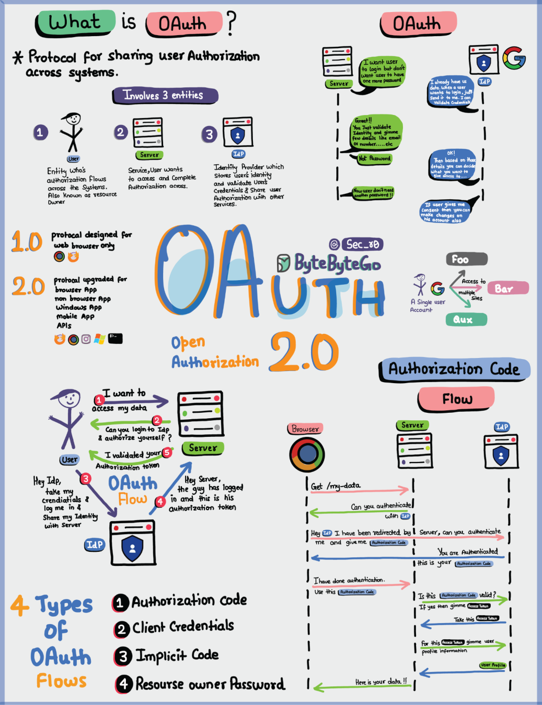

# 什么是OAuth 2.0？

> 原文地址: [https://mp.weixin.qq.com/s/vfVr06oGejWW--yhYo2uuw](https://mp.weixin.qq.com/s/vfVr06oGejWW--yhYo2uuw)

这张图想表达的是：**OAuth 2.0 不是“登录协议”，而是一个“授权协议”**——让你在**不把密码交给第三方应用**的前提下，把你在某个平台上的一部分权限（数据/操作）“临时借给”另一个应用。

* * *

## 1) OAuth 2.0 解决什么问题？（一句话）

你想用「某网站/某App」去访问你在「谷歌/微信/GitHub」上的数据或能力，但**你不想把账号密码给那个网站/App**。OAuth 2.0 就是这个“安全借权限”的标准做法。

* * *

## 2) 图里说的 3 个角色（最关键）

图里把 OAuth 拆成 3 个实体：

1.  **User（用户 / Resource Owner）**  
    数据主人（比如你：你的邮箱、头像、联系人、云盘文件…）
    
2.  **Server（第三方应用 / Client）**  
    你正在使用的那个服务（比如某个网站想读取你的 Google 资料）
    
3.  **IdP（身份提供商 / Authorization Server）**  
    真正管你身份、能发放授权的“平台”（比如 Google、GitHub、Microsoft…）
    
    > 它负责：让你登录、让你点“同意授权”、然后发令牌给第三方应用
    

* * *

## 3) 核心思想：**不给密码**，给“令牌”（Token）

-   **密码（Password）**：相当于你家钥匙 + 全权限，给出去就麻烦了。
    
-   **访问令牌（Access Token）**：相当于“临时门禁卡”，**只允许做被授权的事**，并且通常**有过期时间**。
    
-   （常见还有）**刷新令牌（Refresh Token）**：Access Token 过期后，用它去换新的 Access Token（不必让你反复点同意/登录）。
    

另外还有个重要概念：**Scope（授权范围）**  
比如：只允许读头像 `profile`，不允许读邮件；只允许读，不允许写。

* * *

## 4) 图右下的重点：Authorization Code Flow（授权码流程）

这是 OAuth 2.0 最经典、最常用的流程（也是现在最推荐的主流之一）。

按图里的“浏览器三方对话”翻译成通俗步骤：

1.  你在第三方应用里点：**“用 Google 授权访问我的数据”**
    
2.  第三方应用把你**重定向**到 Google（IdP）：  
    “这位用户要授权我访问哪些权限（scopes）”
    
3.  你在 Google 页面**登录 + 看清楚权限提示 + 点同意**
    
4.  Google 不把 Token 直接给浏览器里的第三方应用，而是先给一个：**Authorization Code（授权码）**
    
5.  第三方应用（服务器端）拿这个授权码去找 Google **换取 Access Token（以及可能的 Refresh Token）**
    
6.  第三方应用拿 Access Token 去调用资源接口：  
    比如 `GET /my-data`，最终把数据返回给你
    

**你全程只把密码输入给 Google（IdP）**，第三方应用根本拿不到你的密码 —— 这就是 OAuth 最核心的安全点。

* * *

## 5) 图里列的 “4 种 OAuth Flow” 是什么（以及现在用不用）

图中列了 4 种常见授权方式：

1.  **Authorization Code（授权码）** ✅ 主流推荐
    

-   现在通常搭配 **PKCE**（尤其移动端/桌面端/SPA）更安全
    

3.  **Client Credentials（客户端凭证）** ✅ 常用于“服务访问服务”
    

-   没有用户参与，比如后端服务调用后端服务（机器对机器）
    

5.  **Implicit（隐式）** ⚠️ 现在基本不推荐/逐渐弃用
    

-   因为把 token 直接暴露在前端环境里，风险更高
    

7.  **Resource Owner Password（密码模式）** ❌ 基本不推荐/已被淘汰思路
    

-   让用户把密码交给第三方应用，等于回到老问题
    

* * *

## 6) 很多人会混淆的点：OAuth ≠ 登录

-   **OAuth 2.0 解决的是“授权（Authorization）”**：允许第三方做哪些事。
    
-   如果你想实现“用 Google 登录”（知道“你是谁”），通常会用：**OpenID Connect（OIDC）**  
    OIDC 是建立在 OAuth 2.0 之上的“身份层”，会返回 **ID Token**（告诉你用户身份信息）。
    

* * *

## 7) 用一个生活类比收尾

-   **你（User）**：房主
    
-   **Google（IdP）**：物业/门禁系统
    
-   **第三方应用（Server/Client）**：维修工
    
-   **OAuth 授权**：你去物业那边刷脸确认“允许维修工进客厅修灯但别进卧室”，物业给维修工一张**只开客厅门、半小时有效**的门禁卡（token）。维修工从此不用你家钥匙（密码）。
    

### OAuth 2.0 代码示例

OAuth 2.0 有多种授权流程（Grant Types），下面我用 Python 语言提供几个常见流程的代码示例。这些示例基于 Requests-OAuthlib 库（一个流行的 Python OAuth 库），假设你已经安装了它（pip install requests-oauthlib）。代码中会使用占位符如 your\_client\_id，在实际使用时需要替换为你的客户端 ID、密钥等（从服务提供商如 Google、GitHub 获取）。

我将重点解释 **Authorization Code Grant Flow**（授权码流程），这是最安全、最常用的流程，适合 Web 应用。然后简要提供其他流程的示例。每个示例包括导入、设置和步骤说明。

####   
1\. 授权码授予流程（授权码流程）

这个流程涉及用户重定向到授权服务器登录，然后回调获取令牌。适合需要用户交互的场景，比如用 Google 登录你的 App。

**步骤说明**：

-   创建 OAuth2Session 对象。
    
-   生成授权 URL，让用户访问并授权。
    
-   用户授权后，输入回调 URL（实际 Web App 中用服务器处理）。
    
-   用授权响应换取访问令牌。
    
-   用令牌访问受保护的资源。
    

Python

`_# 导入必要的库_   from requests_oauthlib import OAuth2Session      _# 配置你的客户端信息（从服务提供商获取）_   client_id = 'your_client_id'  _# 你的客户端 ID_   client_secret = 'your_client_secret'  _# 你的客户端密钥_   redirect_uri = 'https://your.callback/uri'  _# 你的回调 URL_      _# 定义权限范围（scope），根据提供商调整_   scope = [       'https://www.googleapis.com/auth/userinfo.email',  _# 示例：Google 的 email 权限_       'https://www.googleapis.com/auth/userinfo.profile'  _# 示例：Google 的 profile 权限_   ]      _# 创建 OAuth2Session 对象_   oauth = OAuth2Session(       client_id,       redirect_uri=redirect_uri,       scope=scope   )      _# 生成授权 URL（authorization_url）和状态（state，用于防 CSRF）_   authorization_url, state = oauth.authorization_url(       'https://accounts.google.com/o/oauth2/auth',  _# 示例：Google 的授权端点_       access_type="offline",  _# 请求离线访问（可选）_       prompt="select_account"  _# 提示用户选择账号（可选）_   )      _# 提示用户访问 URL 并授权（在实际 Web App 中，重定向用户）_   print(f'请访问 {authorization_url} 并授权访问。')      _# 用户授权后，输入完整的回调 URL（实际中由服务器捕获）_   authorization_response = input('请输入完整的回调 URL: ')      _# 用授权响应换取令牌_   token = oauth.fetch_token(       'https://accounts.google.com/o/oauth2/token',  _# 示例：Google 的令牌端点_       authorization_response=authorization_response,       client_secret=client_secret   )      _# 现在可以用令牌访问受保护的 API_   r = oauth.get('https://www.googleapis.com/oauth2/v1/userinfo')  _# 示例：获取用户信息_   print(r.json())  _# 输出响应_`

**注意**：这个是命令行版本，用于演示。在真实 Web 应用（如 Flask/Django）中，你需要处理 HTTP 重定向和回调路由。令牌（token）包含 access\_token，可用于后续 API 调用。

#### 2\. Client Credentials Grant Flow（客户端凭证流程）

这个流程不涉及用户，直接用客户端凭证换取令牌。适合服务器间通信或后台服务。

**步骤说明**：

-   创建 BackendApplicationClient。
    
-   用客户端 ID 和密钥直接获取令牌。
    
-   无需用户交互。
    

Python

`_# 导入必要的库_   from oauthlib.oauth2 import BackendApplicationClient   from requests_oauthlib import OAuth2Session      _# 配置客户端信息_   client_id = 'your_client_id'   client_secret = 'your_client_secret'      _# 创建客户端_   client = BackendApplicationClient(client_id=client_id)   oauth = OAuth2Session(client=client)      _# 获取令牌_   token = oauth.fetch_token(       token_url='https://provider.com/oauth2/token',  _# 替换为实际令牌端点_       client_id=client_id,       client_secret=client_secret   )      _# 用令牌访问 API_   r = oauth.get('https://provider.com/protected-resource')   print(r.json())`

#### 3\. Resource Owner Password Credentials Grant Flow（资源所有者密码凭证流程）

这个流程直接用用户的用户名和密码换取令牌，但不推荐使用，因为它要求 App 知道用户密码（安全性低）。仅在高度信任的遗留系统中用。

**步骤说明**：

-   创建 LegacyApplicationClient。
    
-   用用户名、密码和客户端凭证获取令牌。
    

Python

`_# 导入必要的库_   from oauthlib.oauth2 import LegacyApplicationClient   from requests_oauthlib import OAuth2Session      _# 配置信息_   client_id = 'your_client_id'   client_secret = 'your_client_secret'   username = 'your_username'   password = 'your_password'      _# 创建客户端_   oauth = OAuth2Session(       client=LegacyApplicationClient(client_id=client_id)   )      _# 获取令牌_   token = oauth.fetch_token(       token_url='https://provider.com/oauth2/token',  _# 替换为实际端点_       username=username,       password=password,       client_id=client_id,       client_secret=client_secret   )      _# 用令牌访问 API_   r = oauth.get('https://provider.com/protected-resource')   print(r.json())`

#### 4\. 令牌刷新（Token Refresh）示例

OAuth 令牌通常有过期时间，可以用刷新令牌（refresh\_token）自动刷新。下面是一个自动刷新的例子。

**步骤说明**：

-   初始化时设置自动刷新参数。
    
-   当令牌过期时，库会自动刷新，并调用 token\_updater 保存新令牌。
    

Python

`_# 导入必要的库_   from requests_oauthlib import OAuth2Session      _# 假设你已有令牌（从之前流程获取）_   token = {       'access_token': 'your_access_token',       'refresh_token': 'your_refresh_token',       'token_type': 'Bearer',       'expires_in': 3600,   }      _# 额外参数_   extra = {       'client_id': 'your_client_id',       'client_secret': 'your_client_secret',   }      _# 保存新令牌的函数（实际中存到数据库或 session）_   def token_saver(new_token):       print("新令牌已保存:", new_token)       _# 在这里保存到文件或数据库_      _# 创建会话，支持自动刷新_   oauth = OAuth2Session(       client_id=extra['client_id'],       token=token,       auto_refresh_url='https://provider.com/oauth2/token',  _# 替换为实际刷新端点_       auto_refresh_kwargs=extra,       token_updater=token_saver   )      _# 访问 API（如果过期，会自动刷新）_   r = oauth.get('https://provider.com/protected-resource')   print(r.json())`

**通用提示**：

-   **安全考虑**
    
    永远不要在代码中硬编码真实密钥或密码。使用环境变量或配置文件。
    
-   **测试** 
    
    用 Google 或 GitHub 的 OAuth Playground 测试。替换端点 URL 为实际成功的（eg, Google: auth URL 是 https://accounts.google.com/o/oauth2/auth ，token URL 是 https://oauth2.googleapis.com/token ）。
    
-   **错误处理**
    
    实际代码中添加 try-except 处理如 TokenExpiredError。
    
-   **更多资源**
    
    这些示例来自 Requests-OAuthlib 官方文档。 如果需要服务器端实现（如 Flask 中的 OAuth provider），可以参考 GitHub 示例仓库。
    

  

### OAuth 2.0 安全最佳实践

  
OAuth 2.0 是一个强大的授权框架，但其安全性取决于正确的实施，以降低令牌窃取、重放攻击和未经授权访问等风险。以下最佳实践源自权威来源，包括 IETF 的 RFC 9700（OAuth 2.0 安全最佳实践，发布于 2025 年 1 月）、OWASP 指南以及 Google 等提供商的建议。这些实践适用于客户端（例如，Web/移动应用程序）和服务器（授权服务器和资源服务器）。请务必参考适用于您具体用例的最新规范。

####   
1\. 使用安全通信和基础设施

-   **强制使用 HTTPS**
    
     所有端点（授权、令牌、重定向 URI 和资源服务器）都必须使用 HTTPS，以防止窃听和中间人攻击。避免使用 HTTP 重定向或未加密的连接
    
-   **安全存储凭证和令牌** 
    
    将客户端密钥、访问令牌和刷新令牌存储在安全存储库中（例如，Google Cloud Secret Manager 等密钥管理器）。切勿将其硬编码到代码中或提交到代码库。对静态令牌进行加密，并使用特定于平台的安全存储（例如，iOS 上的 Keychain，Android 上的 Keystore）。
    
-   **定期审核和清理** 
    
    定期审核 OAuth 客户端，并删除未使用或过时的客户端。在不再需要时撤销令牌，并处理撤销事件（例如，通过跨账户保护等服务）。
    

####   
2\. 保护基于重定向的流

-   **严格验证重定向 URI**
    
     对预注册的 URI 使用精确字符串匹配（仅允许原生应用中的 localhost 端口具有灵活性）。维护一个已批准 URI 的允许列表，并阻止可能泄露代码或令牌的开放式重定向器
    
-   **实施 CSRF 保护** 
    
    使用绑定到用户代理的事务特定状态参数（一次性 CSRF 令牌），或依赖 PKCE 的内置保护。在 OpenID Connect 流程中，使用 nonce 参数。
    
-   **防御混淆攻击** 
    
    当处理多个授权服务器时，使用“iss”（颁发者）参数来验证响应，或者为每个服务器使用不同的重定向 URI。
    
-   **避免凭据转发** 
    
    授权服务器不应在重定向期间转发包含用户凭据的请求。
    

####   
3\. 授权码交换密钥 (PKCE)

-   对公共客户端要求使用 PKCE：始终在公共客户端（例如，移动/SPA 应用）的授权码流程中使用 PKCE，以防止代码拦截。生成代码挑战（例如，S256 方法）和验证器，确保验证器仅在令牌 endpoint.cheatsheetseries.owasp.org 处发送。
    
-   **在服务器上强制执行 PKCE**
    
     授权服务器必须支持 PKCE，如果发送了 code\_challenge，则需要 code\_verifier，并通过拒绝不匹配的请求来缓解降级攻击。
    
-   使用安全浏览器：对于原生应用，通过系统浏览器（例如 iOS 上的 ASWebAuthenticationSession、Android 上的 Chrome 自定义标签页）而不是嵌入式 WebView 来启动 OAuth 流程，以避免凭据 exposure.pragmaticwebsecurity.com
    

####   
4\. 安全地管理令牌

-   发送方约束令牌：使用诸如相互 TLS (mTLS)、所有权证明演示 (DPoP) 或 JWT 断言之类的机制将访问令牌和刷新令牌绑定到客户端，防止重放攻击 attacks.cheatsheetseries.owasp.org
    
-   **短期访问令牌** 
    
    颁发有效期最短（例如，几分钟）的访问令牌，并使用刷新令牌进行续期。实施刷新令牌轮换或发送方限制以增强安全性
    
-   限制令牌权限：遵循最小权限原则：将范围限制在必要范围内，将受众限制在特定的资源服务器上，并在资源服务器上验证范围/声明。使用资源指示器来定位单个 APIs.cheatsheetseries.owasp.org
    
-   **支持令牌撤销** 
    
    提供用于撤销令牌的端点，并妥善处理令牌过期（例如，提示重新身份验证）
    

####   
5\. 避免不安全的资助类型

-   **请勿使用隐式授权** 
    
    由于 URL 中存在令牌泄露的风险，请避免使用此流程；请改用 PKCE 授权码。
    
-   **请勿使用资源所有者密码凭据授权** 
    
    这会将用户凭据暴露给客户端，增加网络钓鱼风险；请选择其他流程。
    
-   **选择合适的授权类型** 
    
    对于机密客户端（服务器），请使用客户端凭据或授权码。对于公共客户端，请使用带有 PKCE 的授权码
    

####   
6\. 客户端身份验证和架构

-   **强客户端认证** 
    
    优先使用非对称认证方式，例如 private\_key\_jwt 或 mTLS，而非共享密钥。对于公共客户端，则应依赖 PKCE。
    
-   **使用后端代理前端 (BFF) 模式** 
    
    对于 Web/SPA 应用，在后端代理 (BFF) 中处理 OAuth，以避免在浏览器中暴露令牌。BFF 管理会话、将令牌附加到 API 调用，并减少攻击面。
    
-   **增量授权** 
    
    仅在需要时（例如，针对特定功能）请求权限范围，而不是预先请求所有权限。通过禁用功能并根据上下文重新提示来处理部分同意。
    

####   
7\. 其他建议

-   **使用推送式授权请求 (PAR)**
    
    预先将授权参数推送至服务器，以避免前端通道暴露。
    
-   **监控和更新** 
    
    随时了解新出现的威胁（例如，通过 RFC 更新或安全研究）。定期审查威胁模型，并针对 OWASP 等常见漏洞测试实现
    
-   **对于原生应用** 
    
    请遵循应用特定的指南，例如使用外部浏览器，并避免在前端直接使用
    

  
实施这些实践可显著降低风险。有关代码层面的详细信息，请参阅 OAuthLib 等库或特定提供商的 SDK。如果您正在构建自定义实现，请参阅完整的 RFC 9700 以获取深入的威胁模型。

### OAuth 2.0 中的 PKCE：代码示例

  
PKCE（代码交换证明密钥，RFC 7636）是 OAuth 2.0 授权码流程的扩展，用于防御代码拦截攻击，对于移动应用、单页应用 (SPA) 或没有安全后端的桌面应用等公共客户端至关重要。其工作原理是生成一个随机的 code\_verifier （高熵字符串），并由此导出 code\_challenge （通常经过 SHA-256 哈希和 Base64 编码）。挑战码包含在授权请求中，而验证码则在令牌交换期间提供，用于验证客户端身份。

  
下面我将提供使用常用库的 Python 代码示例。这些示例假设您已注册 OAuth 客户端（例如，Google、Auth0 或 Keycloak），并且已安装必要的软件包，例如 requests 、 requests-oauthlib 和 oauthlib （ 使用命令 \`pip install requests requests-oauthlib oauthlib\` ）。请将 \`client\_id\` 等占位符替换为您自己的值。这些示例主要针对使用 PKCE 的授权码流程。

####   
1\. 使用 Requests-OAuthlib（推荐，简单易用）

  
Requests-OAuthlib 处理了大部分 OAuth 底层实现工作。以下是如何为公共客户端实现 PKCE（无需客户端密钥）。

  
首先，手动生成 PKCE 对（因为该库不会自动生成）：

Python

`import base64   import hashlib   import os      _# Generate code_verifier: random URL-safe string (43-128 chars)_   code_verifier = base64.urlsafe_b64encode(os.urandom(32)).decode('utf-8').rstrip('=')      _# Generate code_challenge: SHA-256 hash, base64-encoded without padding_   digest = hashlib.sha256(code_verifier.encode('utf-8')).digest()   code_challenge = base64.urlsafe_b64encode(digest).decode('utf-8').rstrip('=')`

现在，完整流程如下：

Python

`from requests_oauthlib import OAuth2Session   import webbrowser  _# For opening browser in desktop scenarios_      _# Configuration (e.g., for Google OAuth)_   client_id = 'your_client_id'   redirect_uri = 'http://localhost:8080/callback'  _# Must match registered URI_   scope = ['openid', 'profile', 'email']   auth_url = 'https://accounts.google.com/o/oauth2/v2/auth'  _# Provider's auth endpoint_   token_url = 'https://oauth2.googleapis.com/token'  _# Provider's token endpoint_      _# Create session (no client_secret for public clients)_   oauth = OAuth2Session(client_id, redirect_uri=redirect_uri, scope=scope)      _# Generate authorization URL with PKCE_   authorization_url, state = oauth.authorization_url(       auth_url,       code_challenge=code_challenge,       code_challenge_method='S256'   )      _# Open browser for user authorization (in desktop app; in web, redirect user)_   print(f'Please visit: {authorization_url}')   webbrowser.open(authorization_url)      _# Manually input the full redirect URL after authorization (in production, use a local server to capture it)_   authorization_response = input('Paste the full redirect URL here: ')      _# Fetch token with code_verifier (no client_secret)_   token = oauth.fetch_token(       token_url,       authorization_response=authorization_response,       code_verifier=code_verifier,       client_secret=None  _# Explicitly none for public clients_   )      _# Access protected resource_   protected_url = 'https://www.googleapis.com/oauth2/v1/userinfo'   response = oauth.get(protected_url)   print(response.json())`

  
**备注** ：

-   对于桌面/移动应用程序，用本地 HTTP 服务器替换手动输入以捕获重定向（参见示例 3）。
    
-   如果使用机密客户端，请在 fetch\_token 中包含 client\_secret 。
    
-   处理状态验证以防止 CSRF：将返回的状态与生成的状态进行比较。
    

####   
2\. 纯请求（不使用外部 OAuth 库）

  
这个底层示例仅使用请求和标准库，并以 Keycloak 提供程序为例进行演示。虽然输出信息较多，但展示了原始的 HTTP 交互。

Python

`import base64   import hashlib   import os   import re   import html   import urllib.parse   import requests      _# Step 1: Generate PKCE pair_   code_verifier = base64.urlsafe_b64encode(os.urandom(40)).decode('utf-8')   code_verifier = re.sub('[^a-zA-Z0-9]+', '', code_verifier)      digest = hashlib.sha256(code_verifier.encode('utf-8')).digest()   code_challenge = base64.urlsafe_b64encode(digest).decode('utf-8').rstrip('=')      _# Configuration (e.g., Keycloak)_   provider = 'http://localhost:8080/realms/master'  _# Adjust to your provider_   client_id = 'your_client_id'   redirect_uri = 'http://localhost/callback'   state = 'random_state_string'  _# For CSRF protection_      _# Step 2: Authorization request_   auth_resp = requests.get(       f'{provider}/protocol/openid-connect/auth',       params={           'response_type': 'code',           'client_id': client_id,           'scope': 'openid profile email',           'redirect_uri': redirect_uri,           'state': state,           'code_challenge': code_challenge,           'code_challenge_method': 'S256'       },       allow_redirects=False   )      _# Extract cookie if needed (for session-based providers like Keycloak)_   cookie = auth_resp.headers.get('Set-Cookie')   if cookie:       cookie = '; '.join(c.split(';')[0] for c in cookie.split(', '))      _# Step 3: Simulate login (POST credentials to form action; adjust for your provider)_   page = auth_resp.text   form_action = html.unescape(re.search(r'<form\s+.*?\s+action="(.*?)"', page, re.DOTALL).group(1))      login_resp = requests.post(       form_action,       data={'username': 'your_username', 'password': 'your_password'},       headers={'Cookie': cookie},       allow_redirects=False   )      _# Step 4: Parse authorization code from redirect_   redirect = login_resp.headers['Location']   query = urllib.parse.urlparse(redirect).query   params = urllib.parse.parse_qs(query)   auth_code = params['code'][0]   returned_state = params['state'][0]   assert returned_state == state  _# Validate state_      _# Step 5: Token exchange with verifier_   token_resp = requests.post(       f'{provider}/protocol/openid-connect/token',       data={           'grant_type': 'authorization_code',           'client_id': client_id,           'redirect_uri': redirect_uri,           'code': auth_code,           'code_verifier': code_verifier       }   )      tokens = token_resp.json()   print(tokens)  _# Contains access_token, etc._`

  
**备注** ：

-   这样可以跳过浏览器交互；实际上，需要在浏览器中打开身份验证 URL，然后手动或通过脚本捕获重定向。
    
-   生产环境中请避免硬编码凭据——仅用于测试。
    

####   
3\. 带有本地 HTTP 服务器的桌面应用程序（使用 OAuthlib）

  
对于桌面或 Jupyter 环境，请使用临时 HTTP 服务器来处理浏览器重定向。本示例使用 oauthlib 作为客户端辅助函数。

Python

`import base64   import hashlib   import random   import string   import webbrowser   import requests   from http.server import BaseHTTPRequestHandler, HTTPServer   from urllib import parse   from oauthlib.oauth2 import WebApplicationClient      class OAuthServer(HTTPServer):       def __init__(self, *args, **kwargs):           super().__init__(*args, **kwargs)           self.auth_code = None      class OAuthHandler(BaseHTTPRequestHandler):       def do_GET(self):           self.send_response(200)           self.end_headers()           self.wfile.write(b'')           qs = parse.parse_qs(parse.urlparse(self.path).query)           self.server.auth_code = qs['code'][0]      def generate_pkce():       rand = random.SystemRandom()       verifier = ''.join(rand.choices(string.ascii_letters + string.digits, k=128))       digest = hashlib.sha256(verifier.encode('utf-8')).digest()       challenge = base64.urlsafe_b64encode(digest).decode('utf-8').rstrip('=')       return verifier, challenge      def login(client_id, auth_uri, token_uri, redirect_uri, scopes, port=8080):       verifier, challenge = generate_pkce()       client = WebApplicationClient(client_id)          auth_url = client.prepare_request_uri(           auth_uri,           redirect_uri=redirect_uri,           scope=scopes,           state='random_state',           code_challenge=challenge,           code_challenge_method='S256'       )          webbrowser.open(auth_url)          with OAuthServer(('', port), OAuthHandler) as server:           server.handle_request()           code = server.auth_code          token_resp = requests.post(           token_uri,           data={               'grant_type': 'authorization_code',               'client_id': client_id,               'redirect_uri': redirect_uri,               'code': code,               'code_verifier': verifier           }       )       return token_resp.json()['access_token']      _# Example usage (e.g., for Microsoft Azure AD)_   config = {       'client_id': 'your_client_id',       'auth_uri': 'https://login.microsoftonline.com/common/oauth2/v2.0/authorize',       'token_uri': 'https://login.microsoftonline.com/common/oauth2/v2.0/token',       'redirect_uri': 'http://localhost:8080',       'scopes': ['openid', 'profile']   }   access_token = login(**config)   print(access_token)`

  
**备注** ：

-   服务器捕获到代码后会自动关闭浏览器标签页。
    
-   验证生产环境中的状态以防止 CSRF 攻击。
    
-   仅在本地测试时使用 verify=False ；启用 SSL 以确保安全。
    

  
这些示例涵盖了常见场景。

### OAuth 2.0 客户端凭据流程

  
客户端凭证授权类型是 OAuth 2.0 (RFC 6749) 中定义的授权流程之一。它适用于客户端应用程序需要使用自身凭证访问资源，而无需用户或资源所有者参与的场景。此流程通常用于机器对机器 (M2M) 或服务器对服务器的通信，例如后端服务向 API 进行身份验证。与以用户为中心的流程（例如授权码）不同，此流程无需用户身份验证或同意步骤——客户端直接向授权服务器证明其身份。oauth.net

####   
何时使用

-   **服务器间集成** 
    
    非常适合需要代表自身而非用户访问受保护资源的机密客户端（例如后端应用程序）。示例包括：
    

-   微服务调用另一个服务的 API。
    
-   从 API 获取数据的自动化脚本或守护进程。
    
-   无需用户模拟的系统级集成。
    

-   对于公共客户端（例如移动应用程序或 SPA）或需要用户上下文时，请避免使用此方法——而应改用其他流程，例如带有 PKCE 的授权码。
    
-   它比涉及重定向或用户交互的流程更简单、更高效。
    

#### 基本流程步骤

  
流程很简单，只包含一次请求-响应交换：

1.  **客户端准备凭证** 
    
    客户端（例如，您的应用程序）收集其 client\_id 和 client\_secret （在客户端向授权服务器注册期间颁发）。
    
2.  **令牌请求** 
    
    客户端向授权服务器的令牌端点发送 POST 请求，进行身份验证（通常通过 HTTP 基本身份验证或在请求正文中进行），并请求访问令牌。
    
3.  **服务器验证并响应** 
    
    授权服务器验证客户端的凭据。如果有效，它将颁发访问令牌（以及可选的刷新令牌或其他元数据）。
    
4.  **访问资源** 
    
    客户端使用访问令牌向资源服务器发出经过身份验证的 API 调用。
    

  
无需浏览器重定向或用户参与，因此适用于非交互式环境。

#### 关键参数

-   **请求参数** 
    
    （在 POST 请求体或请求头中）：
    

-   grant\_type ：必须是 client\_credentials 。
    
-   client\_id ：您的应用程序 ID。
    
-   client\_secret ：您的应用程序密钥（用于机密客户）。
    
-   scope ：可选；指定访问范围（例如， read:users write:reports ）。
    

-   **响应参数** 
    
    （JSON）：
    

-   access\_token ：用于 API 访问的令牌。
    
-   token\_type ：通常为 Bearer 。
    
-   expires\_in ：令牌的有效期，以秒为单位（例如，3600 表示 1 小时）。
    
-   范围 ：已确认的范围（如有要求）。
    

####   
代码示例（Python 与 Requests-OAuthlib）

  
以下是使用 Python 实现的实用示例。如有需要，请安装 requests-oauthlib （ pip install requests-oauthlib ）。本示例假设使用通用提供程序；请将端点和凭据替换为您自己的提供程序（例如，来自 Okta、Microsoft Entra ID 或 Salesforce）。

Python

`from oauthlib.oauth2 import BackendApplicationClient   from requests_oauthlib import OAuth2Session      _# Configuration_   client_id = 'your_client_id'  _# From provider registration_   client_secret = 'your_client_secret'   token_url = 'https://example.com/oauth2/token'  _# Provider's token endpoint (e.g., https://login.microsoftonline.com/{tenant}/oauth2/v2.0/token)_   scope = ['api://example/.default']  _# Optional scopes_      _# Create client_   client = BackendApplicationClient(client_id=client_id)   oauth = OAuth2Session(client=client)      _# Fetch token_   token = oauth.fetch_token(       token_url=token_url,       client_id=client_id,       client_secret=client_secret,       scope=scope   )      print(token)  _# Output: {'access_token': '...', 'token_type': 'Bearer', 'expires_in': 3600, ...}_      _# Use token to access a protected resource_   headers = {'Authorization': f'Bearer {token["access_token"]}'}   response = oauth.get('https://example.com/protected/api', headers=headers)   print(response.json())`

  
**HTTP 请求/响应示例** （为清晰起见，使用 curl）：

-   **要求** 
    
      
    
    文本
    
    `curl -X POST https://example.com/oauth2/token \     -H "Content-Type: application/x-www-form-urlencoded" \     -d "grant_type=client_credentials" \     -d "client_id=your_client_id" \     -d "client_secret=your_client_secret" \     -d "scope=read:users"`
    
-   **响应** 
    
    （成功）：
    
    文本
    
    `{     "access_token": "eyJhbGciOiJIUzI1NiIsInR5cCI6IkpXVCJ9...",     "token_type": "Bearer",     "expires_in": 3600,     "scope": "read:users"   }`
    
-   **错误响应** 
    
    （例如，无效凭据）：
    
    文本
    
    `{     "error": "invalid_client",     "error_description": "Client authentication failed"   }`
    

####   
安全考量和最佳实践

-   **仅限机密客户端** 
    
    此流程仅适用于能够安全存储密钥的客户端（例如服务器）。公共客户端存在泄露凭据的风险
    
-   **最小权限原则** 
    
    请求最小权限范围并使用短期令牌。定期轮换密钥。
    
-   **强制使用 HTTPS**
    
    所有通信必须使用 HTTPS 来保护传输中的凭据。
    
-   **速率限制和监控** 
    
    在服务器端实施以防止滥用。
    
-   **替代方案** 
    
    对于涉及用户的场景，建议使用其他授权方式。遵循 OAuth 2.0 安全最佳实践（RFC 6819）以获取额外的保护，例如令牌绑定。
    

  
这种流程对于后端集成来说效率很高，但需要谨慎管理凭证以避免安全风险。