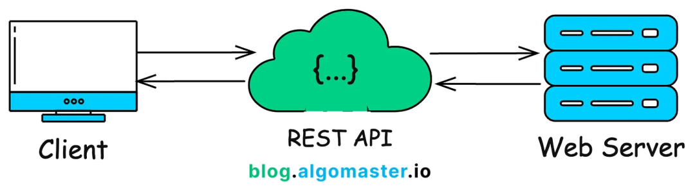
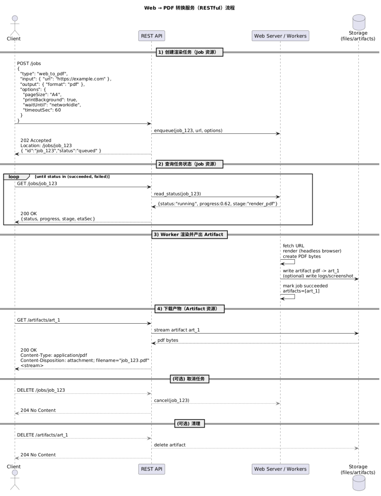

# 你该了解的RESTful


> 原文地址: [https://mp.weixin.qq.com/s/Igb1TIKK7hw3ZM8b-DtQsg](https://mp.weixin.qq.com/s/Igb1TIKK7hw3ZM8b-DtQsg)



可以把 **RESTful** 理解成：**Client（客户端）不直接操作 Web Server 的内部逻辑，而是通过一层“REST API”用标准的 HTTP 语义去“操作资源”**，服务器返回资源的“表示（representation）”（通常是 JSON），双方靠协议约定协作。

* * *

## 1) RESTful 的核心：围绕“资源”设计 API

在 REST 里，你面对的不是“函数调用”，而是“资源（Resource）”。

-   资源用 **URI** 表示（名词为主）
    

-   /users（用户集合）
    
-   /users/42（id 为 42 的用户）
    
-   /orders/2025-0001/items（订单条目集合）
    
      
    

-   对资源做动作，用 **HTTP 方法** 表达（动词放在方法里，而不是 URL 里）
    

-   GET /users/42：读取用户
    
-   POST /users：创建用户
    
-   PUT /users/42：整体替换用户
    
-   PATCH /users/42：部分更新用户
    
-   DELETE /users/42：删除用户
    
      
    

> RESTful 的“好味道”通常就是：**URL 像目录结构（名词），方法像操作指令（动词）。**

* * *

## 2) 图中的“REST API 层”提供的能力

图里 REST API 像“契约层 / 边界层”：

-   屏蔽内部实现：Web Server 可能连接数据库、缓存、消息队列、微服务……客户端不需要知道。
    
-   标准化交互：统一用 HTTP 的方法、状态码、Header、缓存语义。
    
-   面向资源：把“业务对象”抽象成资源，客户端按资源粒度交互。
    

* * *

## 3) REST 的几个关键约束（你一眼能用上的）

### (1) 无状态（Stateless）

每次请求都应包含完成该请求所需的信息（例如 token、参数）。服务器不依赖“会话粘性”。

-   好处：易扩展（负载均衡随便打到任何一台）、易缓存、易故障恢复
    
-   实践：常见用 `Authorization: Bearer <JWT>` 或 session token（即使有 session，也尽量让 API 语义不依赖服务端内存状态）
    

### (2) 统一接口（Uniform Interface）

-   用 HTTP 方法表达意图
    
-   用状态码表达结果
    
-   用内容类型表达表示形式：`Content-Type: application/json`
    
-   支持缓存：`Cache-Control`, `ETag`, `If-None-Match`
    

### (3) 分层系统（Layered System）

客户端看到的是 REST API，并不关心后面是单体、微服务、反向代理、CDN。

* * *

## 4) 状态码：RESTful 的“语气”

常用组合（非常实用）：

-   200 OK：成功返回资源
    
-   201 Created：创建成功（通常带 `Location: /resource/id`）
    
-   204 No Content：成功但不返回 body（常用于 DELETE / PATCH）
    
-   400 Bad Request：参数/格式错误
    
-   401 Unauthorized：未认证（缺 token/无效 token）
    
-   403 Forbidden：已认证但无权限
    
-   404 Not Found：资源不存在
    
-   409 Conflict：资源冲突（例如重复创建、版本冲突）
    
-   422 Unprocessable Entity：语法没错但业务校验失败（可选）
    
-   429 Too Many Requests：限流
    
-   500/503：服务端异常/临时不可用
    

* * *

## 5) 幂等性：为什么 PUT/DELETE 很“适合重试”

-   幂等：同样的请求执行一次和执行多次，效果相同
    

-   GET 幂等
    
-   PUT 通常设计为幂等（设置为某个状态）
    
-   DELETE 通常也幂等（删不存在也可返回 204/404，看规范选择）
    
-   POST 通常**不**幂等（创建一次和创建多次不同）
    
      
    

工程上如果你想让创建也可安全重试：用 **Idempotency-Key**（放 header）或由客户端提供唯一业务 id。

* * *

## 6) RESTful 设计小抄（你直接照抄就能落地）

### 命名

-   用复数名词：`/users`, `/orders`
    
-   层级表达从属：`/users/42/orders`
    
-   查询用 query string：`GET /users?role=admin&page=2&pageSize=20`
    

### 列表分页（常见两种）

-   Offset 分页：`page/pageSize`
    
-   Cursor 分页：`cursor=...`（更适合大数据/时间线）
    

### 错误返回格式（建议统一）

```
{ "error": { "code": "VALIDATION_ERROR", "message": "email is invalid", "details": { "field": "email" } } } 
```

  

### 版本管理（常见做法）

-   URL：`/api/v1/users`
    
-   或 Header：`Accept: application/vnd.xxx.v1+json`
    

* * *

## 7) 一个“符合 RESTful”的对比例子

❌ 不太 REST 的 RPC 风格：

-   POST /createUser
    
-   POST /user/updatePassword
    

✅ RESTful 风格：

-   POST /users（创建用户）
    
-   PATCH /users/42（更新用户部分字段）
    
-   PATCH /users/42/password（把 password 作为子资源/子域也可以）
    

下面给出一套 **Web → PDF 转换服务**的典型 RESTful 设计：把 **Job(任务)**、**File(输入/上传文件，可选)**、**Artifact(产物)** 当成核心资源。

  
编辑

* * *

## 1) 资源模型（Resource Model）

### Job（转换任务）

-   id, type=web\_to\_pdf
    
-   status: `queued | running | succeeded | failed | canceled`
    
-   progress, stage, createdAt, startedAt, finishedAt
    
-   input: `{ url }` 或 `{ htmlFileId }`
    
-   options: 页面尺寸、等待策略、超时等
    
-   artifacts\[\]: 成功后产物列表
    
-   error: 失败原因结构化
    

### File（可选：输入为 HTML/资源包时）

-   上传 HTML、CSS、截图、cookie 文件等（按你需求）
    
-   可被多个 Job 复用
    

### Artifact（产物）

-   pdf 文件、日志、截图、HAR、控制台输出等
    

* * *

## 2) API 路由清单（推荐）

### A. 创建任务（核心）

**POST `/jobs`** （创建 Job 资源，异步处理）

```
{  "type": "web_to_pdf",  "input": { "url": "https://example.com" },  "output": { "format": "pdf" },  "options": {    "pageSize": "A4",    "landscape": false,    "margin": { "topMm": 10, "rightMm": 10, "bottomMm": 10, "leftMm": 10 },    "printBackground": true,    "waitUntil": "networkidle",    "timeoutSec": 60  },  "callbackUrl": "https://client.example.com/webhooks/pdf"}
```

  

响应（建议）：

-   202 Accepted
    
-   Location: /jobs/{jobId}
    

```
{ "id": "job_123", "status": "queued", "createdAt": "2025-11-28T10:13:00Z" } 
```

  

> 如果你希望“创建即落库”也可用 `201 Created`，但**异步任务语义**更推荐 `202 Accepted`。

* * *

### B. 查询任务（轮询）

**GET `/jobs/{jobId}`**

```
{  "id": "job_123",  "type": "web_to_pdf",  "status": "running",  "progress": 0.62,  "stage": "render_pdf",  "input": { "url": "https://example.com" },  "options": { "pageSize": "A4", "printBackground": true },  "startedAt": "2025-11-28T10:13:05Z"}
```

  

成功：

```
{  "id": "job_123",  "status": "succeeded",  "artifacts": [    { "id": "art_pdf_1", "type": "pdf", "mime": "application/pdf", "href": "/artifacts/art_pdf_1" },    { "id": "art_log_1", "type": "log", "mime": "text/plain", "href": "/artifacts/art_log_1" }  ],  "finishedAt": "2025-11-28T10:13:30Z"}
```

  

失败：

```
{  "id": "job_123",  "status": "failed",  "error": {    "code": "NAVIGATION_TIMEOUT",    "message": "Timed out waiting for network idle",    "details": { "timeoutSec": 60 }  }}
```

  

* * *

### C. 列表 / 查询（可选）

**GET `/jobs?status=running&page=1&pageSize=20`**  
或 cursor：`GET /jobs?cursor=...`

* * *

### D. 取消任务（推荐“资源化”的方式）

二选一：

1.  直接取消（简单）
    

-   DELETE **`/jobs/{jobId}`** → `204 No Content`
    

  

2.更“资源化”

-   POST **`/jobs/{jobId}/cancellation`** → `202 Accepted` / `204`
    

* * *

### E. 下载产物 Artifact（核心）

**GET `/artifacts/{artifactId}`**

返回二进制：

-   Content-Type: application/pdf
    
-   Content-Disposition: attachment; filename="job\_123.pdf"
    
-   支持 Range（大文件断点）可选
    

产物元信息（可选）：

-   GET **`/artifacts/{artifactId}/meta`**
    

* * *

## 3) File（输入不是 URL 时才需要）

如果你支持 “HTML → PDF”（上传 HTML 当输入）：

**POST `/files`**（multipart/form-data）  
响应 `201 Created` + `fileId`

然后创建 job：

```
{  "type": "web_to_pdf",  "input": { "htmlFileId": "file_abc" },  "output": { "format": "pdf" }}
```

  

* * *

## 4) 状态码建议（落地好用）

-   创建任务：`202 Accepted`（异步）
    
-   查询：`200 OK`
    
-   下载：`200 OK`
    
-   取消：`204 No Content`
    
-   参数错误：`400`
    
-   未认证：`401`
    
-   无权限：`403`
    
-   不存在：`404`
    
-   冲突/重复：`409`
    
-   限流：`429`
    
-   服务忙：`503`
    

* * *

## 5) 工程上强烈建议补的“REST 友好特性”

### 幂等创建（避免重复任务）

`POST /jobs` 支持：

-   Header: `Idempotency-Key: <uuid>`
    
-   服务端：同 key + 同请求体 → 返回同一个 `jobId`
    

### 缓存（对下载产物很香）

-   ETag + `If-None-Match` → `304`
    

### Webhook（减少轮询）

`callbackUrl` + `X-Signature`（HMAC）签名校验，事件：

-   job.succeeded
    
-   job.failed
    
-   job.canceled