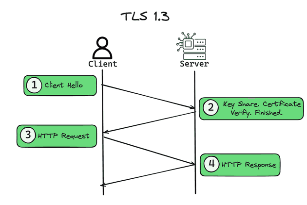
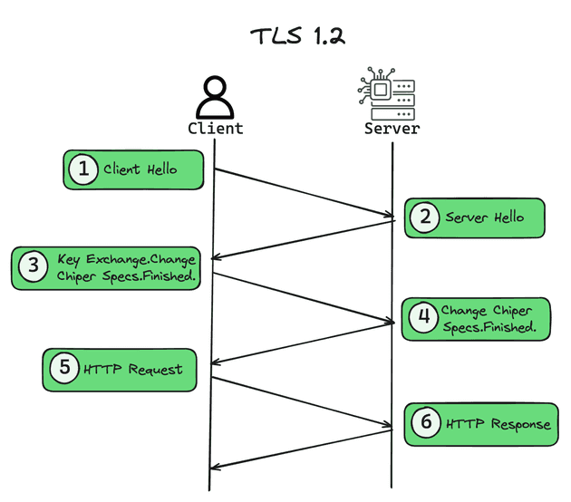

# 你该了解的TLS通信创建过程


> 原文地址: [https://mp.weixin.qq.com/s/jXso2s4FmgZBsrwLSh\_C0A](https://mp.weixin.qq.com/s/jXso2s4FmgZBsrwLSh_C0A)

SSL（更准确说是 **TLS**）通信的“创建过程”，本质上就是：**双方先通过握手协商出同一把会话密钥**，然后再用这把密钥去加密后续应用数据（HTTP、MQTT、WebSocket…都一样）。

下面按“从 0 到 1 连接建立”的视角讲清楚它是怎么发生的（以最常见的 **TLS 1.2 / TLS 1.3** 为主）。

* * *

## 1) TLS 想解决的三件事

1.  保密性：别人抓包也看不懂内容（对称加密）。
    
2.  完整性：内容没被篡改（AEAD 或 HMAC）。
    
3.  身份认证：你连到的真的是目标服务器（证书链 + 域名校验）。
    

* * *

## 2) 总体分两阶段

### A. 握手阶段（Handshake）

目的：**协商参数 + 验证身份 + 建立共享密钥**  
产物：一个“会话密钥/会话状态”（session keys, cipher suite, ALPN, SNI 等）

### B. 应用数据阶段（Application Data）

目的：用握手产物的密钥来加密传输业务数据（HTTP 请求响应等）

* * *

## 3) TLS 1.3 握手（现代主流，最值得记住）

> 关键词：**一次往返（1-RTT）**、**（EC）DHE 密钥交换**、**前向保密 PFS**、更少的握手消息

### (1) ClientHello（客户端 → 服务端）

客户端发：

-   支持的 TLS 版本、密码套件列表（cipher suites）
    
-   key\_share：客户端的 ECDHE 公钥（关键点：提前把“交换密钥材料”带上）
    
-   SNI：我要访问的域名（例如 `example.com`）
    
-   ALPN：我希望用什么应用层协议（例如 `h2`/`http/1.1`，或者 `mqtt`）
    
-   可能有 session resumption 的 PSK 信息（用于恢复）
    

### (2) ServerHello + 证书等（服务端 → 客户端）

服务端回：

-   选择的 cipher suite / TLS 版本
    
-   服务端的 key\_share（ECDHE 公钥）
    
-   Certificate：证书链（服务端身份）
    
-   CertificateVerify：证明“我确实拥有该证书的私钥”
    
-   Finished：握手完整性校验
    

### (3) 客户端校验 + Finished（客户端 → 服务端）

客户端做：

-   校验证书链是否可信（根 CA / 中间 CA / 有效期 / 吊销等）
    
-   校验证书里的域名是否匹配 SNI（SAN/CN）
    
-   用双方 key\_share 算出同一个共享秘密 → 通过 HKDF 派生会话密钥
    
-   发 **Finished**
    

到这里：**握手结束，双方已经有相同的会话密钥**，接下来应用数据直接加密传输。

> 额外：TLS 1.3 还支持 **0-RTT**（恢复会话时可提前发数据），但有“重放攻击”风险，通常只用于幂等请求/可重放容忍的场景。

* * *

## 4) TLS 1.2 握手（仍然常见，尤其老系统/某些设备）

> 关键词：消息更多；如果用 RSA 密钥交换没有 PFS（现在基本都用 ECDHE）

典型流程：

1.  ClientHello
    
2.  ServerHello + Certificate + ServerKeyExchange（ECDHE 参数）+ ServerHelloDone
    
3.  ClientKeyExchange（发 ECDHE 公钥）+ ChangeCipherSpec + Finished
    
4.  Server ChangeCipherSpec + Finished
    

之后才进入加密应用数据。

* * *

## 5) 证书在里面到底做了什么？

证书本身不是用来“加密业务数据”的（业务数据用对称加密更快）。证书主要用于：

-   服务器身份认证：客户端通过 CA 信任链相信“这个公钥属于这个域名的服务器”
    
-   私钥证明：Server 通过签名（CertificateVerify）证明它掌握证书对应私钥
    
-   结合（EC）DHE：保证即便私钥未来泄露，过去抓到的流量也难以解密（PFS）
    

* * *

## 6) 为什么握手里要用非对称/椭圆曲线？

因为双方一开始没有共同密钥，但要在不安全网络上“协商出同一把密钥”。  
（EC）DHE 做的事就是：**双方只交换公钥，也能算出同一个共享秘密**，旁观者算不出来。

* * *

## 7) 建立成功后，真正的数据怎么加密？

现代 TLS 一般用 AEAD：

-   AES-GCM 或 ChaCha20-Poly1305  
      它同时提供：
    
-   加密（confidentiality）
    
-   认证/完整性（integrity & authenticity）
    

每条记录（record）都有：

-   序号/nonce（防重放/防乱序篡改）
    
-   AEAD tag（校验完整性）
    

* * *

## 8) 你在工程里最常见会碰到的几个点

-   SNI：决定服务端拿哪个证书（同 IP 多域名）
    
-   ALPN：决定上层协议（HTTP/2、HTTP/1.1、gRPC、WebSocket over TLS…）
    
-   mTLS：服务端也要求客户端证书，用于强身份认证（企业内网、零信任、某些 MQTT 方案）
    
-   会话恢复：减少握手开销（PSK / session ticket）
    
-   证书校验失败：域名不匹配、链不完整、时间不对、缺中间证书、被拦截替换等
    

咱把“SSL/TLS 通信创建”再往下拆一层：**握手消息长什么样、密钥怎么从 0 变出来、握手后数据怎么被保护、以及你在工程里怎么验证/排错**。我会重点讲 **TLS 1.3**，再对比 **TLS 1.2**。

* * *

## 1) 先记住：TLS 分两层

-   Handshake 协议：协商版本/套件/密钥，做身份认证（证书）
    
-   Record 协议：把“应用数据”切片成记录（records），逐条加密+认证后发送
    

握手一旦完成，**Record 层就拿到会话密钥**，之后 HTTP/MQTT/WebSocket 都只是被“装进 record 里”。

* * *

## 2) TLS 1.3：消息流（最主流）

下面是典型 **1-RTT**（一次往返）建立连接的时序：

  
编辑

### ClientHello 里最关键的 3 个扩展

-   SNI：告诉服务器你要访问哪个域名（决定选哪张证书）
    
-   ALPN：你想在 TLS 上跑什么（`h2`、`http/1.1`、有时是自定义协议名）
    
-   key\_share：客户端把 ECDHE 公钥先给出去，服务器回一个，就能立刻算共享秘密 → 为什么 TLS1.3 能更快
    

* * *

## 3) TLS 1.3：密钥“怎么生出来”的（核心逻辑）

你可以把 TLS1.3 的密钥派生理解成一句话：

> **ECDHE 共享秘密 + 握手消息摘要（transcript hash） → HKDF → 一堆不同用途的密钥**

为什么要用 transcript hash？

-   让“最终密钥”绑定到本次握手的所有内容（版本、套件、扩展、证书等），中间人很难偷偷替换而不被发现。
    

最终至少会派生出：

-   握手加密密钥（用来保护后续握手消息，比如证书）
    
-   应用数据加密密钥（用来保护 HTTP/MQTT 等真实业务数据）
    
-   恢复/会话票据相关密钥（下次更快恢复）
    

* * *

## 4) TLS 1.2：为什么看起来更“啰嗦”

TLS1.2 常见的是 **ECDHE\_RSA / ECDHE\_ECDSA**（也就是 ECDHE + 证书签名算法）：

  
编辑

TLS1.2 的“慢”主要在于：握手消息更多、加密切换点（ChangeCipherSpec）更复杂；并且历史上还出现过不带 PFS 的 RSA 密钥交换（现在基本不推荐/不该用了）。

* * *

## 5) 握手成功后：Record 层到底做了什么？

把应用数据按 record 切块（例如 16KB 左右），每条 record：

-   生成 nonce/序号
    
-   用 AEAD（AES-GCM 或 ChaCha20-Poly1305）进行 **加密 + 完整性认证**
    
-   收到之后验证 tag，失败就直接断连接（防篡改）
    

所以“抓包看不懂”不是因为证书，而是因为**对称密钥 + AEAD**。

* * *

## 6) 证书校验：客户端实际检查什么？

客户端并不是“看到证书就信”，它会做一串检查（常见失败点也在这）：

1.  信任链：服务器证书 ← 中间 CA ← 根 CA（根 CA 在系统信任库）
    
2.  有效期：NotBefore/NotAfter（你机器时间不对会直接翻车）
    
3.  域名匹配：看 SAN（SubjectAltName）里是否包含目标域名
    
4.  用途：KeyUsage/ExtendedKeyUsage 是否允许 TLS server auth
    
5.  （可选）**吊销状态**：OCSP/CRL（现实中很多客户端策略不同）
    

* * *

## 7) 工程实践：怎么快速验证一条 TLS 链路？

### OpenSSL（最常用的“透视镜”）

```
# TLS1.3 + SNI + 打印证书链openssl s_client -connect example.com:443 -servername example.com -tls1_3 -showcerts# 看 ALPN 协商到了什么（比如 h2）openssl s_client -connect example.com:443 -servername example.com -tls1_3 -alpn h2# 如果服务器支持 OCSP stapling，可查看 staplingopenssl s_client -connect example.com:443 -servername example.com -status
```

  

你会特别关注：

-   是否出现 `Verify return code: 0 (ok)`
    
-   ALPN protocol: h2 或 `http/1.1`
    
-   证书链是否完整（有时服务端漏发中间证书会导致部分客户端失败）
    

### curl（更贴近真实 HTTP）

```
curl -vk https://example.com/ curl -vk --http2 https://example.com/ 
```

* * *

## 8) 常见错误“对号入座”

-   wrong version number：你用 TLS 去连了一个明文端口（或中间有反代/端口配错）
    
-   certificate verify failed：域名不匹配 / 链不可信 / 缺中间证书 / 时间不对
    
-   unexpected eof while reading：对端直接断了（SNI 不对、反代没转到 TLS、协议不一致、被防火墙/中间设备打断）
    
-   handshake failure：套件/曲线/签名算法不匹配，或服务端策略拒绝