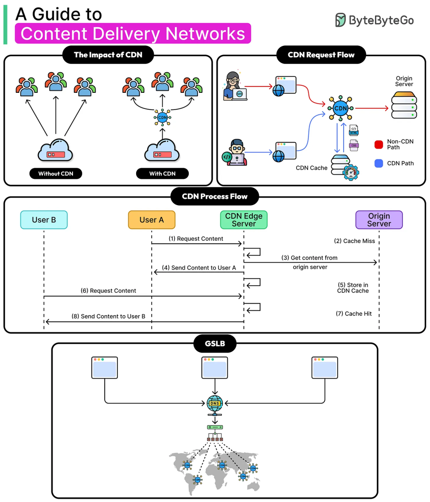

# 你该了解的为什么需要 CDN ？

> 原文地址: [https://mp.weixin.qq.com/s/Fy9mV2rNKbmEFob8yu4yKg](https://mp.weixin.qq.com/s/Fy9mV2rNKbmEFob8yu4yKg)

需要 CDN 的核心原因就一句话：**把内容“搬到离用户更近的边缘节点”，让大多数请求不必跨洲绕远路回源站**。结合图里的 4 块内容，可以这样理解：

## (1) Without CDN vs With CDN：用户分布越广，差距越大

-   **没有 CDN**：全球用户都直连同一个源站（Origin）。距离远 → RTT 高、丢包重传多 → **加载慢**；同时所有流量都压在源站出口 → **带宽贵、容易被打爆**。
    
-   **有 CDN**：用户优先访问就近的 CDN 边缘节点（Edge）。请求“最后一公里/一区域”完成 → **延迟更低、体验更稳**；源站压力显著下降。
    

## (2) CDN Request Flow：把“静态内容”走蓝线，回源只做少数

图中蓝色 CDN Path（缓存）通常承载：

-   图片/JS/CSS/字体/视频切片等静态资源
    
-   甚至一些可缓存的 API 响应
    

红色 Non-CDN Path（回源）只在需要时出现：

-   缓存未命中、动态内容、个性化内容、需要实时计算的请求
    

结果：**大流量内容走缓存，小流量才回源**。

## (3) CDN Process Flow：缓存命中机制带来的“规模效应”

图里 User A 的流程：

1.  向 Edge 请求内容
    
2.  **Cache Miss** → Edge 去源站取
    
3.  Edge 把内容返回给 User A
    
4.  同时 **Store in CDN Cache**
    

接着 User B 再请求同一资源：

-   直接 **Cache Hit**，Edge 本地返回
    
-   **源站完全不用参与**
    

这带来几个现实收益：

-   **速度**：命中时省掉跨网回源，TTFB 和整体加载时间大幅下降
    
-   **扩展性**：同一份热门内容一次回源，多次复用
    
-   **成本**：源站出网/带宽/机器资源明显降低
    

## (4) 全球服务器负载均衡（GSLB）：让用户“自动”连到最合适的节点

底部的 GSLB（通常基于 DNS 调度）做的事是：

-   根据用户地理位置、运营商、节点负载、健康状态
    
-   把域名解析到**最近/最优**的 CDN 节点
    

这保证了：**用户不是随机撞服务器，而是被引导到最靠谱的入口**。

* * *

## 除了加速，CDN 还在“稳”和“安全”上很关键

-   **抗峰值与抗故障**：边缘节点分摊流量，源站不容易被瞬时流量压垮；某节点出问题可快速切换
    
-   **防护与隔离源站**：很多攻击（DDoS、CC、爬虫）在边缘被吸收/过滤，源站 IP 更不暴露
    
-   **就近 TLS 终止/HTTP2/HTTP3**：减少握手与传输开销，移动网络下更明显
    

一句话总结：**CDN = 就近分发 + 缓存复用 + 全局调度**，用网络与架构手段把“慢、贵、容易挂”的源站访问变成“快、省、稳”。

CDN 的缓存机制

内容分发网络（CDN）的缓存机制是其核心功能之一，它通过在分布式服务器上临时存储内容副本，来加速数据访问、减轻源服务器负载，并提升用户体验。简单来说，缓存是将频繁访问的数据存储在更靠近用户的“临时区”（cache），以便后续请求能更快响应，而非每次都从源头拉取。 下面我从原理、工作流程、类型、策略以及优缺点等方面进行讨论。

#### 1. **缓存机制的基本原理**

CDN 的缓存基于“就近访问”和“重复利用”的理念。传统网站内容直接从源服务器（origin server）获取，会因距离、带宽等因素导致延迟高。而 CDN 在全球部署边缘服务器（edge servers），这些服务器会缓存热门内容（如图片、视频、网页文件）。当用户请求时，CDN 会优先从最近的缓存中提供数据，如果缓存中没有（cache miss），则从源服务器拉取并存储副本供后续使用（cache hit）。 这类似于图书馆的借书系统：热门书直接从本地架子上取，而不是每次去总仓库调货。

#### 2. **工作流程**

CDN 缓存的典型流程如下：

-   **用户请求**
    
    浏览器或客户端向 CDN 发送请求（通常通过 DNS 解析路由到最近的边缘节点）。
    
-   **缓存检查**
    
    边缘服务器检查本地缓存是否有匹配的内容。
    

-   **Cache Hit**
    
    如果有，直接返回缓存副本，响应速度极快（通常毫秒级）。
    
-   **Cache Miss**
    
    如果没有，从源服务器获取内容，返回给用户，同时存储到缓存中。
    

-   **更新与失效**
    
    缓存内容有生命周期，当过期或源内容变更时，会自动或手动失效，重新拉取。
    

这个流程大大减少了源服务器的压力，尤其在高并发场景下（如直播或电商高峰），缓存命中率（hit ratio）越高，效率越显著。

#### 3. **缓存类型**

CDN 缓存可分为多种层次，与其他缓存机制（如浏览器缓存）协同工作：

-   **边缘缓存（Edge Caching）**
    
    CDN 的主力，在全球 PoP（Point of Presence）节点存储内容，针对静态资源（如图像、CSS、JS）效果最佳。
    
-   **代理缓存（Proxy Caching）**
    
    CDN 作为反向代理，缓存动态内容的部分（如 API 响应），通过规则过滤可缓存项。
    
-   **浏览器/客户端缓存**
    
    CDN 通过 HTTP 头（如 Cache-Control）指导浏览器本地缓存，进一步减少网络请求。
    
-   **源服务器缓存**
    
    有时与 CDN 结合，使用如 Redis 或 Memcached 在源端缓存数据库查询结果。
    

这些类型层层嵌套，形成多级缓存体系，确保内容高效分发。

#### 4. **缓存策略与控制**

CDN 的缓存并非无限存储，需要策略来管理：

-   **TTL（Time to Live）**
    
    设置缓存过期时间（如 1 小时），过期后自动失效。适合静态内容，但动态内容需短 TTL。
    
-   **HTTP 头控制**
    
    使用 Cache-Control（max-age、no-cache）、Expires、ETag 等头字段指导缓存行为。例如，no-store 表示不可缓存。
    
-   **失效与清除（Invalidation/Purge）**
    
    当源内容更新时，手动或自动清除缓存（如通过 API 调用 purge）。CDN 提供者如 Cloudflare 支持正则表达式匹配批量失效。
    
-   **预热（Prefetching）**
    
    主动将热门内容推送到边缘缓存，提前准备高流量事件。
    
-   **分层与分区**
    
    基于 URL、地理位置或设备类型分区缓存，避免全局失效影响。
    

这些策略确保缓存的准确性和新鲜度，防止“脏数据”问题。

#### 5. **优势与挑战**

**优势**：

-   **性能提升**
    
    减少延迟，提高加载速度（据统计，可缩短 50% 以上响应时间）。
    
-   **负载分担**
    
    源服务器仅处理 miss 请求，节省带宽和计算资源。
    
-   **成本节约**
    
    降低数据传输费用，尤其在全球分发中。
    
-   **可扩展性**
    
    轻松应对流量峰值，如视频流媒体或游戏更新。
    

**挑战**：

-   **一致性问题**
    
    缓存过期前，如果源内容变更，用户可能看到旧版（stale content）。
    
-   **复杂管理**
    
    配置策略需专业知识，误配可能导致安全漏洞（如缓存敏感数据）。
    
-   **命中率优化**
    
    依赖内容流行度，低频资源缓存效果有限，需要算法优化（如 LRU 淘汰机制）。
    
-   **隐私与合规**
    
    缓存可能涉及用户数据，需遵守 GDPR 等法规。
    

总体而言，CDN 的缓存机制是现代互联网高效运行的基石，尤其在云时代，与 AWS CloudFront、Akamai 等服务深度集成。它不仅加速内容，还与安全（如 WAF）和优化（如压缩）相结合，形成完整生态。如果实际应用中遇到具体问题，如自定义缓存规则，建议参考特定 CDN 提供者的文档进行调优。

### CDN 的安全防护功能

内容分发网络（CDN）不仅仅用于加速内容交付，还集成多种安全机制，作为网站的“第一道防线”。它通过分布式架构隐藏源服务器、过滤恶意流量，并提供加密和防护工具，防范 DDoS 攻击、Web 应用漏洞、数据泄露等威胁。以下基于主流 CDN 提供商（如 Cloudflare、Akamai、阿里云等）的功能，总结常见的安全防护特性。这些功能通常内置或可扩展，帮助提升网站的安全性和可用性。

#### 1. **DDoS 攻击防护**

CDN 的分布式节点可以吸收和分散海量攻击流量，防止源服务器过载。大型 CDN（如 Akamai）能处理超过 100 Tbps 的流量，通过全球数据中心过滤异常请求，并在攻击抵达源站前拦截。 例如，Cloudflare 利用规模效应防御僵尸网络攻击，减少源服务器的暴露风险。 这比传统防火墙更有效，因为 CDN 在边缘层级预先过滤，隐藏源 IP 并分流流量，避免单点故障。

#### 2. **Web 应用防火墙（WAF）**

WAF 是 CDN 的核心安全组件，用于检测和阻挡应用层攻击，如 SQL 注入、XSS（跨站脚本）和 CSRF（跨站请求伪造）。它根据规则库分析请求行为，即时拦截恶意负载。 在 CDN 环境中，WAF 可自定义规则，适用于全球节点，确保攻击在边缘被阻断，而不影响源服务器性能。

#### 3. **SSL/TLS 加密与证书管理**

CDN 支持自动配置 SSL/TLS 证书，确保数据传输的加密、身份验证和完整性，防范中间人攻击（MITM）和数据篡改。 Cloudflare 等提供优化机制，如 TLS 会话恢复（减少 CPU 负载）、虚假启动（缩短延迟）和 0-RTT 恢复（加速连接，但需防范重放攻击）。 此外，CDN 可升级源服务器的旧证书，提供免费源加密，提升整体安全并改善搜索引擎排名。

#### 4. **Bot 管理和爬虫防护**

CDN 通过行为分析识别恶意 Bot（如价格抓取机器人或广告欺诈工具），并封锁它们以节省资源和维护公平。 这包括监控请求模式、速率限制和 CAPTCHA 验证，防止资源耗尽或数据窃取，尤其适用于电商和内容网站。

#### 5. **访问控制与内容保护**

CDN 提供多种访问限制机制，如 URL 签名（添加加密串和时间戳，防止非法下载）、Referer 防盗链（检查来源域名）和 IP 黑白名单。 阿里云 等支持用户自定义鉴权服务器，确保只有授权用户访问资源。 这有助于保护敏感内容免遭盗链或未授权访问。

#### 6. **其他辅助安全功能**

-   **负载均衡与流量分流**
    
    通过 GSLB（全球服务器负载均衡）智能路由请求，缓解突发流量和潜在攻击。
    
-   **源站隐藏**
    
    CDN 作为反向代理，屏蔽源服务器 IP，减少直接攻击风险。
    
-   **CC 攻击防护**
    
    针对连接耗尽攻击，CDN 可结合 SCDN（安全 CDN）产品增强防护。
    

总体而言，CDN 的安全防护是多层次的，与传统安全工具互补，能显著降低风险并提升性能。实际部署时，根据提供商（如 Imperva 的 WAAP 集成平台）选择合适的功能。 如果您的网站面临特定威胁，建议评估专业 CDN 服务以定制防护策略。