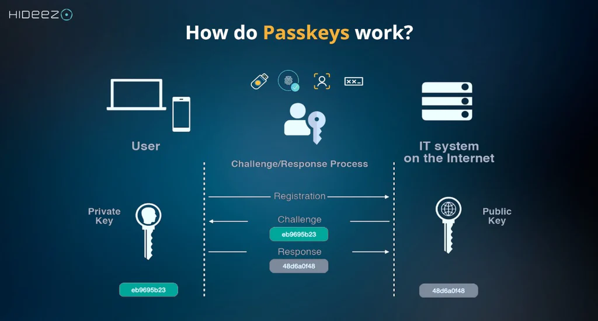
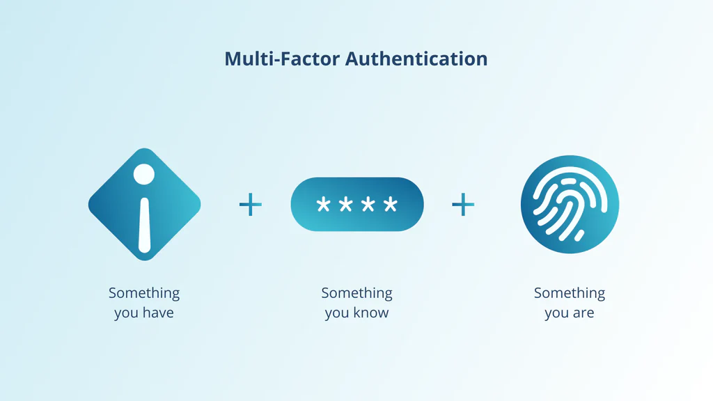

# 你该了解的什么是通行密钥？

> 原文地址: [https://mp.weixin.qq.com/s/GNo8Wz3P6uw46kFEzvSdqA](https://mp.weixin.qq.com/s/GNo8Wz3P6uw46kFEzvSdqA)

### **用 IT 专业人士能听懂的方式解释：你的设备就是你的凭证**

想象一下，你的访问凭证不是一串字符，而是与你的设备生物特征绑定的加密证明。要访问系统，你只需对设备进行身份验证即可。你不会像丢失密码那样丢失这个证明，也没有人能通过常规手段窃取或复制它。这就是通行密钥。

与需要记忆的密码（一种可能被遗忘或被盗的“共享密钥”）不同，Passkey 是一种存储在设备（手机、笔记本电脑、平板电脑）安全硬件元件中的唯一数字凭证。要登录网站或应用程序，您只需像往常一样解锁设备——使用面部识别、指纹或 PIN 码。您的设备会在本地验证您的身份，然后授予您访问权限。Passkey 的核心密钥永远不会离开您的设备，也永远不会传输到服务器。

### **通行密钥与密码：核心区别**

根本性的转变是从“共享密钥”模型（密码，你和服务器都知道）转向“私钥”模型，在私钥模型中，密钥始终由你掌控。这一简单的改变对任何组织的安全都具有巨大的影响。

**特征**

**传统密码**

**通行密钥**

**安全模型**

共同的秘密（你知道的事情）

公钥密码学（你拥有/知道的东西）

**网络钓鱼风险**

极高

免疫设计

**数据泄露的影响**

灾难性后果（密码哈希值被盗）

最小限度（泄露的公钥毫无用处）

**力量**

用户相关（通常较弱、可重复使用）

每个网站始终采用加密技术，且安全性和唯一性都相同。

**用户体验**

输入、记住、管理、重置

使用生物识别/PIN 码解锁设备

**多因素身份验证要求**

单独步骤（ 身份验证器应用程序） （短信）

默认内置

### **公钥密码学如何让这一切运转起来**

创建服务通行密钥时，您的设备会生成一对唯一的、数学上关联的密钥：

1.  私钥 **：** 这是您的秘密凭证。它存储在您设备的安全硬件中（例如 iPhone 上的安全隔离区或 PC 中的 TPM 芯片）。它永远不会离开您的设备。
    
2.  公钥： 这部分并不神秘。你的设备会将它发送到服务服务器，服务器会将它与你的用户名一起存储。你可以把它想象成一把公钥，只有你的私钥才能打开。
    

当您尝试登录时，服务器会向您的设备发送一个唯一的、一次性的验证码。您的设备使用其私钥对该验证码进行加密“签名”，并将签名发送回服务器。服务器使用您存储的公钥来验证该签名。如果验证码匹配，则证明您拥有该设备以及正确的私钥，您的身份即被验证通过。您的密码不会通过互联网传输。

### 它是如何工作的？

  
编辑

结合图里“左边私钥 / 右边公钥 / 中间挑战-响应（Challenge/Response）”，Passkey 的工作原理可以把它理解成：**网站只保存公钥；真正能“证明你是你”的私钥永远留在你的设备里**，登录时用一次性的挑战值来完成验证。

* * *

## (1）注册流程（Registration：把“公钥”交给网站）

1.  用户在设备上发起创建 Passkey（手机/电脑，背后是系统的凭据管理器：iCloud Keychain、Google Password Manager、Windows Hello 等）。
    
2.  设备生成一对密钥：
    

-   私钥（Private Key）：留在本机安全区（或系统凭据库）里，不会给网站
    
-   公钥（Public Key）：可以给网站保存（图右侧）
    
      
    

4.  （可选但常见）**绑定“网站身份”**：Passkey 生成时会与网站的域名/来源（origin，如 `https://example.com`）绑定，这是抗钓鱼关键点。
    
5.  把公钥 + 凭据ID等注册信息发给服务器，服务器把它存到账号下。  
      从此以后，这个账号就有了“用私钥签名证明身份”的能力——但服务器永远拿不到私钥。
    

> 图中“Registration”那条箭头，本质就是“把公钥注册到 IT 系统”。

* * *

## (2）登录流程（Challenge → Response：用私钥完成一次签名证明）

1.  用户打开网站并点击用 Passkey 登录。
    
2.  服务器生成一个随机挑战值 Challenge（图中绿色的 eb9695b23 类似这种随机串），发给客户端。
    

-   这个 challenge 是一次性的，防止重放攻击。
    
      
    

4.  设备提示用户解锁 Passkey：指纹/人脸/设备解锁码（这一步叫 _User Verification_，相当于你在“解锁私钥的使用权”）。
    
5.  设备用私钥对 Challenge（以及域名等上下文）做数字签名，生成 **Response**（图中灰色 48d6a0f48 类似“签名结果”），回传给服务器。
    
6.  服务器用之前保存的公钥验证签名：
    

-   验证通过 ⇒ 说明“持有私钥的人”正在登录 ⇒ 放行
    
-   验证失败 ⇒ 拒绝
    

> 所以图里中间的“Challenge/Response Process”就是：**challenge 由服务器发起；response 是设备用私钥签出来的证明；公钥在服务器端负责验证**。

* * *

## (3）为什么这种流程更安全（对应图的关键点）

-   私钥不离开设备：数据库泄露也只泄露公钥，无法反推私钥。
    
-   挑战值一次一用：截获 Response 也很难复用（因为下次 challenge 不一样）。
    
-   绑定域名/来源：钓鱼站点就算诱导你操作，也无法让你的设备给“别的域名”生成可用的签名（核心抗钓鱼能力）。
    

* * *

## 4）补充：多设备/跨设备是怎么做到的？

-   如果你在手机上存了 passkey，但在电脑上登录：电脑可以通过系统提供的“附近设备”流程（如扫码/蓝牙）让手机完成签名。
    
-   如果开启同步（如 iCloud/Google）：passkey 会以端到端加密形式同步到你其它设备上（体验更方便，但也要注意账号恢复安全）。
    

### **不止是密码：内置多因素身份验证 (MFA)**

多因素身份验证 (MFA) 通过要求提供除密码之外的其他信息来增加安全性。它基于对多个身份“因素”的验证：

-   你知道的一件事： 密码或 PIN 码。
    
-   你拥有的东西： 您的手机或硬件密钥。
    
-   你是什么： 指纹或面部扫描。
    

  
编辑

密码仅包含一个验证因素（“知道”），而通行密钥则至少结合了两个验证因素。要使用通行密钥，您需要存储该密钥的设备（ **您拥有的物品** ），并且必须使用您的 PIN 码（ **您知道的信息** ）或生物识别信息（ **您自身的特征** ）解锁该设备。这使得每次使用通行密钥登录都默认成为一种强大的多因素登录。对于企业而言，集成平台正是在此背景下显得至关重要。

## 密码存储位置

**你拥有相应的_私钥_ ，才能确认你的身份。**

这是一条敏感信息，类似于密码。它会以多种方式之一进行安全存储。

-   密码**存储在操作系统安全可靠的凭据存储库中。** 这并非浏览器保存密码，而是操作系统使用其自身高度安全的存储库。这是默认设置。当您需要使用密码时，操作系统会要求您输入 PIN 码、面部识别、指纹或其他可用技术。在 Windows 系统中，使用的是 Windows Hello；在移动设备上，通常是您选择的设备解锁方式。
    
-   在您的密码管理器中。
    
     许多密码管理器都提供密码密钥存储库功能。这样，您只需为帐户设置一次密码密钥，然后通过密码管理器在多个设备上使用同一个密码密钥，而无需在每个设备上都设置新密钥。当您尝试使用密码密钥时，您的密码库将通过您的主密码、单独的 PIN 码或上述操作系统提供的验证方式来确认您的授权。
    
-   硬件安全密钥 
    
    。某些（ _但并非全部_ ）硬件安全密钥，例如 YubiKey，可以用来存储有限数量的密码。类似于使用密码库，这允许您为某个帐户设置一个密码，随身携带，并在需要时通过身份验证提供该安全密钥来使用。
    

在所有情况下，私钥都会被安全存储。虽然我们不能完全排除这种可能性，但 Passkey 的私钥被泄露的可能性_极低_ ——远低于其他身份验证技术的安全风险。

  

## Windows Hello的最佳实践

下面这套是 **Windows Hello + Passkey**（以及更广义的无密码登录）的实用最佳实践，目标是：**方便**、**抗钓鱼**、同时 **避免丢机/重装后把自己锁死**。

* * *

## 1) 先把 Windows Hello 做“强基础”

-   优先用 Windows Hello Face / Fingerprint（体验最好），没有设备就用 **Hello PIN**。
    
-   PIN 必须强：
    

-   6 位起步，越长越好；别用 000000、生日、重复数字
    
-   到 _设置 → 账户 → 登录选项 → PIN (Windows Hello)_，开启类似“仅允许 PIN 更复杂/包含字母数字”（不同版本文案略有差异）
    

-   启用 TPM + BitLocker（强烈建议）
    

-   TPM 让密钥更难被导出；BitLocker 保护离线取盘攻击（别人拆盘读取你的凭据/数据）。
    
      
    

* * *

## 2) Passkey 的最佳用法（网站登录层面）

-   能用 Passkey 就用 Passkey；并尽量选择“此设备上的 Windows Hello”创建。
    
-   优先为关键账号加第二把“备份钥匙”（非常重要）：  
      给同一账号再注册一个备份 passkey（例如：手机的 passkey 或一枚硬件安全密钥），这样：
    

-   电脑坏了/重装系统/Hello 配置丢失，也能从备份通道登入并重新注册
    

-   避免只剩短信 2FA：短信容易被 SIM 换卡/拦截，建议至少保留 _Authenticator(TOTP)_ 或硬件密钥。
    

* * *

## 3) 设备安全与“防社工/防身边人”

-   不把 Windows 登录密码共享给任何人（哪怕对方只借用电脑一会儿）。
    
-   锁屏习惯：离开就 `Win + L`，别让已解锁会话成为最大漏洞。
    
-   谨慎使用“便利功能”：比如自动登录/记住登录状态，在公共环境不要用。
    

* * *

## 4) 备份与恢复：避免“无密码把自己锁死”

这是很多人踩坑的点：Hello 很方便，但一旦 **主机重装、TPM 清空、账户凭据损坏**，passkey/无密码入口可能也需要“其它方式”救回来。

建议你至少准备三样中的两样：

1.  备用 Passkey：手机或另一台设备再注册一把
    
2.  Authenticator(TOTP) 或硬件密钥：作为登录/高风险操作的备份 MFA
    
3.  恢复码（Recovery codes）：打印/离线保存（别只放在同一台电脑里）
    

并且：

-   把微软账号的恢复信息完善：备用邮箱、手机号、恢复选项都要可用
    
-   重要账号的“恢复码”离线保存（纸质/加密 U 盘），不要只存 OneDrive 同账号目录
    

* * *

## 5) 使用习惯：更安全也更顺

-   只在“你确认是正确域名”的页面创建/使用 Passkey（虽然 passkey 抗钓鱼，但养成确认域名的习惯仍然有价值）。
    
-   浏览器优先 Edge/Chrome 新版本（WebAuthn/Passkey 体验与兼容性更好）。
    
-   系统更新：Windows 更新、驱动（尤其指纹/摄像头）、TPM 固件保持最新，减少 Hello 失效/兼容问题。
    

* * *

## 6) 企业/进阶（如果你有域环境/公司设备）

-   Windows Hello for Business（WHfB）：企业环境建议走 WHfB（证书/密钥信任），并用策略强制 PIN 复杂度、TPM、锁屏、BitLocker 等。
    
-   管理员分离：日常账号非管理员，管理操作用提升权限或单独管理员账户。
    

* * *

### 一句话配置清单（照做就很稳）

-   开启 **BitLocker** + 确认 **TPM** 正常
    
-   启用 **Windows Hello（建议人脸/指纹）** + **强 PIN**
    
-   关键账号：**至少注册 2 把 Passkey（PC + 手机/硬件密钥）**
    
-   保存 **恢复码**（离线） + 保留一个 **TOTP/硬件密钥** 备份通道