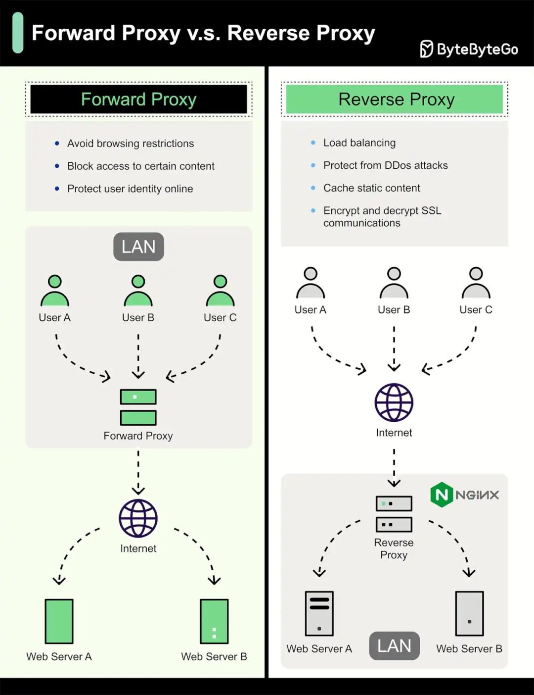

# 你该了解的正向代理与反向代理

> 原文地址: [https://mp.weixin.qq.com/s/1GYWRmwrnqVmKCaq2gsyhw](https://mp.weixin.qq.com/s/1GYWRmwrnqVmKCaq2gsyhw)

这张图的核心区别其实一句话就能概括：

-   **代理（Forward Proxy，正向代理）**：替“客户端/内网用户”去访问外网 —— **服务器只看到代理，看不到真实客户端**。
    
-   **反向代理（Reverse Proxy）**：替“服务器/站点后端”去接待外网 —— **客户端只看到反向代理，看不到真实后端服务器**。
    

下面按图把两者讲清楚。

* * *

## 1) 正向代理（Forward Proxy）在图里怎么走？

图左边：User A/B/C 在 **LAN 内网** → 先连 **Forward Proxy** → 再由它去访问 Internet 上的 Web Server A/B。

### 正向代理的特征

-   **配置在客户端侧**：通常是你的浏览器/系统/应用显式设置“代理地址”，或由网关透明转发。
    
-   **隐藏/代表的是客户端**：外网网站看到的源 IP、行为主体往往是代理服务器；它能“保护用户身份”（图里写的 Protect user identity online）。
    
-   **主要用途（图里列的2点）**
    

-   企业/学校做内容管控（Block access to certain content）
    
-   让外部看不出内网某个具体用户（一定程度的隐私保护）
    

### 常见形态

-   HTTP/HTTPS 代理、SOCKS5
    
-   企业上网网关、审计代理
    
-   某些“加速/中转”客户端本质也属于正向代理思路（客户端把流量先送到一个中间点）
    

* * *

## 2) 反向代理（Reverse Proxy）在图里怎么走？

图右边：Internet 上的用户 User A/B/C → 访问一个站点入口（域名/IP）→ 命中 **Reverse Proxy（图里举例 Nginx）** → 再转发到内网的 Web Server A/B。

### 反向代理的特征

-   **配置在服务器侧**：用户根本不需要知道你的后端有几台机器、在哪个内网。
    
-   **隐藏/保护的是后端**：客户端只见到入口（反向代理），后端真实 IP、拓扑、端口都被遮蔽。
    
-   **主要用途（图里列的四点）**
    

-   负载均衡（Load balancing）
    
-   抗 DDoS/安全防护（Protect from DDoS attacks，常配 WAF、限流、黑白名单）
    
-   缓存静态内容（Cache static content）
    
-   SSL/TLS 终止（Encrypt & decrypt SSL communications：在代理处解密/再转发）
    

### 常见形态

-   Nginx / HAProxy 
    
-   云负载均衡（ALB/NLB）、CDN（本质是更大规模的反向代理网络）
    
-   “一个域名按路径分发”：`/api` → 后端 API，`/static` → 静态服务器等
    

* * *

## 3) 一张对照表（抓住关键差异）

-   **站在谁这一侧？**
    

-   正向代理：客户端这一侧（帮“我”上网）
    
-   反向代理：服务器这一侧（帮“我的站”接客）
    

-   **谁需要配置代理？**
    

-   正向代理：客户端/内网网关要配
    
-   反向代理：服务端部署即可，客户端无感
    

-   **隐藏谁？**
    

-   正向代理：隐藏真实客户端
    
-   反向代理：隐藏真实后端
    

-   **流量方向的直觉**
    

-   正向：人 → 代理 → 网站
    
-   反向：人 → 站点入口(代理) → 后端
    

* * *

## 4) 两个常被忽略但很重要的点

1.  **反向代理并不等于“更安全”**：它只是把入口集中化，便于加 WAF、限流、TLS 策略、隔离内网；安全还要靠配置与体系。
    
2.  **“TLS 终止”意味着代理能看到明文**：如果你在反向代理处解密 HTTPS，再用 HTTP 转发到后端，内网那段就是明文；要端到端则需要“代理到后端也用 TLS”。
    

### 代理（Forward Proxy）和反向代理（Reverse Proxy）的概述

代理服务器（Proxy Server）是一种位于客户端和目标服务器之间的中间服务器，用于转发请求和响应。根据代理的位置和作用方向，我们可以将代理分为正向代理（Forward Proxy）和反向代理（Reverse Proxy）。它们在网络架构中扮演不同的角色，主要用于提升安全性、性能和访问控制。下面我将分别解释它们的工作原理，并进行比较。

### 正向代理（Forward Proxy）的工作原理

正向代理是客户端侧的代理，客户端通过代理服务器访问外部资源。它常用于造访受保护的局域网、隐藏客户端身份或加速访问。工作流程如下：

1.  **客户端发起请求**
    
    客户端（如浏览器）配置代理服务器的地址和端口。当客户端需要访问目标服务器（如一个网站）时，它不会直接连接目标服务器，而是将HTTP/HTTPS请求发送到代理服务器。请求中包含目标URL。
    
2.  **代理服务器处理请求**
    
      
    

-   代理服务器接收客户端的请求。
    
-   检查缓存：如果代理有缓存的响应（如之前访问过的页面），直接返回给客户端（这称为缓存命中，提高效率）。
    
-   如果无缓存，代理服务器以自己的身份向目标服务器发起请求（使用代理的IP地址，而非客户端的IP）。
    

4.  **目标服务器响应**
    
    目标服务器收到代理的请求后，返回响应数据给代理服务器。
    
5.  **代理服务器转发响应**
    
    代理服务器将响应转发回客户端，并可能缓存响应以备后续使用。
    

**关键特点**：

-   **隐藏客户端**
    
    目标服务器只看到代理的IP，无法获知真实客户端信息。
    
-   **常见应用**
    
    企业内网访问控制、匿名浏览。
    

**潜在缺点**：客户端需要手动配置代理；如果代理故障，整个访问链路中断。

### 反向代理（Reverse Proxy）的工作原理

反向代理是服务器侧的代理，位于后端服务器前端，处理来自客户端的请求。它常用于负载均衡、安全防护和内容分发。工作流程如下：

1.  **客户端发起请求**
    
    客户端直接向反向代理服务器发送请求（客户端认为代理就是目标服务器）。代理的地址通常是公开的域名或IP。
    
2.  **反向代理处理请求**

-   接收请求后，进行安全检查（如SSL终止、WAF防火墙过滤恶意流量）。
    
-   路由决策：根据规则（如URL路径、负载情况）将请求转发到后端的一个或多个真实服务器。
    
-   缓存处理：如果有缓存的静态内容，直接返回给客户端。
    

4.  **后端服务器响应**
    
    后端服务器处理请求，返回响应给反向代理。
    
5.  **反向代理转发响应**
    
    代理将响应返回给客户端，并可能添加头信息（如压缩、加密）。
    

**关键特点**：

-   **隐藏后端服务器**
    
    客户端只看到代理的IP，无法直接访问真实服务器，提高安全性。
    
-   **常见应用**
    
    Nginx或Apache作为反向代理，用于网站负载均衡（分发流量到多台服务器）、CDN（内容分发网络）、API网关。
    
-   **示例**
    
    在网站架构中，Nginx作为反向代理，前端接收所有请求，后端连接多个Web服务器（如Tomcat），实现高可用。
    

**潜在缺点**：代理成为单点故障，需要高可用配置（如集群）。

### 代理与反向代理的比较

以下表格总结了两者的区别，便于对比：

方面

正向代理 (Forward Proxy)

反向代理 (Reverse Proxy)

**位置**

位于客户端侧

位于服务器侧

**作用对象**

代表客户端访问服务器

代表服务器响应客户端

**配置方**

客户端需要配置代理地址

服务器端配置，客户端无需感知

**主要功能**

隐藏客户端IP、绕过限制、缓存加速

负载均衡、安全防护、缓存、SSL终止

**典型工具**

frp

Nginx、HAProxy、Apache

**透明度**

客户端知道使用代理

客户端不知道后端有代理

**适用场景**

个人/企业上网代理、匿名访问

Web服务器集群、API管理、内容分发

### 总结

正向代理和反向代理的核心都是转发请求和响应，但方向相反：正向代理服务于客户端，反向代理服务于服务器。在实际网络设计中，它们常结合使用（如正向代理用于客户端访问，反向代理用于服务器保护）。