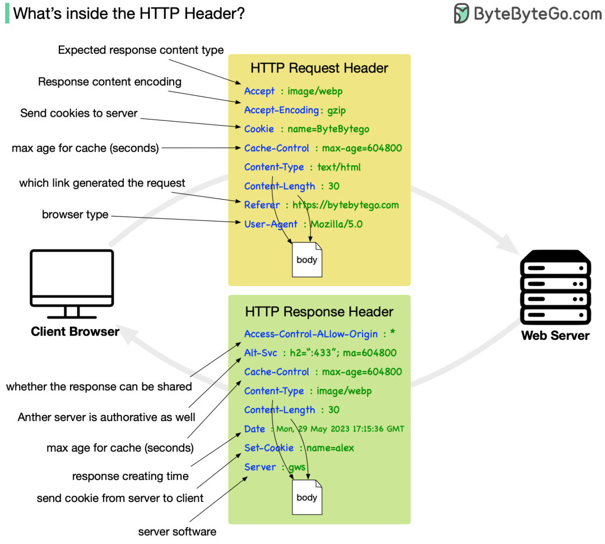
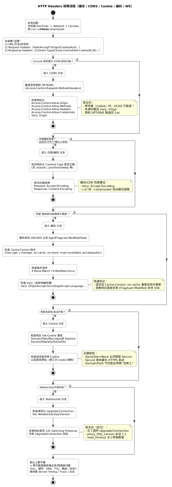

# 关于 HTTP 标头的重要事项

原创 sonadorje AI之Myth 2026-01-15 10:37 云南

> 原文地址: [https://mp.weixin.qq.com/s/dXukKLP-IsSEGWzMrUlabg](https://mp.weixin.qq.com/s/dXukKLP-IsSEGWzMrUlabg)

   
编辑

这张图把 **HTTP 标头（Headers）**分成两块：**请求头（Request Header）**和**响应头（Response Header）**。它们本质上都是“键: 值”的元数据，用来描述**这次通信的上下文**：我想要什么、我能接受什么、你给了什么、该怎么缓存、该不该共享、要不要带上身份状态等。

  

* * *

## 1) 图中请求头：浏览器 → 服务器（“我想要/我能接收/我是谁”）

  

-   **Accept: image/webp**  
    _内容协商_：客户端希望拿到的**响应内容类型**（并不是“我发给你什么类型”）。  
      服务器不一定照做，最终以响应中的 `Content-Type` 为准。
    
      
    
-   **Accept-Encoding: gzip**  
      客户端支持的**压缩算法**（gzip/br/zstd…）。  
      服务器如果压缩了响应，会在响应里用 `Content-Encoding: gzip` 告诉你“我压了什么”。
    
      
    
-   **Cookie: name=ByteBytego**  
      客户端把此前服务器下发的 cookie（会话/偏好/追踪等）带回去。  
      对应响应里的 **Set-Cookie**（服务器下发 cookie）。
    
      
    
-   **Cache-Control: max-age=604800**（请求里也能出现）  
      请求里的 cache-control 更像是“**我愿意接受多新/多旧的副本**”的要求（不同指令含义不同，例如 `max-age=0` 常用于希望走验证）。  
      真正决定响应能否被缓存以及缓存多久，多由响应头 `Cache-Control`、`Expires`、`ETag` 等共同决定。
    
      
    
-   **Content-Type / Content-Length（图里放在请求头示例里）**  
      这俩在“有请求体”的场景（POST/PUT 上传 JSON、表单、文件）非常关键：
    

-   Content-Type：**请求体**是什么格式（比如 `application/json`）
    
-   Content-Length：请求体长度（HTTP/1.1 常见；分块传输则用 `Transfer-Encoding: chunked`，HTTP/2/3 用帧机制）  
      对纯 GET 请求通常没有 body，也就不一定出现这俩。
    
      
    

  

-   **Referer**（图里写成 Referar；现实里确实叫 _Referer_，历史拼写错误沿用至今）  
      表示从哪个页面/链接跳转过来。常用于统计、风控、CSRF 防护辅助。也有隐私风险（可能泄露 URL 参数）。
    
      
    
-   **User-Agent: Mozilla/5.0**  
      客户端软件信息。**不要拿它当安全依据**（很容易伪造），更多用于兼容性/统计。
    

> 图里没画但非常常见的请求头：`Host`(HTTP/1.1 必需)、`Authorization`、`Accept-Language`、`If-None-Match`(配合 ETag)、`Origin`(CORS) 等。

* * *

##   

## 2) 图中响应头：服务器 → 浏览器（“我给了什么/怎么处理/能不能缓存与共享”）

  

-   **Content-Type: image/webp**  
      响应体的真实媒体类型。客户端通常按它来解析/渲染。
    
      
    
-   **Content-Length: 30**  
      响应体长度（同样受 HTTP 版本与传输方式影响）。
    
      
    
-   **Cache-Control: max-age=604800**  
      这才是缓存行为的核心：告诉浏览器/CDN **可以缓存多久、是否允许共享缓存**等。  
      高级用法还会配合 `ETag` / `Last-Modified` / `Vary`。
    
      
    
-   **Date: ... GMT**  
      服务器产生响应的大致时间。常用于缓存与调试。
    
      
    
-   **Set-Cookie: name=alex**  
      服务器下发 cookie。真正落地到浏览器 cookie jar 时还会带属性：`HttpOnly`、`Secure`、`SameSite`、`Domain`、`Path`、`Max-Age/Expires` 等（安全性关键就在这些属性）。
    
      
    
-   **Access-Control-Allow-Origin: \***  
      CORS：告诉浏览器哪些源可以读这个响应。  
      ⚠️ 注意：如果要带 cookie/凭据（`withCredentials` / `Access-Control-Allow-Credentials: true`），就**不能**用 `*`，必须回显具体 origin。
    
      
    
-   **Alt-Svc: ...**  
      “替代服务”提示：比如告诉客户端“这个资源也支持 h2/h3 在另一个端口/主机上”。常见于 HTTP/3/QUIC 推广。
    
      
    
-   **Server: gws**  
      服务器软件标识（可用于排障，也可能暴露指纹；很多站点会隐藏/泛化）。
    

  

* * *

## 3) 关于 HTTP 标头，最重要的“坑点/要点”清单

Content-Type vs Accept 是两回事

-   Accept\*：客户端“想要/能接受什么”
    
-   Content-Type：实际“我发的是什么”（请求体/响应体）  
      做接口时一定要：请求解析看 `Content-Type`，返回正确的 `Content-Type`（否则客户端解码会崩）。
    

  

**压缩协商要配套：Accept-Encoding ↔ Content-Encoding，并且要加 Vary**

-   客户端发 `Accept-Encoding`
    
-   服务器若压缩，回 `Content-Encoding`
    
-   缓存/CDN 场景必须加 **`Vary: Accept-Encoding`**，否则可能把 gzip 版缓存给不支持 gzip 的客户端。
    

  

**缓存不是只看 max-age**  
  真实世界里还要看：`Cache-Control` 指令组合（`public/private/no-store/no-cache/must-revalidate` 等）、`ETag/If-None-Match`、`Last-Modified`、`Vary`，以及 CDN 的策略。缓存问题排查时这些头缺一不可。

  

**Cookie 安全靠属性，不靠“有没加密”**

-   Secure：只在 HTTPS 发送
    
-   HttpOnly：JS 读不到（防 XSS 偷 cookie）
    
-   SameSite：降低 CSRF 风险（现代浏览器默认更严格）  
      此外，别把敏感信息直接塞 cookie；cookie 是会被自动回传的。
    

  

**CORS 是浏览器机制，不是服务器鉴权**  
  服务器返回 `Access-Control-Allow-Origin` 只是让浏览器“放行读取”。真正安全仍要靠服务端鉴权/授权。并且“允许任意源 + 允许凭据”是危险组合（也往往会被浏览器拦）。

  

1.  **很多头都“不可信”，别拿来做安全判断**  
    `User-Agent`、`Referer`、`X-Forwarded-For` 等都可能被伪造。要做风控需要结合 TLS、令牌、签名、服务端会话、反向代理可信链等。
    
2.  有“逐跳(hop-by-hop)”头，代理不能乱转发  
      如 `Connection`、`Upgrade`、`Transfer-Encoding` 等在代理/网关里处理不当，会导致奇怪的断连/缓存/WS 握手失败。
    
3.  标头大小与重复规则很重要  
      头太大可能被 WAF/反代直接 431/400；同名头可能可合并也可能不可合并（`Set-Cookie` 不能简单合并），解析要严格，避免 CRLF 注入类问题。
    

  

##  HTTP 头部的重要事项

HTTP 头部（Headers）是 HTTP 协议的核心组成部分，用于在客户端和服务器之间交换元数据，而不影响实际的请求/响应主体（body）。它们以键-值对形式出现（如 Key: Value），分为请求头部、响应头部、通用头部和实体头部。基于图片的示例，以下是 HTTP 头部的一些重要事项，结合实际应用、安全性和性能考虑：

#### 1. **内容协商与兼容性**

-   头部如 Accept、Accept-Encoding 和 Content-Type 允许客户端和服务器协商响应格式。例如，客户端可以请求 gzip 压缩以优化带宽，服务器则根据 User-Agent 调整响应（如为移动设备提供简化版本）。
    
-   重要性：这确保了跨设备兼容性。如果忽略，可能会导致内容无法渲染（如不支持的图像格式）。在现代 web 中，这支持响应式设计和多媒体交付。
    

#### 2. **缓存控制与性能优化**

-   Cache-Control、max-age 和 Date 字段管理缓存行为。图片中设置的 604800 秒（7 天）意味着浏览器可以本地缓存资源，减少后续请求。
    
-   重要性：有效缓存可显著提高页面加载速度，降低服务器负载。但不当配置（如过长的 max-age）可能导致用户看到过时内容。结合 ETag 或 Last-Modified（图片未示）可实现条件缓存，进一步优化性能。在 CDN（内容分发网络）中，这至关重要。
    

#### 3. **会话管理和状态跟踪**

-   Cookie 和 Set-Cookie 用于传输小型数据块，如用户 ID 或偏好。图片展示了从客户端发送 cookie 和服务器设置新 cookie 的过程。
    
-   重要性：HTTP 是无状态协议，cookie 启用状态跟踪（如登录会话）。但需注意隐私问题：欧盟 GDPR 等法规要求明确同意。现代替代如 HTTP-only cookies 或 JWT（JSON Web Tokens）可增强安全性，防止 XSS 攻击。
    

#### 4. **安全性与跨域保护**

-   Access-Control-Allow-Origin（CORS）控制资源共享，图片中的 \* 通配符允许所有域访问，但这可能引入安全风险（如 CSRF 攻击）。
    
-   重要性：头部如 Strict-Transport-Security（HSTS，未示）强制 HTTPS，防止中间人攻击。Content-Security-Policy（CSP）限制资源加载，防御 XSS。忽略这些可能导致数据泄露，尤其在 API 或单页应用（SPA）中。始终优先使用 HTTPS 以加密头部和主体。
    

#### 5. **追踪与调试**

-   Referer、User-Agent 和 Server 提供上下文，用于分析流量或调试问题。
    
-   重要性：Referer 有助于追踪来源，但可能泄露隐私（现代浏览器有时会抑制它）。User-Agent 可用于 A/B 测试，但易被伪造，导致指纹追踪问题。在日志分析中，这些头部是宝贵工具。
    

#### 6. **版本演进与最佳实践**

-   图片基于 HTTP/1.x，但 HTTP/2 和 HTTP/3 引入二进制头部压缩（HPACK/QPACK），减少开销。
    
-   重要性：升级到新版本可改善多路复用和延迟。最佳实践包括最小化头部大小（避免不必要字段）、使用压缩，并定期审计以防漏洞（如头部注入攻击）。工具如 curl 或浏览器开发者工具可查看实际头部。
    

总之，HTTP 头部虽“隐形”，却决定了 web 交互的效率、安全和用户体验。图片简化了这些概念，但实际应用中，头部可能更复杂（如包含授权令牌）。开发者应参考 RFC 9110（HTTP 语义）以确保合规。如果你在构建 web 应用，优先考虑性能和安全头部配置，以避免常见陷阱如缓存中毒或信息泄露。

下面给一份“排障用”的 **HTTP Headers 流程图**：按 **CORS / 缓存 / Cookie / 编码压缩 / Content-Type / WebSocket** 逐步定位。

  
编辑