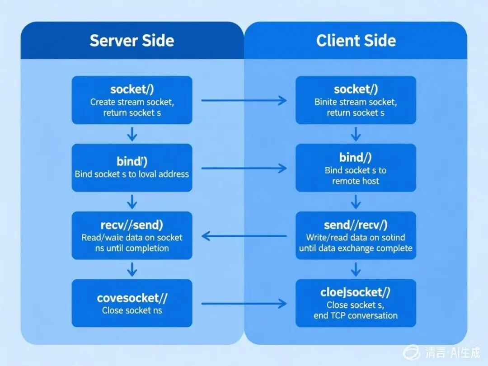

# 再谈Socket编程中阻塞/非阻塞模式


> 原文地址: [https://mp.weixin.qq.com/s/h2\_NvBRcMpztFlc4S8aRcQ](https://mp.weixin.qq.com/s/h2_NvBRcMpztFlc4S8aRcQ)



我们用一个非常生活化的比喻——

**“去咖啡馆买咖啡”**，来彻底讲清楚Socket编程中的阻塞和非阻塞模式。

### 故事背景：你（应用程序）去咖啡馆（服务器）买咖啡

想象一下，你是一个程序，你的任务就是去咖啡馆点一杯拿铁，然后拿着咖啡回来继续工作。这个“点咖啡”的过程，就是一次网络请求（比如请求一个网页）。

**咖啡馆里有几个关键角色：**

-   你（客户端程序）： 发起请求的人。
    
-   点餐柜台（Socket）： 你和咖啡馆交流的窗口。
    
-   服务员（操作系统内核）： 负责接收你的订单，并和后厨沟通。
    
-   后厨（服务器应用）： 真正做咖啡的地方。
    

* * *

### 1\. 阻塞模式 - “死等型”顾客

在这种模式下，你是一个非常执着、一根筋的顾客。

**情景再现：**

1.  点单（发送请求 **`send`）：** 你走到柜台，对服务员说：“一杯拿铁，谢谢。” 服务员记下订单，转身递给后厨。在这个过程中，你就站在柜台前，**一动不动地等着**，直到服务员回头告诉你“订单已收到”，你才进行下一步。如果后厨正忙，服务员没空立刻接你的单，你就会一直堵在柜台前等。
    
2.  等咖啡（等待响应 **`recv`）：** 订单提交后，你知道咖啡需要时间制作。但你不会离开柜台去做别的事，而是**继续站在柜台前，眼睛直勾勾地盯着出餐口，什么都不干，就等你的咖啡**。
    
3.  取咖啡（收到数据）： 终于，服务员喊了你的号码，把做好的拿铁递给你。这时，你拿到咖啡，整个任务完成，心满意足地离开。
    

**阻塞模式的特点：**

-   简单直接： 你的行为逻辑很简单：一步、二步、三步……每一步都必须等上一步彻底完成。
    
-   效率极低： 在等咖啡的漫长过程中，你（这个程序线程）完全被“阻塞”住了，不能去回邮件、刷手机（不能处理其他任务）。你的所有时间都浪费在了等待上。
    
-   资源占用： 如果一个咖啡馆同时来了很多这样的“死等型”顾客，每个顾客都需要一个专门的柜台通道（线程）来服务，对咖啡馆（服务器）的资源是巨大的浪费。
    

**编程中的体现：**

在阻塞Socket中，像 `connect()`, `send()`, `recv()`这样的函数，在操作没有完成之前（比如数据没有真正发送出去，或没有收到对方的数据），函数调用是不会返回的，程序会停在那里一直等待。

* * *

### 2\. 非阻塞模式 - “时间管理大师”型顾客

在这种模式下，你是一个高效的时间管理大师。

**情景再现：**

1.  点单（非阻塞 **`send`）：** 你走到柜台，发现服务员正忙。你不会干等，而是立刻问他：“我现在下单可以吗？” 服务员可能回答：“现在不行，你过会儿再来（返回 `EAGAIN`或 `EWOULDBLOCK`错误）。” 你听到后，**转身就去旁边座位上刷手机（处理其他任务）**。过了一分钟，你再来问一次，直到成功下单为止。
    
2.  等咖啡（非阻塞 **`recv`）：** 下单成功后，你不会傻站在柜台前。你会回到座位，做自己的事：回几封邮件、写会儿代码（处理其他连接或任务）。每隔一段时间，你就走到柜台问一下：“我的拿铁好了吗？（调用 `recv()`尝试读取数据）”
    

-   如果咖啡没好，服务员会说：“没好呢，等着！（返回 `EAGAIN`）”，你就回去继续工作。
    
-   如果咖啡好了，服务员会把咖啡递给你，你完成任务。
    
      
    

**非阻塞模式的特点：**

-   高效利用时间： 你（线程）永远不会因为等待而空闲。在等待一个响应时，可以去处理其他请求。
    
-   编程复杂： 你需要不断地“轮询”，即主动地、反复地去询问状态（“好了没？”、“好了没？”）。这需要你自己管理一个任务循环。如果询问得太频繁，你会累死（CPU空转）；询问得不频繁，咖啡可能凉了（响应延迟）。
    
-   单线程处理多任务： 一个你（一个线程）就可以同时盯着好几杯咖啡的订单，在它们之间来回切换询问。
    

* * *

### 3\. I/O多路复用 - “雇佣秘书”模式（非阻塞的升级版）

由于“时间管理大师”自己轮询太累了，于是出现了更高级的模式——I/O多路复用。这就像你雇佣了一个秘书。

**情景再现：**

1.  你告诉秘书：“我去点一杯拿铁和一杯卡布奇诺，你帮我盯着这两个订单。**只要其中任何一杯好了，或者两杯都好了，就立刻打电话通知我。** 在这期间，我要去开会了（线程可以去休眠）。”
    
2.  秘书（`select`, `poll`, `epoll`等系统调用）就搬个凳子坐在出餐口，替你监视着所有你关心的订单。
    
3.  当后厨做好其中任何一杯咖啡时，秘书会立刻知道，然后打电话叫你来取。你只需要在接到通知后，过来直接取走咖啡即可。
    

**I/O多路复用的特点：**

-   “等事件就绪”： 这是它的核心。程序阻塞在 `select`/`epoll`这样的调用上，但这不是等待某个具体的I/O操作，而是等待“某个或多个Socket有数据可读/可写”这个**事件**发生。一旦事件发生，它才去调用真正的 `recv`或 `send`，这时因为数据已经准备好了，所以这些操作会立刻完成，不会阻塞。
    
-   极大提升效率： 一个线程（你）加上一个秘书（多路复用器）就可以高效管理成百上千个网络连接（订单），而无需创建大量线程。这是高性能网络服务器的基石（如Nginx, Redis）。
    
-   仍然是同步I/O： 注意，取咖啡这个动作还是你自己做的。所以它本质上是非阻塞模式的一种更高效的用法，属于**同步非阻塞I/O**。
    

* * *

### 总结与对比

模式

比喻

编程特点

优点

缺点

适用场景

**阻塞**

死等型顾客

调用I/O函数后，线程被挂起，直到操作完成。

编程非常简单，逻辑清晰。

效率极低，一个线程只能处理一个连接，资源浪费严重。

客户端程序、连接数极少的简单服务器。

**非阻塞**

时间管理大师

调用I/O函数立即返回，需要循环检查状态。

单线程可处理多连接，提高资源利用率。

编程复杂，需要轮询，CPU占用高（忙等待）。

现在较少直接使用，通常是和多路复用结合。

**I/O多路复用**

雇佣秘书

线程阻塞在 `select/epoll`上，等待多个连接中的任何一个就绪。

高效，能管理大量连接，是高性能服务器的标准。

编程比阻塞模式复杂，但比纯轮询的非阻塞简单。

**高并发网络服务器**，如Web服务器、聊天服务器等。

希望这个“咖啡馆买咖啡”的比喻能让你对Socket的阻塞和非阻塞模式有一个生动而深刻的理解！

## winsock2的函数及其调用时机和作用

WinSock2（Windows Socket 2）是 Windows 平台上的网络编程接口，它基于 **Berkeley Sockets（BSD Sockets）** 标准，并扩展了一些 Windows 特有的功能。WinSock2 提供了一系列函数，用于创建、连接、发送和接收数据等网络操作。下面我们详细介绍 **WinSock2 的核心函数**，并说明它们的**调用时机**和**作用**。

* * *

## **1\. 初始化与清理**

在开始使用 WinSock2 之前，必须先初始化，并在结束时清理资源。

### **(1) `WSAStartup()`**

**作用**：初始化 WinSock2 库，指定使用的版本（如 `2.2`）。

**调用时机**：程序启动时，**任何其他 WinSock 函数之前**。

**参数**：

-   wVersionRequested：请求的 WinSock 版本（如 `MAKEWORD(2, 2)`）。
    
-   lpWSAData：返回 WinSock 实现的详细信息。
    

**示例**：

```
WSADATA wsaData;if (WSAStartup(MAKEWORD(2, 2), &wsaData) != 0) {printf("WSAStartup failed\n");return1;}
```

  

### **(2) `WSACleanup()`**

**作用**：清理 WinSock2 资源，释放 DLL。

**调用时机**：程序结束时，**所有 Socket 操作完成后**。

**示例**：

`WSACleanup();`

* * *

## **2\. 创建与关闭 Socket**

### **(3) `socket()`**

**作用**：创建一个新的 Socket（套接字）。

**调用时机**：需要建立网络连接时（TCP/UDP）。

**参数**：

-   af：地址族（如 `AF_INET`表示 IPv4）。
    
-   type：Socket 类型（`SOCK_STREAM`表示 TCP，`SOCK_DGRAM`表示 UDP）。
    
-   protocol：协议（通常 `0`表示自动选择）。
    

**示例**：

```
SOCKET sock = socket(AF_INET, SOCK_STREAM, 0);if (sock == INVALID_SOCKET) {printf("socket() failed: %d\n", WSAGetLastError());return1;}
```

  

  

### **(4) `closesocket()`**

**作用**：关闭 Socket，释放资源。

**调用时机**：不再需要 Socket 时（如通信结束）。

**示例**：

`closesocket(sock);`

* * *

## **3\. 绑定与监听（服务器端）**

### **(5) `bind()`**

**作用**：将 Socket 绑定到特定的 IP 和端口。

**调用时机**：服务器启动时，监听连接之前。

**参数**：

-   sock：Socket 描述符。
    
-   addr：指向 `sockaddr_in`结构体的指针，包含 IP 和端口。
    
-   addrlen：`sockaddr_in`的大小。
    

**示例**：

```
structsockaddr_in serverAddr;serverAddr.sin_family = AF_INET;serverAddr.sin_addr.s_addr = INADDR_ANY; // 监听所有网卡serverAddr.sin_port = htons(8080);       // 端口 8080if (bind(sock, (struct sockaddr*)&serverAddr, sizeof(serverAddr)) == SOCKET_ERROR) {printf("bind() failed: %d\n", WSAGetLastError());closesocket(sock);return1;}
```

  

### **(6) `listen()`**

**作用**：让 Socket 进入监听状态，等待客户端连接。

**调用时机**：`bind()`之后，`accept()`之前。

**参数**：

-   sock：Socket 描述符。
    
-   backlog：等待连接队列的最大长度（如 `5`）。
    

**示例**：

```
if (listen(sock, 5) == SOCKET_ERROR) {printf("listen() failed: %d\n", WSAGetLastError());closesocket(sock);return1;}
```

  

* * *

## **4\. 连接（客户端）**

### **(7) `connect()`**

**作用**：客户端连接到服务器。

**调用时机**：客户端需要建立 TCP 连接时。

**参数**：

-   sock：Socket 描述符。
    
-   addr：服务器的 `sockaddr_in`结构体。
    
-   addrlen：`sockaddr_in`的大小。
    

**示例**：

```
structsockaddr_in serverAddr;serverAddr.sin_family = AF_INET;serverAddr.sin_addr.s_addr = inet_addr("127.0.0.1"); // 服务器 IPserverAddr.sin_port = htons(8080);                   // 服务器端口if (connect(sock, (struct sockaddr*)&serverAddr, sizeof(serverAddr)) == SOCKET_ERROR) {printf("connect() failed: %d\n", WSAGetLastError());closesocket(sock);return1;}
```

  

* * *

## **5\. 接受连接（服务器端）**

### **(8) `accept()`**

**作用**：接受客户端的连接请求，返回一个新的 Socket 用于通信。

**调用时机**：`listen()`之后，服务器等待客户端连接时。

**参数**：

-   sock：监听 Socket。
    
-   addr：存储客户端地址信息（可设为 `NULL`）。
    
-   addrlen：客户端地址结构体的大小（可设为 `NULL`）。
    

**示例**：

```
SOCKET clientSock = accept(sock, NULL, NULL);if (clientSock == INVALID_SOCKET) {printf("accept() failed: %d\n", WSAGetLastError());closesocket(sock);return1;}
```

  

## **6\. 发送与接收数据**

### **(9) `send()`/ `recv()`（TCP）**

**作用**：

-   send()：发送数据（TCP）。
    
-   recv()：接收数据（TCP）。
    

**调用时机**：连接建立后，需要传输数据时。

**参数**：

-   sock：Socket 描述符。
    
-   buf：数据缓冲区。
    
-   len：数据长度。
    
-   flags：额外选项（通常 `0`）。
    

**示例**：

```
// 发送数据char sendBuf[] = "Hello, Server!";send(clientSock, sendBuf, strlen(sendBuf), 0);// 接收数据char recvBuf[1024];int bytesReceived = recv(clientSock, recvBuf, sizeof(recvBuf), 0);if (bytesReceived > 0) {    recvBuf[bytesReceived] = '\0';printf("Received: %s\n", recvBuf);}
```

  

### **(10) `sendto()`/ `recvfrom()`（UDP）**

**作用**：

-   sendto()：发送数据（UDP）。
    
-   recvfrom()：接收数据（UDP）。
    

**调用时机**：UDP 通信时（不需要 `connect()`）。

**参数**：

-   sock：Socket 描述符。
    
-   buf：数据缓冲区。
    
-   len：数据长度。
    
-   flags：额外选项（通常 `0`）。
    
-   addr：目标/来源地址（`sockaddr_in`）。
    
-   addrlen：地址结构体大小。
    

**示例**：

```
structsockaddr_in serverAddr;serverAddr.sin_family = AF_INET;serverAddr.sin_addr.s_addr = inet_addr("127.0.0.1");serverAddr.sin_port = htons(8080);// 发送 UDP 数据sendto(sock, "Hello UDP", 9, 0, (struct sockaddr*)&serverAddr, sizeof(serverAddr));// 接收 UDP 数据char recvBuf[1024];structsockaddr_in clientAddr;int addrLen = sizeof(clientAddr);recvfrom(sock, recvBuf, sizeof(recvBuf), 0, (struct sockaddr*)&clientAddr, &addrLen);
```

  

  

## **7\. 错误处理**

### **(11) `WSAGetLastError()`**

**作用**：获取最后一次 WinSock 错误的错误码。

**调用时机**：任何 WinSock 函数返回 `SOCKET_ERROR`时。

**示例**：

```
if (send(sock, buf, len, 0) == SOCKET_ERROR) {printf("send() failed: %d\n", WSAGetLastError());}
```

  

  

* * *

## **8\. 非阻塞模式 & I/O 多路复用**

### **(12) `ioctlsocket()`**

**作用**：设置 Socket 为非阻塞模式。

**调用时机**：需要非阻塞 Socket 时（如高并发服务器）。

**示例**：

`u_long mode = 1; // 1 = 非阻塞，0 = 阻塞 ioctlsocket(sock, FIONBIO, &mode);`

### **(13) `select()`**

**作用**：I/O 多路复用，监视多个 Socket 的可读/可写状态。

**调用时机**：需要同时管理多个 Socket 时（如聊天服务器）。

**示例**：

```
fd_set readSet;FD_ZERO(&readSet);FD_SET(sock, &readSet);structtimeval timeout;timeout.tv_sec = 5; // 5 秒超时timeout.tv_usec = 0;int ready = select(0, &readSet, NULL, NULL, &timeout);if (ready > 0 && FD_ISSET(sock, &readSet)) {// Socket 可读}
```

  

  

## **总结**

**函数**

**作用**

**调用时机**

`WSAStartup()`

初始化 WinSock2

程序启动时

`WSACleanup()`

清理 WinSock2

程序结束时

`socket()`

创建 Socket

需要网络连接时

`closesocket()`

关闭 Socket

通信结束时

`bind()`

绑定 IP 和端口

服务器启动时

`listen()`

监听连接

`bind()`之后

`connect()`

客户端连接服务器

客户端需要连接时

`accept()`

接受客户端连接

`listen()`之后

`send()`/ `recv()`

TCP 数据收发

连接建立后

`sendto()`/ `recvfrom()`

UDP 数据收发

UDP 通信时

`WSAGetLastError()`

获取错误码

WinSock 出错时

`ioctlsocket()`

设置非阻塞模式

需要非阻塞 Socket 时

`select()`

I/O 多路复用

管理多个 Socket 时

WinSock2 的这些函数构成了 Windows 网络编程的基础，理解它们的调用时机和作用，能帮助你编写高效的网络程序！🚀