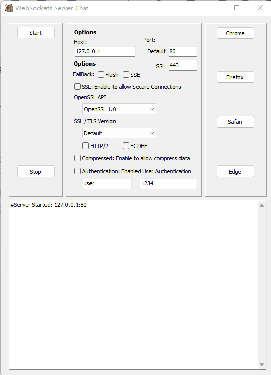
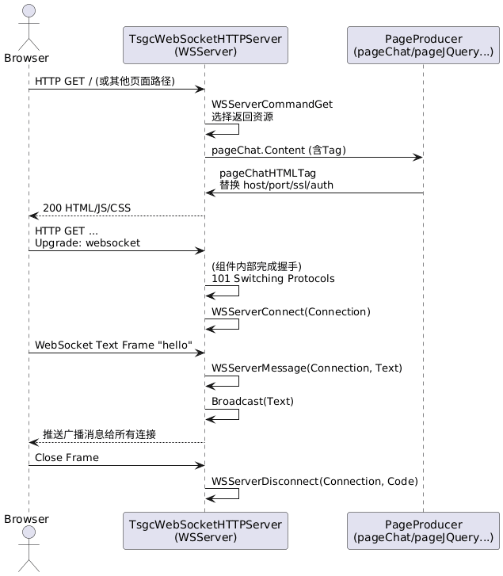

# 基于VCL的WebSocket服务器的运作方式讲解


> 原文地址: [https://mp.weixin.qq.com/s/pumW15RoYO2doHXzbD33Uw](https://mp.weixin.qq.com/s/pumW15RoYO2doHXzbD33Uw)



WebSocket服务器的核心组件是TsgcWebSocketHTTPServer（简称WSServer），这是一个第三方库（sgcWebSockets）提供的多线程服务器组件。它同时处理WebSocket连接和HTTP请求，使用同一个TCP端口，实现了一个简单的聊天应用服务器。以下从整体流程、配置、事件处理和关键机制等方面详细讲解其运作方式。我会结合代码中的实现和组件的文档特性进行说明，便于理解。

#### 1. **整体运作流程**

  
编辑

WSServer的运作基于事件驱动的多线程模型，类似于一个REPL（读取-评估-响应循环），但专注于网络通信：

-   启动阶段：服务器激活后，监听指定的TCP端口（默认80或自定义）。它会检查传入的TCP连接：
    

-   如果检测到有效的WebSocket握手（Handshake），则将连接升级为WebSocket协议实例（TsgcWebSocket连接），用于实时双向通信（如聊天消息）。
    
-   如果不是WebSocket，则作为HTTP请求处理，用于提供静态文件或动态内容（如聊天页面HTML）。
    
      
    

-   运行阶段：服务器维护一个连接列表（Connections），每个客户端连接用唯一GUID标识。服务器可以广播消息、发送针对性数据，或处理断开/错误。
    
-   停止阶段：设置Active := False，清理绑定和连接。
    
-   多线程处理：组件内部使用多线程处理并发连接（MaxConnections可限制），确保高负载下不阻塞主线程。代码中通过Memo日志记录所有事件，便于监控。
    

在代码中，这个流程从btnStartClick开始激活服务器，到btnStopClick停止。服务器启动后，浏览器（如Chrome）可以通过DoOpenBrowser打开URL连接（http(s)://host:port），加载聊天页面并建立WebSocket。

#### 2. **配置和初始化**

代码中在FormCreate和btnStartClick中进行初始化和配置：

-   端口和绑定：设置Port（默认或SSL端口），添加Bindings（IP和端口组合）。例如：
    

-   非SSL：Port = txtDefaultPort.Text (默认80)。
    
-   SSL：添加额外绑定到SSL端口 (默认443)。
    
-   Flash fallback：额外绑定843端口。
    
      
    

-   文档根路径：WSServer.DocumentRoot := ExtractFilePath(Application.ExeName);，服务器从此目录提供静态文件（如HTML、JS）。
    
-   协议规格：默认支持RFC6455（标准WebSocket），可配置遗留规格（如Hixie76）。
    
-   HTTP/2支持：如果chkHTTP2.Checked，则启用HTTP2Options.Enabled，并设置TLS版本为tls1\_3。客户端不支持时自动回退到HTTP/1.1。
    
-   SSL/TLS配置：chkSSL.Checked启用SSL。配置OpenSSL API版本（oslAPI\_1\_0/1\_1/3\_0）、TLS版本（tls1\_0到tls1\_3）、ECDHE（椭圆曲线Diffie-Hellman密钥交换）。SSL端口单独绑定，客户端证书验证通过OnSSLVerifyPeer事件（代码中未实现验证）。
    
-   其他选项：
    

-   压缩：chkCompressed.Checked启用Extensions.PerMessage\_Deflate（per-message-deflate扩展），客户端不支持时自动回退无压缩。
    
-   认证：chkAuthentication.Checked启用Authentication.Enabled，在OnAuthentication事件验证用户名/密码（代码中仅记录日志，不实际验证）。
    
-   Fallback机制：chkFlash.Checked启用Flash回退（遗留浏览器使用Flash模拟WebSocket）；chkSSE.Checked启用Server-Sent Events回退（单向推送模拟）。
    
-   会话管理：组件支持SessionState（启用HTTP会话），但代码中未启用。会话超时通过SessionTimeOut设置。
    
      
    

启动后，代码记录日志（如"#Server Started"），禁用选项面板，启用浏览器按钮。服务器激活（Active := True）后，开始监听连接。

#### 3. **事件处理（核心逻辑）**

WSServer通过事件回调处理所有交互，这些事件在代码中实现，用于聊天功能：

-   OnConnect (WSServerConnect)：新WebSocket连接建立时触发。代码记录IP："Connected: " + Connection.IP。每个连接创建一个TsgcWebSocket实例，加入Connections列表（GUID索引）。
    
-   OnMessage (WSServerMessage)：收到客户端文本消息时触发。代码记录IP + 消息，然后调用WSServer.Broadcast(Text);，将消息广播给所有连接的客户端，实现群聊。支持二进制消息（OnBinary，未在代码中使用）。
    
-   OnDisconnect (WSServerDisconnect)：连接关闭时触发。代码记录IP和关闭代码："Disconnected (" + Code + "): " + Connection.IP。关闭代码表示原因（如1000正常关闭）。
    
-   OnError (WSServerError)：握手失败或通信错误时触发。代码记录IP + 错误。
    
-   OnAuthentication (WSServerAuthentication)：认证启用时触发。代码仅记录用户名:密码，实际中可设置Authenticated := (aUser = 'admin' and aPassword = 'pass') 来验证。
    
-   OnCommandGet (WSServerCommandGet)：HTTP GET/POST/HEAD请求时触发，用于处理非WebSocket流量。代码检查Document：
    

-   /jquery.mobile.css：返回pageJQueryMobileCSS.Content (CSS)。
    
-   /jquery.js：返回jQuery脚本。
    
-   /jquery.mobile.js：返回jQuery Mobile脚本。
    
-   其他：返回pageChat.Content (聊天HTML页面)，并设置ContentType和ResponseNo=200。 这允许服务器提供聊天UI（HTML+JS），客户端加载后通过JS建立WebSocket连接。
    
      
    

-   其他事件：组件支持OnHandshake（握手成功）、OnBeforeHeartBeat（自定义心跳，默认为Ping/Pong保持连接）、OnException（HTTP异常）等，但代码中未实现。
    

这些事件使服务器响应式：不主动轮询，而是通过回调处理传入数据。

#### 4. **WebSocket连接和消息处理细节**

-   握手和升级：客户端发送WebSocket升级请求（Upgrade: websocket头），服务器验证后升级。失败则触发OnError。
    
-   消息传输：WebSocket支持全双工（双向同时通信）。消息可分帧（frame），支持文本/二进制/控制帧（Ping/Pong用于心跳，防止超时）。
    
-   广播和针对性发送：Broadcast发送给所有（可过滤Channel/Protocol/Include/Exclude）。代码中简单广播所有消息。单个连接用Connection.WriteData。
    
-   连接管理：Connections列表允许迭代、Ping（检查活跃）、DisconnectAll。代码未使用高级管理，但可扩展（如用户列表）。
    

#### 5. **HTTP集成和Fallback机制**

-   内置HTTP服务器：与WebSocket共享端口，提供静态/动态内容。KeepAlive启用时，复用TCP连接减少开销。
    
-   Fallback：
    

-   Flash：遗留浏览器使用Flash桥接WebSocket。
    
-   SSE：单向事件流，回退用于不支持WebSocket的客户端。
    
-   HTTP/2：启用后，优先使用；不支持则回退HTTP/1.1。
    
-   压缩：客户端协商后启用。
    
      
    

-   文件上传：组件支持（StreamType配置内存/文件流），但代码中未用（聊天无需上传）。
    

#### 6. **安全和扩展性**

-   SSL/TLS：加密通信，代码中通过chkSSL启用。ALPN（Application-Layer Protocol Negotiation）支持HTTP/2选择。
    
-   认证和会话：基本认证（用户名/密码），或扩展到会话（TIdHTTPSession）。代码中认证可选，仅日志。
    
-   错误处理：OnUnknownProtocol处理非HTTP/WebSocket连接（代码未实现，可关闭以防攻击）。
    
-   聊天应用扩展：代码是基础实现，可添加频道（Channel过滤广播）、用户验证、历史消息存储等。
    

#### 7. **潜在问题和注意事项**

-   端口权限：低端口（如80）需管理员权限。
    
-   并发：多线程处理，但高负载需监控MaxConnections。
    
-   浏览器兼容：现代浏览器支持RFC6455；遗留用Fallback。
    
-   日志和调试：代码用Memo记录所有事件，便于追踪。
    

总之，这个WebSocket服务器通过TsgcWebSocketHTTPServer实现了一个高效的聊天后端：HTTP提供UI，WebSocket处理实时消息。代码聚焦简单配置和事件响应，适合学习扩展。如果需要更深入的组件细节，可参考sgcWebSockets官方文档。

  

### 使用curl.exe测试WebSocket服务器连通性

curl.exe（从版本7.86.0开始）支持WebSocket协议测试，通过--websocket选项实现HTTP升级握手到WebSocket。它允许你建立连接、发送消息帧，并接收响应，但交互性不如专用工具（如wscat或浏览器DevTools）。curl的WebSocket支持是实验性的（需启用--http1.1），且主要用于简单测试（如连通性和消息回显）。如果你的curl版本较旧（<7.86.0），需升级或使用其他工具。

#### 前提条件

1.  **服务器运行：**

-   Host: localhost（或txtHost.Text，如127.0.0.1）。
    
-   默认端口：80（txtDefaultPort.Text，通常80或自定义）。
    
-   SSL：先测试非SSL（chkSSL未选中），URL为ws://localhost:80/。
    
-   WebSocket路径：代码中未明确指定，通常默认为根路径/（取决于客户端JS，如pageChat生成的HTML中ws连接路径）。如果聊天页面在/，WebSocket很可能也在/或/chat（检查pageChat.Content中的JS代码）。
    
-   认证：如果chkAuthentication选中，需用户名/密码（txtAuthUser/txtAuthPassword）。
    
-   压缩/Fallback：curl不支持Flash/SSE回退；压缩（PerMessage-Deflate）curl可能协商，但默认禁用。
    

-   使用Delphi应用启动服务器（点击btnStart）。
    
-   记录日志到memoLog：观察连接、消息、错误。
    
      
    

4.  **curl安装：下载最新curl.exe（https://curl.se/download.html），支持Windows。验证版本：\`curl --version\`（确保>=7.86.0并有WebSocket支持）。**
5.  **防火墙/权限：确保端口开放，低端口（如80）可能需管理员运行Delphi应用。**
6.  **测试路径：先用浏览器打开聊天页面（btnChrome等），确认WebSocket工作（DevTools Network标签查看ws://连接）。复制确切URL路径（如ws://localhost:80/chat）。**

#### 基本测试步骤

1.  **测试HTTP连通性（先验证基础）：
    
    text
    
    ```
    curl -i http://localhost:80/
    ```
    
    **

-   预期：返回200 OK，Content-Type: text/html（pageChat内容，包括jQuery等）。日志显示GET请求（虽未直接记录，但OnCommandGet处理）。
    
-   如果认证启用：curl -u username:password -i http://localhost:80/。
    
-   SSL变体：curl -k -i https://localhost:443/（-k忽略自签名证书）。
    

-   服务器也处理HTTP，所以先确认页面可达。
    

4.  **建立WebSocket连接：**

-   服务器日志：#Authentication: user:pass（OnAuthentication）。
    

-   成功：HTTP/1.1 101 Switching Protocols头，然后WebSocket帧。
    
-   服务器日志：Connected: 127.0.0.1（OnConnect触发）。
    
-   失败：错误如"Upgrade required"或连接拒绝（检查端口、防火墙）。
    

-   \--http1.1：强制HTTP/1.1（WebSocket要求）。
    
-   \--no-alpn：禁用ALPN（避免HTTP/2干扰）。
    
-   \-i：显示响应头（握手成功显示101 Switching Protocols）。
    
-   \-N：禁用buffering，便于实时输出。
    
-   \-H "Sec-WebSocket-Version: 13"：指定RFC6455版本。
    
-   URL：ws://host:port/path（path从浏览器JS确认，如/或/ws）。
    

-   使用--websocket选项进行升级握手。curl会发送Upgrade: websocket头，并处理Sec-WebSocket-Key。
    
-   基本命令（非SSL，根路径）：
    
    text
    
    ```
    curl --http1.1 --no-alpn --websocket -i -N -H "Sec-WebSocket-Version: 13" ws://localhost:80/
    ```
    
-   预期响应：
    
-   如果路径不是/（e.g., /chat）：ws://localhost:80/chat。
    
-   认证：添加-u username:password（Basic Auth，在握手前发送Authorization头）。
    
    text
    
    ```
    curl --http1.1 --no-alpn --websocket -u user:pass -i -N ws://localhost:80/
    ```
    

9.  **发送消息并测试广播：**

-   服务器日志：127.0.0.1:Hello from curl!（OnMessage），然后广播。
    
-   如果另一个客户端（如浏览器）已连接，它会收到广播消息。
    
-   要测试回显：用两个curl终端，一个发送，一个保持连接接收（但curl非交互式，接收需-N并观察输出）。
    

-   \-T -：从stdin读取数据作为文本帧发送。
    
-   或直接：curl --http1.1 --no-alpn --websocket --data "Hello from curl!" ws://localhost:80/（--data发送文本）。
    

-   curl的--websocket模式支持发送数据帧，但默认是单向（发送后可能需另一个curl实例接收）。
    
-   发送文本消息（聊天模拟）：
    
    text
    
    ```
    echo "Hello from curl!" | curl --http1.1 --no-alpn --websocket -T - -H "Sec-WebSocket-Key: dGhlIHNhbXBsZSBub25jZQ==" ws://localhost:80/
    ```
    
-   预期：
    
-   二进制消息：用--data-binary @file.bin。
    
-   心跳：curl不自动Ping；服务器可能有默认心跳（OnBeforeHeartBeat未实现）。
    

13.  **SSL (WSS) 测试：**

-   \--insecure 或 -k：忽略自签名证书（生产环境需有效证书）。
    
-   如果HTTP/2启用（chkHTTP2），可能需额外配置，但WebSocket通常在HTTP/1.1。
    

-   启用chkSSL，端口txtSSLPort（默认443）。
    
-   命令：
    
    curl --http1.1 --no-alpn --insecure --websocket -i -N wsS://localhost:443/
    
-   认证/发送同上。
    

16.  **高级测试和交互：**

-   运行后，在另一个终端发送消息，检查output.log中的帧。
    

-   **保持连接并接收：curl的WebSocket模式可接收帧，但需stdin/stdout重定向脚本。 示例批处理脚本（test.bat）：
    
      
    
    ```
    @echo offcurl --http1.1 --no-alpn --websocket -N -i ws://localhost:80/ > output.log
    ```
    
    **
-   **指定Subprotocol：如果服务器/客户端协商（如"chat"），添加-H "Sec-WebSocket-Protocol: chat"。**
-   **压缩：curl不支持PerMessage-Deflate协商；服务器会回退无压缩。**
-   **断开测试：Ctrl+C中断curl，服务器日志显示Disconnected (1006): 127.0.0.1（OnDisconnect，1006异常关闭）。**
-   **错误模拟：用无效Key/Version测试，观察OnError日志。**

#### 故障排除

-   **连接失败：**

-   "Connection refused"：服务器未启动、端口错、防火墙阻挡。检查netstat -an | find "80"确认监听。
    
-   "101 not received"：握手失败。检查路径（浏览器DevTools确认ws URL）、版本（13为RFC6455）。
    
-   SSL错误："SSL certificate problem"：用--insecure；确保证书配置（WSServer.SSLOptions）。
    

-   **认证失败：401 Unauthorized。确认-u选项，服务器OnAuthentication设置Authenticated := True（代码中未验证，仅日志；需修改代码实际检查）。**
-   **无消息广播：确保OnMessage调用Broadcast。测试需至少两个连接（e.g., 一个curl + 一个浏览器）。**
-   **curl版本问题：旧版无--websocket，用手动头模拟：
    
      
    
    ```
    curl -i -N -H "Connection: Upgrade" -H "Upgrade: websocket" -H "Sec-WebSocket-Key: SGVsbG8sIHdvcmxkIQ==" -H "Sec-WebSocket-Version: 13" http://localhost:80/
    ```
    
    **

-   这仅测试握手，不支持数据帧。
    

-   **日志检查：所有事件在memoLog；无日志表示未达服务器。**
-   **替代工具：如果curl不足，用wscat（npm install -g wscat）：wscat -c ws://localhost:80/（交互式，支持发送/接收）。**

通过这些步骤，你可以验证连通性、握手、消息广播。如果服务器有自定义路径或协议，调整URL。测试后，观察Delphi日志确认行为一致。

###   

###