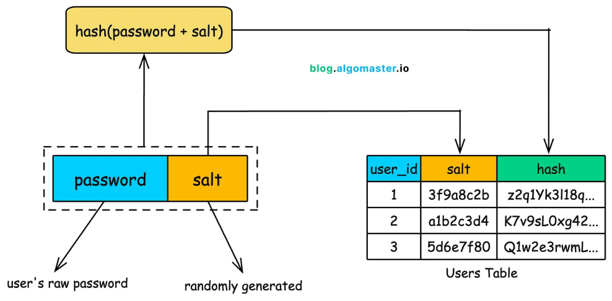
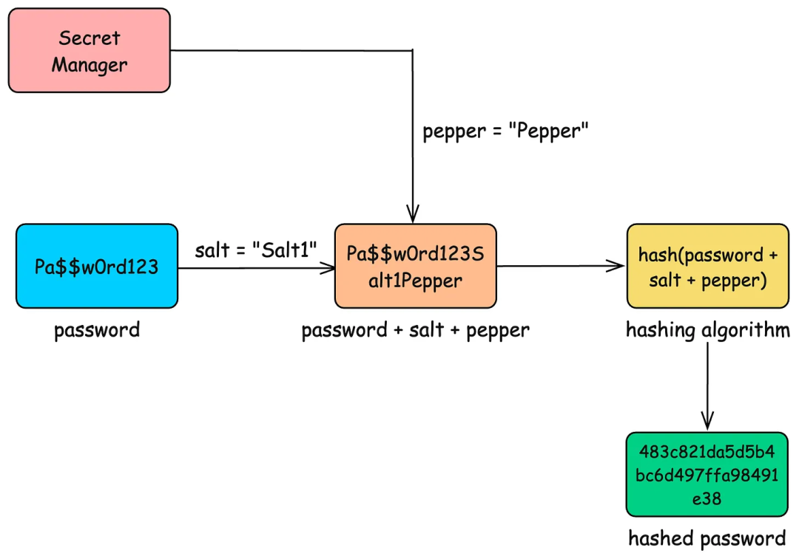

# 如何在数据库中安全地存储密码


> 原文地址: [https://mp.weixin.qq.com/s/NClb6m63CKuMw9qmQm6YLQ](https://mp.weixin.qq.com/s/NClb6m63CKuMw9qmQm6YLQ)

   
编辑

此图展示的是密码存储的安全机制：使用盐值（salt）结合哈希（hash）函数来保护用户密码。以下是图中步骤的解析和整体含义的解释。我将一步步分解图的元素，并说明其在实际应用中的作用。

  

### 1. **图的整体结构和步骤解析**

图从上到下描述了用户密码从输入到存储的过程，强调了“加盐哈希”的方法。以下是详细步骤：

  

-   **起点：hash(password + salt)**
    
     这是一个核心操作框，表示对“密码（password） + 盐值（salt）”的组合进行哈希计算。
    

-   步骤：用户输入原始密码（user's raw password），系统生成一个随机盐值（randomly generated）。然后，将密码和盐值拼接（通常是简单连接，如字符串相加）。
    
-   哈希函数的作用：哈希是一种单向加密算法（如SHA-256、bcrypt等），它将输入转换为固定长度的字符串（hash值），无法逆向还原原始输入。这确保了即使数据库被泄露，攻击者也无法直接看到明文密码。
    
      
    

  

-   **中间部分：password 和 salt 的拆分**

-   左侧蓝色框：**password**（密码），箭头指向“user's raw password”（用户的原始密码）。这表示密码来自用户输入，从不直接存储。
    
-   右侧橙色框：**salt**（盐值），箭头指向“randomly generated”（随机生成）。盐值是为每个用户独立生成的随机字符串（通常是16-32字节的随机数），目的是使相同密码的哈希结果不同。
    
-   步骤：
    
      
    

1.  用户注册或设置密码时，提供原始密码。
    
2.  系统立即生成一个唯一的随机盐值（例如，使用加密安全的随机数生成器，如Python的secrets模块）。
    
3.  将密码和盐值拼接（password + salt）。
    
4.  对拼接结果进行哈希计算，得到最终的hash值。
    
      
    

  

-   **底部：Users Table（用户表）**
    
     这是一个数据库表示例，包含列：user\_id（用户ID）、salt（盐值）、hash（哈希值）。
    

-   示例数据：
    
    user\_id
    
    salt
    
    hash
    
    1
    
    3f9a8c2b
    
    z2q1yK3l18q..
    
    2
    
    a1b2c3d4
    
    K7v9sLOxG42..
    
    3
    
    5d6e7f80
    
    Q1w2e3rwmL..
    
-   步骤：计算得到的hash值和对应的salt值一起存储在数据库中，与user\_id关联。原始密码在计算后立即丢弃，从不存储。
    
-   当用户登录时：系统取出该用户的salt，拼接用户输入的密码，进行相同哈希计算，然后比较结果与存储的hash是否匹配。
    
      
    

  

-   **箭头和流程：**

-   上部箭头从哈希操作指向password + salt的组合，表示哈希的输入。
    
-   下部箭头指向用户表，表示最终存储的结果。
    
-   整个流程从用户输入到数据库存储，形成一个安全的单向转换。
    
      
    

### 2. **图的含义和意义**

  

-   **核心含义**
    
    这是一种防御密码破解攻击的标准实践，称为“加盐哈希”（Salted Hashing）。它解决了单纯哈希的弱点：
    

-   如果只存储hash(password)，攻击者可以使用“彩虹表”（rainbow table）——预计算的常见密码哈希列表——快速破解。
    
-   通过添加独特盐值，即使两个用户密码相同（如“password123”），他们的哈希也会完全不同，因为盐值不同。这大大增加了破解难度，需要针对每个用户单独计算。
    
      
    

  

-   **安全意义：**

-   防止批量破解：盐值使预计算攻击（如彩虹表）无效化。
    
-   增强抵抗力：结合慢哈希函数（如bcrypt、Argon2），可以进一步抵御暴力破解（brute-force）和字典攻击。
    
-   实际应用：广泛用于网站、App的密码存储（如WordPress、Django框架）。
    
-   局限性：这不是万能的；用户仍需使用强密码，系统需保护数据库免于泄露。
    
-     
    

已经明确了两件事：

1.  哈希运算必须缓慢且具有适应性。
    
2.  必须对哈希值进行加盐处理，以防止预先计算和重复模式。
    

仅这两项措施就已经大大提高了安全门槛。但即便攻击者窃取了哈希值和盐值，还有一层额外的防御措施可以显著降低攻击的效用。

这额外的一层叫做**撒粉** 。

  
编辑

这张图表达的是：**不要把密码明文存数据库**，而是把用户输入的 _password_ 先和两个“配料”混合后再做**不可逆的密码哈希**，最后**只存哈希结果（以及盐和算法参数）**。

图中流程拆开讲就是：

1.  用户设置密码：`Pa$$wOrd123`（明文只在内存里短暂出现）
    
2.  系统为该用户生成 **salt（盐）**：例如 `Salt1`
    

-   salt 是每个用户唯一、随机的，一般直接和哈希一起存数据库
    
      
    

4.  系统从 \*\*Secret Manager（密钥/机密管理器）\*\*取出 **pepper（胡椒）**：例如 `Pepper`
    

-   pepper 是全局秘密（或分组秘密），**不进数据库**，放在环境变量/KMS/HSM/Secret Manager
    
      
    

6.  使用专门的密码哈希算法计算：`hash(password + salt + pepper)` → 得到 `483c...`
    
7.  数据库存：`salt`、`hash`、算法名和参数（以及版本）
    

* * *

## salt vs pepper：分别解决什么问题？

### Salt（盐）= “每个用户一把不同的调料”

-   作用：让同一个密码在不同用户上算出来的哈希也不同，**防彩虹表**、防“撞库时一眼看出哪些人用同密码”。
    
-   要点：**随机、足够长（比如 16 bytes 或 32 bytes）**，每个用户都不一样；可以明文存数据库。
    

### Pepper（胡椒）= “额外的一把隐藏钥匙”

-   作用：即使攻击者拿到了整个数据库（含盐+哈希），**没有 pepper 也很难离线爆破**（无法直接验证猜测）。
    
-   要点：**绝不能和数据库放一起**；最好放 KMS/HSM/Secret Manager；可以做 **pepper 轮换**（加 pepper\_id/version）。
    

> 注意：pepper 不是银弹——如果攻击者同时拿到了应用服务器/配置（能读到 pepper），那 pepper 的优势会打折。所以它是“额外防线”，不是唯一防线。

* * *

## 真正安全的关键：别用普通 hash（SHA256/MD5），要用“密码哈希”

图里写的是“hashing algorithm”，实际工程里必须是 **专门的慢哈希/内存硬哈希**，例如：

-   Argon2id（优先推荐）
    
-   bcrypt
    
-   scrypt
    
-   PBKDF2（在合规/旧系统里常见，但一般不如 Argon2id）
    

这些算法的特点是：**算得慢 / 吃内存**，让 GPU/ASIC 的暴力破解成本显著上升。单纯 `SHA-256(password+salt)` 这种太快了，数据库一旦泄露非常危险。

* * *

## 数据库里应该存什么？（推荐字段）

以用户表为例，常见存法：

-   password\_hash：算法输出（Base64/hex）
    
-   salt：随机盐（Base64）
    
-   algo：如 `argon2id`
    
-   params：如 `m=64MB,t=3,p=1` 或者拆成字段
    
-   pepper\_id：当前使用的 pepper 版本号（用于轮换/兼容多把 pepper）
    
-   hash\_version：你自己的格式版本（方便未来迁移）
    

**不存：**

-   明文密码
    
-   可逆加密后的密码（“加密存密码”通常也是坏主意；一旦密钥泄露就全军覆没）
    

* * *

## 登录校验怎么做？

用户登录输入密码后：

1.  从 DB 取 `salt`、`algo`、`params`、`pepper_id`、`password_hash`
    
2.  从 Secret Manager 取对应 `pepper`
    
3.  用同样算法再算一次哈希
    
4.  用 **常量时间比较**（constant-time compare）对比两段哈希是否一致
    

额外最佳实践：

-   登录接口做 **限速/锁定策略**、验证码、IP 风控，减少在线爆破
    
-   成功登录后如果发现参数过旧（例如 Argon2 参数太弱），可以 **“登录即升级”**：重新计算更强参数并更新 DB
    

* * *

## Pepper 怎么“正确地加进去”？

图里用的是拼字符串 `password + salt + pepper`，概念上对，但工程上建议更严谨：

-   使用明确的字节拼接/结构化编码，避免歧义：如 `len(password)||password||len(salt)||salt`
    
-   或用“带密钥”的形式：例如把 pepper 当 key 做 **HMAC/Keyed hashing**（具体做法与所选 KDF/库有关）
    
-   避免 pepper 直接写死在代码里；要能轮换、能审计、能分环境（dev/staging/prod）
    

* * *

## 最后一句：更好的方向

如果条件允许，优先上 **Passkey/WebAuthn** 或至少 **MFA**，这样就算密码体系再强，仍能进一步降低“密码被撞库/钓鱼”的风险。

## 一套 **Delphi + libsodium(Argon2id)** 的实用实现（代码可直接用）。

在 Delphi 里落地“安全存密码”（结合图里的 **salt + pepper + hash** 思路），推荐用这套组合：

-   算法：Argon2id（首选）/ bcrypt / scrypt（都行，但 Argon2id更现代）
    
-   salt：由算法库自动生成并写进“哈希字符串”（只存一列 hash 就够）
    
-   pepper：放在 **Secret Manager/环境变量/DPAPI 配置**里，**不进数据库**
    

## 1) 数据库字段设计（最省事、最常用）

```
-- PostgreSQL 示例alter table users  add column password_hash text not null,  add column pepper_id smallint not null default 1,  add column password_updated_at timestamptz not null default now();
```

  

`password_hash` 建议直接存 libsodium 生成的“PHC 字符串”，里面已经包含 **salt + 参数 + 哈希结果**，类似：  
`$argon2id$v=19$m=65536,t=2,p=1$...$...`

`   `

* * *

## 2) Pepper 放哪？（Delphi 实际做法）

最简单可用的方式（生产上也常见）：

-   Windows 服务/桌面程序：从 **环境变量**读 `APP_PEPPER_V1`
    
-   或者：把 pepper 用 **DPAPI** 加密后落到配置文件（解密只在本机/当前用户可用）
    
-   更高级：上云 KMS / Key Vault / HSM（你以后再升级也不影响 DB 结构）
    

pepper **务必可轮换**：比如 V1/V2 两把。

  

* * *

## 3) Delphi 代码（libsodium + HMAC(pepper, password) + Argon2id）

思路：不要直接 `password+salt+pepper` 拼字符串（容易出编码/歧义坑），而是：

> `pwdKey = HMAC-SHA256(pepper, UTF8(password))`  
> 把 `pwdKey` 当作“输入密码”交给 Argon2id 生成最终 `password_hash`

这样 pepper 永远不进 DB，又不会出现字符串拼接歧义。

> 依赖：`libsodium.dll` 放到程序同目录（或 PATH）  
> Delphi 自带 `System.Hash`（用于 HMAC-SHA256）

### PasswordHashing.pas

```
unit PasswordHashing;interfaceuses  System.SysUtils, System.Classes, System.Hash;typeEPasswordHash = class(Exception);  TPasswordHasher = recordpublicclassfunctionHashPassword(const Password: string; const Pepper: TBytes;      OpsLimit: UInt64 = 0; MemLimit: NativeUInt = 0):string; static;classfunctionVerifyPassword(const Password: string; const Pepper: TBytes;const StoredHash: string): Boolean; static;classfunctionNeedsRehash(const StoredHash: string;      OpsLimit: UInt64 = 0; MemLimit: NativeUInt = 0): Boolean; static;end;implementationconst// libsodium constants (常用默认值；也可直接传 0 用库内置 interactive)  crypto_pwhash_STRBYTES = 128;// 这些值来自 libsodium 的“交互式”建议（不同版本可能略有差异）// 你也可以不硬编码：OpsLimit/MemLimit 传 0，即使用你自己系统的默认策略。  OPSLIMIT_INTERACTIVE: UInt64 = 2;  MEMLIMIT_INTERACTIVE: NativeUInt = 67108864; // 64MBfunctionsodium_init: Integer; cdecl; external'libsodium.dll';functioncrypto_pwhash_str(outStr: PAnsiChar; const passwd: PAnsiChar; passwdlen: UInt64;  opslimit: UInt64; memlimit: NativeUInt): Integer; cdecl; external'libsodium.dll';functioncrypto_pwhash_str_verify(const str: PAnsiChar; const passwd: PAnsiChar; passwdlen: UInt64): Integer; cdecl;external'libsodium.dll';functioncrypto_pwhash_str_needs_rehash(const str: PAnsiChar; opslimit: UInt64; memlimit: NativeUInt): Integer; cdecl;external'libsodium.dll';procedureSecureZero(var B: TBytes);beginif Length(B) > 0then    FillChar(B[0], Length(B), 0);  SetLength(B, 0);end;functionUtf8Bytes(const S: string): TBytes;begin  Result := TEncoding.UTF8.GetBytes(S);end;functionHmacSha256(const Key, Msg: TBytes): TBytes;begin// System.Hash: 返回原始 bytes  Result := THashSHA2.GetHMACAsBytes(Msg, Key);end;classfunctionTPasswordHasher.HashPassword(const Password: string; const Pepper: TBytes;  OpsLimit: UInt64; MemLimit: NativeUInt):string;var  pwdUtf8, pwdKey: TBytes;  outBuf: array[0..crypto_pwhash_STRBYTES-1] of AnsiChar;  rc: Integer;beginif sodium_init < 0thenraise EPasswordHash.Create('libsodium init failed');if OpsLimit = 0then OpsLimit := OPSLIMIT_INTERACTIVE;if MemLimit = 0then MemLimit := MEMLIMIT_INTERACTIVE;  pwdUtf8 := Utf8Bytes(Password);try    pwdKey := HmacSha256(Pepper, pwdUtf8);  // 32 bytestry      FillChar(outBuf, SizeOf(outBuf), 0);      rc := crypto_pwhash_str(@outBuf[0], PAnsiChar(AnsiString(TEncoding.ANSI.GetString(pwdKey))),                              UInt64(Length(pwdKey)), OpsLimit, MemLimit);if rc <> 0thenraise EPasswordHash.Create('crypto_pwhash_str failed (out of memory?)');// outBuf 是以 #0 结尾的 C 字符串（PHC 格式）      Result := string(AnsiString(@outBuf[0]));finally      SecureZero(pwdKey);end;finally    SecureZero(pwdUtf8);end;end;classfunctionTPasswordHasher.VerifyPassword(const Password: string; const Pepper: TBytes;const StoredHash: string): Boolean;var  pwdUtf8, pwdKey: TBytes;  rc: Integer;  hashAnsi: AnsiString;beginif sodium_init < 0thenraise EPasswordHash.Create('libsodium init failed');  pwdUtf8 := Utf8Bytes(Password);try    pwdKey := HmacSha256(Pepper, pwdUtf8);try      hashAnsi := AnsiString(StoredHash);      rc := crypto_pwhash_str_verify(PAnsiChar(hashAnsi),             PAnsiChar(AnsiString(TEncoding.ANSI.GetString(pwdKey))),             UInt64(Length(pwdKey)));      Result := (rc = 0);finally      SecureZero(pwdKey);end;finally    SecureZero(pwdUtf8);end;end;classfunctionTPasswordHasher.NeedsRehash(const StoredHash: string;  OpsLimit: UInt64; MemLimit: NativeUInt): Boolean;var  rc: Integer;  hashAnsi: AnsiString;beginif sodium_init < 0thenraise EPasswordHash.Create('libsodium init failed');if OpsLimit = 0then OpsLimit := OPSLIMIT_INTERACTIVE;if MemLimit = 0then MemLimit := MEMLIMIT_INTERACTIVE;  hashAnsi := AnsiString(StoredHash);  rc := crypto_pwhash_str_needs_rehash(PAnsiChar(hashAnsi), OpsLimit, MemLimit);  Result := (rc <> 0); // 1=needs rehash, 0=no, -1=invalidend;end.
```

  

> 说明：

-   StoredHash 就是一段字符串，DB 存它即可（salt/参数内嵌）
    
-   VerifyPassword 内部已经是“安全比较”，不用你自己 constant-time compare
    
-   NeedsRehash 让你实现“登录即升级”：参数变强后，下次登录就重新 Hash 再更新 DB
    

  

* * *

## 4) Pepper 轮换怎么做（工程上必须考虑）

DB 增加 `pepper_id`：

-   注册/改密：使用最新 pepper（比如 id=2），写入 `pepper_id=2`
    
-   登录校验：按 `pepper_id` 取对应 pepper 验证
    
-   轮换策略：保留旧 pepper 一段时间（允许老 hash 登录后自动升级到新 pepper）
    

  

* * *

## 5) 你必须避免的坑（很常见）

1.  不要用 SHA256/MD5 存密码（太快，泄露就完）
    
2.  不要可逆加密存密码（密钥泄露就全破）
    
3.  salt 必须每用户随机（libsodium 已帮你做好）
    
4.  pepper 不要写死在代码里（至少环境变量/DPAPI）
    
5.  登录加限速/锁定/风控，否则在线爆破照样危险