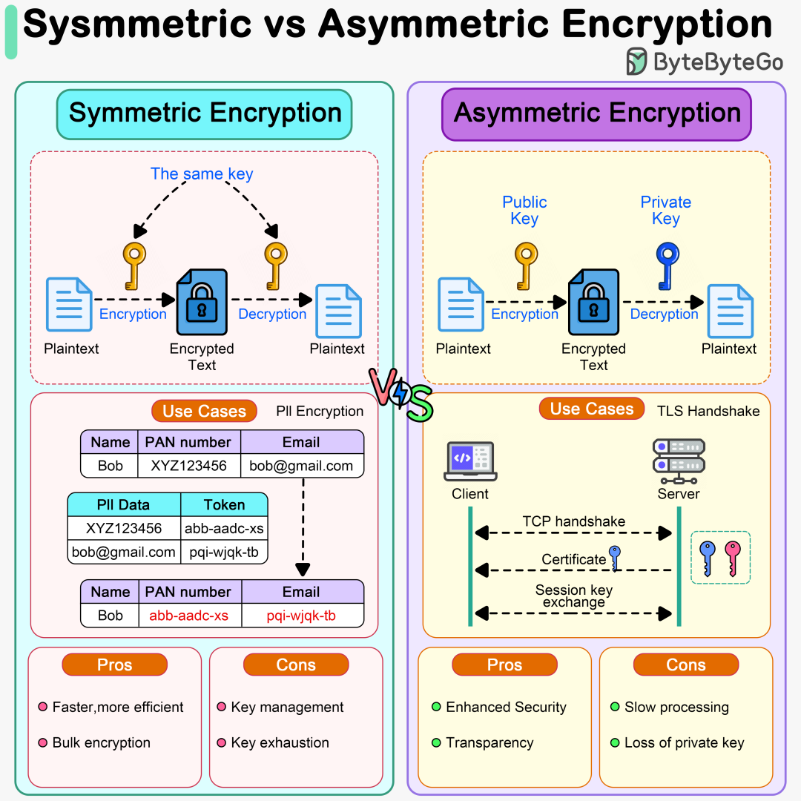

# 对称加密与非对称加密

原创 sonadorje AI之Myth 2025-12-15 08:43 云南

> 原文地址: [https://mp.weixin.qq.com/s/ELlGNARUxzvDudn\_oZj-EQ](https://mp.weixin.qq.com/s/ELlGNARUxzvDudn_oZj-EQ)



### 图片内容分析

提供的图片是一张信息图（infographic），由ByteByteGo制作，标题为“Symmetric vs Asymmetric Encryption”。它以视觉方式对比了对称加密（Symmetric Encryption）和非对称加密（Asymmetric Encryption）的原理、用例、优缺点。图片采用左右分栏布局，左侧为对称加密，右侧为非对称加密，使用图标、流程图和表格来阐述内容。整体色调以蓝色、橙色为主，风格简洁明了，便于理解加密概念。

  

-   **左侧（对称加密部分）**
    
      
    
    -   原理图：展示使用同一个密钥（The same key）进行加密和解密的过程。流程为：明文（Plaintext） → 使用密钥加密 → 密文（Encrypted Text） → 使用相同密钥解密 → 明文。图标中有一个锁和两个相同的钥匙，强调密钥共享。
        
    -   用例：以“PII Encryption”（个人身份信息加密）为例，展示一个表格，其中包括姓名（Name）、PAN号码（类似于身份证号）和电子邮件（Email）。原始数据如Bob的PAN“XYZ123456”和邮箱“bob@gmail.com”被加密为“XY Z123456 abb-aadc-xs”和“bob@gmail.com pqi-wjqk-tb”。加密后表格显示了混淆后的值，箭头指向加密过程，强调对敏感数据的保护。
        
          
        
    -   **优缺点**
        
        -   Pros（优点）：Faster, more efficient（更快、更高效）；Bulk encryption（适合批量加密）。
            
        -   Cons（缺点）：Key management（密钥管理复杂）；Key exhaustion（密钥耗尽，可能指密钥重复使用导致的安全风险或疲劳）。
            
        

-   **右侧（非对称加密部分）：**

-   原理图：展示使用公钥（Public Key）和私钥（Private Key）配对。流程为：明文 → 使用公钥加密 → 密文 → 使用私钥解密 → 明文。图标中公钥为橙色、私钥为蓝色，强调公钥可公开分享，私钥需保密。
    
-   用例：以“TLS Handshake”（TLS握手）为例，展示客户端（Client）和服务器（Server）之间的交互。流程包括TCP握手、证书交换（Certificate）和会话密钥交换（Session key exchange）。箭头表示双向通信，强调安全建立连接。
    
-   优缺点
    
    -   **Pros（优点）**
        
        Enhanced Security（增强安全性）；Transparency（透明性，可能指公钥的公开和可验证性）。
        
    
      
    
    -   **Cons（缺点）**
        
        Slow processing（处理速度慢）；Loss of private key（私钥丢失风险）。 
        
    

图片中间有“Vs.”标记分隔两侧，底部有 pros/cons 的橙色圆形标签。整体设计突出对比，帮助初学者快速把握加密类型差异。注意，图片中对称加密的用例聚焦于数据存储/传输的简单加密，而非对称加密强调安全密钥交换的场景。一些术语如“Key exhaustion”可能是个简化或笔误，通常讨论中更多指“Key exchange problem”（密钥交换问题）。

### 对称加密与非对称加密的区别

对称加密和非对称加密是现代密码学中的两大核心类型，它们在密钥使用、性能、安全性和应用场景上存在显著差异。以下从多个维度进行对比，使用表格便于清晰呈现：

方面

对称加密 (Symmetric Encryption) 

非对称加密 (Asymmetric Encryption) 

**密钥机制**

使用单一密钥（共享密钥）进行加密和解密。双方必须事先安全共享同一密钥。

使用密钥对：公钥（公开分享，用于加密）和私钥（保密，用于解密）。公钥可自由分发，无需共享私钥。

**工作原理**

加密和解密过程对称，使用相同算法和密钥。常见算法如AES、DES。

加密和解密不对称，基于数学难题（如大数因子分解或椭圆曲线）。常见算法如RSA、ECC。

**性能**

更快、更高效，适合处理大量数据（bulk encryption）。计算开销低。

较慢，计算密集型，尤其在密钥生成和操作时。适合小数据量或密钥交换。

**安全性**

安全性依赖密钥保密。如果密钥泄露，整个系统易受攻击。密钥交换是主要弱点（需安全通道）。

更高安全性，公钥可公开，无需安全交换。私钥泄露仅影响一方。支持数字签名和身份验证。

**用例**

数据存储加密（如文件、数据库中的PII）、VPN隧道、对称会话密钥（如在TLS中使用AES）。图片中示例：加密个人敏感信息表格。

安全密钥交换（如TLS/SSL握手）、数字证书、电子签名、HTTPS。图片中示例：客户端-服务器证书和会话密钥交换。

**优点**

\- 速度快，资源消耗低。 - 适合实时加密（如视频流）。 图片中：Faster, more efficient; Bulk encryption。

\- 解决密钥分发问题。 - 支持身份认证和不可否认性。 图片中：Enhanced Security; Transparency。

**缺点**

\- 密钥管理复杂（如何安全分发？）。 - 密钥耗尽或重复使用风险（易被破解）。 图片中：Key management; Key exhaustion。

\- 处理慢，不适合大文件。 - 私钥丢失导致永久问题。 图片中：Slow processing; Loss of private key。

**实际应用结合**

常与非对称加密结合使用：用非对称交换对称密钥，然后用对称进行高效传输。

作为“入口”机制，确保初始通信安全。

总体而言，对称加密强调效率，适用于内部或已信任环境下的数据保护，但密钥分发是瓶颈（如图片中隐含的共享密钥箭头）。非对称加密则解决了这一痛点，通过公私钥实现安全通信，但牺牲了速度（如图片中TLS握手的复杂流程）。在实践中，二者往往互补，例如HTTPS先用RSA（非对称）交换AES密钥（对称），平衡安全与性能。图片很好地捕捉了这些本质区别，但简化了某些概念（如忽略量子计算对非对称加密的潜在威胁）。

基于之前的讨论，对称加密（如AES）和非对称加密（如RSA）在实际应用中常常通过编程实现。下面我将提供Python代码示例，展示如何使用这些加密类型。注意，这些示例依赖于第三方库（如cryptography或pycryptodome），这些库在标准Python环境中需要安装（例如，通过pip install cryptography）。我选择了简单且实用的示例，来源于可靠来源，并进行了轻微调整以确保清晰性。示例包括密钥生成、加密和解密过程。

#### 对称加密示例：使用AES-256-GCM

AES是常见的对称加密算法，这里使用GCM模式（Galois/Counter Mode），它提供加密和认证（防止篡改）。这个示例加密一个消息，然后解密它。GCM模式需要一个密钥（对称的）和一个随机nonce（类似于IV，不能重复使用）。

Python

```
from cryptography.hazmat.primitives.ciphers import Cipher, algorithms, modesfrom cryptography.hazmat.primitives import paddingfrom cryptography.hazmat.backends import default_backendimport os# 生成一个随机的256位密钥（32字节）key = os.urandom(32)# 要加密的消息plaintext = b"This is a secret message."# 生成一个随机的nonce（12字节推荐用于GCM）nonce = os.urandom(12)# 创建加密器algorithm = algorithms.AES(key)mode = modes.GCM(nonce)cipher = Cipher(algorithm, mode, backend=default_backend())encryptor = cipher.encryptor()# 加密消息（GCM不需要填充，但如果需要可以添加）ciphertext = encryptor.update(plaintext) + encryptor.finalize()tag = encryptor.tag  # 认证标签，用于验证完整性print("Ciphertext:", ciphertext.hex())print("Tag:", tag.hex())# 解密过程decryptor = cipher.decryptor()decrypted = decryptor.update(ciphertext) + decryptor.finalize()# 验证标签（如果篡改，会抛出异常）decryptor.verify(tag)print("Decrypted:", decrypted.decode('utf-8'))
```

  

**解释**：

-   密钥管理：使用相同的密钥进行加密和解密，这是对称加密的核心。
    
-   安全性：GCM提供内置认证，防止中间人攻击。如果标签不匹配，解密会失败。
    
-   输出示例：运行时，ciphertext 和 tag 会是随机的十六进制字符串，解密后恢复原消息。
    
-   注意：在生产环境中，使用安全的密钥存储（如环境变量或密钥管理服务），并确保nonce不重复。密钥长度为256位，提供高安全性，但计算稍慢。
    

这个示例基于cryptography库的文档和Nakov的实用加密书籍，适合批量数据加密，如文件或数据库字段（类似于图片中的PII加密用例）。

#### 非对称加密示例：使用RSA-OAEP

RSA是非对称加密的经典算法，使用公钥加密、私钥解密。这里生成一个2048位密钥对（推荐最小长度），然后加密/解密消息。使用OAEP填充（Optimal Asymmetric Encryption Padding）来增强安全性。

Python

```
from cryptography.hazmat.primitives.asymmetric import rsa, paddingfrom cryptography.hazmat.primitives import hashesfrom cryptography.hazmat.backends import default_backend# 生成RSA密钥对（2048位，公钥指数65537是标准值）private_key = rsa.generate_private_key(    public_exponent=65537,    key_size=2048,    backend=default_backend())public_key = private_key.public_key()# 要加密的消息（RSA适合小数据，如密钥交换）plaintext = b"This is a secret message."# 使用公钥加密（OAEP填充，使用SHA-256）ciphertext = public_key.encrypt(    plaintext,    padding.OAEP(        mgf=padding.MGF1(algorithm=hashes.SHA256()),        algorithm=hashes.SHA256(),        label=None    ))print("Ciphertext:", ciphertext.hex())# 使用私钥解密decrypted = private_key.decrypt(    ciphertext,    padding.OAEP(        mgf=padding.MGF1(algorithm=hashes.SHA256()),        algorithm=hashes.SHA256(),        label=None    ))print("Decrypted:", decrypted.decode('utf-8'))
```

  

**解释**：

-   密钥机制：公钥用于加密（可公开分享），私钥用于解密（必须保密）。这解决了对称加密的密钥分发问题。
    
-   性能：RSA较慢，适合小数据（如加密对称密钥），不适合大文件。图片中的TLS握手用例中，RSA常用于初始会话密钥交换。
    
-   输出示例：ciphertext 是随机的长十六进制字符串，解密恢复原消息。
    
-   注意：密钥大小越大越安全，但生成和操作越慢。实际中，结合对称加密使用：用RSA加密AES密钥，然后用AES加密数据。
    

这个示例来源于cryptography文档和Nakov的书籍，适用于场景如安全邮件或证书签名。

#### 混合使用示例：RSA + AES

在实践中，常结合两者：用RSA交换AES密钥，然后用AES进行高效加密。这平衡了安全性和性能。

Python

```
# 延续以上代码...# 生成AES密钥aes_key = os.urandom(32)# 用RSA公钥加密AES密钥encrypted_aes_key = public_key.encrypt(    aes_key,    padding.OAEP(        mgf=padding.MGF1(algorithm=hashes.SHA256()),        algorithm=hashes.SHA256(),        label=None    ))# 用AES加密大消息nonce = os.urandom(12)cipher = Cipher(algorithms.AES(aes_key), modes.GCM(nonce), backend=default_backend())encryptor = cipher.encryptor()large_ciphertext = encryptor.update(b"A large secret file content.") + encryptor.finalize()tag = encryptor.tag# 解密：先用RSA私钥解密AES密钥，然后用AES解密数据decrypted_aes_key = private_key.decrypt(    encrypted_aes_key,    padding.OAEP(        mgf=padding.MGF1(algorithm=hashes.SHA256()),        algorithm=hashes.SHA256(),        label=None    ))decryptor = Cipher(algorithms.AES(decrypted_aes_key), modes.GCM(nonce), backend=default_backend()).decryptor()decrypted_large = decryptor.update(large_ciphertext) + decryptor.finalize()decryptor.verify(tag)print("Decrypted large message:", decrypted_large.decode('utf-8'))
```

  

**解释**：这模拟了HTTPS/TLS的流程（图片右侧用例）：非对称用于密钥交换，对称用于数据传输。优点：安全密钥分发 + 高效加密。

这些示例是基础的；对于生产代码，添加错误处理、密钥存储（如PEM格式导出）和随机性来源。

### ECDSA 签署示例

谈谈ECDSA的基本原理  
椭圆曲线数字签名算法 (ECDSA) 是数字签名算法 (DSA) 的一种变体，它使用椭圆曲线密码学进行数字签名。它是非对称的，这意味着它使用私钥进行签名，使用公钥进行验证。由于其高效性和强大的安全性，且密钥长度比 RSA 更短，ECDSA 被广泛应用于加密货币（例如比特币）、TLS 证书和安全消息传递等领域。

  
这里提供一个使用 ecdsa 库（可在多种环境下使用）的完整 Python 示例。这段代码在 SECP256k1 曲线（区块链中常用）上生成 ECDSA 密钥对，首先对消息进行哈希处理（因为 ECDSA 对哈希值而非原始数据进行签名），然后验证签名。为了便于说明，我附上了实际执行的示例输出——请注意，每次运行生成的密钥和签名都是随机的。

Python

`from ecdsa import SigningKey, VerifyingKey, SECP256k1   import hashlib      _# Generate a new private key on the SECP256k1 curve_   sk = SigningKey.generate(curve=SECP256k1)      _# Derive the public key from the private key_   vk = sk.verifying_key      _# Message to sign (as bytes)_   message = b"This is a message to sign."      _# Hash the message using SHA-256 (ECDSA requires a hash of the message)_   message_hash = hashlib.sha256(message).digest()      _# Sign the hash with the private key_   signature = sk.sign(message_hash)      _# Output the results_   print("Private Key (hex):", sk.to_string().hex())   print("Public Key (hex):", vk.to_string().hex())   print("Message:", message.decode())   print("Message Hash (hex):", message_hash.hex())   print("Signature (hex):", signature.hex())      _# Verify the signature using the public key_   try:       vk.verify(signature, message_hash)       print("Verification: Signature is valid.")   except:       print("Verification: Signature is invalid.")`

#### 示例输出

文本

`Private Key (hex): 38797a7b295b649742e477f6a2437fc6d00041eb94edf97e0b4542d345ca9806   Public Key (hex): 02a722cfda0264f45bbce60bf1382ae50a47e6f65bfbb75836fdb1303272674f37cfb2ffff5644459d5072fe2c901355b8fd034112d448351bdd64ba01b4d696   Message: This is a message to sign.   Message Hash (hex): 1bf4629fd0ad245999779b8e64b75cec686aff9d4897609ab1e47fc6f0020aff   Signature (hex): 22e36ae6540aaf6a363ec7864d00db2f3e969a04c8fef626790553dbfb1ccc924954e6550c6d040a8aa4173e7f6ae75c7e22624ddf7a430673dac0d11b781e69   Verification: Signature is valid.`

#### 关键解释

-   密钥生成：私钥是随机生成的，公钥则通过数学方法从私钥推导而来。SECP256k1 使用 256 位密钥提供 128 位安全性。
    
-   哈希：在签名之前，务必对消息进行哈希处理（例如，使用 SHA-256），因为 ECDSA 处理的是固定大小的输入。
    
-   签名：使用私钥生成签名（对于此曲线，通常为 70-72 字节）。
    
-   验证：使用公钥检查签名是否与哈希值匹配。如果消息或签名被篡改，验证将失败。
    
-   安全提示：切勿重复使用 nonce 值（由库内部处理），务必妥善保管私钥，并使用安全的随机数生成器。在生产环境中，为确保互操作性，请将密钥导出为 PEM 等格式。
    

### EdDSA 签名示例

谈谈EdDSA的基本原理  
EdDSA（Edwards 曲线数字签名算法）是一种基于扭曲 Edwards 曲线的现代非对称签名方案，具有强大的安全性、高性能和抗侧信道攻击能力。它常用于 SSH、Signal 和加密货币（例如 Solana）等协议中。其标准实现是 Ed25519，它使用 Curve25519 椭圆曲线。

这里提供一个使用 cryptography 库（一种安全且标准的选择）的完整 Python 示例。这段代码生成一个 Ed25519 密钥对，直接对消息进行签名（Ed25519 内部集成了安全哈希算法），并验证签名。我附上了实际运行的示例输出——请注意，密钥和签名都是随机生成的，每次运行都会有所不同。

Python

`from cryptography.hazmat.primitives.asymmetric.ed25519 import Ed25519PrivateKey, Ed25519PublicKey      _# Generate a new private key_   private_key = Ed25519PrivateKey.generate()      _# Derive the public key_   public_key = private_key.public_key()      _# Message to sign (as bytes)_   message = b"This is a message to sign."      _# Sign the message directly (Ed25519 is deterministic and secure)_   signature = private_key.sign(message)      _# Output the results_   print("Private Key (hex):", private_key.private_bytes_raw().hex())   print("Public Key (hex):", public_key.public_bytes_raw().hex())   print("Message:", message.decode())   print("Signature (hex):", signature.hex())      _# Verify the signature_   try:       public_key.verify(signature, message)       print("Verification: Signature is valid.")   except:       print("Verification: Signature is invalid.")`

#### 示例输出

文本

`Private Key (hex): 1b1e05e724c7c3b61951ad2df65d97c14ea3c4bc5586baab321e44015187a4d6   Public Key (hex): 75f81e87e47b037126aae3094854322ff2194d60fc05cc132cc13c08fe23f497   Message: This is a message to sign.   Signature (hex): 15e3b6062e9e2c3daee9eca7b39cc835b744b5454cb46d40c6b5e8bbb74eaf554bf28a22ab8fd7e6d2f1a8e50bed0578b50a73b9e4293c98ae27a2220ae8c200   Verification: Signature is valid.`

#### 关键解释

-   密钥生成：私钥是一个 32 字节的随机种子；公钥（也是 32 字节）是通过数学方法推导出来的。
    
-   签名：Ed25519 对消息进行确定性签名（不使用随机数，与 ECDSA 相比降低了滥用风险）。它内部使用 SHA-512 进行哈希运算。
    
-   验证：使用公钥确认签名的有效性。如果消息发生更改，则验证失败。
    
-   与 ECDSA 相比的优势：速度更快，密钥更小，对实现缺陷（例如，nonce 问题）的安全性更高。
    
-   安全提示：始终使用安全的随机密钥生成方法。务必对私钥保密。对于超长消息或特定用途，请考虑使用 Ed25519ph 变体（已预先使用 SHA-512 哈希算法处理）。密钥可以导出为 PEM 等格式，以实现互操作性。
    

  
本示例基于官方密码学文档。