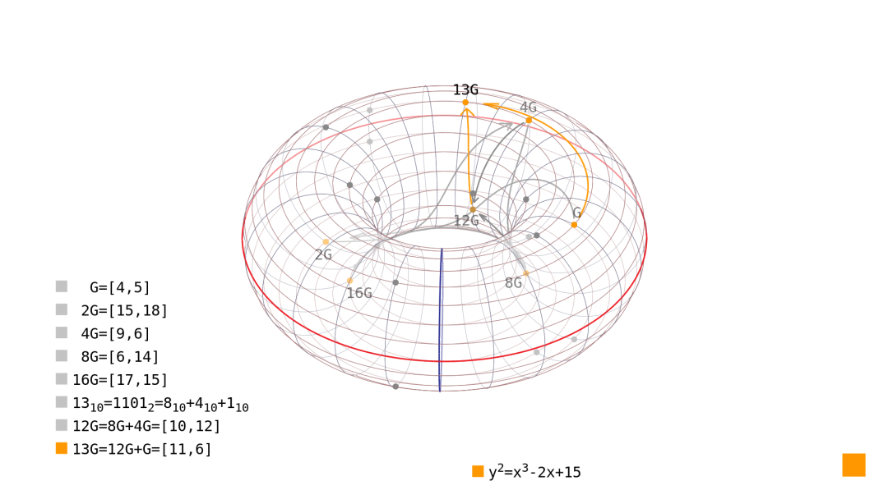
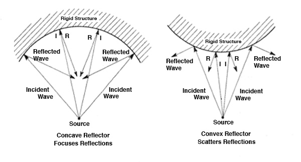
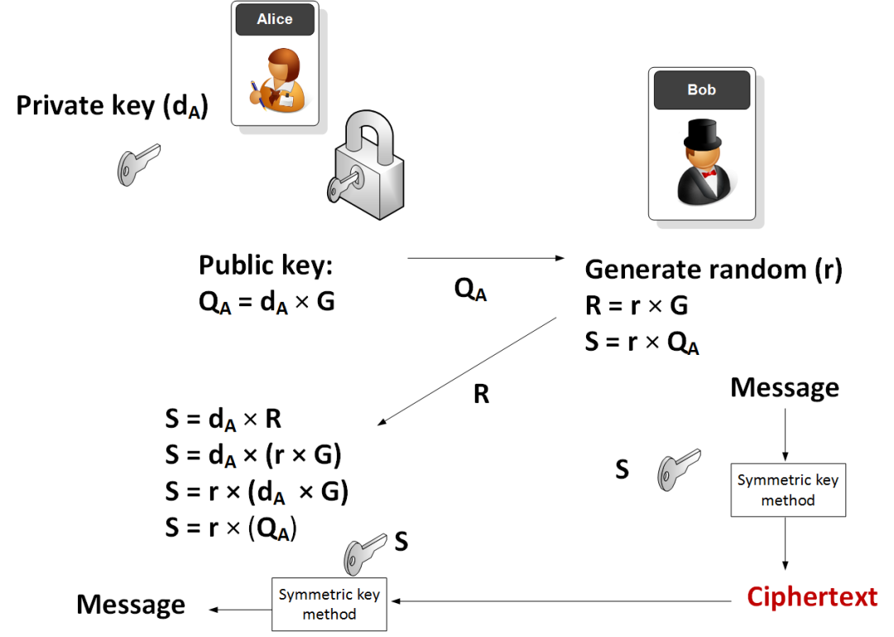
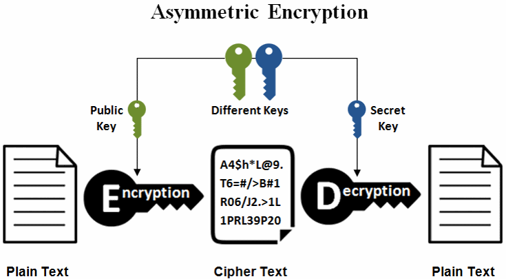

# 椭圆曲线中的生成元（基点）

> 原文地址: [https://mp.weixin.qq.com/s/ivVe8qT77Iq3kI27fZjaJg](https://mp.weixin.qq.com/s/ivVe8qT77Iq3kI27fZjaJg)

### 什么是椭圆曲线？

想象一下，椭圆曲线就像一个特殊的“环形轨道”，它不是圆的，而是根据一个数学公式画出来的曲线。常见的公式是 y² = x³ + ax + b，其中 a 和 b 是固定数字。这个曲线对称，看起来像一个躺着的“8”字或一个弯曲的椭圆。在密码学中，我们通常在有限的数字范围内使用它（比如有限域），但为了直观，我们先看实数上的样子。

编辑

这张图展示了一个典型的椭圆曲线。你可以看到它上下对称，点可以在上面“滑动”。

在线生成椭圆曲线

### 生成元（Generator）和基点（Base Point）是什么？

生成元G是这个数学王国的“起源种子”，就像一颗小小的橡树种子，埋在土壤（曲线）里，通过反复“浇水倍增”（加法），瞬间长成参天大树，枝叶覆盖整个森林（群中的所有点）。从1G起步，2G像幼苗破土，3G枝繁叶茂……直到nG抵达“永恒之境”（无穷远点，像树的生命周期结束）。这比喻一个病毒的起点：从一个细胞感染开始，指数级复制，征服整个系统，但逆向追踪源头难如大海捞针。

在密码学里，G是“超级英雄的起源之光”：私钥k是英雄的成长历程，公钥kG是成熟的守护者。计算容易如英雄变身，反推k则像破解时间旅行悖论。

生成元，也叫基点，通常用G表示。它是椭圆曲线上的一个特殊点，就像“起点”或“种子”。为什么特殊？因为通过反复“加”自己（叫标量乘法），你可以生成曲线上的所有点（在有限域下，形成一个有限群）。

比如：

-   1G = G（自己）
    
-   2G = G + G
    
-   3G = 2G + G
    
-   以此类推，直到一个很大的数nG = O（无穷远点，相当于0）。
    

这就像用一个起点，通过倍增，覆盖整个轨道。n很大时（比如），计算公钥kG很容易，但从结果要反推出k却很难——这就是密码学的安全基础，比如比特币的公钥生成。

**生成元不是随便选的，它必须满足某些条件：生成的群足够大，且没有小因子，便于安全使用**。

  
编辑

这张图是在用一个“玩具椭圆曲线”上的基点（生成元）G来演示：点如何通过“反复相加”生成整个群，以及标量乘法（kG）怎么用 double-and-add（二进制快速加法）算出来。

* * *

## 1) 图里是什么曲线？点在哪个“世界”里？

右下角给了曲线方程：

但图中点坐标是 `[4,5]、[15,18]...` 这种小整数，并且出现了 18、17 之类的值，说明这是在**有限域**里做运算（ECC 常用的那种），这里实际上是在：

-   模 23 的有限域 上（因为把这些点代入方程并对 23 取模能对上）
    

所以“加法”不是普通实数平面里的几何，而是 **所有计算都 mod 23** 的群运算。

* * *

## 2) 椭圆曲线的群：单位元、加法、倍点

在 ECC 里，一条椭圆曲线上的点集合再加上一个特殊点：

-   无穷远点（Point at Infinity）= **单位元**（相当于 0）
    

就组成一个群。群运算写成 P+Q。

-   G 是一个点（图里给：**G = \[4,5\]**）
    
-   2G=G+G
    
-   4G=2G+2G
    
-   8G=4G+4G
    
-   ……
    

图左侧列出了这些倍点结果（都在 mod 23 意义下）：

-   G=\[4,5\]
    
-   2G=\[15,18\]
    
-   4G=\[9,6\]
    
-   8G=\[6,14\]
    
-   16G=\[17,15\]
    

这些就是“沿着群结构走路”的脚印。

* * *

## 3) 什么叫生成元（基点）？

### 定义（核心）

一个点 G 如果满足：反复相加得到的集合

能覆盖一个循环子群，那么 G就是这个子群的**生成元**。

最关键的量叫 **阶（order）**：

-   G的阶 n：最小的正整数 n使得     
    

如果这个子群的大小刚好等于整条曲线群的大小，那 G就是**整个群的生成元**。

### 这张图里发生了什么？

这条玩具曲线在 上的点总数（含 ）就是 **23**，而图里的基点 G=\[4,5\]的阶也正好是 **23**。因此：

-   G 在这里就是“整群生成元”  
      也就是：从 G 出发，算 G,2G,3G,… 会把所有点（以及 ）走一遍，然后回到起点。
    

这就是“生成元/基点”这个词的直观含义：**一把钥匙开一串门，最终把整个循环走完。**

* * *

## 4) 图中橙色路径：13G 是怎么从 G 算出来的？

图左侧写了：

  

这就是 ECC 标量乘法的经典技巧：把 k写成二进制，然后只做“倍点（doubling）+少量加法”。

图里按这个思路算：

1.  先倍点得到：G,2G,4G,8G,16G
    
2.  因为 13=8+4+1，所以：
    

-   12G=8G+4G=\[10,12\]
    
-   13G=12G+G=\[11,6\]
    
      
    

图中的橙色箭头/弧线就是在强调这条“组合路径”。

* * *

## 5) 为什么 ECC 要选“基点 G”？

真实密码学里不会用这么小的域（这只是教学演示），但逻辑完全一致：

-   私钥：随机选一个大整数 d
    
-   公钥：Q=dG
    

安全性来自：给你G 和 Q，要反推 d 很难（椭圆曲线离散对数问题）。

因此工程上会选一个**公开固定的基点 G**，并确保它所在子群的阶 n很大且通常为大素数。

### 为什么重要？在密码学中的应用

在椭圆曲线密码学（ECC）中，基点G是标准化的（比如secp256k1曲线用于比特币）。你的私钥k乘以G得到公钥K = kG。别人知道K和G，但猜不出k，因为“反向”计算超级难（离散对数问题）。

简单说，它像一个单向门：进去容易，出来难。这让加密、签名变得安全又高效，比RSA用更小的密钥。

生成元G就像赛道的“起点旗帜”或“魔法种子”，一个特殊的起点点。从这里开始，你可以反复“倍增”自己，就像滚雪球一样越滚越大：1G是起点，2G是跳一步，3G再跳……直到覆盖整个赛道的所有点。这像一个探险家从营地出发，通过步步前进（加法），探索整个地图，但地图是循环的，最终回到“无穷远”（像地平线上的零点）。

另一个比喻：G是“钥匙模具”，私钥k是转动次数，公钥是转动后的锁位。计算kG像顺时针转锁容易，但逆推k像破解迷宫超级难。或者像DNA序列，从一个基因生成整个生物体，但反推原始基因难如登天。在比特币里，G是标准起点，你的钱包私钥乘G得到地址，就像从种子长出整棵树。

  
编辑

这张图像一个声音波或路径交互，想象生成元像起点声波，在曲线环境中扩散生成新点。

生成元选择像挑种子：必须强壮，能长出大树（大群），没有弱点让坏人轻易砍倒。

ECC像一个高效的“隐形堡垒”：用小钥匙（短位数）建大墙，比老式RSA像用大锤砸墙省力。基点G是堡垒的基石，私钥kG是你的秘密门。坏人知道门和基石，但猜不出钥匙转了多少圈——这像离散对数谜题，一个单向陷阱门。

更多比喻让它像讲童话：曲线是王国，G是国王，通过繁衍（乘法）统治所有领土，但入侵者无法追溯血统。

### 私钥k如何得到？

在椭圆曲线密码学（ECC）的奇妙王国里，私钥k就像你的“个人魔法咒语”或“隐藏的超级英雄身份卡”——它是一个秘密数字，守护着你的数字资产或通信安全。私钥不是随便捡来的，而是通过一个精心设计的“随机抽奖仪式”产生的。简单来说，你用一个超级安全的随机数生成器（CSPRNG，比如操作系统提供的熵源或硬件随机源）来“摇号”，生成一个巨大的整数。这个过程像在茫茫数字海洋中钓出一条独一无二的金鱼：快速、不可预测，确保没人能猜到或重现。

想象一下，你在赌场里玩一个超级老虎机，但这个机器不是为了赢钱，而是为了安全——它从大气噪声、鼠标移动或量子事件中汲取“随机种子”，然后吐出一个介于1和一个天文数字（曲线阶n-1）之间的k。这不像扔骰子那么简单，因为普通随机数太容易被破解；必须用加密级别的“混沌风暴”生成，确保像宇宙大爆炸一样不可逆。

  
编辑

这张图像一个私钥生成的流程图，展示了从随机源到最终k的“魔法转化”过程，就像炼金术士从混沌中提炼黄金。

### 私钥k需要满足什么条件？

私钥k可不是任意数字，它必须像一个合格的“骑士”一样，满足严格的“入职要求”：

1.  范围限制：1 ≤ k ≤ n-1，其中n是生成元G的阶（order），也就是最小正整数让nG变成“无穷远点”（像骑士的征途终点）。这确保k不会溢出曲线王国，导致无效操作。比喻成赛马：k是马匹的号码，必须在1到总马数-1之间，否则就跑不出赛道。
    
2.  随机性和不可预测性：k必须是真正随机的，像飓风中的落叶路径，无法被别人猜到或计算。如果用弱随机源，坏人就能像破解简单谜题一样偷走你的秘密。
    
3.  唯一性和保密性：每个用户独有，且永不泄露。像你的指纹或DNA，必须独特且藏在保险箱里。
    
4.  比特长度足够：通常256位或更多，确保“蛮力攻击”像在银河系找一粒沙子一样不可能。
    

如果k不满足这些，就像用破锁守卫城堡——敌人轻易攻破。在比特币等应用中，k太小或可预测会导致资金丢失，所以总是用库如OpenSSL来生成。

  
编辑

这里是另一个生动插图，描绘了ECC中私钥到公钥的转化，像种子（k）通过魔法树（G）长成堡垒（公钥），强调条件如土壤肥沃（随机性）。

另一个比喻：k是你的“灵魂密码”，生成如灵魂投胎——随机却命中注定，条件如健康检查，确保它能驾驭曲线王国的力量而不崩塌。