# 椭圆曲线的“加法”群规则


> 原文地址: [https://mp.weixin.qq.com/s/DLydjzFEKErg5ftFFYArNg](https://mp.weixin.qq.com/s/DLydjzFEKErg5ftFFYArNg)


这四个式子是在讲**椭圆曲线的“加法”群规则**（chord-and-tangent）。核心口诀是：

> **同一条直线与椭圆曲线的三个交点（按重数计算）相加等于 0（单位元）**  
> 也就是：若直线与曲线交于 A,B,C，则 A+B+C=0。  
> 这里的 0（图里写 0）指的是**无穷远点** O，是加法单位元。

同时，点的相反数是关于 **x 轴镜像**：  
若 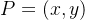，则 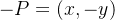。

* * *

## 1) P+Q+R=0

第 1 幅里蓝线穿过曲线上的两点 P,Q，并与曲线**再交**于第三点 R。  
因此按规则：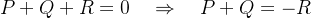  
所以**真正的“和”** P+Q 不是图上的 R，而是把 R关于 x 轴翻过去得到的 −R。

* * *

## 2) P+Q+Q=0（切线导致“重交点”）

第 2 幅里蓝线过 P 并在 Q 处**相切**。  
“相切”意味着这条线在 Q 处的交点**重数为 2**，所以这条线与曲线的三个交点（按重数）是：P,Q,Q。  
因此：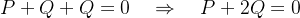  
它表达的是一种**退化/特殊位置**：存在某个 P，使得“过 P 且在 Q 相切”的直线成立，于是第三个交点“又是 Q”。

* * *

## 3) P+Q+0=0（竖直线：互为相反数）

第 3 幅里蓝线是**竖直线**，它与曲线交于 P 和 Q，而第三个交点是无穷远点 0(=O)（可以理解为“竖直方向的无穷远处”）。  
因此：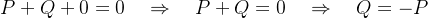  
几何上就是：P 与 Q **x 坐标相同，y 互为相反数**。

* * *

## 4) P+P+0=0（竖直切线：2 阶点）

第 4 幅里在 P 处的切线是**竖直的**，这通常发生在 P 的 y=0（点落在 x 轴上）。  
此时 P=−P（因为关于 x 轴翻过去还是自己），所以 2P=0。图中写成：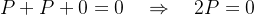  
这表示 P 是一个**阶为 2 的点**（加两次回到单位元）。

我把图里四种情况都对应到**代数计算公式**上（同一套规则，在实数域和有限域 里都成立；有限域里把除法换成“乘逆元”即可）。

下面用最常见的短 Weierstrass 形式举例：

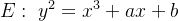

并约定单位元（图里的 0）是无穷远点 O。

* * *

## 0\. 两个最基本的代数规则

### 0.1 取相反数（对应“关于 x 轴镜像”）

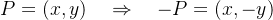

在有限域 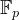中就是 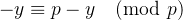。

### 0.2 直线交点求和规则

任意一条直线与曲线相交（按重数算）得到三点 A,B,C，则

A+B+C=O

所以如果直线过 P,Q，第三交点叫 R，那么

P+Q=−R

* * *

## 1) 图 1：一般加法 P+Q+R=O

设

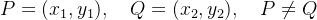

### 1.1 斜率

  

-   在实数域：
    

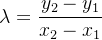

  

-   在有限域 （模素数 p）：
    

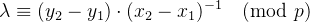

这里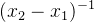 是模 p 的乘法逆元。

### 1.2 结果坐标

先得到第三交点的 x 坐标（注意这一步已经等价于“直线与曲线第三次相交”）：

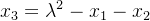

然后：

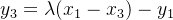

得到

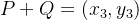

### 1.3 与图中 R 的关系

图中那条直线的第三交点 R 实际上是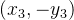。  
因为图的规则写的是：

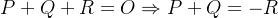

所以你算出来的 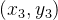 正是 −R。

* * *

## 2) 图 2：切线导致重数 P+Q+Q=O

这一幅表达的是：一条直线**经过 P**，并且在 Q 处**相切**（所以 Q 这个交点算两次），于是三点（按重数）是 P,Q,Q：

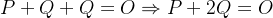

这幅更像是在讲“交点重数”的概念：  
**相切 = 交点重数为 2**，所以写成 Q+Q。

> 代数上，若你真的要算“在 Q 点的切线与曲线第三交点”，那就是“点加倍”的公式（见下一节）。  
> 然后再取相反数得到 2Q。

* * *

## 3) 图 3：竖直线 P+Q+O=O

当且 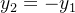 时，直线 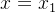 是竖直线，它与曲线交于 P,Q，第三个交点是无穷远点 O：

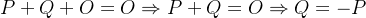

### 代数计算时怎么处理？

这是加法的一个“特判”：

-     
    
-   若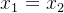 且 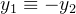（实数里就是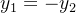）
    
      P+Q=O
    

并且这时斜率公式会出现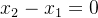的“除 0”，所以必须先特判。

* * *

## 4) 图 4：竖直切线 P+P+O=O（2 阶点 / y=0）

在短 Weierstrass 曲线中，若 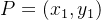 且 y1=0，那么切线在该点是竖直的（几何上会“冲到无穷远点”），对应：

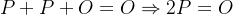

这说明 P 是一个 **阶为 2 的点**（加两次回到单位元）。

### 代数计算时的点加倍公式（正常情况）

若 P≠O 且 y1≠0，点加倍 2P 这样算：

斜率（切线斜率）：

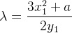

有限域里：


结果：

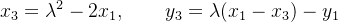

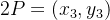

### 但当 y1=0 时？

 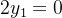 没有逆元（或会“除 0”），所以必须特判：

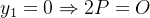

这正是图 4 的公式含义。

* * *

## 一句话把四幅图和代数规则对应起来

  

-   **图1**：普通加法（割线）  
      先算斜率 λ，再算 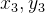 得到 P+Q。
    
      
    
-   **图2**：切线 = 重交点（重数 2），对应“加倍/或带重数的三交点和为 O”
    
      
    
-   **图3**：竖直线遇到互为相反数的两点，和为 O
    
      
    
-   **图4**：y=0 的点切线竖直，点是 2 阶点：2P=O
    

下面我用一个\*\*“玩具椭圆曲线（有限域）”\*\*把图里的四种情况全部手算一遍。

* * *

## 选一个具体曲线与点（都在模 ppp 的有限域里）

取素数域 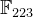，曲线：

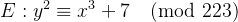

即 a=0,  b=7,  p=223。

选两点（都是曲线上的点）：

-   P=(192,105)
    
-   Q=(17,56)
    

单位元（图里的 0）记为 O（无穷远点）。

并且相反数规则：

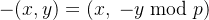

* * *

## 1) 图1：割线三交点 P+Q+R=O ⇒ P+Q=−R

### 1.1 算斜率 λ


先算差：

-   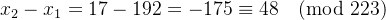
    
-   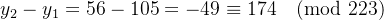
    

求逆元：

-   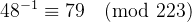（因为 148⋅79≡1）
    

所以：

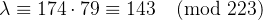

### 1.2 算结果坐标

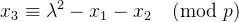

 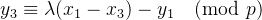

代入：

-   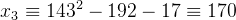
    
-   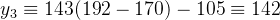
    

所以：

P+Q=(170,142)

（图里那条线的“第三交点”是 R=(170,−142)，而我们定义的和是 −R，所以才有 P+Q+R=O。）

* * *

## 2) 图2：切线导致重数 P+Q+Q=O

这幅图的意思是：直线**经过 P**，并且在 Q 点**相切**，所以 Q 这个交点算两次：

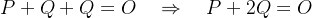

它强调的是“**相切 = 重交点（重数为2）**”这一条群论/代数几何事实。

> 实操里最常用的是“在某点相切”对应的就是 **点加倍 2Q**（见下一条的公式）。

* * *

## 3) 图3：竖直线 P+(−P)+O=O ⇒ P+(−P)=O

对我们选的 P=(192,105)：

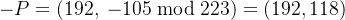

于是：

P+(−P)=O

这就是图3：竖直线 x=192 与曲线交于 P 和 −P，第三个交点是 O。

* * *

## 4) 图4：竖直切线 P+P+O=O（y=0 的 2 阶点）

找一个 y=0 的点：只要让

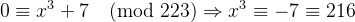

而 ，所以点

T=(6,0)

在曲线上。

因为 T=−T（y=0 翻转还是自己），所以：

2T=O

这正是图4表达的“竖直切线/2阶点”。

* * *

## 顺便演示一次“点加倍”公式（最常用）

对 P=(192,105) 计算 2P：


这里 a=0。

-   分子：
    
-   分母：
    
-   
    
-   
    

再算：

-   
    
-   
    

所以：

2P=(49,71)

# Delphi 实现要点（对应四种情况的“特判”）

下面给你一段**直接可用的核心代码**（短 Weierstrass，模素数 p）：

```
type  TEcPoint = record    X, Y: Int64;    Inf: Boolean; // True 表示无穷远点 OclassfunctionInfinity: TEcPoint; static;classfunctionCreate(AX, AY: Int64): TEcPoint; static;end;classfunctionTEcPoint.Infinity: TEcPoint;begin  Result.Inf := True;  Result.X := 0; Result.Y := 0;end;classfunctionTEcPoint.Create(AX, AY: Int64): TEcPoint;begin  Result.Inf := False;  Result.X := AX; Result.Y := AY;end;functionModP(A, P: Int64): Int64;begin  Result := A mod P;if Result < 0then Inc(Result, P);end;functionEgcd(A, B: Int64; out X, Y: Int64): Int64;var x1, y1, g: Int64;beginif B = 0thenbegin    X := 1; Y := 0;Exit(A);end;  g := Egcd(B, A mod B, x1, y1);  X := y1;  Y := x1 - (A div B) * y1;  Result := g;end;functionModInv(A, P: Int64): Int64;var x, y, g: Int64;begin  A := ModP(A, P);  g := Egcd(A, P, x, y);if g <> 1thenraise Exception.Create('No inverse (A and P not coprime)');  Result := ModP(x, P);end;// 曲线: y^2 = x^3 + a*x + b (mod p)functionEcAdd(const P1, P2: TEcPoint; a, p: Int64): TEcPoint;var  x1,y1,x2,y2, lam, x3, y3, num, den: Int64;begin// O + P = Pif P1.Inf thenExit(P2);if P2.Inf thenExit(P1);  x1 := P1.X; y1 := P1.Y;  x2 := P2.X; y2 := P2.Y;// 图3：x 相等且 y1 = -y2 -> 竖直线 -> 和为 Oif (x1 = x2) and (ModP(y1 + y2, p) = 0) thenExit(TEcPoint.Infinity);if (x1 = x2) and (y1 = y2) thenbegin// 点加倍：图4特判 y=0 -> 竖直切线 -> 2P=Oif ModP(y1, p) = 0thenExit(TEcPoint.Infinity);    num := ModP(3*x1*x1 + a, p);    den := ModP(2*y1, p);    lam := ModP(num * ModInv(den, p), p);endelsebegin// 普通加法：图1    num := ModP(y2 - y1, p);    den := ModP(x2 - x1, p);    lam := ModP(num * ModInv(den, p), p);end;  x3 := ModP(lam*lam - x1 - x2, p);  y3 := ModP(lam*(x1 - x3) - y1, p);  Result := TEcPoint.Create(x3, y3);end;
```

  

用你这条玩具曲线直接验证：

-   P+Q=(170,142)
    
-   2P=(49,71)
    
-   P+(−P)=O
    
-   2(6,0)=O