# 椭圆曲线的标量乘法

> 原文地址: [https://mp.weixin.qq.com/s/E7tyipIqfsNazgjSRBNo1Q](https://mp.weixin.qq.com/s/E7tyipIqfsNazgjSRBNo1Q)

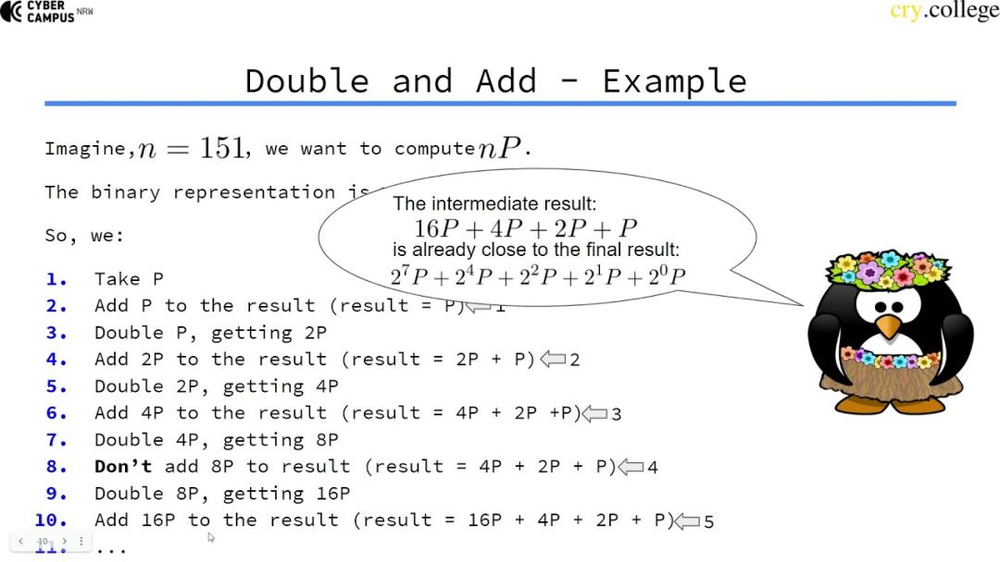  
编辑

这张图在讲椭圆曲线里**标量乘法**（scalar multiplication）：给定一个点 P 和整数 n，要算 nP（把点 P 在群里“加”自己 n次）。核心技巧就是 **Double-and-Add（倍加法）**：

-   Double（倍点）：Q←2Q（等价于 Q+Q）
    
-   Add（加点）：若某一位需要，就把当前的 Q 加进结果：R←R+Q
    

**Q 和 R 只是算法里的“临时变量名”**，用来把 nP的计算过程拆成“不断翻倍 + 选择性累加”。

你可以把它们理解成两件事：

-   Q：当前这张“面额”的点（不断翻倍的那个点）
    
-   R：已经凑出来的“零钱总和”（累加的结果点）
    

* * *

## (1）它们分别代表什么？

### Q（Current / running point）

-   含义：**当前的 ** （或 ）
    
-   一开始：Q=P
    
-   每处理一位：都会做一次倍点
    
    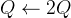
    
    所以 Q 会依次变成：
    
    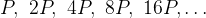
    

你可以把 Q 当成“正在增长的权重”。

### R（Result / accumulator）

-   含义：**累加器**，保存“已经选中的那些  的和”
    
-   一开始：R=O（无穷远点，等价于 0）
    
-   当某一位是 1：把当前 Q 加进去
    
    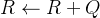
    
-   当某一位是 0：R 不变
    

最终答案就是：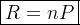

* * *

## (2）用“凑钱”类比最直观

把 n 写成二进制，比如 。

按位由高到低表示就是：

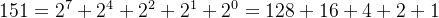

-   Q：你手上那张钞票的面额，起初 1 元，每次翻倍：1、2、4、8、16、…
    
-   R：你钱包里已经放进去的金额总和
    
-   位是 1 就把这张钞票放进钱包（R 加 Q），位是 0 就跳过
    
-   然后继续把下一张钞票翻倍出来（Q 变成 2Q）
    

* * *

## (3）原理一句话

把整数 n 写成二进制：

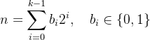

那么

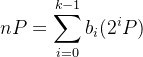

所以你只需要从 P,2P,4P,8P,…这些“**2 的幂倍**”里，把二进制位为 1 的那些挑出来加起来即可。  
而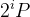 正好可以用“不断倍点”得到：P→2P→4P→8P→⋯

## (4）图里的例子：n=151

图上写 “Imagine, n=151, we want to compute nP”  
先把 151 写成二进制：

-   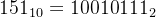
    
-   也就是
    
    
    

因此：

图中气泡也在强调这点：已经算到的中间结果

16P+4P+2P+P

“离最终结果很近”，只差再把 128P 加上去。

* * *

## (5）图中步骤在做什么（从低位到高位的做法）

图里的流程是典型的“**从最低位开始（LSB-first）**”：

-   一开始当前倍数 Q=P，结果 R=0
    
-   看二进制最低位是 1，就把 Q 加进 R
    
-   然后把 Q倍点（变成下一档：2P,4P,8P,…）
    
-   下一位是 1 就加，不是 1 就跳过
    

对照图里列出的动作：

1.  取 P（此时 Q=P）
    
2.  加 P：R=P（因为最低位 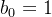）
    
3.  倍点：Q=2P
    
4.  加 2P：R=2P+P（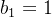）
    
5.  倍点：Q=4P
    
6.  加 4P：R=4P+2P+P（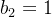）
    
7.  倍点：Q=8P
    
8.  不加 8P：R不变（因为 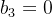）
    
9.  倍点：Q=16P
    

10.加 16：R=16P+4P+2P+P（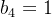）

后面继续倍点到 32P,64P,128P，对应位是 0、0、1，最终再把 128P 加进去，就得到 151P。

* * *

## (6）为什么它快？

如果你用“朴素加法”算 151P，要加 150 次点加法。  
Double-and-Add 用二进制只需要：

-   倍点次数：大约是位数 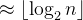（这里 151 是 8 位，倍点约 7 次）
    
-   加点次数：大约是二进制里 1 的个数（popcount）减 1（这里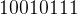 有 5 个 1，加点约 5 次）
    

所以复杂度从 O(n)变成 O(log⁡n)，这就是椭圆曲线能高效做签名/密钥交换的关键之一。

* * *

## (7）一个非常直观的类比

把 nP 想成“用很多张面额为 1,2,4,8,16,… 的钞票凑钱”：

-   倍点：相当于把面额翻倍（1→2→4→8…）
    
-   加点：相当于某一位是 1，就把这张钞票放进钱包（累加到结果）
    

  

下面这张图是在用**几何方式**把椭圆曲线的“标量乘法”拆成一连串 **倍点（doubling）** 来做——也就是把

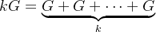

变成“不断翻倍”的过程：G→2G→4G→8G→⋯

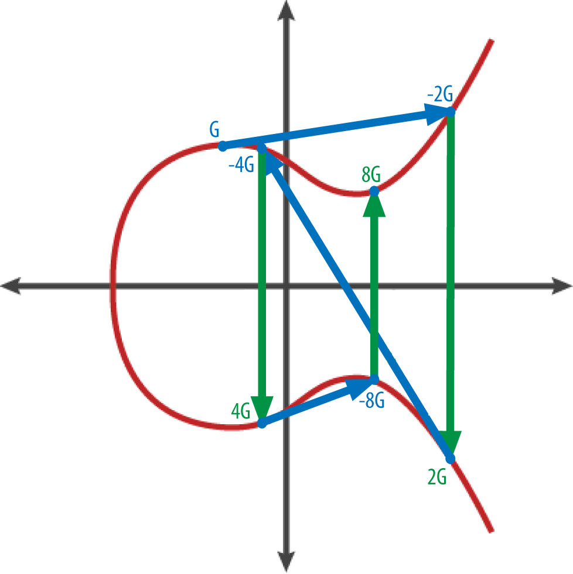  
编辑

图里每种颜色其实在表达固定含义：

-   红色曲线：椭圆曲线 E
    
-   蓝色线段：用于群运算的直线（这里主要是“切线”）
    

-   做倍点时，用的是“过该点的切线”
    
      
    

-   绿色竖箭头：关于 x 轴的镜像（取负号）
    

-   若点是 (x,y)，那么 −P=(x,−y)（在有限域里是 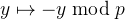）
    
      
    

* * *

## 1) 图中一步步在算什么：G→2G→4G→8G

### A. 从 G 得到 2G

1.  在点 **G**处画切线（图中上方那条蓝线的方向）。
    
2.  这条切线会再次交椭圆曲线于一个点，图上标成 **−2G**（注意是负号）。
    
3.  再沿绿色竖箭头把 −2G关于 x 轴翻到对称点，就得到 **2G**。
    

这就是倍点公式的几何版本：

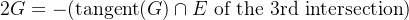

* * *

### B. 从 2G 得到 4G

同样套路：

1.  在 **2G**处画切线（图中那条斜着的大蓝线）。
    
2.  切线再次交曲线于 **−4G**（图上标的 −4G）。
    
3.  绿色竖箭头把 −4G翻过去得到 **4G**。
    

* * *

### C. 从 4G 得到 8G

1.  在 **4G**处画切线（图下方较短的蓝线）。
    
2.  得到交点 **−8G**（图上标的 −8G）。
    
3.  绿色竖箭头翻过去得到 **8G**。
    

* * *

## 2) 这就是“标量乘法”的核心：用二进制不断倍点

你现在已经在图里“预计算”出了：

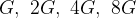

它们对应二进制权重：

1,2,4,8

所以任意 k都能写成二进制：

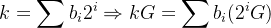

算法上就是 **Double-and-Add**：

-   从最高位往低位扫：每一位都做一次 **Double**（结果翻倍）
    
-   如果该位是 1，再做一次 **Add**（把对应的 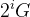 加进去）
    

举个直接用图里点的例子：  
如果 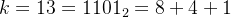，那

13G=8G+4G+G

你先用倍点得到 8G，再把 4G 和 G依次加进去就行。

* * *

## 3) 图里“负号”为啥这么重要？

因为椭圆曲线的加法规则是：

-   直线与曲线的第三个交点，得到的是 **“和的相反数”**
    
-   所以最后要做一次 **关于 x 轴的翻转**（绿色箭头）才能得到真正的和
    

这就是图里每次都会出现 −2G,−4G,−8，然后再翻成 2G,4G,8G 的原因。

  

下面我用一个**\*\*玩具椭圆曲线（小素数域）\*\***把图里的 Double-and-Add 真正算一遍，让你看到每一步的点坐标怎么变。

* * *

## 0）我们要算什么？

椭圆曲线里的标量乘法：给定点 P 和整数 n，计算

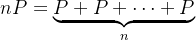

直接加 n−1 次太慢，所以用 **Double-and-Add（倍加法）**：

-   Double：倍点 Q←2Q
    
-   Add：如果该二进制位是 1，就累加 R←R+Q
    

* * *

## 1）点加/倍点公式（在有限域  上）

设曲线：

单位元是无穷远点 O（相当于“0”）。

### 点加 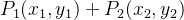 

（当 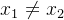，且不是互为相反点）

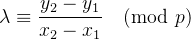

 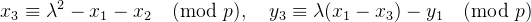

除法在模 p下就是乘以逆元：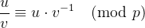。

### 倍点 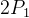 

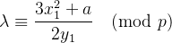

然后同样算 x3,y3。

* * *

## 2）选一个“玩具曲线”和点

我们选素数 p=211，曲线：

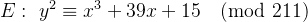

取点：

P=(152,176)

它确实在曲线上，因为：

-   左边 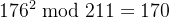 
    
-   右边 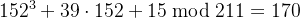 
    

* * *

## 3）按照图里的例子：算 151P

先把 151 写成二进制：

所以：

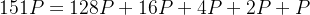

这正对应图里气泡说的：中间结果像 16P+4P+2P+P，最后再补一个 128P。

* * *

## 4）先用“不断倍点”得到 P,2P,4P,…,128P

从 P 一直倍点（每次 _Double_）得到：

-   P=(152,176)
    
-   2P=(167,141)
    
-   4P=(73,120)
    
-   8P=(102,101)
    
-   16P=(50,24)
    
-   32P=(44,48)
    
-   64P=(90,12)
    
-   128P=(83,203)
    

（这些都是真按上面的模逆+公式算出来的。）

* * *

## 5）真正执行 Double-and-Add（从低位到高位，和图的风格一致）

151 的二进制从最低位到最高位是：

![$b_0..b_7 = [1,1,1,0,1,0,0,1]$](https://mmbiz.qpic.cn/mmbiz_png/jlXjovro0triaaGoZiaV6EHOicMK2mdxlp5NfaFwyHYI8ibZt2jrRNbldopVnx96iaW9dOyHFwv9ic9VicpNwLbmx8gXA/640?wx_fmt=png&from=appmsg)

流程：初始化 R=O，当前倍数点 Q=P。每处理一位：

-   若 bit=1：R←R+Q
    
-   然后 Q←2Q（准备下一位）
    

下面是每一步的**实际点坐标**：

位i

bit

当前 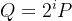 

是否加进 R

新的 R

0

1

P=(152,176)

加

R=(152,176)

1

1

2P=(167,141)

加

R=(85,160)

2

1

4P=(73,120)

加

R=(111,105)

3

0

8P=(102,101)

不加

R=(111,105)

4

1

16P=(50,24)

加

R=(47,63)

5

0

32P=(44,48)

不加

R=(47,63)

6

0

64P=(90,12)

不加

R=(47,63)

7

1

128P=(83,203)

加

**R=(31,93)**

因此最终：

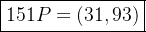

顺带一提：图里气泡的“中间结果”

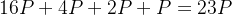

在这个玩具曲线上确实就是：

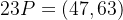

然后最后再加 128P 得到 151P。