# 椭圆曲线的群、子群和阶

> 原文地址: [https://mp.weixin.qq.com/s/-cNL7d5cm4\_NA9M0XwdCLA](https://mp.weixin.qq.com/s/-cNL7d5cm4_NA9M0XwdCLA)

### 伽罗瓦域（Galois Fields）

想象一下，数学世界里有一个“有限的数字王国”，不像我们平时用的无限整数，这里的一切数字都有限制，只能有固定数量的元素。这个王国叫伽罗瓦域，通常记作 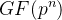，其中 p 是素数（像 2、3、5 这样的质数），n 是正整数。它就像一个特殊的算术系统，在里面你可以做加法和乘法，但一切都“循环”或“模”某个规则。

为什么叫伽罗瓦域？因为它是由数学家伽罗瓦发明的，用来解决多项式方程的问题。在密码学和计算机科学中，它超级重要，因为椭圆曲线密码就建立在伽罗瓦域上。

举个简单例子：最小的伽罗瓦域是 GF(2)，只有 0 和 1，加法像异或（0+0=0, 0+1=1, 1+0=1, 1+1=0），乘法就是普通乘（但 1\*1=1）。

更大的如 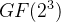，有 8 个元素（因为 2^3=8），元素可以用二进制多项式表示，比如 000 到 111，对应 0 到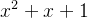。加法是位异或，乘法要用一个不可约多项式（如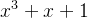）来“模”掉多余部分。

它满足域的性质：加法和乘法封闭、有单位元、有逆元（除了0），没有零因子。

下面是  的加法和乘法表的示意图，帮助你直观理解这些运算：

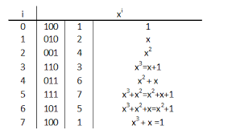编辑

这个表就像一个乘法口诀表，但有限制，元素之间运算后结果还在域里。

### 椭圆曲线的群（Elliptic Curve Groups）

现在，切换到椭圆曲线：它不是椭圆形的（名字有点误导），而是一个方程 y² = x³ + a x + b 定义的曲线，在伽罗瓦域上定义时，就成了有限点集。

在实数上，它看起来像一个对称的曲线，有时候像∞符号。曲线上的点（x,y）加上一个“无穷远点”O，形成一个群。

什么是群？群就是一个集合，加上一个运算（这里是“点加法”），满足封闭、结合、有单位（O）、有逆（对称点）。

在椭圆曲线群中，运算不是普通加法，而是几何加法：取两点 P 和 Q，画一条直线连接它们，交曲线第三点 R，然后取 R 关于 x 轴的对称点，就是 P + Q。

如果 P=Q，就是切线。加到无穷远点 O，就消失了（像零）。

在有限域上，点是离散的，但原理一样。这在密码学中用作公钥加密，因为计算离散对数难。

这里是一个椭圆曲线在实数上的图形示例（y² = x³ - x+1）：

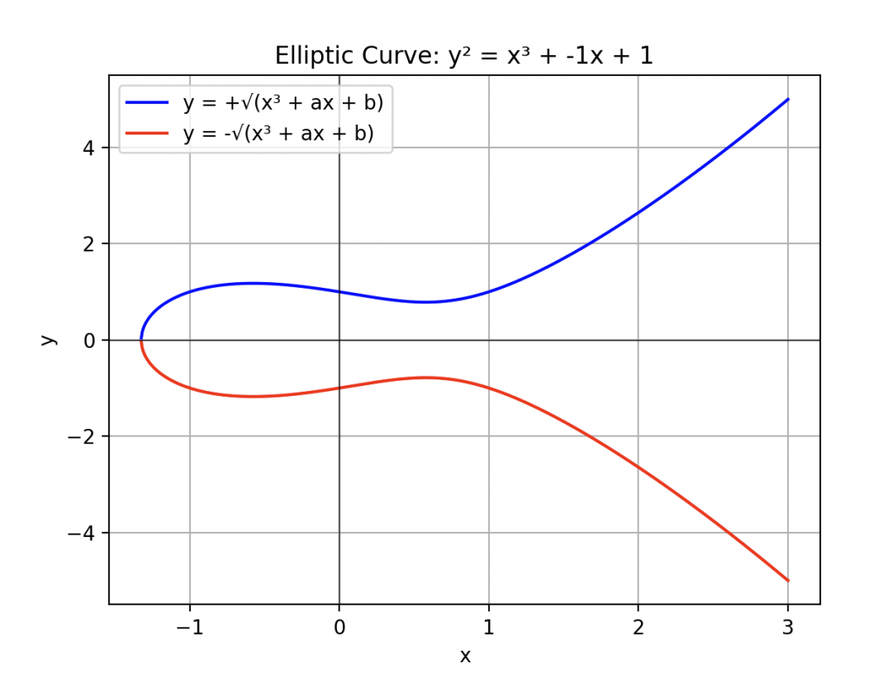  
编辑

在有限域如 GF(p) 上，曲线变成格点，但群结构还在，总点数（阶）是 #E ≈ p+1。

点加法的示意图：

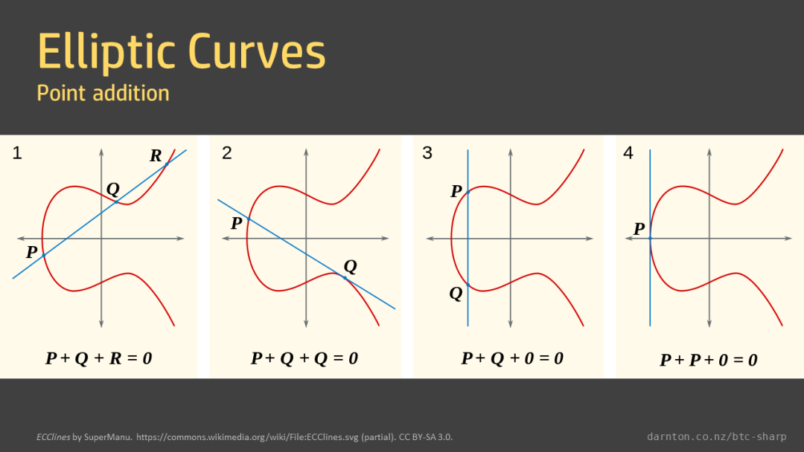  
编辑

### 子群（Subgroups）

子群是群里的一个小团体，满足群的所有性质，但元素少一些。在椭圆曲线群中，子群通常是循环子群，由一个生成元 G 生成：像 {O, G, 2G, 3G, ..., kG=O}，其中 k 是阶。

比如，整个椭圆曲线群 E，可能有一个子群 H，由某个点 P 生成的所有倍数。

子群必须封闭：加两个元素，结果还在子群里。有单位 O，有逆。

在密码学中，我们常用大阶的循环子群，来确保安全（难求离散对数）。

一个循环子群在椭圆曲线上的示意图：

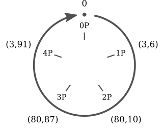  
编辑

别担心，这张图看起来有点抽象，但它其实是用一个简单的圆圈来“简化”表示椭圆曲线上的数学结构——具体是一个**循环子群**（cyclic subgroup）。它不是真实的椭圆曲线形状（椭圆曲线通常像一个弯曲的∞符号），而是用圆来象征“循环”和“封闭”的群性质，就像一个钟表盘，走到头又回到起点。

#### **为什么用这个图？**

这张图是为了让你直观理解抽象的“群和子群”——不是画真实的曲线（太乱），而是用圆“抽象化”循环。实际计算时，用伽罗瓦域上的坐标做点加法公式：

-   2P = P + P：用切线公式。
    
-   但图省略计算，焦点在结构上。
    

#### 1. **图的整体结构：一个“循环轮盘”**

  

-   **圆圈**
    
    整个图是一个圆，代表群的“循环性”。在椭圆曲线群中，点可以“加”起来（点加法），加到一定次数后，会回到起点，就像圆周上转一圈。
    
      
    
-   **箭头**
    
    从顶部的一个点（标0）开始，顺时针或逆时针循环，箭头指向“0 •”，表示从起点出发，绕圈后回来。这暗示这是一个封闭的循环：加法操作会重复。
    
      
    
-   **点的位置**
    
    圆上分布了5个点，标记为0P, 1P, 2P, 3P, 4P。这些不是随意放的，而是代表椭圆曲线上一个基点P的“倍数”：
    

-   0P
    
    这是“无穷远点”O（infinity point），群的单位元，像加法中的“0”。一切从这里开始，也在这里结束。图中在顶部。
    
-   1P
    
    就是基点P本身，右上位置，坐标(3,6)。
    
-   2P
    
    P + P = 2P，右下，坐标(80,10)。
    
-   3P
    
    2P + P = 3P，左下，坐标(80,87)。
    
-   4P
    
    3P + P = 4P，左上，坐标(3,91)。
    
      
    

  

-   **为什么是圆？**
    
     在真实的椭圆曲线上，这些点散布在曲线上（不是圆），但这里用圆简化成“轮盘”来示意它们的顺序和循环：从0P出发，加P得到1P，再加P到2P... 到4P，再加P（即5P）就回到0P。这叫**阶（order）为5的循环子群**——最小的正整数5，使得5P = O。
    

通俗比喻：想象一个5人自行车队，P是每个骑手。0P是“站着不动”，1P是一个人骑，2P是两人串联... 5P时“满员”回到起点。坐标(3,91)等是这些点在实际椭圆曲线方程（如y² = x³ + ax + b）上的真实位置，但图用圆连接它们来强调“群循环”。

这里是一个类似的标准示意图，展示椭圆曲线点的倍加如何形成循环（注意，它可能不是一模一样的曲线，但原理相同）：

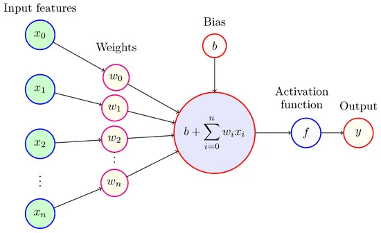  
编辑

#### 2. **坐标的含义**

-   每个点都有(x,y)坐标，比如1P是(3,6)，2P是(80,10)等。这些是满足椭圆曲线方程的点。例如，在实数域上，点必须符合y² = x³ + a x + b（a和b决定曲线形状）。
    
-   注意对称：1P (3,6) 和4P (3,91) 有相同x=3，但y不同（可能互为负，因为在椭圆曲线中，点的逆是关于x轴对称：P的逆是(x,-y)）。
    
-   2P (80,10) 和3P (80,87) 类似，x=80，y互异。这暗示曲线是对称的，点加法涉及画线求交点。
    
-   为什么这些具体数字？可能是从一个特定曲线计算的例子，比如secp256k1（比特币用）或其他，但简化到小阶5来演示（实际密码学中阶很大，如10^77）。
    

#### 3. **这代表什么数学概念？**

  

-   **群（Group）**
    
    整个圆代表椭圆曲线的点群，所有点加法封闭。
    
      
    
-   **子群（Subgroup）**
    
    这个5点集合是由P生成的子群：{0P, 1P, 2P, 3P, 4P}。它是群的一个“小团体”，满足群性质。
    
      
    
-   **阶（Order）**
    
      
    

-   子群的阶=5（元素数）。
    
-   点P的阶=5（最小k使kP=0）。
    
      
    

  

-   在密码学中，这样的子群用于密钥：私钥d=3，公钥=3P=(80,87)。别人难从3P倒推d（离散对数问题）。
    

另一个辅助图，展示实际椭圆曲线上的点如何“加”成倍数（从P到2P等），最终循环：

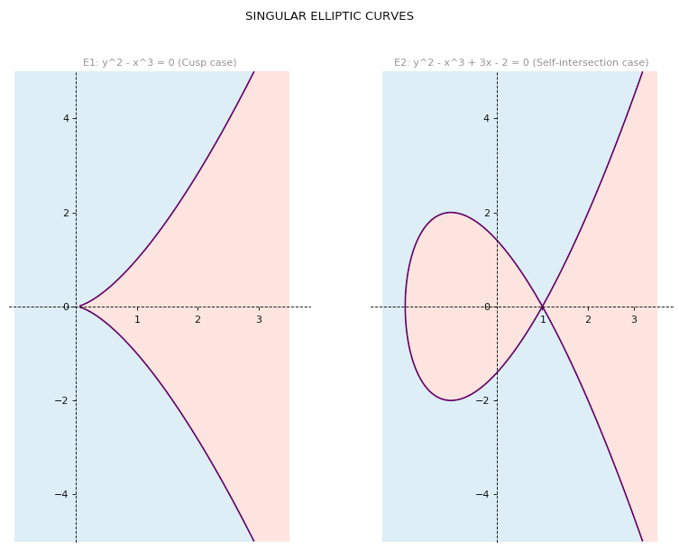  
编辑

  

### 阶（Orders）

阶有两种：群的阶是元素总数，比如椭圆曲线群的阶 #E。

元素的阶是点 P 的阶 ord(P)，是最小的正整数 k，使得 kP = O（无穷远点）。

比如，如果 P 的阶是 5，那么 5P = O，但更小的倍数不是。

在密码学中，基点 G 的阶 n 要大（素数），这样私钥 d (1到n-1) 计算公钥 Q = dG 安全。

一个点阶的计算示例：

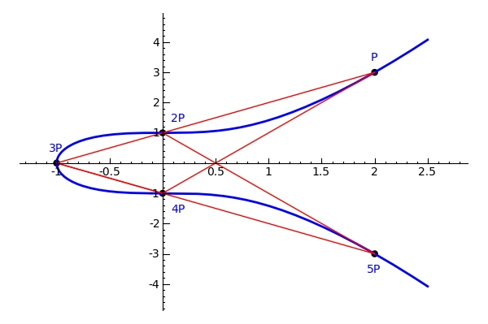  
编辑

总之，这些概念连起来：伽罗瓦域提供“地基”，椭圆曲线在其上形成群，子群和阶决定结构和安全。就像一个数学游乐场，简单规则下隐藏复杂计算！

### 有限域逆元计算的解释

在有限域里面你可以做加减乘除（除了除以0）。逆元计算是其中关键的一部分：对于一个非零元素 aaa，找到另一个元素 bbb（叫乘法逆元），使得 a×b=1（域中的单位元）。这就像在实数中，3 的逆元是 1/3，因为 3 × (1/3) = 1。

为什么重要？在密码学（如椭圆曲线加密）、编码理论中，逆元用于“除法”（其实是乘以逆元）。有限域分两种常见类型：素域 GF(p)（p 是素数，元素是 0 到 p-1）和扩展域 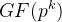（k>1，元素是多项式）。逆元计算方法类似，都基于扩展欧几里得算法（Extended Euclidean Algorithm），但一个是整数，一个是多项式。

下面我通俗解释两种情况的计算方法，用例子和步骤说明。算法的核心是：通过反复“除法”和“余数”找到 gcd（最大公约数），然后回溯求逆。因为域中 gcd(a, 模数)=1，所以总有逆元。

#### 1\. 素域 GF(p) 中的逆元

这里元素是整数模 p（p 素数），运算像时钟（模 p 循环）。逆元满足 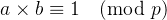。

**方法：扩展欧几里得算法**

-   目标：找整数 s，使得 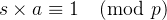，s 就是逆元。
    
-   步骤：
    

1.  用欧几里得算法求 gcd(a, p)：反复用大数除小数，取余数，直到余数=0。gcd=1。
    
2.  回溯：用余数表达成 a 和 p 的线性组合，找到系数 s（忽略 p 的系数）。
    
      
    

-   为什么有效？因为算法证明 gcd⁡(a,p)=sa+tp，当 gcd=1 时，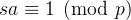。
    

**例子：计算 3 在 GF(7) 中的逆元（即 3b ≡1 mod 7）**

-   步骤1：求 gcd(7,3)
    

-   7 = 2 × 3 + 1
    
-   3 = 3 × 1 + 0
    
-   gcd=1。
    
      
    

-   步骤2：回溯
    

-   从 1 = 7 - 2 × 3（从第一行）
    
-   所以 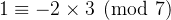，逆元是 -2 mod 7 = 5（因为 -2 +7=5）。
    
      
    

  

-   验证：3 × 5=15，15 mod 7=1。正确！
    

另一个例子：5 在 GF(13) 中的逆元。

-   13=2×5 +3
    
-   5=1×3 +2
    
-   3=1×2 +1
    
-   2=2×1 +0
    
-   回溯：1=3-1×2
    
-   2=5-1×3 → 1=3-1(5-1×3)=2×3 -1×5
    
-   3=13-2×5 → 1=2(13-2×5)-1×5=2×13 -5×5
    
-   所以 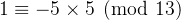，逆元 -5 mod13=8（-5+13=8）。
    
-   验证：5×8=40，40 mod13=1（40-3×13=40-39=1）。
    

这里是一个扩展欧几里得算法求模逆元的图示例子，帮助你可视化步骤：

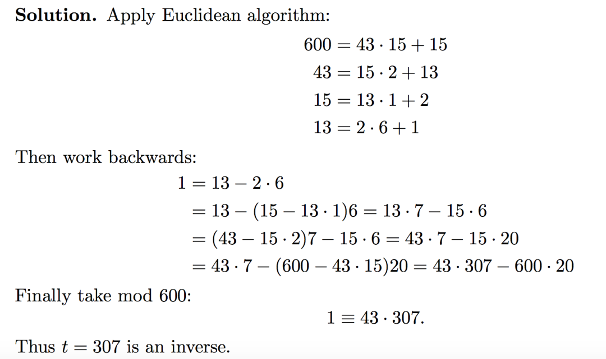  
编辑

（图中展示了类似的手写计算过程，列出每步的除法和回代。）

如果你用编程实现，Python 的 sympy 库有 mod\_inverse 函数，直接计算（如上面例子结果5和8）。

#### 2\. 扩展域 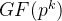中的逆元

这里元素不是简单整数，而是次数小于 k 的多项式，模一个不可约多项式 m(x)（像“模数”），系数在 GF(p) 中。通常 p=2（二进制域），用于计算机。

**方法：多项式扩展欧几里得算法**

-   类似整数版，但“除法”是多项式除法（商和余数）。
    
-   目标：找多项式 s(x)，使得 s(x) × a(x) ≡ 1 mod m(x)。
    
-   步骤：
    

1.  求 gcd(a(x), m(x)) =1（常数多项式）。
    
2.  回溯表达 1 = s(x) a(x) + t(x) m(x)，s(x) 是逆元。
    
      
    

**例子：在 GF(2^3) 中计算 (x+1) 的逆元**

-   不可约多项式 m(x)=x³ + x +1（二进制系数，mod 2）。
    
-   a(x)=x+1。
    
-   步骤1：多项式 gcd(m(x), a(x))
    

-   m(x) ÷ a(x)：x³ + x +1 = x² (x+1) + (x² + x +1)（因为 x²(x+1)=x³ + x²，减去即加 mod2：x³ + x +1 + x³ + x² = x² + x +1）。
    
-   接下来 (x+1) ÷ (x² + x +1)：商=x，余数=1（x(x+1)=x² + x，加到 x² + x +1 得1）。
    
-   然后 (x² + x +1) ÷ 1 =... 但 gcd=1。
    
      
    

-   步骤2：回溯
    

-   1 = (x² + x +1) + x (x+1)（mod2，-x=x）。
    
-   x² + x +1 = (x³ + x +1) + x² (x+1)。
    
-   代入：1 = \[(x³ + x +1) + x² (x+1)\] + x (x+1) = (x³ + x +1) + (x² + x)(x+1)。
    
-   所以 1 = (x² + x) (x+1) + 1 (x³ + x +1)，逆元是 x² + x。
    
      
    

-   验证：(x+1)(x² + x) = x³ + x² + x² + x = x³ + x (mod2)，再 mod m(x)：x³ + x = (x³ + x +1) +1 =1 (mod2)。
    

在整数表示（x²=4, x=2,1=1）：a=3 (011)，逆元=6 (110)，3×6=18，二进制乘法后 mod 对应 m(x) 得1。

#### 注意事项

-   只有非零元素有逆元（0 没有）。
    
-   如果 p 很大，也可以用费马小定理：逆元 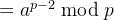（但欧几里得更高效）。
    
-   在编程中，手动实现欧几里得或用库（如 sympy for Python）。
    
-   复杂度：O(log p) 或 O(k²) for 扩展域，高效。
    

这个计算是有限域运算的基础