# 椭圆曲线非对称加密的原理讲解


> 原文地址: [https://mp.weixin.qq.com/s/qgfOLAOn\_DKPKNiITL8Dng](https://mp.weixin.qq.com/s/qgfOLAOn_DKPKNiITL8Dng)

      首先，我们来简单聊聊什么是非对称加密。它就像一把特殊的锁：你有一个公钥（公开的钥匙，大家都可以用它来锁上信息），和一个私钥（只有你自己有的钥匙，用来解锁）。传统的非对称加密如RSA基于大数因式分解的难度，而椭圆曲线加密（ECC）则基于一种更巧妙的数学游戏——椭圆曲线上的“点跳跃”问题。它更高效，用更短的密钥就能达到同样的安全级别，常用于比特币、HTTPS等。

#### 1\. 什么是椭圆曲线？

想象一条光滑的曲线，看起来像一个不对称的“U”形或“驼峰”，它的数学方程是：y² = x³ + ax + b（其中a和b是固定参数，确保曲线光滑无奇点）。在加密中，我们不是用实数，而是用有限域（像一个有限的数字网格），但为了直观，我们先看实数上的样子。

这条曲线上的点可以“加”起来，形成一个群结构。这就是ECC的核心。

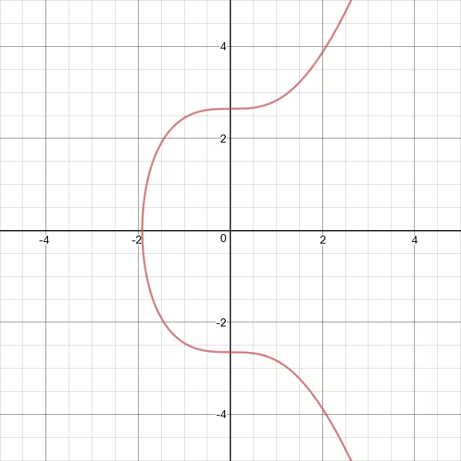  
编辑

如上图所示，这就是一个典型的椭圆曲线（实数域上）。它对称于x轴，看起来简单，但隐藏着深奥的数学。

#### 2\. 点运算：加法和倍增

ECC的魔法在于曲线上的“点加法”。规则是：

-   取两个点P和Q，画一条直线连接它们，这条线会与曲线再交于第三个点R'。
    
-   然后，反转R'的y坐标（像镜像翻转），得到真正的结果点R = P + Q。
    
-   如果P和Q是同一个点（点倍增），就画切线，同样找交点并翻转。
    

这就像在曲线上的“弹跳”：从一个点“跳”到另一个点。重复加法（标量乘法）如k \* P（加P自己k次），很容易计算，但反过来从结果点反推k（私钥）却超级难——这就是“椭圆曲线离散对数问题”（ECDLP），黑客需要天文数字的计算量。


  

编辑

  

上图演示了点加法的几何过程。注意，还有一个“无穷远点O”作为零元素，像加法的起点。

#### 3\. 如何生成密钥对

-   大家约定一个标准曲线（如secp256k1）和一个基点G（曲线上的一个固定点）。
    
-   私钥d：随机选一个大整数（比如1到n-1，n是曲线的阶）。
    
-   公钥Q：计算Q = d \* G（用点倍增，G加自己d次）。
    

公钥Q可以公开，因为从Q反推d几乎不可能。

#### 4\. 密钥交换：Diffie-Hellman风格（ECDH）

假设Alice和Bob想安全交换密钥：

-   Alice有私钥a，公钥A = a \* G。
    
-   Bob有私钥b，公钥B = b \* G。
    
-   Alice计算共享密钥S = a \* B = a \* (b \* G)。
    
-   Bob计算S = b \* A = b \* (a \* G)。
    
-   结果相同：S = a \* b \* G。
    
-   窃听者看到A、B、G，但计算a_b_G需要破解ECDLP，很难。
    

这就像两人各拉一根绳子的一端，中间打结后交换，再解自己的结，就能得到相同的秘密。

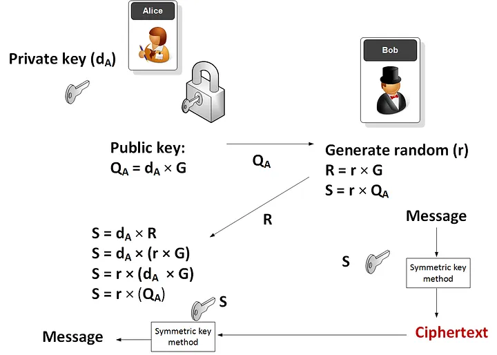

  

  

How Do You Encrypt With Elliptic Curves? | by Prof Bill Buchanan ...

如图，共享点S就是他们的秘密密钥，用于后续对称加密（如AES）。

#### 5\. 为什么安全且高效？

-   安全：基于ECDLP，量子计算机也能抵抗某些攻击（但需后量子升级）。
    
-   高效：256位ECC密钥相当于3072位RSA，计算更快，适合手机等设备。
    
-   应用：签名（ECDSA，如比特币交易）、加密、TLS证书。
    

总之，ECC把复杂的数学曲线变成安全的“跳跃游戏”：容易前进，难倒退。

### ECDSA签名机制详解

ECDSA（Elliptic Curve Digital Signature Algorithm，椭圆曲线数字签名算法）是一种基于椭圆曲线密码学的数字签名方案。它是DSA（Digital Signature Algorithm）的椭圆曲线版本，更高效、安全，常用于区块链（如比特币）、SSL/TLS证书和软件签名。简单来说，它允许你“签名”一个消息（如交易或文件），证明是你发的，且消息没被篡改，而别人只能验证，不能伪造。核心依赖椭圆曲线的点运算和离散对数难题（ECDLP），计算容易但逆向难。

ECDSA的安全性建立在：给定公钥Q和基点G，反推私钥d（Q = d \* G）几乎不可能。整个过程包括密钥生成、签名和验证。下面一步步详解。

#### 1\. 密钥生成

-   大家约定一个标准椭圆曲线参数：曲线方程（如y² = x³ + ax + b）、有限域p、基点G、阶n（G加自己n次回到起点）。
    
-   私钥d：随机选一个1到n-1之间的大整数。
    
-   公钥Q：计算Q = d \* G（点乘：G加自己d次，使用高效算法如双倍加法）。
    

这个点乘是ECDSA的基础运算：它像在曲线上的“多次弹跳”，正向计算快，反向求d难。

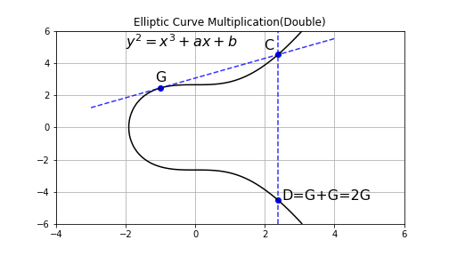

  

编辑

如上图所示，点乘是将点G重复加法得到k\*G。

#### 2\. 签名过程

假设你要签名消息m（如一笔交易）：

-   先计算消息的哈希z = HASH(m)（常用SHA-256，转成整数，截取到n位）。
    
-   随机选一个临时密钥k（1到n-1，必须每次不同且保密，否则签名可被破解）。
    
-   计算点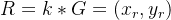。
    
-   取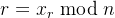（如果r=0，重选k）。
    
-   计算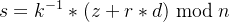（是k的模逆，确保s ≠ 0，否则重选k）。
    
-   签名就是(r, s)对。
    

这里k是“一次性”的随机数，确保签名不可预测。整个过程像用私钥“混合”哈希和随机点。

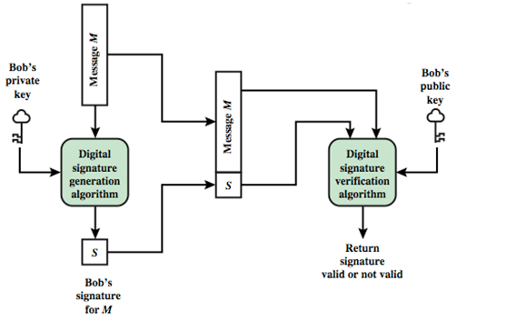

  

编辑

上图展示了签名生成的步骤：从消息哈希到计算r和s。

另一个视角的签名流程：

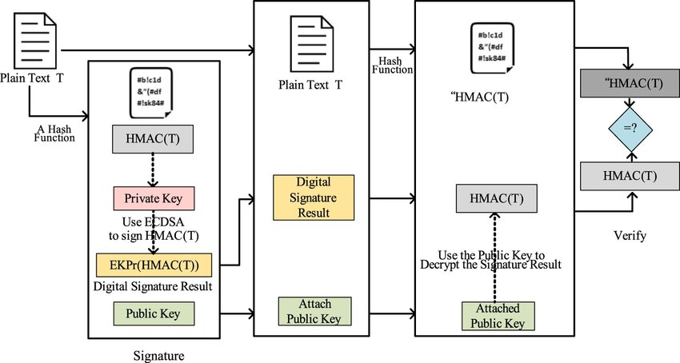

  

编辑

#### 3\. 验证过程

接收者有消息m、签名(r, s)和你的公钥Q：

-   计算z = HASH(m)（同签名时）。
    
-   计算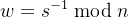（s的模逆）。
    
-   u1 = z \* w mod n。
    
-   u2 = r \* w mod n。
    
-   计算点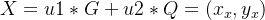。
    
-   如果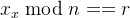，则签名有效；否则无效。
    

验证本质是重构一个点X，看它是否匹配r。它证明签名者知道私钥d，而无需暴露d。因为

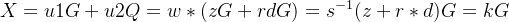（从签名公式推导），所以x坐标匹配r。

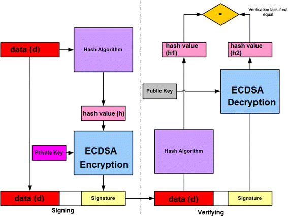

  

编辑

上图清晰显示了签名和验证的两个阶段。

更详细的验证计算：

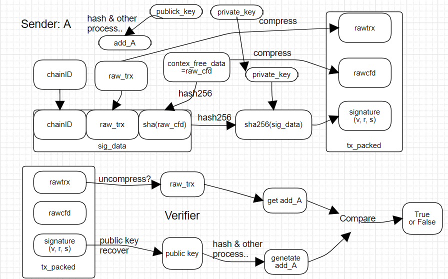

  

编辑

#### 4\. 为什么安全？

-   不可伪造：没有私钥d，无法计算正确的s，因为需要解决ECDLP。
    
-   防篡改：消息改了，z变了，验证失败。
    
-   随机性：k必须真随机且唯一；如果k重复（如Sony PS3漏洞），可从两个签名反推d。
    
-   效率：256位ECDSA密钥相当于3072位RSA，计算更快，适合移动设备。
    
-   潜在风险：量子计算机可能威胁（需Shor's算法），但当前安全。标准曲线如secp256k1（比特币用）经测试无后门。
    

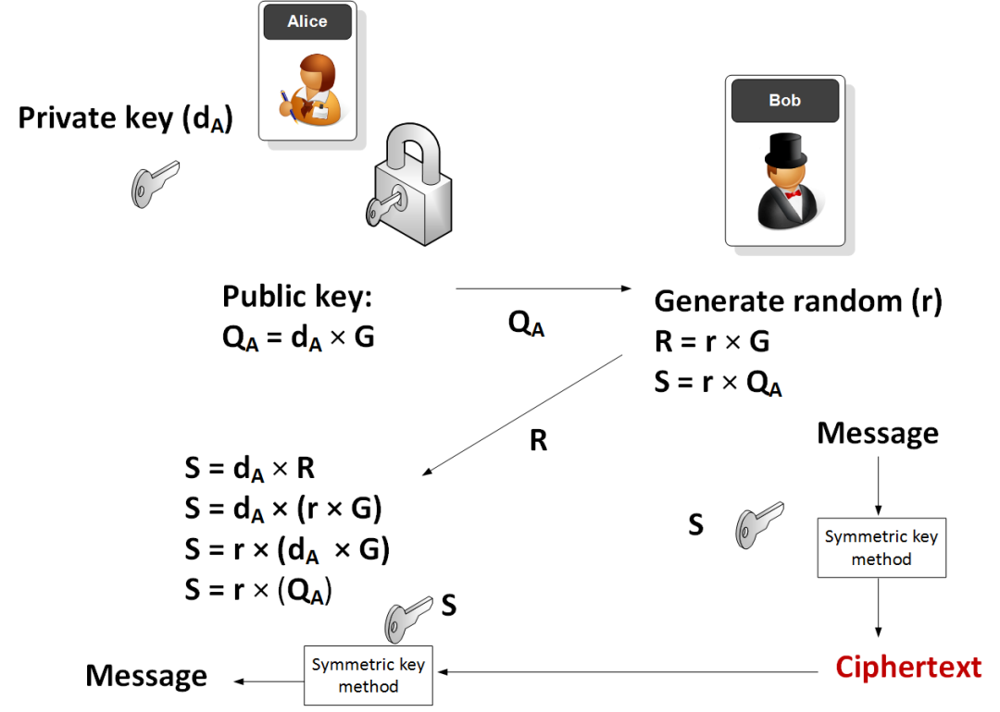

####   

#### 5\. 实际应用与注意

-   实现：用库如OpenSSL或Python的ecdsa模块。示例代码（伪码）：
    
    text
    
    ```
    from ecdsa import SigningKey, SECP256k1sk = SigningKey.generate(curve=SECP256k1)vk = sk.verifying_keysignature = sk.sign(b"message")assert vk.verify(signature, b"message")
    ```
    

  

-   注意：始终用安全随机源生成k；验证时检查r和s在1到n-1间。
    

ECDSA把数学曲线变成可靠的“数字指纹”。

### ECDSA数学证明详解

ECDSA（Elliptic Curve Digital Signature Algorithm，椭圆曲线数字签名算法）的数学证明主要聚焦于两个方面：**正确性证明**（为什么正确的签名能通过验证）和**安全性证明**（为什么它难以伪造）。这里我们以通俗方式详解，结合数学推导和图像。假设你已了解ECDSA基本机制（如果没有，可参考前文）。我们用标准参数：椭圆曲线群（G为生成元，n为阶），私钥d，公钥Q = d · G。所有运算在模n下。

#### 1\. 回顾签名与验证公式

  

-   **签名：对消息m，计算哈希z = HASH(m) mod n。**

-   选随机k ∈ \[1, n-1\]。
    
-   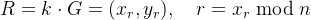。
    
-   。
    
-   签名：(r, s)。
    

  

-   **验证：计算z = HASH(m) mod n。**

-   。
    
-   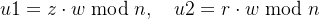。
    
-   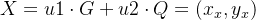。
    
-   若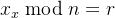，则有效。
    
      
    

现在证明：为什么X的x坐标等于r？

#### 2\. 正确性证明（数学推导）

证明的核心是展示验证中的X点实际上等于签名中的R点（k · G），从而x坐标匹配。

从验证公式开始，反向推导：

X = u1 · G + u2 · Q

代入u1和u2：

\= (z · w) · G + (r · w) · Q

由于Q = d · G，代入：

\= z · w · G + r · w · d · G

\= (z · w + r · w · d) · G

\= w · (z + r · d) · G

现在，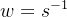，而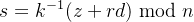，所以：

![$s^{-1} = [k^{-1} · (z + r · d)]^{-1} = (z + r · d)^{-1} · k$](https://mmbiz.qpic.cn/mmbiz_png/jlXjovro0toD4EYiavjsfWbskMhXdkU1wRh1AtcInia3HG0CeAOmU4jCBibCZB88LdFsMrYul9oibYZiamzkaEhJiahA/640?wx_fmt=png&from=appmsg)

更精确：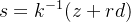，所以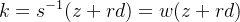

因此，X = w · (z + r · d) · G = k · G = R

是的！X = R，所以X的x坐标 mod n = r，验证通过。

通俗比喻：签名像用私钥“锁住”随机点k·G，验证用公钥“解锁”重构它，看是否匹配。

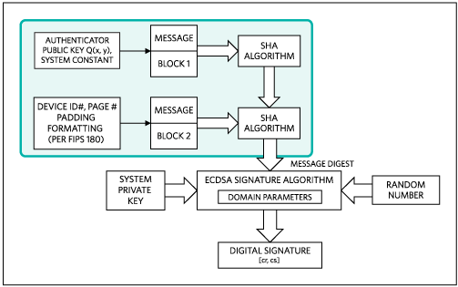

  

编辑

上图展示了签名和验证的公式推导，清晰显示了等式如何成立。

另一个角度的推导图：

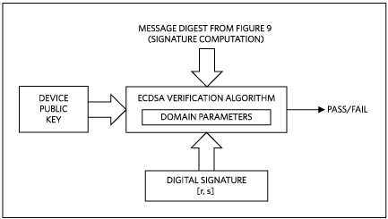

  

编辑

这里强调了w · (z + r · d) · G = k · G的等价性。

更详细的Medium文章推导：

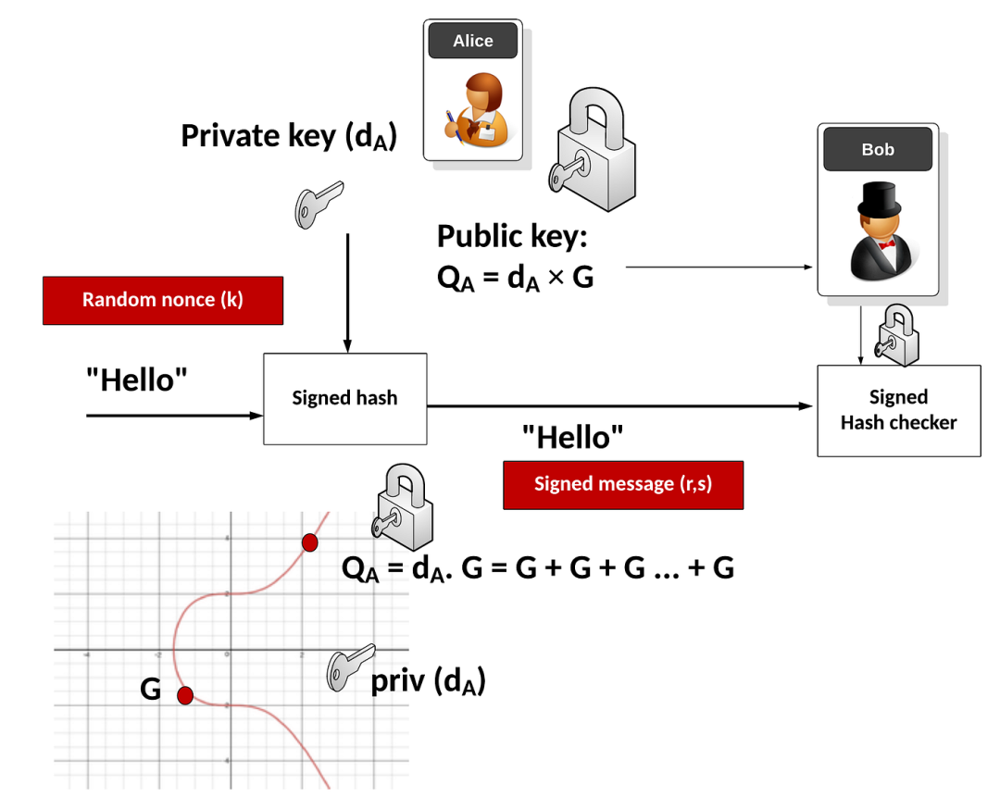

  

编辑

此图展示了扩展形式，但核心是相同的逆向计算。

#### 3\. 安全性证明

ECDSA的安全性基于\*\*椭圆曲线离散对数问题（ECDLP）\*\*的计算困难：给定Q和G，求d使得Q = d · G是NP难的。

  

-   **存在性不可伪造（EUF-CMA）：攻击者无法在多项式时间内伪造签名，即使能查询签名 oracle。证明依赖于“随机预言机模型”（HASH如随机函数）。**

-   模拟：用挑战公钥Q运行攻击者，提供模拟签名。
    
-   从伪造中提取d = (s · k - z) / r（但k未知，通过重放攻击或数学技巧求）。
    
-   假设攻击者能伪造(r, s)对新m。
    
-   从伪造签名，可提取信息反解ECDLP（详见Schorr签名类似证明）。
    
-   正式证明：如果ECDLP易解，则ECDSA不安全；反之安全。减归证明：假设ECDSA可破，则构建ECDLP求解器。
    
      
    

通俗说：伪造签名相当于从公钥反推私钥或破解随机k，都需天文计算（如2^{128}次操作 for 256-bit曲线）。

潜在弱点：若k不随机（如重复），可从两签名解d = (s2 · z1 - s1 · z2) / (r · (s1 - s2)) mod n（线性方程）。

ResearchGate的流程图：


  

编辑

此图概述了签名过程，隐含安全性依赖点运算的单向性。

博客详细解释：

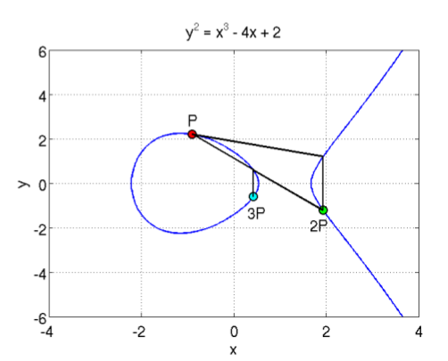

  

编辑

上图深入了点乘和逆的计算，支撑了安全性。

#### 4\. 总结与注意

ECDSA的数学优雅在于群同态：签名嵌入私钥信息，验证用公钥恢复而不泄露。实际中，用NIST曲线如P-256。证明假设HASH碰撞抵抗和k保密。如果你想用代码验证小规模证明，可用Python的ecdsa库模拟，但大参数需专业工具。