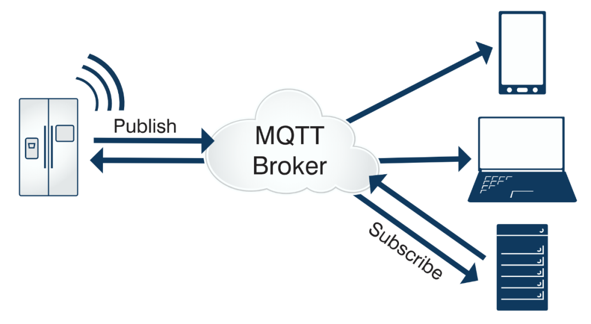

# 自制证书如何在mqtt中进行双向认证


> 原文地址: [https://mp.weixin.qq.com/s/qcFtAoVolI3Ef2Xyp5Al6Q](https://mp.weixin.qq.com/s/qcFtAoVolI3Ef2Xyp5Al6Q)



 

我们来详细探讨一下如何在 MQTT 中（以流行的 Mosquitto broker 为例）使用**自制证书（Self-signed Certificate）** 实现**双向认证（Mutual TLS Authentication， mTLS）**。

双向认证不仅是客户端验证服务器的身份（标准的 TLS），服务器也会严格验证客户端的身份。这提供了更高层级的安全保障，特别适用于物联网（IoT）等设备间需要强身份验证的场景。

### 核心概念理解

-   自制证书（Self-signed Certificate）： 指不是由公共受信任的证书颁发机构（CA）签发，而是由我们自己创建的私有根证书颁发机构（Root CA）签发的证书。它成本为零，但需要手动在所有参与方信任该根证书。非常适合内部测试、开发或封闭的私有网络环境。
    
-   双向认证（mTLS）： 在 TLS 握手过程中，双方都会出示自己的证书并验证对方的证书。
    

1.  客户端验证服务器证书是否由其信任的 CA 签发（标准 TLS）。
    
2.  服务器验证客户端证书是否由其指定的、信任的 CA 签发（mTLS 新增的步骤）。
    
      
    

* * *

### 实现步骤概览

整个过程可以分为四大步：

1.  创建自己的证书颁发机构（CA）和一系列证书：这是最核心的一步。
    
2.  配置 MQTT 服务器（Broker - Mosquitto）：使其要求客户端证书，并信任你的 CA。
    
3.  配置 MQTT 客户端：使其提供证书并信任服务器的证书（即你的 CA）。
    
4.  测试连接。
    

我们将使用 OpenSSL 命令行工具来生成所有证书。

* * *

### 第一步：生成证书文件

我们将创建以下文件：

-   ca.key： 根 CA 的私钥。
    
-   ca.crt： 根 CA 的证书（**这是信任的根源，需要分发给所有服务器和客户端**）。
    
-   server.key： MQTT 服务器的私钥。
    
-   server.crt： MQTT 服务器的证书，由 `ca.crt`签发。
    
-   client.key： MQTT 客户端的私钥。
    
-   client.crt： MQTT 客户端的证书，由 `ca.crt`签发。
    

**操作步骤：**

1.  创建根 CA (只需做一次)
    
    ```
    # 生成根CA的私钥（无密码，可根据需要添加 -des3 参数加密码）openssl genrsa -out ca.key 2048# 使用私钥自签名，生成根证书（crt文件）openssl req -x509 -new -nodes -key ca.key -sha256 -days 3650 -out ca.crt# 你会被问及国家、省份等信息，Common Name（CN）可以取一个有意义的名字，如 "My Local MQTT CA"
    ```
    
      
    
      
    
2.  生成服务器证书
    
    ```
    # 生成服务器私钥openssl genrsa -out server.key 2048# 创建证书签名请求（CSR）openssl req -new -key server.key -out server.csr# 同样需要填写信息，关键是 Common Name (CN)。**这里必须填写MQTT服务器的主机名或IP地址**，否则证书验证会失败。# 例如，如果你的broker地址是 mqtt.mydomain.com，CN 就填这个。# 使用根CA签署服务器CSR，生成服务器证书openssl x509 -req -in server.csr -CA ca.crt -CAkey ca.key -CAcreateserial -out server.crt -days 365 -sha256
    ```
    
      
    
      
    
3.  生成客户端证书 (可以为每个设备生成一套)
    
    ```
    # 生成客户端私钥openssl genrsa -out client.key 2048# 创建证书签名请求（CSR）openssl req -new -key client.key -out client.csr# Common Name (CN) 这里可以用于标识客户端设备，如 "sensor_01"。# 使用根CA签署客户端CSR，生成客户端证书openssl x509 -req -in client.csr -CA ca.crt -CAkey ca.key -CAcreateserial -out client.crt -days 365 -sha256
    ```
    
      
    
      
    

现在你拥有了所有必要的文件：`ca.crt`, `server.key`, `server.crt`, `client.key`, `client.crt`。

* * *

### 第二步：配置 Mosquitto Broker

编辑 Mosquitto 的配置文件（通常是 `/etc/mosquitto/mosquitto.conf`或 `mosquitto.conf`）。

需要修改或添加以下关键配置：

```
# 1. 指定服务器证书和私钥certfile /path/to/your/server.crtkeyfile /path/to/your/server.key# 2. 指定受信任的CA证书（用于验证客户端证书）cafile /path/to/your/ca.crt# 3. 强制要求客户端提供证书（开启双向认证）require_certificate true# 4. （可选但推荐）启用客户端证书的CN作为用户名use_identity_as_username true# 标准监听端口 8883 用于 MQTT over TLSlistener 8883
```

  

**重启 Mosquitto 服务**以使配置生效。

```
sudo systemctl restart mosquitto
```

  

* * *

### 第三步：配置 MQTT 客户端

客户端需要三样东西：

1.  信任的 CA 证书 (`ca.crt`)： 用于验证服务器证书是否可信。
    
2.  客户端证书 (`client.crt`)： 用于向服务器证明自己的身份。
    
3.  客户端私钥 (`client.key`)： 与客户端证书配对的私钥。
    

以下是一些常见客户端的配置方法：

**1\. 使用 `mosquitto_sub`/`mosquitto_pub`命令行工具：**

```
mosquitto_sub \  -h <your_broker_host> \  -p 8883 \  -t "test/topic" \  --cafile /path/to/ca.crt \  --cert /path/to/client.crt \  --key /path/to/client.key \  -v
```

  

**2\. 使用 MQTT Explorer / MQTT.fx 等图形化工具：**

在连接配置中：

-   SSL/TLS 选项卡中，选择 `Self-signed certificates`。
    
-   CA File： 选择 `ca.crt`。
    
-   Client Certificate File： 选择 `client.crt`。
    
-   Client Key File： 选择 `client.key`。
    

**3\. 在代码中（例如 Python 使用 Paho-MQTT）：**

```
import paho.mqtt.client as mqttimport sslclient = mqtt.Client()client.tls_set(    ca_certs="/path/to/ca.crt",    certfile="/path/to/client.crt",    keyfile="/path/to/client.key",    tls_version=ssl.PROTOCOL_TLSv1_2)client.connect("your_broker_host", 8883, 60)client.loop_forever()
```

  

  

### 第四步：测试与验证

1.  使用配置好的客户端尝试连接和发布/订阅消息。
    
2.  观察 Mosquitto 的日志（通常位于 `/var/log/mosquitto/mosquitto.log`），如果连接成功，你会看到包含客户端证书 CN 的成功连接信息。
    
3.  测试失败情况：
    

-   服务器没有 **`require_certificate true`**： 即使客户端不提供证书也能连接 -> 配置未生效。
    
-   客户端提供错误的证书（例如，用一个未被此 CA 签发的证书）： 连接会被服务器立即拒绝，日志会显示 "TLS handshake failed" 或 "Certificate verification failed"。
    
-   客户端不信任服务器的 CA： 客户端会报错，提示无法验证服务器证书。
    
      
    

### 安全注意事项与最佳实践

1.  保管好私钥： 尤其是 `ca.key`和 `server.key`，一旦泄露，整个安全体系就崩塌了。`ca.key`最好离线存储。
    
2.  证书有效期： 为证书设置合理的有效期，并建立证书轮换流程。
    
3.  客户端唯一性： 为每个设备或客户端生成独立的证书和私钥，便于管理和撤销。如果需要吊销证书，你需要建立 CRL（证书吊销列表）或使用 OCSP，但这在自制证书环境中较复杂。
    
4.  权限控制： 结合 `use_identity_as_username true`和 Mosquitto 的 ACL（访问控制列表），可以根据客户端证书的 CN 来精细控制其发布/订阅权限。
    
5.  加密强度： 使用足够长的密钥（2048位或以上）和安全的哈希算法（SHA256 或以上）。
    

通过以上步骤，你就可以成功地在一个内部 MQTT 网络中部署基于自制证书的双向认证，极大地增强了系统的安全性。

###   

### 除了身份认证，自制证书是否如https那样对传输数据进行加密/解密？

**答案是：是的，完全一样。**

一旦基于 TLS（无论是单向还是双向认证）的MQTT连接建立成功，**整个通信通道，包括所有MQTT协议数据（连接、发布、订阅）和消息载荷（payload），都会像HTTPS一样被高强度加密。**

### 核心原理：TLS 协议的作用

自制证书在双向认证中扮演了两个独立的角色：

1.  身份认证（Authentication）：这是你明确配置的目的。服务器用 `server.crt`证明自己是真正的服务器，客户端用 `client.crt`证明自己是合法的设备。这是通过证书的签名链（由你的私有CA根证书验证）来完成的。
    
2.  加密传输（Encryption）：这是TLS协议**内在的、自动的**功能。一旦双方通过证书验证了身份，TLS握手过程就会：
    

-   协商会话密钥：客户端和服务器会基于一个复杂的算法（如Diffie-Hellman）协商生成一个或多个对称密钥。这个过程中交换的信息是用对方的公钥（来自证书）加密的，只有对应的私钥才能解密。
    
-   建立加密通道：之后，所有的应用层数据（即MQTT数据包）都会使用这些高效的对称会话密钥进行加密和解密。常见的对称加密算法包括AES等。
    
      
    

**打个比方：**

建立TLS连接就像是在一间屋子里进行一场安全的商务会谈。

-   交换名片（证书）：双方出示自己的名片（证书）来确认对方身份（**身份认证**）。
    
-   进入隔音密室并上锁：一旦身份确认，你们会一起进入一个隔音的密室，并从里面锁上门（**协商密钥**）。
    
-   开始密谈：现在，无论你们在密室里谈论什么（**传输数据**），外面的人都听不到。即使有人窃听了你们之前交换名片的过程，他也进不了密室。
    

### 自制证书 vs 公共受信任证书

这里有一个非常重要的区别需要澄清：

方面

自制证书（Self-Signed CA）

公共受信任证书（Public Trusted CA）

**加密强度**

**完全相同**

**完全相同**

**身份认证**

仅被你自己创建的生态系统信任

被操作系统、浏览器等全球广泛信任

**主要目的**

内部网络、私有系统的**身份管理和安全**

面向公众的**身份信任和安全**

**关键结论：** 加密强度**不取决于**证书是自制的还是由DigiCert/Let's Encrypt签发的。加密强度取决于TLS协议的版本（如TLS 1.2, 1.3）和协商时选择的加密套件（Cipher Suite）。

-   一个由Let's Encrypt签发的证书和使用弱加密算法（如RC4）的服务器，其安全性远低于一个使用自制证书但配置了强加密套件（如AES256-GCM）的服务器。
    
-   你的自制证书配置，同样可以支持**TLS 1.3**和最新的、最安全的加密算法。
    

### 如何验证加密确实生效了？

你可以通过以下方法验证数据是否被加密：

1.  网络抓包（最直接的证据）：
    
    使用像 **Wireshark** 这样的工具捕获MQTT服务器端口（默认8883）的网络流量。
    

-   未加密的MQTT（1883端口）：你可以清晰地看到纯文本的MQTT协议字段，如 `CONNECT`, `PUBLISH`, 以及消息的topic和payload。
    
-   加密的MQTT over TLS（8883端口）：你只能看到“**Application Data**”包，其内容完全是乱码，Wireshark会提示“TLSv1.2/1.3 Encrypted Application Data”。这证明了通信已被加密。
    
      
    

3.  查看服务器配置：
    
    在Mosquitto配置中，你指定了 `cafile`, `certfile`, `keyfile`，这就已经指示服务器必须启动TLS监听器。没有这些配置，服务器不会在8883端口提供TLS服务。
    

所以，请放心，你的自制证书方案不仅完美地解决了设备身份认证的问题，**也同时为企业级的传输加密提供了保障**，其加密效果与HT网站和使用收费证书的MQTT服务完全相同。