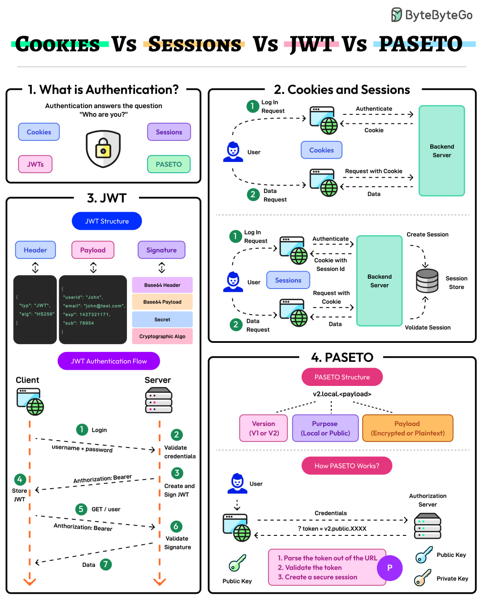

# 谈谈Cookies vs Sessions vs JWT vs PASETO


> 原文地址: [https://mp.weixin.qq.com/s/dQRrwab3aiAbJiYeq9MOUA](https://mp.weixin.qq.com/s/dQRrwab3aiAbJiYeq9MOUA)



### 1\. 图中内容的分析概述

这张来自 ByteByteGo 的信息图（Infographic）以“Cookies Vs Sessions Vs JWT Vs PASETO”为主题，系统地解释了 Web 认证（Authentication）的基本概念及其四种常见机制。图表分为四个主要部分，采用流程图、结构图和步骤说明的形式，便于视觉化理解。核心问题是认证解决“Who are you?”（你是谁？），并通过 Cookies、Sessions、JWT 和 PASETO 等技术实现用户身份验证。

  

-   **整体布局**
    
    图表从左到右、上到下组织内容。第1部分介绍认证基础，第2部分解释 Cookies 和 Sessions，第3部分详述 JWT，第4部分聚焦 PASETO。每个部分结合图标、箭头流程和代码示例，强调客户端（User/Client）和服务器（Server/Backend）之间的交互。
    
      
    
-   **视觉元素**
    
    使用彩色框（如蓝色 Cookies、紫色 JWT、橙色 PASETO）、用户图标、浏览器和服务器符号，以及编号步骤（e.g., 1. Log In），使复杂概念易懂。图中还包含代码片段（如 JWT 的 Base64 编码）和密钥图标（Public/Private Key），突出安全方面。
    
      
    
-   **重点主题**
    
    强调状态管理（Stateful vs Stateless）、存储位置（客户端 vs 服务器）、安全机制（签名 vs 加密）和流程差异。图表暗示这些机制不是互斥的（如 Sessions 常依赖 Cookies），而是根据场景选择。
    

下面基于图中内容，逐一分析每个机制，然后进行比较讨论。

### 2\. Cookies 和 Sessions

#### 图中描述

  

-   **Cookies**
    
    图中将 Cookies 描绘为浏览器存储的小型数据片段，用于在请求中发送到服务器。流程：用户登录（Log In Request），服务器认证后生成 Cookie 并发送回客户端。后续请求携带 Cookie，服务器验证后返回数据。
    
      
    
-   **Sessions**
    
    Sessions 是服务器端存储的用户状态。图中显示：登录后，服务器创建 Session ID，存储在数据库（Backend Server with DB），并通过 Cookie 发送 Session ID 给客户端。后续请求携带 Cookie 中的 Session ID，服务器查询 DB 验证 Session 并返回数据。
    
      
    
-   **关键流程**
    

1.  用户登录请求 → 服务器认证 → 创建 Session 并存储在 DB。
    
2.  发送 Cookie（含 Session ID）给客户端。
    
3.  后续请求携带 Cookie → 服务器验证 Session → 返回数据。
    
      
    

  

-   **特点**
    
    这是有状态（Stateful）的机制，依赖服务器存储，Cookie 仅作为传输 ID 的载体。
    

#### 分析

从图中可见，Cookies 和 Sessions 常结合使用：Cookies 负责客户端-服务器间的“票据”传递，Sessions 提供服务器端持久化存储。这种方式简单可靠，但服务器需维护 Session 数据库，适合需要频繁更新用户状态的场景（如购物车）。潜在问题：如果 Cookie 被窃取，可能导致会话劫持（Session Hijacking），图中未直接提及但隐含安全依赖 HTTPS。

#### 代码示例（Python Flask）

Flask 默认使用签名 Cookies 来存储 Session 数据（客户端侧），但可以配置为服务器侧存储（如使用 Redis）。以下是简单示例，使用 Flask 的内置 Session（基于 Cookies）：

Python

```
from flask import Flask, request, session, make_responseapp = Flask(__name__)app.secret_key = 'your_secret_key'  # 用于签名 Session Cookie，必须保密@app.route('/login', methods=['POST'])def login():    username = request.form.get('username')    password = request.form.get('password')    # 假设认证成功    if username == 'user' and password == 'pass':        session['username'] = username  # 设置 Session 数据（存储在签名 Cookie 中）        return 'Logged in successfully!'    return 'Invalid credentials'@app.route('/protected')def protected():    if 'username' in session:        return f'Hello, {session["username"]}! This is protected content.'    return 'Please log in first'@app.route('/logout')def logout():    session.pop('username', None)  # 移除 Session 数据    return 'Logged out'if __name__ == '__main__':    app.run(debug=True)
```

  

在这个示例中，/login 设置 Session（通过 Cookie 存储），/protected 检查并使用它，/logout 清除它。Flask 会自动处理 Cookie 的发送和验证。

### 3\. JWT (JSON Web Tokens)

#### 图中描述

  

-   **JWT 结构**
    
    分为三部分，用点（.）分隔：
    
      
    
    -   **Header**
        
        算法和类型（e.g., {"typ": "JWT", "alg": "HS256"}），Base64 编码。
        
          
        
    -   **Payload**
        
        用户数据（e.g., {"userid": "John", "email": "john@test.com", "exp": 14273171, "sub": 78954}），Base64 编码。
        
          
        
    -   **Signature**
        
        使用密钥对 Header+Payload 签名，防止篡改。
        
          
        
    
      
    
-   **JWT 认证流程**
    

1.  用户登录（Username + Password）。
    
2.  服务器验证凭证。
    
3.  创建并签名 JWT。
    
4.  发送 JWT 给客户端（通常存入 Authorization: Bearer）。
    
5.  客户端后续请求携带 JWT（GET /user, Authorization: Bearer JWT）。
    
6.  服务器验证签名。
    
7.  如果有效，返回数据。
    
      
    

  

-   **特点**
    
    无状态（Stateless），所有信息在 token 中，不需服务器存储。使用加密算法（如 HMAC）确保完整性。
    

#### 分析

图中强调 JWT 的自包含性（Self-contained），适合分布式系统（如微服务），因为服务器无需数据库查询即可验证。示例代码展示了 Base64 编码的直观性，但也暗示潜在风险：Payload 是可读的（非加密），如果包含敏感数据，需小心。图中流程清晰显示客户端存储 token，减少服务器负担，但 token 较大可能影响性能。

#### 代码示例（Python with PyJWT）

使用 PyJWT 库（需安装 pip install PyJWT）创建和验证 JWT：

Python

```
import jwtfrom datetime import datetime, timedelta, timezone# 密钥，必须保密SECRET_KEY = 'your_secret_key'# 创建 JWTdef create_jwt(user_id):    payload = {        'sub': user_id,        'exp': datetime.now(tz=timezone.utc) + timedelta(minutes=30),  # 过期时间        'iat': datetime.now(tz=timezone.utc)  # 发行时间    }    token = jwt.encode(payload, SECRET_KEY, algorithm='HS256')    return token# 验证 JWTdef verify_jwt(token):    try:        payload = jwt.decode(token, SECRET_KEY, algorithms=['HS256'])        return payload    except jwt.ExpiredSignatureError:        return 'Token expired'    except jwt.InvalidTokenError:        return 'Invalid token'# 示例使用token = create_jwt('john_doe')print(f'Generated Token: {token}')decoded = verify_jwt(token)print(f'Decoded Payload: {decoded}')
```

  

在这个示例中，create\_jwt 生成带过期时间的 token，verify\_jwt 检查签名和过期。

### 4\. PASETO (Platform-Agnostic Security Tokens)

#### 图中描述

  

-   **PASETO 结构**
    
    版本化设计（如 v2.local.payload+），分为：
    
      
    
    -   **Version/Purpose**
        
        e.g., v2 (Version), local/public (Purpose: Local 为对称加密，Public 为非对称签名)。
        
          
        
    -   **Payload**
        
        加密或明文（Encrypted or Plaintext），包含用户数据。
        
          
        
-   如何工作（How PASETO Works?）
    

1.  解析 token（Parse the token out of the URL）。
    
2.  验证 token（Validate the token）。
    
3.  创建安全会话（Create a secure session）。
    
      
    

  

-   **密钥机制**
    
    使用 Public Key（公开密钥）验证，Private Key（私有密钥）签名/加密。示例：?token=v2.public.XXXXX，用户凭证 → 服务器认证。
    
      
    
-   **特点**
    
    设计为 JWT 的安全替代品，避免 JWT 的常见漏洞（如算法混淆攻击）。
    

#### 分析

图中将 PASETO 定位为更安全的 token 标准，强调加密选项（不同于 JWT 的纯签名）。流程简化但突出密钥对：Public 用于验证，Private 用于生成，确保不可否认性。相比 JWT，PASETO 版本固定、算法有限，减少配置错误。图中未详述，但隐含其平台无关性（Platform-Agnostic），适合现代应用需强加密的场景。

#### 代码示例（Python with paseto）

使用 paseto 库（需安装 pip install paseto）创建和验证 token（这里使用 v4.public 模式）：

Python

```
import pasetofrom paseto.keys.asymmetric_key import AsymmetricSecretKey, AsymmetricPublicKeyfrom paseto.protocols.v4 import ProtocolVersion4# 生成密钥对（生产中应安全存储）secret_key = AsymmetricSecretKey.generate(protocol=ProtocolVersion4)public_key = secret_key.public_key  # 公开密钥，用于验证# 创建 PASETO tokendef create_paseto(claims):    token = paseto.create(        key=secret_key,        purpose='public',        claims=claims,        exp_seconds=1800  # 30 分钟过期    )    return token# 验证 PASETO tokendef verify_paseto(token):    parsed = paseto.parse(        key=public_key,        purpose='public',        token=token    )    return parsed['message']# 示例使用claims = {'user_id': 'john_doe', 'role': 'admin'}token = create_paseto(claims)print(f'Generated Token: {token}')decoded = verify_paseto(token)print(f'Decoded Claims: {decoded}')
```

  

在这个示例中，create\_paseto 使用私钥签名 token，verify\_paseto 使用公钥验证并提取 claims。PASETO 默认更安全，避免 JWT 的算法灵活性问题。

### 5\. 比较讨论：Cookies vs Sessions vs JWT vs PASETO

基于图中内容，这些机制都是认证工具，但差异在于状态管理、安全性和适用性。以下从多个维度比较：

  

-   **状态管理（Stateful vs Stateless）**
    
      
    

-   Cookies + Sessions：有状态，服务器存储 Session 数据，适合复杂状态（如用户偏好）。缺点：服务器负载高，可扩展性差（需 Session 同步）。
    
-   JWT 和 PASETO：无状态，token 自包含所有 info，服务器只需验证。优点：易于分布式系统，减少 DB 查询；缺点：token 失效需等待过期，无法即时撤销。
    
      
    

  

-   **存储位置**
    

-   Cookies/Sessions：Cookie 存客户端（浏览器自动管理），Session 存服务器 DB。
    
-   JWT/PASETO：token 存客户端（LocalStorage、Cookie 或 Header），无服务器存储。
    
      
    

  

-   **安全机制**
    

-   Cookies/Sessions：依赖 Cookie 的 HttpOnly/Secure 属性防 XSS/CSRF。图中显示易受劫持影响。
    
-   JWT：签名防篡改，但 Payload 可读（Base64 非加密），易受算法降级攻击。图中结构示例突出签名依赖 Secret。
    
-   PASETO：内置加密（local 模式），固定算法避免 JWT 漏洞。图中密钥图标强调更强安全性，适合高安全需求（如金融 app）。
    
      
    

  

-   **性能与复杂度**
    

-   Cookies/Sessions：简单实现，但服务器开销大。
    
-   JWT：易集成（库多，如 jsonwebtoken），token 大小中等。
    
-   PASETO：更现代（2018 提出），库较少，但设计简洁。图中流程比 JWT 短，暗示更高效。
    
      
    

  

-   **适用场景**
    
    （从图推断）：
    

-   Cookies/Sessions：传统 Web app，需服务器控制（如 e-commerce）。
    
-   JWT：API、重 API 的 SPA（Single Page App），如 RESTful 服务。
    
-   PASETO：对安全敏感的现代 app，替代 JWT 避免已知问题。
    
-   组合使用：图中暗示 Cookies 可携带 JWT/PASETO token。
    
      
    

总体而言，图表推广从传统（Cookies/Sessions）向 token-based（JWT/PASETO）的演进，强调后者在微服务时代的优势。但选择取决于项目规模、安全需求和兼容性。PASETO 被描绘为 JWT 的“升级版”，解决其痛点，如无加密默认。实际开发中，需结合 HTTPS 和最佳实践（如短过期时间）使用。