# 谈谈ECDSA 的确定性签名


> 原文地址: [https://mp.weixin.qq.com/s/kOtyxLTAVBMOgsa-xtUdCQ](https://mp.weixin.qq.com/s/kOtyxLTAVBMOgsa-xtUdCQ)

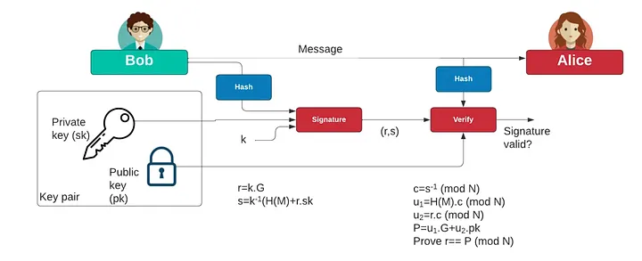

这张图把 **ECDSA 的签名/验签数据流**画得很直观：左边 Bob（持有密钥对），右边 Alice（只拿到消息+签名+公钥来验证）。

* * *

## 1) 图里在讲什么：标准 ECDSA 流程

### 签名端（Bob）

1.  对消息做哈希：
    
      e=H(M)
    
2.  取一个一次性随机数（nonce）k（图中单独画出来的 **k**）
    
3.  椭圆曲线标量乘：
    
      R=kG
    
    取 R 的 x 坐标（再 mod 曲线阶 n）得到：
    
    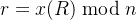
    
4.  计算：
    
    
    
5.  输出签名 (r,s)
    

> 图中写的 `r = k.G`、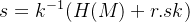 就是这两步。

我用一个**能手算**的“玩具椭圆曲线”把 **Bob 端 ECDSA（确定性 k）签名 5 步**完整跑一遍；流程和 secp256k1 完全同构，只是把大数换成小数便于看清每一步。

* * *

## 预设参数（玩具曲线，便于演示）

-   有限域：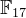（所有坐标都对 17 取模）
    
-   曲线：
    
-   基点：G=(5,1)
    
-   基点阶（群的子群阶）：n=19  
      （也就是 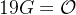，所以签名里的 “mod N” 用 N=n=19）
    

Bob 的私钥选：

sk=7

消息 M 的哈希（为了演示直接给一个值）：

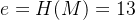(真实世界里是 SHA-256 等再截断/取模)

## 第1步：对消息哈希

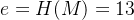

* * *

## 第2步：确定性地产生 nonce k

真实世界用 **RFC6979(HMAC-SHA256)** 从 (sk,e) 推导 k。  
这里为了能手算，用一个“教学版确定性规则”模拟它：

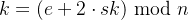

代入：

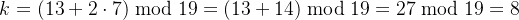

所以本次签名使用：

k=8

* * *

## 第3步：计算 R=kG

R=kG=8G

用倍点法（double）算到 8G（都在 mod 17 下）：

### 先算 2G（点加公式的“倍点”）

对 G=(5,1)：

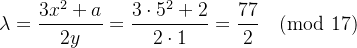

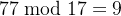，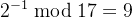，所以：

 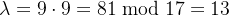

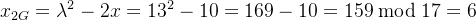

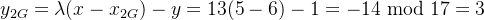

所以：

2G=(6,3)

### 再算 4G=2(2G)

对 (6,3)：

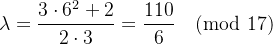

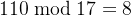，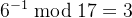，所以：

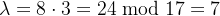

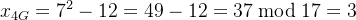

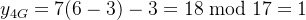

所以：

4G=(3,1)

### 再算 8G=2(4G)

对 (3,1)：

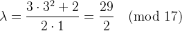

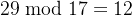，，所以：

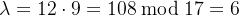

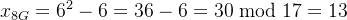

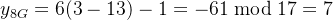

所以：

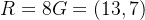

* * *

## 第4步：计算 r

ECDSA 的 r 是 R 的 x 坐标再 mod n：

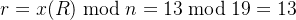

* * *

## 第5步：计算 s

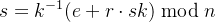

先求 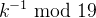：  
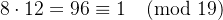，所以：

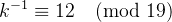

再算括号：

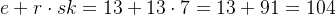

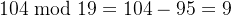

最后：

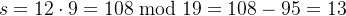

* * *

## 最终签名结果

(r,s)=(13,  13)

> 现代实现里常做一个“low-s 规范化”（防可塑性）：若 s>n/2，取 s′=n−s。  
> 这里 n=19, n/2=9.5,s=13>9.5，所以 low-s 会变成 s′=19−13=6，签名可写成 (13,6)（验签等价）。

### 验签端（Alice）

1.  同样哈希：
    
      e=H(M)
    
2.  计算 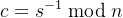（很多教材写 ）
    
3.  计算：
    
    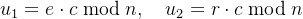
    
4.  计算点：
    
    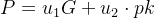
    
5.  验证：
    
    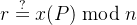
    

> 图右下角的 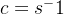、`u1/u2`、`P=u1.G+u2.pk`、`Prove r==P` 就是这套验签。

* * *

我们继续把 **Alice 端验签**按图里的公式一步步算出来，最后验证 r 是否匹配。

* * *

## 已知（来自上一轮签名示例）

曲线：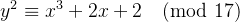  
基点：G=(5,1)  
子群阶：n=19

Bob 私钥：sk=7  
消息哈希：e=H(M)=13

签名（未做 low-s 规范化）：

(r,s)=(13,13)

* * *

## (0) 先算公钥 pk=sk⋅G

我们需要 pk=7G。

前面我们已经算过一些倍点：

-   2G=(6,3)
    
-   4G=(3,1)
    

再继续算：

-   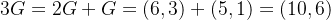
    
-   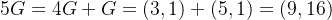
    
-   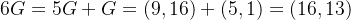
    
-   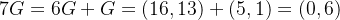
    

所以：

pk=(0,6)

* * *

## (1) Alice 对消息哈希（同 Bob）

e=H(M)=13

* * *

## (2) 计算 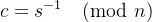 

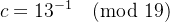

因为 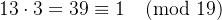，所以：

c=3

* * *

## (3) 计算 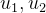 

图里是：

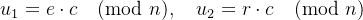

代入：


所以：


* * *

## (4) 计算点  


点加公式（x1≠x2）：


代入 ：

-   分子：
    
-   分母：
    
-   （因为 ）
    

所以：


算坐标：


因此：

P=(13,7)

* * *

## (5) 验证：


而签名给的 r=13，所以：

验签通过

* * *

### 顺便：如果你用 low-s 规范化（把 s=13 变成 s′=19−13=6）

验签也一样会过，因为 ECDSA 的判定只看 x(P)；你会得到 P变成原来点的相反数（y 取负），但 **x 不变**，所以仍满足 r。

  

## 2) 为什么会引出“确定性签名”：问题全在 k

ECDSA 里 **k 的质量是生死线**：

-   如果 k 重复用在两次不同消息上（或者被攻击者猜到/泄露一部分），私钥 sksksk 会被直接解出来。
    
-   历史上很多真实事故都不是算法错，而是 **随机数发生器不可靠**、实现 bug、虚拟机熵不足、设备启动早期熵不够等导致 k 出问题。
    

所以，“确定性 ECDSA（Deterministic ECDSA）”的核心思想是：

> **k 不再靠外部 RNG 随机生成，而是由 (私钥 sk + 消息哈希 e) 通过标准算法确定性地产生。**

这样 RNG 挂了也不至于把私钥送出去。

* * *

## 3) ECDSA 的“确定性签名”到底确定在哪里？

确定性 ECDSA 并不是改了 r,s 公式（公式完全一样），而是把：

-   随机选 k  
      换成
    
-   确定性推导 k
    

最常见、事实标准是 **RFC 6979**：用 **HMAC\_DRBG** 从 sk 与 e=H(M) 推导出 k。

可以把它理解成：


然后照旧算：


### 结果是什么？

-   同一个私钥 sk 对同一条消息 M，每次签名得到的 (r,s) **完全一致**（如果不额外加盐）。
    
-   不依赖系统 RNG，也就规避了“烂随机数导致私钥泄露”的大坑。
    

* * *

## 4) 确定性签名的优缺点

### 优点

-   强抗 RNG 故障：最大价值点。
    
-   可复现：调试、审计、硬件实现一致性更好。
    
-   协议层不用改：验签方完全无感，还是标准 ECDSA 签名。
    

### 注意点 / 风险

-   仍然要防 **侧信道**（计时/功耗/缓存）：因为 k 虽然不靠 RNG，但它依然是“必须保密的一次性秘密”。
    
-   有些系统会在 RFC6979 的基础上再混入少量随机性（“deterministic but randomized”）来增强侧信道防护——这不影响正确性，但会让签名不再完全可复现。
    

* * *

## 5) 你可以用一句话记住

> **确定性 ECDSA = 标准 ECDSA + 用 RFC6979 从(私钥+消息哈希)确定性生成 k**  
> 公式不变，安全性大幅降低对随机数的依赖，避免“k 出事私钥就没了”。

下面按图里的变量（k、r、s、c、u1、u2、P）把 \*\*“确定性 ECDSA（RFC6979）”\*\*讲透，并给出一份 **可直接照着写 Delphi 的伪代码 + 单元骨架**。

* * *

## 1) 关键点：确定性 ECDSA 只“换掉 k 的来源”

ECDSA 的签名公式不变：

-   
    
-   ，其中 e 是消息哈希（按规则截断/折叠）
    

**确定性**的地方在于：

> 不再用 RNG 随机挑 k，而是用 RFC6979 的 HMAC\_DRBG 从 `(sk, e)` 推导出 k。  
> 同一私钥 + 同一消息 → 推导出的 k 固定 → 签名 (r,s) 固定。

* * *

## 2) RFC6979 的 k 推导流程（HMAC\_DRBG）

### 2.1 需要的辅助函数（RFC6979 术语）

设曲线阶为 nnn，其字节长度：

-   qlen = bit\_length(n)
    
-   rolen = ceil(qlen / 8) （n 的定长字节数）
    

定义：

1.  int2octets(x)：把整数 x 编成 **固定 rolen 字节**的大端序（不足左补 0）
    
2.  bits2int(b)：把哈希输出 b（比特串）取左侧 qlen 位（如果 b 比 qlen 长就截断），得到整数
    
3.  bits2octets(b)：
    

-   z1 = bits2int(b)
    
-   z2 = z1 mod n
    
-   返回 `int2octets(z2)`
    

> **注意：这一步就是“把 H(M) 变成适合模 n 的 e”**。很多实现错在没做 bits2octets / truncation。

### 2.2 HMAC\_DRBG 状态机（K、V）

选择哈希函数（常见：P-256 用 SHA-256；secp256k1 也常用 SHA-256；P-384 用 SHA-384…）

初始化：

-   V = 0x01 重复 `hlen` 次
    
-   K = 0x00 重复 `hlen` 次
    
-   bx = int2octets(sk) || bits2octets(h1)  
      其中 `h1 = H(M)` 的原始哈希字节串
    

更新：

-   K = HMAC(K, V || 0x00 || bx)
    
-   V = HMAC(K, V)
    
-   K = HMAC(K, V || 0x01 || bx)
    
-   V = HMAC(K, V)
    

生成候选 k：  
循环：

-   T = empty
    
-   while len(T) < rolen:
    

-   V = HMAC(K, V)
    
-   T = T || V
    
      
    

-   k = bits2int(T) （同样按 qlen 截断）
    
-   if `1 <= k <= n-1`：成功，返回 k
    
-   否则（极少发生）：
    

-   K = HMAC(K, V || 0x00)
    
-   V = HMAC(K, V)
    
-   继续循环
    
      
    

* * *

## 3) 把 k 塞回你图里的 ECDSA 签名公式

得到 k 后就是标准 ECDSA：

1.  R = k\*G
    
2.  r = R.x mod n，若 `r==0` 重新生成 k（RFC6979 循环继续即可）
    
3.  e = bits2int(H(M))（或者直接用上面 bits2octets 产生的 z 再转整数；两者要一致）
    
4.  s = k^{-1} \* (e + r\*sk) mod n，若 `s==0` 重新生成 k
    

**推荐额外做一步 “low-s 规范化”（防签名可塑性）**：

-   如果 `s > n/2`，就 `s = n - s`
    

* * *

## 4) Delphi 实现要点（你写代码时最容易踩坑的地方）

### 4.1 哈希与 HMAC

你需要：

-   Hash(M) -> bytes
    
-   HMAC(K, data) -> bytes
    

你可以选：

-   System.Hash（新 Delphi 版本常见）
    
-   mORMot 的 SHA/HMAC
    
-   OpenSSL 的 HMAC 接口（最稳）
    

（我下面给骨架时，把 HMAC/SHA 当作可替换的函数。）

### 4.2 大整数

签名过程里必需：

-   modInv(k, n)
    
-   modMul / modAdd / mod  
      建议用 `System.Math.BigNumbers` 的 `TBigInteger`（如果你版本有），否则用你自己的大数库/openssl BN。
    

### 4.3 椭圆曲线运算

你需要：

-   ScalarMul(G, k) -> ECPoint
    
-   ECAdd(P,Q)（验签要用）
    

如果你不想自己写椭圆曲线算术，最省事是：

-   用 OpenSSL 的 EC\_GROUP/EC\_POINT 做乘法与加法
    
-   r,s 的计算用 BN 做
    

* * *

## 5) Delphi 伪代码 + 单元骨架（照着填就能跑）

下面把 **RFC6979 派生 k**写成 Delphi 风格骨架；ECC 点乘那部分你可以接 OpenSSL 或你已有的曲线库。

```
unit DeterministicECDSA_RFC6979;interfaceuses  System.SysUtils, System.Classes{$IFDEF HAS_BIGINTEGER}  , System.Math.BigNumbers{$ENDIF}  ;type  TBytes = System.SysUtils.TBytes;// 你需要提供：HMAC(Hash) 与 Hash// 推荐：HMAC-SHA256 / SHA256（以 P-256 或 secp256k1 为例）  THashFunc = reference tofunction(const Data: TBytes): TBytes;  THmacFunc = reference tofunction(const Key, Data: TBytes): TBytes;// 曲线参数需要：n（阶），G（基点）以及点乘函数// 这里把点类型抽象掉，方便你接 OpenSSL 或自写实现  TECPoint = record    X, Y: TBytes; // 或者你用 BN/BigInteger 保存end;functionRFC6979_DeriveK(const PrivKeyInt2Octets: TBytes; // int2octets(sk), fixed rolen bytesconst MsgHash: TBytes;           // h1 = H(M)const N_BigEndian: TBytes;       // n 的大端字节（固定 rolen 也行）  QLenBits: Integer;const Hmac: THmacFunc;  HLen: Integer): TBytes; // 返回 k 的 int2octets(k), fixed rolen bytesimplementationfunctionCeilDiv(A, B: Integer): Integer;begin  Result := (A + B - 1) div B;end;functionConcatBytes(const A, B: TBytes): TBytes;var  L1, L2: Integer;begin  L1 := Length(A);  L2 := Length(B);  SetLength(Result, L1 + L2);if L1 > 0then Move(A[0], Result[0], L1);if L2 > 0then Move(B[0], Result[L1], L2);end;functionConcat3(const A, B, C: TBytes): TBytes;begin  Result := ConcatBytes(ConcatBytes(A, B), C);end;functionRepeatByte(B: Byte; Count: Integer): TBytes;var  i: Integer;begin  SetLength(Result, Count);for i := 0to Count - 1do    Result[i] := B;end;// bits2int：取左边 qlen 位functionBits2Int(const Bits: TBytes; QLenBits: Integer): TBytes;var  qlenBytes, shiftBits: Integer;  tmp: TBytes;  i: Integer;begin  qlenBytes := CeilDiv(QLenBits, 8);  SetLength(tmp, qlenBytes);// 先取前 qlenBytesfor i := 0to qlenBytes - 1doif i < Length(Bits) then tmp[i] := Bits[i] else tmp[i] := 0;  shiftBits := (qlenBytes * 8) - QLenBits;if shiftBits > 0thenbegin// 右移 shiftBits（仅对最后一个字节区域不够时的截断）// 简化实现：整体右移 shiftBits// 你也可以换成大整数处理更稳// 下面给一个字节级右移：var carry: Byte := 0;for i := 0to qlenBytes - 1dobeginvar newCarry := tmp[i] shl (8 - shiftBits);      tmp[i] := (tmp[i] shr shiftBits) or carry;      carry := newCarry;end;end;  Result := tmp;end;// 这里的 ModN / Compare / SubN / AddN 等最好用大整数实现// 为了给你结构清晰，我只留接口说明。// 你实际实现时：把字节串转 BN/BigInteger，做 mod 运算，再转回定长 rolen bytes。functionRFC6979_DeriveK(const PrivKeyInt2Octets: TBytes;const MsgHash: TBytes;const N_BigEndian: TBytes;  QLenBits: Integer;const Hmac: THmacFunc;  HLen: Integer): TBytes;var  rolen: Integer;  K, V, bx: TBytes;  h1_b2o: TBytes;  Tacc: TBytes;begin  rolen := Length(PrivKeyInt2Octets); // 定长// h1_b2o = bits2octets(h1) = int2octets(bits2int(h1) mod n)// 你需要在这里做：Bits2Int(MsgHash) -> integer -> mod n -> int2octets// 暂用占位（请替换为正确的 mod n 逻辑）：  h1_b2o := Bits2Int(MsgHash, QLenBits);// TODO: h1_b2o := Int2Octets( (BigInt(h1_b2o) mod n), rolen )  bx := ConcatBytes(PrivKeyInt2Octets, h1_b2o);  V := RepeatByte($01, HLen);  K := RepeatByte($00, HLen);// K = HMAC(K, V || 0x00 || bx)  K := Hmac(K, Concat3(V, TBytes.Create($00), bx));  V := Hmac(K, V);// K = HMAC(K, V || 0x01 || bx)  K := Hmac(K, Concat3(V, TBytes.Create($01), bx));  V := Hmac(K, V);while True dobegin    SetLength(Tacc, 0);while Length(Tacc) < rolen dobegin      V := Hmac(K, V);      Tacc := ConcatBytes(Tacc, V);end;// k = bits2int(Tacc)    Result := Bits2Int(Tacc, QLenBits);// TODO: 把 Result 作为整数检查 1..n-1// if 1 <= k <= n-1 then//   Result := Int2Octets(k, rolen); Exit;// 失败分支（极少）    K := Hmac(K, ConcatBytes(V, TBytes.Create($00)));    V := Hmac(K, V);end;end;end.
```

  

上面这份骨架里，我**刻意把“mod n / 比较 1..n-1 / int2octets 定长输出”留成 TODO**，因为这部分你肯定会用你自己的大数（TBigInteger 或 OpenSSL BN），这样最稳、也最贴合你现有工程。

* * *

## 6) 你接下来怎么落地（两条路线）

### 路线 A：全用 OpenSSL（最省心、最不容易错）

-   HMAC/SHA：OpenSSL
    
-   大数 BN：OpenSSL
    
-   EC 点乘/加法：OpenSSL  
      你只负责 RFC6979 输出 k，然后用 OpenSSL 做 `k*G` 取 r，再算 s。
    

### 路线 B：你有自己的 ECC / 大数库

-   直接把 RFC6979 的 k 接到你现有的 `ScalarMul(G,k)` 上