# 谈谈ECDSA的基本原理


> 原文地址: [https://mp.weixin.qq.com/s/b-pT26CS0SD5zstthtaLnQ](https://mp.weixin.qq.com/s/b-pT26CS0SD5zstthtaLnQ)

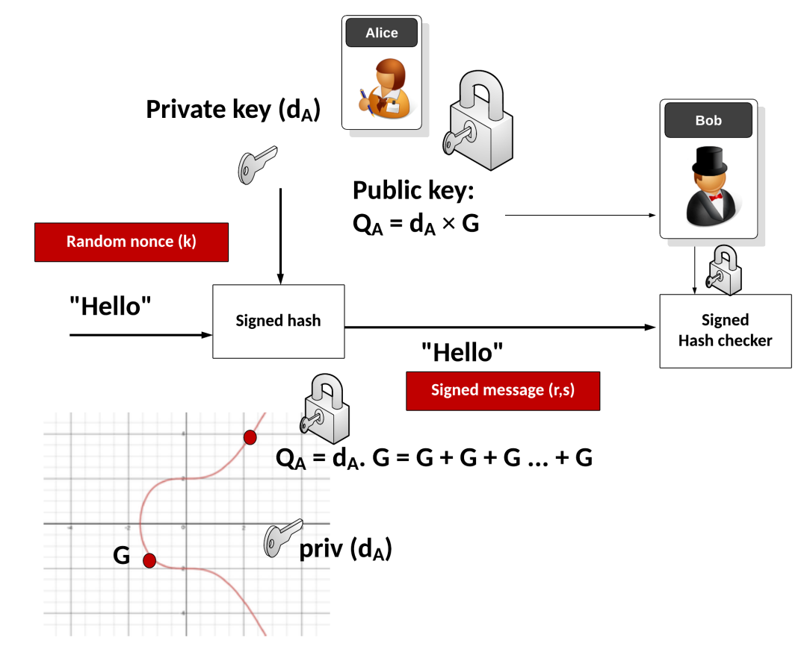

图里其实画的是 **ECDSA（椭圆曲线数字签名算法）的一次完整签名 + 验证过程**。我按画面的结构，把它说清楚。

* * *

## 1\. 密钥：在椭圆曲线上做“乘法”

左下角的曲线图：

-   红色曲线是某条 **椭圆曲线**。
    
-   红点 **G** 是曲线上的一个固定点，叫 **基点（generator）**。
    
-   Alice 选一个大整数
    
    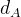
    
    作为自己的 **私钥**（图里的小钥匙 priv (dA)）。
    
-   用椭圆曲线上的“点乘法”算出：
    
    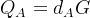
    
    这就是 **公钥**（图里上面的红点 + 锁：）。
    

所谓

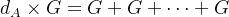

就是把点 G 自己加很多很多次（dA 次）。  
**从 dA 算 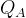很容易；反过来从 推 dA 极难**——这就是椭圆曲线离散对数难题，给了 ECDSA 安全性。

  

* * *

## 2\. 签名阶段：Alice 用私钥 + 随机数给 “Hello” 签名

图的中间部分是签名过程，参与者是 Alice。

1.  消息：  
      Alice 要发送的消息是 `"Hello"`。
    
2.  先做哈希：  
      对 `"Hello"` 做一次密码哈希（例如 SHA-256），得到一个固定长度的消息摘要：
    
    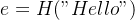
    
    图中 “Signed hash” 方框里就是在处理 “Hello” 的哈希。
    
3.  生成一次性随机数 k（随机 nonce）：  
      图中左上红色框 “Random nonce (k)”：
    

-   k 是对这条消息**一次性使用**的大随机数。
    
-   这个 k 必须保密、不能重用，否则会泄露私钥 dA。
    
      
    

5.  算出签名的第一部分 r：  
      用 k 在椭圆曲线上做点乘：
    
    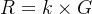
    
    取点 R 的 x 坐标（再对阶 n 取模）：
    
    
    
6.  算出签名的第二部分 s：  
      用 dA、消息哈希 e 和 r 计算：
    
    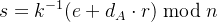
    
    这里的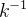是 k 在模 n 下的乘法逆元。
    
7.  最终签名：  
      签名就是一对数：
    
    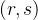
    
    图中红色条 “Signed message (r,s)” 表示 Alice 把 **消息 "Hello" + 签名 (r,s)** 一起发给 Bob。
    

注意：**签名过程中只用到了私钥 dA 和随机 nonce k，公钥不参与计算；验证时只用公钥，不需要私钥。**

* * *

## 3\. 验证阶段：Bob 用公钥检查签名

图右侧是 Bob 和 “Signed Hash checker”。

1.  Bob 收到：
    

-   消息 `"Hello"`
    
-   签名 `(r, s)`
    
      
    

3.  Bob 同样对 `"Hello"` 做哈希：
    
    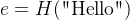
    
4.  使用 Alice 的 **公钥**  和签名 (r, s) 做下面运算（图中在 “Signed Hash checker” 盒子里完成）：
    

1.  计算：
    
    
    
2.  计算两个系数：
    
    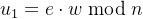
    
    ，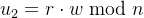
    
3.  在椭圆曲线上算一个点：
    
    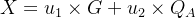
    
    取 X 的 x 坐标（对 n 取模）：
    
    
    
      
    

6.  验证条件：  
      如果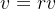
    
    就认定签名有效；否则签名无效。
    

图中 Bob 手里的小锁 + “Signed Hash checker” 就是在做这个验证过程。

  

* * *

## 4\. 这套机制保证了什么？

从图和上面的过程，可以总结 ECDSA 提供的几个安全属性：

1.  完整性：  
      签名是基于消息哈希 H("Hello") 做的，消息哪怕改一个字节，哈希就完全不同，验证必然失败。
    
2.  认证 / 身份：  
      只有握有私钥 dA 的 Alice 才能算出与公钥  匹配的 (r, s)。  
      Bob 用 **公钥** 就能验证“真的是 Alice 签的”。
    
3.  抗伪造性：  
      没有私钥 dA 的攻击者，只知道公钥 ，想伪造一个 (r, s) 让验证通过，本质上等价于解椭圆曲线离散对数问题，现有算法做不到。
    
4.  随机 nonce 的重要性：  
      图中特地强调了随机 nonce k：
    

-   如果两次不同消息使用**同一个 k**，或者 k 被部分泄露，都可能从两份签名方程中解出私钥 dA。
    
-   实际实现中会非常非常重视“安全随机数”的质量。
    
      
    

* * *

## 5\. 用一句话概括图里的 ECDSA

-   左下角：在椭圆曲线上用基点 G 和私钥 dA 生成公钥 。
    
-   中间：Alice 对消息 "Hello" 做哈希，用私钥 dA 和随机数 k 生成签名 (r, s)。
    
-   右边：Bob 拿到消息 + 签名，用公钥 验证签名是否和消息匹配，从而确认“确实是 Alice 发的、内容没被改”。
    

  

来一份 **“教学版 ECDSA” Python 实现**。  
⚠️ 说明在前：**只用于学习原理，绝对不要用于生产环境或真实密码学场景！**  
因为：

-   使用的是非常小的“玩具曲线”
    
-   随机数生成、哈希、参数选择都不安全，只是为了把流程看清楚
    

* * *

## 一、选一条玩具椭圆曲线

我们选一个非常小的素数域 ：


在这条曲线上有一个点 G=(5,1)，它的阶为 19（在这条曲线上加 19 次回到无穷远点）。  
所以我们把：

-   p=17：有限域模数
    
-   a=2,b=2：曲线参数
    
-   G=(5,1)：基点
    
-   n=19：基点的阶
    

  

* * *

## 二、完整教学版代码

```
# ============================================#  教学版 ECDSA：玩具椭圆曲线 y^2 = x^3 + 2x + 2 (mod 17)#  只用于理解流程，绝对不要用于生产！# ============================================import hashlibimport randomfrom typing importOptional, Tuple# ---------- 椭圆曲线参数（玩具） ----------# y^2 = x^3 + a*x + b (mod p)p = 17a = 2b = 2# 基点 G（generator）G = (5, 1)# 基点阶 nn = 19# 在这条玩具曲线上，G 的阶为 19Point = Optional[Tuple[int, int]]  # None 表示无穷远点 O# ---------- 工具函数：模运算 & 椭圆曲线运算 ----------defmod_inv(x: int, m: int) -> int:"""    模 m 下的乘法逆元：返回 y 使得 x * y ≡ 1 (mod m)    使用扩展欧几里得算法。    """if x == 0:raise ZeroDivisionError("没有逆元：x = 0")# 扩展欧几里得    lm, hm = 1, 0    low, high = x % m, mwhile low > 1:        r = high // low        nm = hm - lm * r        new = high - low * r        hm, lm = lm, nm        high, low = low, newreturn lm % mdefis_on_curve(P: Point) -> bool:"""检查点 P 是否在椭圆曲线上。"""if P isNone:returnTrue# 无穷远点视为在曲线上    x, y = Preturn (y * y - (x * x * x + a * x + b)) % p == 0defpoint_add(P: Point, Q: Point) -> Point:"""    椭圆曲线点加法：R = P + Q    """if P isNone:return Qif Q isNone:return P    x1, y1 = P    x2, y2 = Q# P + (-P) = Oif x1 == x2 and (y1 + y2) % p == 0:returnNoneif P != Q:# 斜率 lambda = (y2 - y1) / (x2 - x1)        m = (y2 - y1) * mod_inv(x2 - x1, p) % pelse:# P == Q，做点倍加# lambda = (3*x1^2 + a) / (2*y1)        m = (3 * x1 * x1 + a) * mod_inv(2 * y1, p) % p    x3 = (m * m - x1 - x2) % p    y3 = (m * (x1 - x3) - y1) % preturn (x3, y3)defscalar_mult(k: int, P: Point) -> Point:"""    标量乘法：k * P（重复点加）    使用双倍-加法算法（double-and-add）。    """if k % n == 0or P isNone:returnNone    k = k % n    R = None# 无穷远点    addend = Pwhile k > 0:if k & 1:            R = point_add(R, addend)        addend = point_add(addend, addend)        k >>= 1return R# ---------- 哈希函数：把消息映射到整数 e ----------defhash_message(msg: str) -> int:"""    使用 SHA-256 对消息做哈希，然后取模 n。    （教学用，真实 ECDSA 里还有更多规范细节）    """    h = hashlib.sha256(msg.encode("utf-8")).digest()    e = int.from_bytes(h, "big")return e % n# ---------- 密钥生成 ----------defgenerate_keypair() -> Tuple[int, Point]:"""    生成一对密钥 (d, Q)：    - d: 私钥，1 <= d < n    - Q: 公钥 = d * G    """    d = random.randrange(1, n)  # 玩具：直接用 random；生产环境必须用强随机数    Q = scalar_mult(d, G)assert is_on_curve(Q)return d, Q# ---------- ECDSA 签名 ----------defsign(msg: str, d: int) -> Tuple[int, int]:"""    对消息 msg 用私钥 d 做 ECDSA 签名。    返回 (r, s)。    """    e = hash_message(msg)whileTrue:# 1. 生成随机 nonce k（一次性）        k = random.randrange(1, n)# 2. 计算 R = k * G，取其 x 坐标        R = scalar_mult(k, G)assert R isnotNone        x_R, _ = R        r = x_R % nif r == 0:continue# 罕见情况，重选 k# 3. 计算 s = k^{-1} * (e + d*r) mod n        k_inv = mod_inv(k, n)        s = (k_inv * (e + d * r)) % nif s == 0:continue# 罕见情况，重选 kreturn r, s# ---------- ECDSA 验证 ----------defverify(msg: str, signature: Tuple[int, int], Q: Point) -> bool:"""    使用公钥 Q 验证 msg 的签名 (r, s)。    """    r, s = signatureifnot (1 <= r < n and1 <= s < n):returnFalse    e = hash_message(msg)# 1. 计算 w = s^{-1} mod n    w = mod_inv(s, n)# 2. u1 = e*w, u2 = r*w    u1 = (e * w) % n    u2 = (r * w) % n# 3. X = u1*G + u2*Q    X = point_add(scalar_mult(u1, G), scalar_mult(u2, Q))if X isNone:returnFalse    x_X, _ = X    v = x_X % n# 4. 签名有效当且仅当 v == rreturn v == r# ---------- 小测试：签名 & 验证 ----------if __name__ == "__main__":    msg = "Hello"# 生成密钥对    dA, QA = generate_keypair()print("私钥 dA =", dA)print("公钥 QA =", QA)# 签名    sig = sign(msg, dA)print("消息:", msg)print("签名 (r, s) =", sig)# 验证    ok = verify(msg, sig, QA)print("验证结果:", ok)# 改一下消息试试    ok2 = verify("Hello!", sig, QA)print("篡改后消息验证结果:", ok2)
```

  

## 三、你可以重点对照的几个地方

1.  sign() **函数**  
      对应我们讲的签名公式：
    
    
    
      
    
    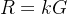
    
    ,     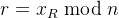       
    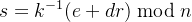
    
2.  verify() **函数**  
     对应验证公式：
    
    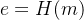
    
      
    
    
    
      
    
    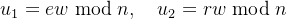
    
      
    
    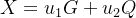
    
     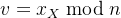
    
3.  检查 v==r 就是图里的 “Signed Hash checker”。
    
4.  scalar\_mult **/ `point_add`**  
      这两个函数就是图里左下角“G + G + … + G = dA·G”背后真正的实现。
    

我们把这条“玩具曲线”上所有点都列出来。

曲线是：

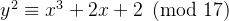

在有限域  上，一共有 **18 个有限点**，再加上无穷远点 O 一共 19 个点。

按 x 从小到大列出所有有限点：

-   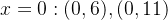
    
-   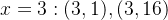
    
-   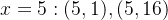← 基点 G=(5,1)
    
-   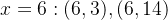
    
-   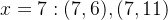
    
-   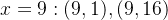
    
-   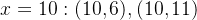
    
-   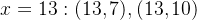
    
-   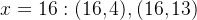
    

再加上：

-   无穷远点 O（单位元）
    

所以整条曲线的点集是：

### {O, (0,6),(0,11),(3,1),(3,16),(5,1),(5,16),(6,3),(6,14),(7,6),(7,11),(9,1),(9,16),(10,6),(10,11),(13,7),(13,10),(16,4),(16,13)}

选定基点 G=(5,1)时，它在这条曲线上的阶正好是 **19**，也就是：

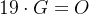，

并且 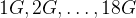 会把上面列出的 18 个有限点全部“走一圈”扫一遍。