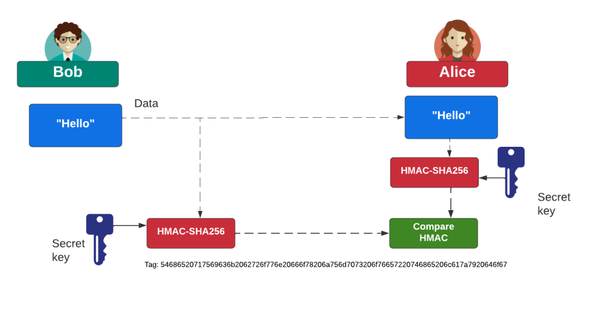
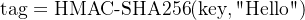
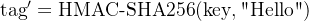

# 谈谈HMAC的工作原理


> 原文地址: [https://mp.weixin.qq.com/s/PTKrg744d1DPK51z6OvSKg](https://mp.weixin.qq.com/s/PTKrg744d1DPK51z6OvSKg)



 这张图在讲 **HMAC（Hash-based Message Authentication Code）** 的典型用法：用“共享密钥 + 哈希函数”给消息做一个**防篡改、可验证来源**的“标签（Tag / MAC）”。

## 图里发生了什么

1.  Bob 手里有两样东西：
    

-   要发送的数据：`"Hello"`
    
-   一把与 Alice 共享的 **secret key（共享密钥）**
    
      
    

3.  Bob 计算：
    
    
    
    得到一串看起来像随机的十六进制字符串（图下方 Tag）。
    
4.  Bob 把 **数据 + tag** 一起发给 **Alice**（图中虚线箭头）。
    
5.  Alice 收到后，用**同一把 secret key** 对收到的数据再算一遍：
    
    
    
6.  Compare HMAC：如果 `tag' == tag`，说明：
    

-   数据在传输中**没有被改过**（完整性 Integrity）
    
-   发送方**很可能**是拥有密钥的人（认证/鉴别 Authentication）
    
      
    

如果中间人把 `"Hello"` 改成 `"Hella"`，Alice 重新算出来的 `tag'` 会完全不同，比较就失败。

> 关键点：攻击者就算看到了数据和 tag，只要**不知道 secret key**，就几乎不可能伪造出能通过验证的新 tag。

* * *

## HMAC 的“内部原理”到底是什么

HMAC 不是“key + message 直接哈希”那么简单；它用了一种**双层哈希**的结构来把密钥安全地混入哈希计算中：

-   H 是哈希函数（图里用 SHA-256，所以是 HMAC-SHA256）
    
-   K0 是把密钥处理到“哈希的块大小”（比如 SHA-256 的块大小是 64 字节）：
    

-   密钥太长：先 `K = H(K)` 压缩一下
    
-   密钥太短：右侧补 0 到块大小
    
      
    

-   ipad 是一串固定字节 `0x36` 重复填满块大小
    
-   opad 是一串固定字节 `0x5c` 重复填满块大小
    
-   ⊕ 是按字节异或
    
-   || 是拼接
    

我们按“从里到外”剖开。

## 0\. 先把符号翻译成人话

-   K：密钥（secret key）
    
-   m：消息（message）
    
-   H(x)：哈希函数（比如 SHA-256）
    
-   ||：拼接（把两段字节首尾接起来）
    
-   ⊕：按字节异或 XOR
    
-   ipad：内层填充常量（64 字节全是 `0x36`，对 SHA-256 来说）
    
-   opad：外层填充常量（64 字节全是 `0x5c`）
    
-   K0：把密钥 K 变成“哈希块大小”长度后的版本（SHA-256 块大小是 64 字节）
    

* * *

## 1) K0 是什么？为什么要 K0？

SHA-256 不是“想塞多少就塞多少”那种处理方式；它内部是按 **64 字节一块**处理的。  
所以 HMAC 先把密钥整理成 **正好 64 字节**的 `K0`：

-   如果 `len(K) > 64`：先把 K 哈希成 32 字节：`K = H(K)`，再补32个0 填满 64字节。
    
-   如果 `len(K) <= 64`：直接右侧补 0 填满 64字节。
    

一句话：**让密钥变成固定长度，方便后面 XOR 两个 pad。**

* * *

## 2) 先看“内层”括号：H((K0 ⊕ ipad) || m)

### 2.1 (K0 ⊕ ipad) 是在干嘛？

-   ipad 是固定常量：0x`36 0x36 0x36 ...`（重复 64 次）
    
-   K0 ⊕ ipad 就是把密钥“搅”进来，得到一个**看起来随机**的 64 字节块
    

可以把它理解为：**“用密钥生成一个内层专用的起始块”**。

### 2.2 再拼接消息 m

`(K0 ⊕ ipad) || m`  
意思就是：先放 64 字节的“内层密钥块”，后面紧跟消息内容。

### 2.3 做一次哈希

`inner = H( (K0 ⊕ ipad) || m )`

这一步的产物 `inner` 是 32 字节（SHA-256 输出 32 字节）。

> 你可以把 inner 理解成：**“带密钥的消息摘要”**（但注意它不是最终结果，只是中间值）。

* * *

## 3) 再看“外层”括号：H((K0 ⊕ opad) || inner)

### 3.1 (K0 ⊕ opad) 又来一次？

`opad` 是另一个固定常量：0x`5c 0x5c 0x5c ...`（重复 64 次）

`K0 ⊕ opad` 得到一个**外层专用**的 64 字节密钥块。

### 3.2 把 inner 拼上去再哈希

`(K0 ⊕ opad) || inner`  
然后再做一次哈希：

`tag = H( (K0 ⊕ opad) || inner )`

这个 `tag` 就是最终的 HMAC。

* * *

## 4) 把整条公式改写成“分步伪代码”（最容易懂）

```
K0    = key padded/hashed to block_sizeinner = H( (K0 XOR ipad) || m )tag   = H( (K0 XOR opad) || inner )return tag
```

这就是那条公式的全部含义。

* * *

## 5) 为什么要“内外两层”？能不能只做一层？

如果你只做一层，比如很多人会天真写：

-   H(K || m) 或 `H(m || K)` 或 `H(K XOR something || m)`
    

对某些哈希结构（尤其是 MD5/SHA1/SHA256 这类 Merkle–Damgård）会踩坑，典型就是**长度扩展攻击**等结构性问题。

HMAC 的“两层结构 + 两个不同 pad”本质是在做两件事：

1.  让密钥以安全方式参与哈希（避免“直接把 key 拼进去”的坑）
    
2.  把内层和外层隔离开（ipad/opad 不同，避免某些可构造的碰撞/等价关系）
    

你可以把它理解成：  
**先用密钥把消息“封口”一次（inner），再用密钥“再封口”一次（outer）。**

* * *

## 6) 用一句更直观的比喻

-   inner = H(密钥内衬 + 消息)
    
-   tag = H(密钥外壳 + inner)
    

内衬和外壳用的是同一把钥匙，但用不同的“搅拌常量”（ipad/opad）让它们不会混淆。

我们就“手算”一遍 **XOR**，把 `(K0 ⊕ ipad)` 和 `(K0 ⊕ opad)` 彻底看穿。用前面同一组例子：

-   key = "secret key"（ASCII）
    
-   ipad = 0x36 重复 64 次
    
-   opad = 0x5c 重复 64 次
    
-   K0 = key 的字节 + 后面补 0 到 64 字节
    

* * *

## 6.1) 先把 key 写成字节（十六进制）

`"secret key"` 的 ASCII 十六进制是：

字符

s

e

c

r

e

t

(空格)

k

e

y

hex

73

65

63

72

65

74

20

6b

65

79

所以 `K0` 的前 10 个字节就是这些，后面全补 `00`。

* * *

## 6.2) 先算内层：K0 ⊕ ipad（ipad = 36）

XOR 的规则你可以记一句：**相同为 0，不同为 1**（按位做）；但手算十六进制更直观：

我们逐字节算前 10 个（后面的补零更简单）：

### 前 10 个字节（真实密钥部分）

i

K0字节

hex

ipad

hex

XOR结果

hex

0

s

73

0x36

36

73 ⊕ 36

**45**

1

e

65

36

36

65 ⊕ 36

**53**

2

c

63

36

36

63 ⊕ 36

**55**

3

r

72

36

36

72 ⊕ 36

**44**

4

e

65

36

36

65 ⊕ 36

**53**

5

t

74

36

36

74 ⊕ 36

**42**

6

空格

20

36

36

20 ⊕ 36

**16**

7

k

6b

36

36

6b ⊕ 36

**5d**

8

e

65

36

36

65 ⊕ 36

**53**

9

y

79

36

36

79 ⊕ 36

**4f**

所以你会看到前 10 个字节变成：

```
45 53 55 44 53 42 16 5d 53 4f 
```

  

### 后面补零的部分（最简单）

从第 10 字节开始，`K0` 都是 `00`，所以：

-   00 ⊕ 36 = 36
    

也就是说后面全变成一串 `36 36 36 ...`

这就解释了你之前看到的：

```
(K0 ⊕ ipad) = 45 53 55 44 53 42 16 5d 53 4f 36 36 36 36 36 ... 
```

  

* * *

## 6.3) 再算外层：K0 ⊕ opad（opad = 5c）

同理，逐字节算前 10 个：

i

K0字节

hex

opad

hex

XOR结果

hex

0

s

73

0x5c

5c

73 ⊕ 5c

**2f**

1

e

65

5c

5c

65 ⊕ 5c

**39**

2

c

63

5c

5c

63 ⊕ 5c

**3f**

3

r

72

5c

5c

72 ⊕ 5c

**2e**

4

e

65

5c

5c

65 ⊕ 5c

**39**

5

t

74

5c

5c

74 ⊕ 5c

**28**

6

空格

20

5c

5c

20 ⊕ 5c

**7c**

7

k

6b

5c

5c

6b ⊕ 5c

**37**

8

e

65

5c

5c

65 ⊕ 5c

**39**

9

y

79

5c

5c

79 ⊕ 5c

**25**

前 10 个字节变成：

```
2f 39 3f 2e 39 28 7c 37 39 25 
```

  

后面补零部分：

-   00 ⊕ 5c = 5c
    

所以后面是一串 `5c 5c 5c ...`

这就对应你之前看到的：

```
(K0 ⊕ opad) = 2f 39 3f 2e 39 28 7c 37 39 25 5c 5c 5c 5c 5c ... 
```

  

* * *

## 6.4) 现在你应该能“读懂公式”的每一块了

-   (K0 ⊕ ipad)：把密钥块“换个皮肤”（内层皮肤）
    
-   (K0 ⊕ opad)：把密钥块“换个皮肤”（外层皮肤）
    
-   || m：把消息拼上去
    
-   H(...)：做 SHA-256
    
-   两层：先算 inner，再用 inner 算最终 tag
    

### 为什么要搞“两层 + ipad/opad”这么绕？

主要为了避免一些把“哈希直接当 MAC”的坑，最著名的是**长度扩展攻击（length extension）**：  
很多常见哈希（MD5/SHA-1/SHA-256 这类 Merkle–Damgård 结构）对 `H(key||message)` 这种做法不安全；HMAC 的结构专门把这些问题规避掉了，并且有较成熟的安全性分析。

* * *

## HMAC 能保证什么，不能保证什么

✅ 能保证：

-   完整性：消息没被篡改
    
-   共享密钥方的认证：能生成正确 tag 的人，必须知道密钥
    

❌ 不能保证：

-   保密性/加密：消息内容仍是明文（图里 `"Hello"` 直接传过去）。  
      如果要保密，需要再配合加密（如 AES-GCM）或直接用 TLS。
    

⚠️ 还要注意：

-   不能防重放：攻击者可以原封不动转发 “(Hello, tag)” 让你误以为是新消息。  
      解决：把 `nonce / 计数器 / 时间戳 / 会话ID` 等一起纳入 HMAC 计算（即 HMAC 覆盖“你认为重要的全部字段”）。
    

* * *

## 实战要点（很常用、也很容易踩坑）

-   密钥要随机且够长：至少 128 bit（16 字节）起步，常用 256 bit。
    
-   比较 tag 要用常数时间比较（constant-time compare），避免时序泄露。
    
-   明确字节编码：HMAC 算的是“字节串”，双方必须对字符串、JSON、参数顺序等有一致的序列化方式（否则会“看起来一样但算出来不一样”）。
    
-   tag 可以截断（比如取前 16 字节）用于节省带宽，但截断越短，伪造概率越高。
    

这是一种“散列-然后-散列”的方法：

-   内层：密钥 XOR ipad，然后连接消息，再散列。
    
-   外层：密钥 XOR opad，然后连接内层结果，再散列。
    

这种设计防止了简单连接密钥的漏洞（如在 MD5 中的碰撞攻击）。

优势与应用

-   优势：计算高效、耐碰撞、抗重放攻击（结合 nonce）。不需公钥基础设施。
    
-   局限：不提供机密性（需结合加密如 AES）；密钥泄露会导致失效。
    
-   应用示例：HTTP 认证、JWT 令牌、区块链交易验证。
    

下面再次把图中的每一步“摊开来算”。

我们约定：

-   消息 `m = "Hello"`（ASCII 字节：`48 65 6c 6c 6f`）
    
-   共享密钥 `K = "secret key"`（ASCII 字节：`73 65 63 72 65 74 20 6b 65 79`）
    
-   哈希函数：`SHA-256`
    
-   SHA-256 的 **块大小 block size = 64 字节**
    

* * *

## 1) 把密钥变成块大小：K0

HMAC 先把密钥处理成 64 字节的 `K0`：

-   如果 `len(K) > 64`：先 `K = SHA256(K)` 再补零
    
-   如果 `len(K) <= 64`：直接右侧补 `0x00` 到 64 字节
    

这里 `K="secret key"` 只有 10 字节，所以：

**K0 (64 bytes) = K + 54 个 00**

K0 的十六进制（共 64 字节 = 128 hex）：

```
736563726574206b657900000000000000000000000000000000000000000000 0000000000000000000000000000000000000000000000000000000000000000 
```

  

* * *

## 2) 准备两块固定“垫子”：ipad / opad

-   ipad：64 字节全是 `0x36`
    
-   opad：64 字节全是 `0x5c`
    

* * *

## 3) 内层：inner = SHA256((K0 ⊕ ipad) || m)

先算：

### 3.1 计算 (K0 ⊕ ipad)

把 K0 的每个字节与 `0x36` 异或：

```
(K0 ⊕ ipad) = 455355445342165d534f36363636363636363636363636363636363636363636 3636363636363636363636363636363636363636363636363636363636363636 
```

  

### 3.2 拼接消息并做 SHA-256

输入是：

```
(K0 ⊕ ipad) || "Hello" 
```

  

得到内层哈希：

```
inner = 1641bb0ecfc8190a416cf0b9d351c8c18e08825255c800e5eb1b3de2b05fbfe6 
```

  

* * *

## 4) 外层：tag = SHA256((K0 ⊕ opad) || inner)

### 4.1 计算 (K0 ⊕ opad)

```
(K0 ⊕ opad) = 2f393f2e39287c3739255c5c5c5c5c5c5c5c5c5c5c5c5c5c5c5c5c5c5c5c5c5c 5c5c5c5c5c5c5c5c5c5c5c5c5c5c5c5c5c5c5c5c5c5c5c5c5c5c5c5c5c5c5c5c 
```

  

### 4.2 拼接 inner 并做 SHA-256

输入是：

```
(K0 ⊕ opad) || inner 
```

  

得到最终 **HMAC Tag**：

```
tag = be11221de3016217529dc1c1205027dd3585e79a8d2a7c6159f4a8aec700d9ab 
```

  

这就是 Bob 发给 Alice 的 “Tag”。

* * *

## 5) Alice 如何验证（对应图里 Compare HMAC）

Alice 收到 `(m="Hello", tag=...)` 后，用同一把密钥 **重复上面的计算** 得到 `tag'`，然后做比较：

-   若 `tag' == tag`：消息未被篡改，且发送方拥有共享密钥
    
-   否则：要么消息被改了，要么 tag 是伪造的
    

> 实战里比较要用 **常数时间比较**（constant-time compare），避免时序泄露。

* * *

## 给你一段可复现的 Python（你可以改 key/msg 玩）

```
import hmac, hashlibkey = b"secret key"msg = b"Hello"tag = hmac.new(key, msg, hashlib.sha256).hexdigest()print(tag)# be11221de3016217529dc1c1205027dd3585e79a8d2a7c6159f4a8aec700d9ab
```

  

下面把两段“**完整输入字节流**”都按十六进制原样展开（就是喂给两次 SHA-256 的真实数据）。

下面仍用同一组例子：

-   key = b"secret key"（10 字节）
    
-   msg = b"Hello"（5 字节）
    
-   SHA-256 block size = 64 字节
    

* * *

## 1) 先得到 K0（64 字节）

`K0 = key + 0x00...补齐到 64 字节`

```
K0 (64 bytes): 736563726574206b657900000000000000000000000000000000000000000000 0000000000000000000000000000000000000000000000000000000000000000 
```

  

* * *

## 2) 内层输入： (K0 ⊕ ipad) || msg

`ipad = 0x36 * 64`

### 2.1 先算 (K0 ⊕ ipad)

```
K0 ⊕ ipad (64 bytes): 455355445342165d534f36363636363636363636363636363636363636363636 3636363636363636363636363636363636363636363636363636363636363636 
```

  

### 2.2 再拼上消息 "Hello"

所以 **内层 SHA-256 的真实输入**是（总长度 64 + 5 = 69 字节）：

```
inner_input = (K0 ⊕ ipad) || msg (len = 69) 455355445342165d534f36363636363636363636363636363636363636363636 3636363636363636363636363636363636363636363636363636363636363636 48656c6c6f 
```

  

对它做 SHA-256，得到：

```
inner = SHA256(inner_input) 1641bb0ecfc8190a416cf0b9d351c8c18e08825255c800e5eb1b3de2b05fbfe6 
```

  

* * *

## 3) 外层输入： (K0 ⊕ opad) || inner

`opad = 0x5c * 64`

### 3.1 先算 (K0 ⊕ opad)

```
K0 ⊕ opad (64 bytes): 2f393f2e39287c3739255c5c5c5c5c5c5c5c5c5c5c5c5c5c5c5c5c5c5c5c5c5c 5c5c5c5c5c5c5c5c5c5c5c5c5c5c5c5c5c5c5c5c5c5c5c5c5c5c5c5c5c5c5c5c 
```

  

### 3.2 再拼上 inner（32 字节）

所以 **外层 SHA-256 的真实输入**是（总长度 64 + 32 = 96 字节）：

```
outer_input = (K0 ⊕ opad) || inner (len = 96) 2f393f2e39287c3739255c5c5c5c5c5c5c5c5c5c5c5c5c5c5c5c5c5c5c5c5c5c 5c5c5c5c5c5c5c5c5c5c5c5c5c5c5c5c5c5c5c5c5c5c5c5c5c5c5c5c5c5c5c5c 1641bb0ecfc8190a416cf0b9d351c8c18e08825255c800e5eb1b3de2b05fbfe6 
```

  

对它做 SHA-256，得到最终 HMAC Tag：

```
HMAC = SHA256(outer_input) be11221de3016217529dc1c1205027dd3585e79a8d2a7c6159f4a8aec700d9ab 
```

  

* * *

## 4) 复现并打印这些输入（Python）

```
import hashlib, binasciikey = b"secret key"msg = b"Hello"block = 64K = keyiflen(K) > block:    K = hashlib.sha256(K).digest()K0 = K + b"\x00" * (block - len(K))ipad = bytes([0x36]) * blockopad = bytes([0x5c]) * blockk_ipad = bytes(a ^ b for a, b inzip(K0, ipad))k_opad = bytes(a ^ b for a, b inzip(K0, opad))inner_input = k_ipad + msginner = hashlib.sha256(inner_input).digest()outer_input = k_opad + innertag = hashlib.sha256(outer_input).hexdigest()defdump(label, b, width=32):    hx = binascii.hexlify(b).decode()print(label, "len =", len(b))for i inrange(0, len(hx), 2*width):print(hx[i:i+2*width])dump("K0", K0)dump("K0^ipad", k_ipad)dump("inner_input", inner_input)print("inner =", binascii.hexlify(inner).decode())dump("K0^opad", k_opad)dump("outer_input", outer_input)print("HMAC =", tag)
```

  

总之，图像提供了 HMAC 的直观入门，但实际实现更注重安全工程。