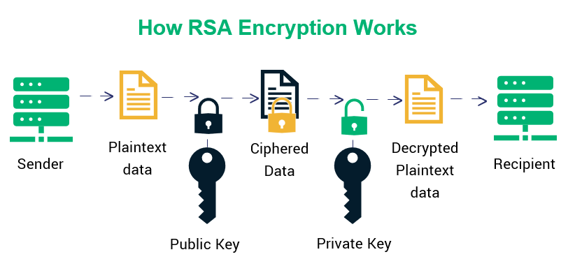
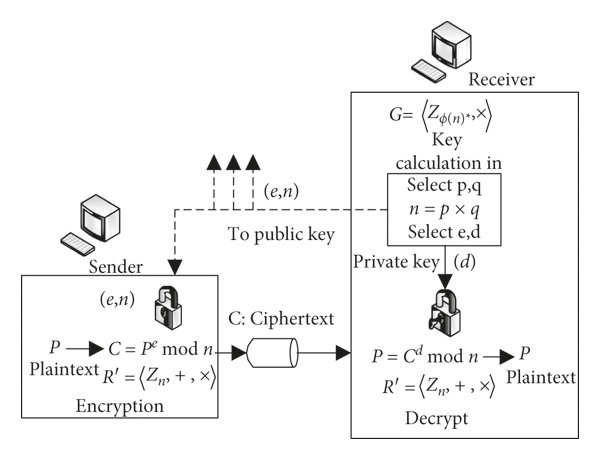

# 谈谈RSA 的工作原理

> 原文地址: [https://mp.weixin.qq.com/s/Zdd5ZBuseIRwI8PAKt1\_tA](https://mp.weixin.qq.com/s/Zdd5ZBuseIRwI8PAKt1_tA)

##  **什么是 RSA 算法？**

RSA 算法是一种非对称加密算法，它依赖于两个密钥：用于加密的公钥和用于解密的私钥。

使用两个密钥的概念正是非对称加密的精髓所在。与对称加密使用同一密钥进行加密和解密不同，RSA 使用一对密钥。这种差异使其成为确保数据安全的强大工具。

## **RSA 背后的科学原理**

RSA 算法的优势在于能够有效地分解大素数。以下是该数学过程的简化表示：

## **密钥生成：**

RSA 算法中的密钥生成过程是其运行的基础环节。以下是详细的步骤说明。

1.  质数的选择：  
      第一步是选择两个不同的素数（ `p` 和 `q` ）。为了确保系统安全，这两个数必须随机选取，并且具有相似的比特长度。
    
2.  n **的计算：**  
      计算 `p` 和 `q` 的乘积 `n` 。这个值 `n` 将作为公钥和私钥的模数。由于素数只有两个因子（1 和它本身），两个素数的乘积将具有唯一的因数分解。这意味着 `n` 只能分解为 `p` 和 `q` ，这使得攻击者很难从 `n` 推导出 `p` 和 `q` 。
    
3.  欧拉函数 **`(φ)` 的计算：**  
      欧拉函数 `φ(n)` 与 `p` 和 `q` 的值直接相关。  
      计算欧拉函数：  
    `φ(n) = (p-1) * (q-1)`  
      它决定公钥和私钥。如果 `p` 和 `q` 不是素数，计算 `φ(n)` 就会变得更加复杂，从而危及 RSA 系统的安全性。
    
4.  公钥选择 **`(e)` ：**  
      选择一个与 `φ(n)` 互质的整数 `e` ，并满足 `1 < e < φ(n)` 。 `(n, e)` 即为公钥，可以提供给其他人。
    
5.  私钥计算 **`(d)` ：**  
      计算 `d` ，即 `e` 模 `φ(n)` 的模乘法逆元。这简单来说就是 `d` 是满足以下方程的数：  
    `(d * e)% φ(n) = 1`  
    `(n, d)` 表示私钥，应该保密。
    

## **加密：**

给定明文消息 `M` 和公钥 `(n, e)` ，密文 `C` 可以计算如下：  
`C = M^e mod n`  
这是加密过程，其中 `M^e` 表示消息 `M` `e` 次幂，然后除以 `n` 取余数。

## **解密：**

要从密文 `C` 和私钥 `(n, d)` 恢复明文消息 `M` ，请使用以下公式：  
`M = C^d mod n`  
这是解密方法，其中 `C^d` 表示密文 `C` `d` 幂，然后除以 `n` 取余数。

> RSA 系统的安全性主要依赖于分解大合数的计算难度。如果 `p` 和 `q` 是很大的素数，即使在高性能计算机上，分解 `n` 也会非常耗时耗力。这可以防止攻击者根据公钥推断出私钥，从而确保 RSA 系统的安全性。

  
编辑

我先简要重述图的内容，然后深入剖析RSA的工作原理。图中清晰地描绘了RSA的密钥生成、加密、解密以及公钥分发过程，我会结合数学基础、证明、安全性分析，并通过一个具体的小型数值示例来阐释（使用小素数以便计算演示；在实际应用中会使用大素数）。这将帮助您更全面理解RSA的核心机制。

### 图内容分析

这张图是一个标准的RSA算法示意图，分为发送者（Sender）和接收者（Receiver）两侧，中间通过公钥分发连接。关键元素包括：

-   接收者侧（右边）：
    

-   生成公钥的过程：选择两个大素数p和q，计算n = p × q，然后选择e和d（其中d是私钥）。
    
-   公钥表示为G = ⟨ℤ\_φ(n)\*, ×⟩，这是指在模φ(n)下的乘法群（用于确保e有逆元d）。
    
-   解密：接收密文C，使用私钥d计算P = C^d mod n，恢复明文P。
    
-   额外标注：R = ⟨ℤ\_n\*, ×⟩（模n下与n互素元素的乘法群）和R' = ⟨ℤ\_n +, ×⟩（模n下的环结构），强调RSA依赖于模运算的代数结构。
    
      
    

-   发送者侧（左边）：
    

-   加密：获取公钥(e, n)，将明文P加密为C = P^e mod n。
    
      
    

-   中间部分：
    

-   公钥(e, n)通过不安全通道分发（箭头表示“To public key”）。
    
-   私钥d仅由接收者持有。
    
      
    

-   整体流程：发送者加密明文→发送密文C→接收者解密。图中用锁图标象征加密/解密的“钥匙”概念。
    

图的数学标注（如φ(n)、mod n运算）突出了RSA的数论基础。这是一张教学性的流程图，准确捕捉了RSA的非对称性：加密用公钥，解密用私钥，且公钥可公开。

### RSA工作原理深入解说

RSA（以发明者Rivest、Shamir和Adleman命名）是一种非对称加密算法（公钥加密系统），于1977年提出。它允许在不安全信道上安全通信，而无需事先交换密钥。核心优势是“加密容易，解密需私钥”，安全性基于大整数因式分解的计算困难性。下面我从密钥生成、加密/解密、数学证明、安全性和局限性等方面深入剖析。

#### 1\. 密钥生成（Key Generation）

这是RSA的基础，由接收者（或密钥持有者）完成。过程确保公钥可公开，而私钥保密。图中右上角的“calculation in Select p,q → n = p × q → Select e,d”正是这一步。

-   步骤：
    

1.  随机选择两个大素数p和q（通常数百位长，且p ≠ q，以避免某些攻击）。这些素数必须保密。
    
2.  计算模数n = p × q。n是公钥的一部分，大小决定了加密强度（当前推荐至少2048位）。
    
3.  计算欧拉函数φ(n) = (p - 1)(q - 1)。φ(n)表示小于n且与n互素的整数个数（基于欧拉定理）。
    
4.  选择公钥指数e：1 < e < φ(n)，且gcd(e, φ(n)) = 1（e与φ(n)互素）。常见选择是e = 65537（一个费马素数，计算高效且安全）。
    
5.  计算私钥指数d：d是e在模φ(n)下的乘法逆元，即满足d × e ≡ 1 (mod φ(n))。可以使用扩展欧几里得算法或Python的pow(e, -1, φ(n))求解。
    
6.  输出：公钥为(e, n)，私钥为d（实际中常包括p、q以加速解密，但d是核心）。
    
      
    

-   **为什么这样设计？**
    
     图中提到的群结构G = ⟨ℤ\_φ(n)_, ×⟩确保了e有逆元d，因为这是乘法群（abelian group），乘法可逆。R = ⟨ℤ\_n_, ×⟩是模n下的单位群，用于模运算的安全性。
    
-   实际考虑：p和q应接近但不相同，选择时需避免弱素数（如可被Pollard rho算法快速分解）。生成过程是随机的，以抵抗字典攻击。
    

#### 2\. 加密（Encryption）

由发送者完成，使用接收者的公钥。图中左边：P → C = P^e mod n。

-   步骤：
    

1.  将明文消息转换为整数P（0 ≤ P < n）。实际中，明文通常用PKCS#7等填充方案处理，以防短消息攻击。
    
2.  计算密文C = P^e mod n（使用快速幂算法，如二进制指数化，避免直接计算大幂次）。
    
3.  发送C（即使被截获，也无法轻易解密）。
    
      
    

-   效率：e小（如65537）使加密快速。模运算确保C也在0到n-1范围内。
    

#### 3\. 解密（Decryption）

由接收者完成，使用私钥。图中右边：C → P = C^d mod n。

-   步骤：
    

1.  接收C。
    
2.  计算P = C^d mod n（同样用快速幂）。
    
3.  恢复原始消息。
    
      
    

-   优化：实际中使用中国剩余定理（CRT）：既然n = p × q，可分别计算mod p和mod q，然后合并，加速约4倍（因为d大）。
    

#### 4\. 数学基础与正确性证明

RSA的魔力在于：为什么C^d mod n = P？这基于数论定理。

-   欧拉定理：若gcd(P, n) = 1，则P^φ(n) ≡ 1 (mod n)。扩展到任意P（即使不互素，也成立）。
    
-   证明：
    

-   C = P^e mod n
    
-   因此P = C^d mod n = (P^e)^d mod n = P^(e×d) mod n
    
-   由于d × e ≡ 1 (mod φ(n))，即e×d = k×φ(n) + 1（某整数k）
    
-   所以P^(e×d) = P^(k×φ(n) + 1) = (P^φ(n))^k × P ≡ 1^k × P ≡ P (mod n)（由欧拉定理）
    
      
    

-   完整性：对于gcd(P, n) ≠ 1的情况，使用中国剩余定理证明：P ≡ 0 mod p或q时，也成立（细节见数论教材）。
    

图中的R和R'标注强调了这些运算在环/群中的闭合性，确保无溢出或无效结果。

#### 5\. 示例演示

为了直观，我用小素数模拟整个过程（实际中用大数）。假设p=61, q=53（图中未指定，但原理相同）。

-   密钥生成：
    

-   n = 61 × 53 = 3233
    
-   φ(n) = (61-1)(53-1) = 60 × 52 = 3120
    
-   选择e=7（gcd(7,3120)=1）
    
-   d = 7的逆元 mod 3120 = 1783（因为7×1783 = 12481 ≡ 1 mod 3120）
    
-   公钥：(7, 3233)，私钥：1783
    
      
    

-   加密：明文P=42
    

-   C = 42^7 mod 3233 = 240（计算详见快速幂）
    
      
    

-   解密：C=240
    

-   P = 240^1783 mod 3233 = 42
    
      
    

这验证了正确性。如果攻击者只知(7,3233)和240，无法轻易求d（需分解3233）。

#### 6\. 安全性分析

-   核心假设：大整数分解困难。已知n，求p/q是NP问题（当前无多项式算法）。2048位n需超算多年破解。
    
-   攻击方式：
    

-   因式分解：如通用数域筛法（GNFS），但对大n无效。
    
-   侧信道攻击：如时序攻击（观察计算时间推测d），需硬件防护。
    
-   弱密钥：如果p/q太近，可用Fermat攻击；e太小可广播攻击。
    
-   量子威胁：Shor's算法可在量子计算机上快速分解（但当前量子机不足以威胁2048位RSA）。
    
      
    

-   实际应用：RSA常用于密钥交换（如TLS/HTTPS），而非直接加密大文件（用AES等对称算法）。标准如RSA-OAEP添加填充防攻击。
    

#### 7\. 局限性与扩展

-   性能：解密慢（d大），故常与对称加密结合。
    
-   标准：RFC 8017定义现代RSA。
    
-   替代：ECC（椭圆曲线）更高效，但RSA仍广泛使用。
    

总之，RSA巧妙利用数论实现安全通信。这张图简洁概括了其本质：非对称密钥 + 模幂运算。

### Python 代码示例

  
这里用 Python 实现了一个简单的示例，使用小素数进行演示（实际应用中，如果需要更大的密钥和更高的安全性，请使用 cryptography 等库）。它能够生成密钥、加密消息并解密消息。我们使用 Python 内置的 pow 函数来实现高效的模幂运算和模逆运算。

Python

`import math      _# Step 1: Choose two primes (small for demo; use large in practice)_   p = 61   q = 53      _# Step 2: Compute n and phi(n)_   n = p * q   phi = (p - 1) * (q - 1)      _# Step 3: Choose e (coprime to phi)_   e = 7   g = math.gcd(e, phi)  _# Should be 1_   print(f"GCD of e and phi: {g}")      _# Step 4: Compute d (modular inverse of e mod phi)_   d = pow(e, -1, phi)      _# Keys_   print(f"Public key: ({e}, {n})")   print(f"Private key: ({d}, {n})")      _# Step 5: Encrypt a message_   message = 42  _# Plaintext (must be < n)_   cipher = pow(message, e, n)   print(f"Ciphertext: {cipher}")      _# Step 6: Decrypt_   decrypted = pow(cipher, d, n)   print(f"Decrypted: {decrypted}")`

#### 示例输出

运行此代码时：

文本

`GCD of e and phi: 1   Public key: (7, 3233)   Private key: (1783, 3233)   Ciphertext: 240   Decrypted: 42`

这证实了消息已正确恢复。在实际应用中，请生成随机的大素数并添加填充/错误处理。