# 谈谈SM2算法

> 原文地址: [https://mp.weixin.qq.com/s/g5Kt\_mOVgRz-kR990BIWbQ](https://mp.weixin.qq.com/s/g5Kt_mOVgRz-kR990BIWbQ)

SM2算法的核心是基于椭圆曲线的公钥密码系统，而椭圆曲线就像一个特殊的数学形状，用于生成安全的密钥。简单来说，SM2使用的椭圆曲线方程是标准的Weierstrass形式：**y² = x³ + a x + b**（所有运算都在模p的有限域上进行）。这里的x和y是曲线上的点坐标，a和b是固定系数，p是一个大素数，确保计算安全且高效。

这个方程不是在无限平面上的椭圆，而是“有限域”里的版本，看起来像一个散点图，但点之间有特殊的“加法”规则。坏人想破解它，就得解决超级难的数学难题，比如从公钥反推私钥，就像从一堆沙子里找特定一粒沙。

SM2的标准参数是固定的，由中国国家密码管理局定义，确保所有人用同一套“游戏规则”。下面我用表格列出关键参数（所有值都是16进制表示，256位长）：

参数

描述

值（16进制）

p

有限域的模数（大素数）

FFFFFFFE FFFFFFFF FFFFFFFF FFFFFFFF FFFFFFFF 00000000 FFFFFFFF FFFFFFFF

a

曲线系数a

FFFFFFFE FFFFFFFF FFFFFFFF FFFFFFFF FFFFFFFF 00000000 FFFFFFFF FFFFFFFC

b

曲线系数b

28E9FA9E 9D9F5E34 4D5A9E4B CF6509A7 F39789F5 15AB8F92 DDBCBD41 4D940E93

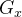

基点G的x坐标

32C4AE2C 1F198119 5F990446 6A39C994 8FE30BBF F2660BE1 715A4589 334C74C7

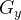

基点G的y坐标

BC3736A2 F4F6779C 59BDCEE3 6B692153 D0A9877C C62A4740 02DF32E5 2139F0A0

n

基点G的阶（order）

FFFFFFFE FFFFFFFF FFFFFFFF FFFFFFFF 7203DF6B 21C6052B 53BBF409 39D54123

h

余因子（cofactor，通常为1）

1

这些参数定义了整个曲线。基点G是曲线上一个起始点，从它开始“乘法”生成公钥。私钥是一个小于n的随机数，公钥就是私钥乘G。

为了让你更直观地理解，看看下面这些示意图：

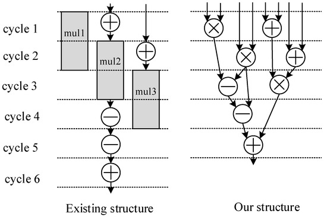编辑

  

这张图来自一篇关于SM2椭圆曲线密码（ECC）硬件实现的论文，具体是《A High-Performance Elliptic Curve Cryptographic Processor of SM2 over GF(p)》（发表于2019年）。它比较了两种结构在执行模乘法（modular multiplication）时的操作调度：左侧的“Existing structure”（现有结构，基于先前文献\[15\]的设计）和右侧的“Our structure”（proposed structure，论文作者提出的优化版本）。这些结构针对SM2算法中的核心运算——有限域GF(p)上的乘法和快速归约（reduction）——进行了时钟周期（cycle）级别的调度优化。

简单来说，这是一个**数据流图或流水线调度图**，展示了如何在硬件（如FPGA或ASIC）中高效计算大数乘法（256位×256位）。乘法在这里用“mul”表示（灰色块），加法用“+”，减法用“-”，乘法（交叉？）用“X”（可能代表组合或交叉运算，如Karatsuba算法中的中间步骤）。每个“cycle”代表一个时钟周期，箭头表示操作依赖和数据流动。左侧结构更串行（sequential），总需6周期；右侧更并行（pipelined），总需5周期，节省时间。

为什么优化这个？在SM2中，椭圆曲线点加法（point addition, PA）和点倍增（point doubling, PD）依赖大量模乘法，而标量乘法（scalar multiplication, PM，即计算k \* P）又依赖PA/PD。加速模乘法就能让整个SM2签名/加密更快，尤其在资源有限的硬件上。

下面我一步步分解两个结构。注意，图中“mul1”、“mul2”、“mul3”指三个半字乘法（half-word multiplications），因为用了Karatsuba–Ofman算法：把256位乘法拆成三个129位乘法（P00 = a0 \* b0, P11 = a1 \* b1, Pss = (a0 + a1) \* (b0 + b1)），然后组合结果并做模归约（reduction，确保结果在模p范围内）。

### 左侧：Existing Structure（现有结构）

这个结构基于一个半字乘法器（129-bit multiplier），每个半字乘法需2周期。全乘法需三个半字乘法，加上组合和归约，总共6周期。操作是串行的：一个mul完成后才开始下一个，中间有加/减来处理Karatsuba的组合（e.g., Pss - P00 - P11）。

-   Cycle 1：执行mul1（第一个半字乘法，e.g., P00 = a0 \* b0）。灰块表示乘法硬件忙碌。箭头向下指向一个“+”（可能预备加法，但未执行）。
    
-   Cycle 2：mul1完成，继续处理mul2（第二个半字乘法，e.g., P11 = a1 \* b1）。上方有“+”箭头，可能表示mul1的结果被用于加法准备，但整体还是串行。
    
-   Cycle 3：mul2完成，启动mul3（第三个半字乘法，e.g., Pss = (a0 + a1) \* (b0 + b1)）。箭头指向“-”（减法，用于组合如中间结果 = Pss - P00 - P11）。
    
-   Cycle 4：mul3进行中或完成，执行“-”（减法）。下方有一个灰块，可能表示归约的开始（fast reduction，使用加/减处理进位）。
    
-   Cycle 5：继续归约，使用“+”和“-”（可能多步减法，因为传统归约可能需多次减p来确保结果 < p）。
    
-   Cycle 6：最终“+”，完成整个乘法和归约。箭头向下表示输出。
    

**问题**：串行执行导致硬件利用率低（乘法器闲置时间多），总延迟6周期。归约用单阶段算法，可能需多达13次减法（因为中间结果可能达14p）。

### 右侧：Our Structure（拟议结构）

这个是优化的版本，仍用同一个129位半字乘法器，但通过更好的流水线（pipelining）和两阶段快速归约（two-stage fast reduction, TSFR）重叠操作。三个mul还是需执行，但mul3和归约部分重叠，总只需5周期。图中箭头更密集、树状，显示并行和重叠。

-   Cycle 1：启动mul1（P00）。箭头向下到多个操作：右上“+”（预加a0+a1等），表示并行准备Karatsuba的输入。
    
-   Cycle 2：mul1完成，同时启动mul2（P11）。箭头分叉到“X”（交叉组合？代表Karatsuba的中间计算）和“+”，显示mul1结果立即用于后续准备，而非等待。
    
-   Cycle 3：mul2进行，启动mul3（Pss）。箭头向下到“-”和“X”，表示开始组合（e.g., Pss - P00 - P11），利用前两个mul的结果。
    
-   Cycle 4：mul3完成，重叠第一阶段归约：用“-”和分叉箭头处理进位。图中树状结构显示多个并行加/减（用512位加法器处理）。
    
-   Cycle 5：第二阶段归约：箭头汇聚到“+”和“-”，只需一次最终减法（因为TSFR将范围缩到\[0, 2p)）。
    
-   Cycle 6：无操作（节省了！）。箭头直接向下输出，整个过程在cycle 5结束。
    

**优势**：通过重叠（e.g., mul3和归约同时），减少1周期。TSFR算法分两阶段：第一阶段粗归约，第二阶段精归约，只需1次减p，而非13次。硬件用carry-save加法（不传播进位，更快）。

### 关键差异和优化点

-   周期数：左侧6周期，右侧5周期——节省约16.7%，累积到整个SM2 PM（需数百次乘法）就很显著。
    
-   并行度：左侧箭头线性（串行），右侧树状（分支表示并行加/减）。右侧用更多“X”（可能指乘法组合或交叉路径）来重叠计算。
    
-   归约优化：传统单阶段归约（左侧）效率低；TSFR（右侧）用两步，确保最小减法次数。
    
-   硬件影响：两者都用小乘法器（省面积），但右侧更好利用流水线，适合高性能处理器。论文称在250 MHz ASIC上，PM只需0.057 ms。
    

如果这张图是论文中的Figure 1，它强调了模乘法在SM2中的瓶颈优化，帮助硬件更快实现数字签名等。

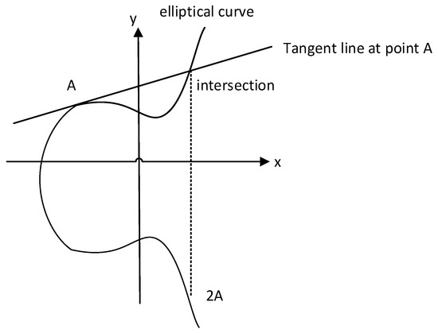  
编辑

这张图描绘了SM2白盒实现的随机泄露缓解策略，但核心还是围绕曲线方程的点运算，突出安全设计。

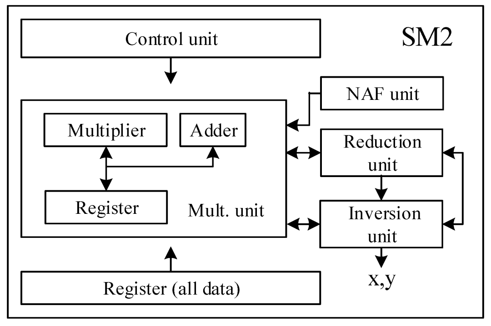  
编辑

最后这张是另一个SM2处理器示意图，强调了有限域运算和曲线参数的作用，帮助可视化方程在实际中的应用。

把它想成一台专门“算椭圆曲线”的小工厂：输入一串数字（私钥、随机数、消息哈希），最后吐出 **SM2 的签名 (r,s)** 或者吐出 **公钥点 (x,y)**。图里每个方块就是工厂里的一条产线/一个工位。

下面我用“流水线工厂 + 厨房”风格讲解，保证你一眼就懂。

* * *

## 1）整张图在讲什么：SM2 里最累的活是谁？

SM2 本质上最重的计算是 **标量乘法**：

-   生成公钥：P=dG
    
-   签名/验签里也大量用：kG、sG+tP
    

而“标量乘法”就是：把点 G在曲线上做一堆 **加法/倍点**（相当于反复“翻倍 + 选择性相加”）。

所以这个处理器的核心任务就是：**高效地做椭圆曲线点运算**。

* * *

## 2）各模块通俗解释（按工厂岗位来）

### A. Control unit（控制单元）——“总导演/调度员”

它不算数学，它负责：

-   现在是算 **KeyGen**（dG）还是 **Sign**（kG、求 r,s）还是 **Verify**
    
-   每一步该让谁干活：先倍点？再加点？要不要做一次模约简？
    
-   数据该从哪个寄存器搬到哪个单元
    

一句话：**指挥交通 + 发号施令**。

* * *

### B. Register (all data)（总仓库）——“冰箱/储物间”

SM2 算一会儿就会冒出一堆中间变量：

-   标量：d,k,r,s,e
    
-   点坐标：X,Y（甚至还有 Jacobian 坐标的 Z）
    
-   临时变量：乘法结果、加法进位、约简后的数
    

这些都放在“总仓库”里，随取随用。

* * *

### C. Mult. unit：Multiplier / Adder / Register（算术核心）——“大力士 + 小算盘 + 临时盘子”

这是标量域里的“体力活”：

-   Multiplier（乘法器）：干最重的活，比如算 a⋅b
    
-   Adder（加法器）：算 a+b 或 a−b
    
-   Register（局部寄存器）：给它们放临时结果，避免来回搬运
    

你可以把它理解为：  
**厨房里的灶台（Multiplier）+ 砧板（Adder）+ 小碗（Register）**。

椭圆曲线点加/倍点要用到很多乘法/平方/加减，这块就是“发动机”。

* * *

### D. NAF unit（NAF 单元）——“省油的导航：少做加法”

NAF = Non-Adjacent Form，一种把标量（比如 k 或 d）写成更“聪明”的二进制表示的方法。

普通二进制：可能很多位是 1 → 要做很多次“加点”。  
NAF 表示：尽量让 1 的数量少，而且 1 不挨着 → **加点次数更少**。

效果就像：

-   你开车导航：普通路线要走很多红绿灯（加点）
    
-   NAF 给你一条“红绿灯更少的路线”  
      所以整体更快、更省电。
    

* * *

### E. Reduction unit（约简单元）——“把数字拉回合法范围的保安”

在有限域运算里，所有数都要 **mod p**（坐标域）或 **mod n**（标量域）。

乘法一做完可能变成超大的数，它就负责：

-   做模约简（mod p / mod n）
    
-   把结果“裁剪回”规定范围
    

它就像结账时的“找零机”：  
不管你给多大面额，最后都找成“规定币值体系内”的数。

* * *

### F. Inversion unit（求逆单元）——“最贵的一道菜：除法/求逆”

在有限域里“除法”不直接做，而是变成求逆：

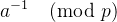

求逆通常比乘法贵很多（像“做一道佛跳墙”那么耗时），因此处理器往往单独有一个求逆单元。

在点运算里，尤其是 **仿射坐标** 的点加法公式会用到除法；  
硬件常用技巧是用 **Jacobian 坐标** 让中间过程几乎不需要求逆，最后输出 x,y 时再做一次求逆（图里输出写着 X,Y，就是最后落到仿射坐标）。

* * *

### G. X, Y（输出坐标）——“成品装盒区”

最终算出来的椭圆曲线点坐标输出：

-   例如公钥点 P=(x,y)
    
-   或者验签时算出来的某个点 sG+tP 的坐标
    

* * *

## 3）把它串成一个“生动”的工作流程：签名时发生了什么？

以 **签名** 为例（大概）：

1.  Control unit：开始签名！把消息哈希 e、随机数 k 准备好
    
2.  NAF unit：把 k 变成“省油版路线图”（NAF 表示）
    
3.  循环执行标量乘 kG：
    

-   每轮都要“倍点”（点翻倍）→ 用 Multiplier/Adder 干一堆乘加
    
-   遇到 NAF 位是 1 或 -1 才“加点/减点” → 少做很多次加点
    
-   每次算术结果都要过 **Reduction unit**（保证 mod p 正确）
    
      
    

5.  得到点 R=(x1,y1)，输出区拿到 x1
    
6.  Control unit 继续指挥：算 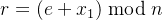，再算 s
    

-   这里会涉及 mod n 的乘加、以及一个“求逆”（例如 ）
    
-   求逆就叫上 **Inversion unit** 来做“佛跳墙”
    
      
    

8.  最终吐出签名 (r,s)（图里没画 r,s，但这是 SM2 签名核心产物）
    

* * *

## 4）为什么这样的拆分很合理？

-   乘法器：最忙、最耗资源 → 单独强调
    
-   求逆器：次数少但很贵 → 单独做、并尽量减少它的调用
    
-   NAF：减少加点次数 → 直接省电提速
    
-   约简：有限域必须随时 mod → 不可缺的“纠错/保安”
    
-   控制单元 + 寄存器：让流水线不断料
    

就像一个高效餐厅：

-   切配（Adder/寄存器）
    
-   爆炒（Multiplier）
    
-   慢炖（Inversion）
    
-   出菜前摆盘（Reduction + 输出）
    

那我们把“点加/点倍”的**成本账本**翻出来——你会一下明白：为什么图里专门放了 **NAF unit、Reduction unit、Inversion unit**，以及为什么工程实现都在拼命“少做求逆”。

* * *

## 1) 先立个“硬件厨房成本单位”

在有限域里（mod p 或 mod n）常把操作成本按三种食材算：

-   M：一次乘法（Multiplication）——“爆炒”
    
-   S：一次平方（Squaring）——“快炒”（通常比乘法便宜一点）
    
-   I：一次求逆（Inversion）——“佛跳墙”（非常贵）
    

经验上（大概量级，具体看实现）：

-   1 次 I ≈ 80～150 次 M（甚至更高）
    

所以结论先放这儿：

> **求逆 I 是性能杀手**。能少做一次就赚大了。

* * *

## 2) 为什么处理器图里把 Inversion unit 单独画出来？

因为它又贵又“长”：

-   乘法/平方可以做成高吞吐流水线（Multiplier/Adder 很忙）
    
-   求逆往往是扩展欧几里得或幂运算（要跑很多轮），像“慢炖锅”
    
-   于是硬件上常把求逆做成一个独立大模块：**不常用，但每次用都很重**
    

* * *

## 3) 点运算的两种坐标：仿射 vs Jacobian（这决定你要不要频繁求逆）

### A) 仿射坐标（Affine）：点就是 (x,y)

公式看起来简洁，但点加/点倍会出现除法，例如：

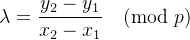

这就要 **求逆 I**（因为除法=乘以逆元）。

**坏消息**：如果你每次点加都做 1 次 I，那标量乘法会慢成乌龟。

### B) Jacobian 坐标：点是 (X:Y:Z)(X:Y:Z)(X:Y:Z)，真实坐标是

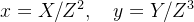

好处：点加/点倍的中间公式里**几乎不需要求逆**，主要用乘法/平方（M、S）。  
最后真正要输出 (x,y) 时，再做 **一次求逆**把 Z还原回去。

所以硬件图里 “X,Y 输出 + Inversion unit” 很像：

> **中间全程快炒（M/S），出锅装盘时才做一次佛跳墙（I）。**

* * *

## 4) “点倍/点加”到底要花多少 M/S/I？（成本表）

下面是**常见数量级**（不同公式/优化会有差异，但趋势稳定）：

### 仿射坐标（Affine）

-   点加 P+Q：大致 **1I + 若干 M/S**
    
-   点倍 2P：大致 **1I + 若干 M/S**
    

\=> 频繁出现 **I**，很不划算。

### Jacobian 坐标（常见实现，短Weierstrass曲线；SM2 的曲线参数也支持优化）

-   点倍 2P：大致 **4M + 4S**（数量级）
    
-   点加 P+Q（普通）：大致 **~11M + 5S**（数量级）
    
-   点加（Mixed，加一个仿射点）：大致 **~8M + 3S**（数量级）
    
-   最后转回仿射（得到输出 X,Y）：**1I + 若干 M/S**
    

你看到了吗？

> Jacobian 把“每一步都要 I”变成“最后才要 1 次 I”。  
> 这就是 Inversion unit 存在的意义：**少用但必须有**。

* * *

## 5) NAF unit 为什么能显著加速？——它让“加点次数”变少

标量乘法 kG 的核心套路是 **Double-and-Add**：

-   每一位都要做一次“倍点”（Double）——这个躲不掉
    
-   只有当该位是 1（或非零）时才需要“加点”（Add）
    

### 普通二进制表示

对 256 位标量：

-   倍点：固定 ~256 次
    
-   加点：平均一半位是 1 → ~128 次
    

### NAF 表示（Non-Adjacent Form）

NAF 的性质：**非零位更少、且不相邻**  
平均非零位密度大约降到 **~1/3** 左右：

-   倍点：仍然 ~256 次
    
-   加点：变成 ~85 次左右（明显少）
    

更狠的是窗口 NAF（wNAF）：再把加点次数压低到大约

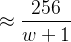

比如 w=5，加点次数约 256/6≈43（当然要配合预计算表）。

### 一个超小例子（直观感受）

我们刚刚玩具例子里 k=14：

-   二进制：1110 → 有 3 个 1（加点次数偏多）
    
-   NAF 可以写成：10000 − 00010（相当于 16−2）  
      非零位只有 2 个（一个 +1，一个 -1）→ 加点更少
    

所以图里的 **NAF unit** 就像：

> “把路线规划得更省红绿灯”，让你少停（少加点），自然更快。

* * *

## 6) Reduction unit 为什么也很关键？——它是“随手把锅沿擦干净”

在硬件里，乘法结果会变得很大（几百位甚至更长），如果不及时 mod 回来：

-   寄存器装不下
    
-   后续运算会越来越慢
    
-   可能溢出/出错
    

所以 **Reduction unit** 就是每次乘完、平方完的“自动取模清理机”：

> 你做菜时边炒边收汁，保证锅里永远是“可控体积”。

* * *

## 7) 把整台 SM2 处理器想成一场“乐队演出”

-   Control unit：指挥家（决定何时 Double、何时 Add、何时 Reduce、何时 Invert）
    
-   Multiplier/Adder：鼓手和贝斯（节奏担当，最忙）
    
-   Registers：乐谱架（中间变量放这里）
    
-   Reduction：调音师（把每次结果都调回合法音域 mod p/n）
    
-   NAF：编曲师（减少高难段落“加点”出现次数）
    
-   Inversion：独奏大咖（不常上台，但一上台就很“贵”很久）
    
-   X,Y 输出：演出收尾的“定格镜头”（最后一次求逆把坐标还原成标准形态）
    

  

把这张框图“跑起来”，像看一段动画脚本一样：**控制单元每一拍在做什么、寄存器里放什么、哪些模块在忙**。我会用很口语的“CPU 指令流”来讲。

* * *

## 1) 先定场景：我们要算什么？

最典型、最耗时的动作是 **标量乘法**：

-   公钥：P=dG
    
-   签名：R=kG
    
-   验签：X=sG+tP
    

所以我们重点讲 **一次 kG（或 dG）是怎么在硬件里一轮轮算出来的**。

* * *

## 2) 寄存器（Register all data）里通常放哪些“角色”？

把寄存器当作“片场道具桌”，常见会有：

### 点寄存器（曲线点）

-   R：当前累积结果点（初始化为无穷点 O）
    
-   Q：当前“被翻倍的点”（起始为基点 G）
    
-   这些点通常用 Jacobian 坐标：(X:Y:Z)
    

### 标量/控制寄存器（mod n）

-   k：标量（或其 NAF 表示）
    
-   i：当前处理到第几位
    
-   sign：当前 NAF 位是 +1 / 0 / -1
    

### 临时寄存器（算术中间量）

-   T0, T1, T2…：乘法/平方/加减中间结果  
      （你可以把它们理解成“搅拌碗”）
    

* * *

## 3) 控制单元的“脚本”：NAF + Double-and-Add（每一轮干啥）

### 3.1 开机准备（Setup）

1.  NAF unit：把标量 k 转成 NAF（或 wNAF）序列  
      输出：一串位 ui∈{−1,0,+1}
    
2.  寄存器初始化：
    

-   R←OR （无穷点，累积结果）
    
-   Q←G（或从最高位开始时，用固定套路设置）
    
-   指针 i←最高位
    
      
    

> 有些实现是“从最高位到最低位”，也有从低位到高位；硬件通常偏爱从高位到低位（更像移位器/流水线）。

* * *

## 4) 主循环：每一位（每一拍）都在发生什么？

想象你在看一台机器跳舞：**每轮必做 Double，遇到非零 NAF 位才做 Add/Sub**。

### 第 i 轮（处理 NAF 位 uiu\_iui）

#### Step A：Double（必做）

控制单元喊：

-   “Mult unit，上！”：做点倍 R←2R
    

在 Jacobian 坐标里，点倍需要一堆 M/S：

-   Multiplier：狂做乘法/平方
    
-   Adder：做加减组合
    
-   Reduction：每做完一段就取模（防溢出、保证在域内）
    

**像什么？**  
像你每一轮都要把面团“对折一次”（Double），这一步固定存在。

#### Step B：看 NAF 位（省油导航起作用了）

控制单元问 NAF unit：

-   “这一位 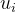 是多少？”
    

三种情况：

1.  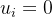
    

-   什么都不加，直接进入下一位  
      像：这一拍“只对折不加料”。
    
      
    

3.  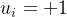
    

-   做点加：R←R+Q（或 +G / +预计算点）  
      Mult unit + Reduction 再忙一轮。
    
      
    

5.  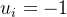
    

-   做点减：R←R−Q  
      点减其实是加上负点：(x,y)↦(x,−y)（mod p）  
      然后同样走点加电路。
    
      
    

> 你会发现：NAF 的魔法在于：很多位都是 0，于是 Step B 经常啥也不用做，省了大量“加点”。

#### Step C：更新指针

-   i←i−1，循环继续
    

* * *

## 5) “Q 是谁？”为什么图里没画预计算表也能理解？

在最基础的 Double-and-Add 中：

-   你要么让 Q=G 固定不变（每次只加/减 G）
    
-   要么用窗口法 wNAF：提前准备一张小表  
      G,3G,5G,...  
      这样遇到某些位时一次加一个更大的“预制块”，进一步减少加点次数
    

你这张图没画预计算表，但 **NAF unit** 的存在通常暗示：它要么做 NAF，要么做 wNAF（更常见）。

* * *

## 6) 最后的“成品出锅”：为什么这时才叫 Inversion unit？

主循环算完，寄存器里得到的是 Jacobian 点：

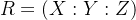

但我们要输出仿射坐标 (x,y)：

这一步需要求逆 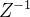（一次 I，很贵）：

1.  Inversion unit：算 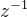 
    
2.  Mult unit：算
    

-   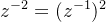
    
-   
    
      
    

4.  Reduction unit：随时 mod p
    
5.  输出：
    

-   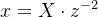
    
-   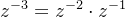
    
      
    

这就是“为什么求逆器不常用，但最后必须登场”的原因：

> 全程靠 Jacobian 避开求逆，**最后只求一次逆**来“落地成标准坐标”。

* * *

## 7) 把它映射到 SM2 的三种任务

### A) 生成公钥：P=dG

-   NAF(d) → 主循环（Double + 少量 Add）→ 一次求逆 → 输出 P(x,y)
    

### B) 签名：算 R=kG 得到 x1

-   NAF(k) → 主循环 → 一次求逆 → 得到 x1
    
-   然后标量域里继续算 r,s（mod n）：
    

-   r = (e + x1) mod n
    
-   s 需要一次求逆（例如 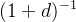→ 也会叫 Inversion unit（但这是 mod n 的逆）
    
      
    

> 注意：图里 Inversion unit 画在一起，实际可能有“mod p 的求逆器”和“mod n 的求逆器”或复用同一个大求逆器。

### C) 验签：算 X=sG+tP

-   这里常用“双标量乘法”技巧（Shamir trick）：少算一些倍点/加点
    
-   但硬件上仍可视作：控制单元调度 Mult unit 做一堆点运算，最后输出一个点用于比对 r。
    

* * *

## 8) 一句“带画面感”的总结

-   NAF unit：把“要走的路”改成红绿灯更少的路线（少加点）
    
-   Multiplier/Adder：跑得最勤快的厨子（乘法/加法不停炒菜）
    
-   Reduction：每炒两下就把汁收回到锅里（mod）
    
-   Inversion：最后出锅前的“顶级慢工序”（只做一次，最贵）
    
-   Control unit：导演喊 Action，安排谁上场、什么时候上场
    
-   Register：道具桌，保证中间材料随手可取