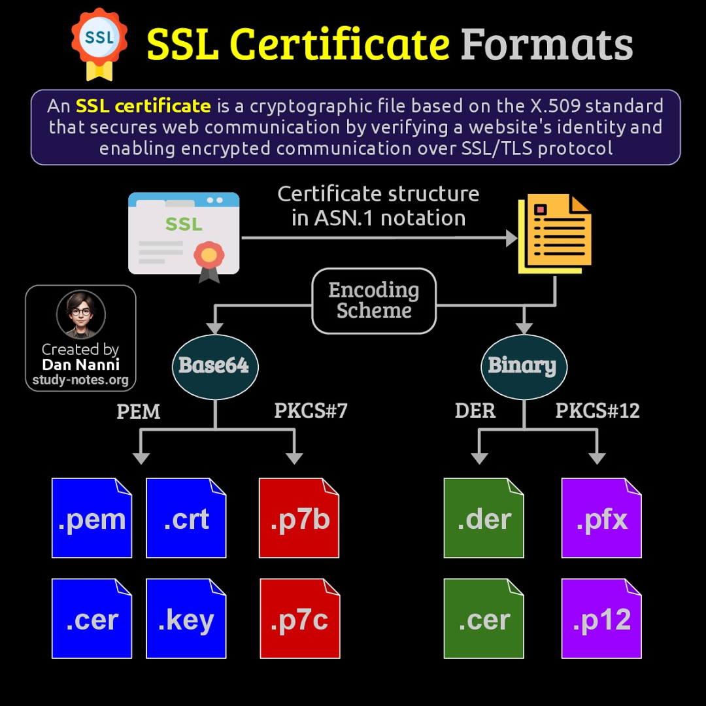

# 谈谈SSL证书的PEM、DER和PKCS#12格式


> 原文地址: [https://mp.weixin.qq.com/s/vJszBsxhX49iXes4XkOGYQ](https://mp.weixin.qq.com/s/vJszBsxhX49iXes4XkOGYQ)



这是一张关于SSL证书格式的\_infographic\_（信息图），标题为“SSL Certificate Formats”。图片的核心内容基于X.509标准解释SSL证书的结构和编码方式，强调SSL证书是一种加密文件，用于验证网站身份并启用SSL/TLS协议下的加密通信。图片的创建者标注为“Dan Nanni”，来源为“study-notes.org”。

图片的结构采用树状图形式，从上到下展开：

-   起点：SSL证书的结构用ASN.1（Abstract Syntax Notation One）表示，这是X.509证书的标准描述语言，用于定义证书的字段（如版本、序列号、发行者、有效期、公钥等）。
    
-   中间层：ASN.1结构通过“Encoding Scheme”（编码方案）转换为实际文件格式，分为两大分支：
    

-   Base64：一种文本编码方式，将二进制数据转换为可读的ASCII字符。
    
-   Binary：直接的二进制编码，不进行文本转换。
    
      
    

-   末端分支：
    
    Base64下分为：
    
       DER：关联文件扩展名为 .der、.cer。
    
       PKCS#12：关联文件扩展名为 .pfx、.p12。
    
    Binary下分为：
    
       PEM：关联文件扩展名为 .pem、.crt、.cer、.key。
    
       PKCS#7：关联文件扩展名为 .p7b、.p7c。
    
      
    

图片使用彩色文件图标（如蓝色.pem、红色.p7b等）来视觉化不同格式的文件扩展名，并通过箭头连接展示从ASN.1到最终格式的转换过程。整体设计简洁，旨在帮助理解SSL证书的编码变体及其常见文件类型。图片还提到证书确保网站通信的安全性，但未深入技术细节，如加密算法或具体字段。

### SSL证书的PEM、DER和PKCS#12格式区别

基于图片的描述和SSL证书的标准知识，我将重点比较PEM、DER和PKCS#12这三种格式的区别。这些格式都是X.509证书的衍生，但编码方式、内容包容性和使用场景不同。以下从多个维度进行对比：

#### 1. **编码方式**

  

-   **PEM**
    
    采用Base64编码，将二进制数据（通常是DER格式）转换为纯文本格式，并在开头和结尾添加特定标签（如-----BEGIN CERTIFICATE----- 和 -----END CERTIFICATE-----）。这使得PEM文件易于阅读和传输（如通过邮件或文本编辑器复制）。
    
      
    
-   **DER**
    
    纯二进制编码，直接遵循ASN.1的Distinguished Encoding Rules（DER）规则。没有文本转换，因此文件是不可读的二进制数据。
    
      
    
-   **PKCS#12**
    
    也是二进制编码，但基于PKCS#12标准（一种档案格式），通常包含加密保护（如密码）。它可以打包多个组件，而不仅仅是单一证书。
    

#### 2. **文件内容和包容性**

  

-   **PEM**
    
    通常包含单个证书、公钥或私钥，但可以链式包含多个证书（例如证书链）。它以文本形式存在，便于手动编辑或连接多个证书。
    
      
    
-   **DER**
    
    严格包含单个证书或密钥的二进制表示，不能轻松包含多个项。没有头尾标签，内容更紧凑。
    
      
    
-   **PKCS#12**
    
    功能最全面，可以包含证书、私钥、证书链（包括中间CA证书）和可选的密码保护。它像一个“容器”或“档案文件”，常用于导出整个证书包（如从浏览器导出）。
    

#### 3. **文件扩展名（基于图片）**

  

-   **PEM**
    
    .pem、.crt、.cer、.key（图片中蓝色和绿色图标）。
    
      
    
-   **DER**
    
    .der、.cer（图片中绿色图标）。注意.cer可以是PEM或DER，取决于编码。
    
      
    
-   **PKCS#12**
    
    .pfx、.p12（图片中紫色图标）。
    

#### 4. **使用场景和兼容性**

-   PEM：最常见于Apache、Nginx等Web服务器配置，以及OpenSSL工具。因为是文本格式，兼容性高，易于在不同系统间传输。适合需要手动配置或调试的场景。
    
-   DER：常用于Java环境（如Keystore）或Windows系统，因为二进制格式更高效，不需要额外转换。兼容性稍差于PEM，但文件大小更小。
    
-   PKCS#12：主要用于Windows（IIS服务器）和浏览器（如Chrome、Firefox）的证书导入/导出。适合需要保护私钥的场景（如移动设备或备份），因为支持加密。但兼容性依赖于支持PKCS#12的软件，不如PEM通用。
    

#### 5. **优缺点总结**

格式

优点

缺点

**PEM**

文本可读、易传输、可链式多个证书

文件较大（因Base64膨胀约33%）

**DER**

紧凑、高效、二进制纯净

不可读、不易手动编辑

**PKCS#12**

支持打包多个组件、密码保护

二进制且复杂、兼容性依赖工具

总的来说，图片将这些格式置于ASN.1的编码树下，突出PEM和PKCS#12分别属于Base64和Binary分支（DER也是Binary）。在实际应用中，选择格式取决于系统需求：PEM适合跨平台文本操作，DER适合高效二进制，PKCS#12适合安全打包。如果需要转换（如PEM转DER），可以使用OpenSSL命令如openssl x509 -outform der -in certificate.pem -out certificate.der。

如何读取 PEM 文件以获取公钥和私钥

## ASN.1在证书中的作用

ASN.1（Abstract Syntax Notation One）是一种国际标准，用于描述数据结构和编码规则，主要由ITU-T和ISO联合定义（标准如ITU-T X.680）。在SSL/TLS证书（基于X.509标准）中的作用是作为一种抽象的、平台无关的语法来定义证书的内部结构，确保证书数据在不同系统间一致性和互操作性。下面我从多个角度解释其具体作用。

### 1. **定义证书的抽象结构**

-   ASN.1充当一种“描述语言”，用于指定证书的字段和层次结构，而不涉及具体的编码细节。这类似于编程中的数据类型定义，帮助标准化证书的内容。
    
-   在X.509证书中，ASN.1定义了核心组件，包括：
    

-   TBSCertificate
    
    （To Be Signed Certificate）：证书主体部分，包含版本号、序列号、签名算法、发行者（Issuer）、有效期（Validity）、主体（Subject）、公钥信息（SubjectPublicKeyInfo）等。
    
-   SignatureAlgorithm：签名算法标识。
    
-   SignatureValue：实际签名值。
    
      
    

-   例如，证书的ASN.1表示可能像这样（简化伪代码）：
    
    text
    
    ```
    Certificate ::= SEQUENCE {    tbsCertificate       TBSCertificate,    signatureAlgorithm   AlgorithmIdentifier,    signatureValue       BIT STRING}
    ```
    
      
    
      这里SEQUENCE、BIT STRING等是ASN.1的基本类型，用于构建嵌套结构。
    

### 2. **确保数据类型和编码的标准化**

-   ASN.1允许定义复杂的数据类型（如序列、集合、字符串、整数），并支持嵌套（如证书链中的多个证书）。
    
-   它分离了“抽象语法”（数据是什么）和“传输语法”（数据如何编码），这使得证书可以被编码成不同格式（如图片中提到的PEM、DER等），而核心结构保持不变。
    
-   作用：防止歧义，确保全球证书颁发机构（CA）和浏览器/服务器在解析证书时使用相同的语义。例如，浏览器验证证书时，可以可靠地提取公钥或有效期，而不管底层编码。
    

### 3. **支持编码规则的转换**

-   ASN.1本身不直接存储数据，而是通过编码规则（如BER、DER、PER）转换为二进制或文本格式。
    
      
    
    -   **DER**
        
        （Distinguished Encoding Rules）：ASN.1的最常见编码变体，用于证书的二进制表示，确保唯一性和紧凑性（无歧义编码）。
        
    -   这直接连接到证书格式：从ASN.1结构编码到DER（二进制），再Base64转换为PEM（文本）。
        
          
        
-   作用：在网络传输中，ASN.1确保证书数据高效且安全地序列化。例如，OpenSSL工具使用ASN.1来解析或生成证书，如命令openssl asn1parse可以dump证书的ASN.1结构。
    

### 4. **在证书生命周期中的实际应用**

-   生成证书：CA使用ASN.1定义模板，填充数据后签名。
    
-   验证证书：客户端（如浏览器）解析ASN.1结构，检查字段（如发行者链、过期时间）。
    
-   扩展性：ASN.1支持扩展字段（如X.509 v3扩展，包括SAN、KeyUsage），允许证书适应新需求（如EV证书的组织验证）。
    
-   互操作性：在多平台环境中（如Windows、Linux、Java），ASN.1确保证书一致解析，避免兼容问题。
    

### 总结对比：ASN.1与其他格式的关系

方面

ASN.1的作用

与证书格式的关联

**抽象层**

定义结构（字段、类型）

基础，所有格式（如PEM、DER）都源于ASN.1

**编码层**

通过规则转换为可存储格式

DER是ASN.1的二进制编码；PEM是DER的Base64版本

**优势**

平台无关、灵活、可扩展

确保全球SSL/TLS生态系统的标准化

总之，ASN.1是X.509证书的“蓝图”，其作用在于提供一个通用的、抽象的框架来组织和标准化证书数据，从而支持安全的身份验证和加密通信。如果没有ASN.1，证书将缺乏一致性，导致兼容性和安全问题。

### PKCS#7格式概述

PKCS#7（Public Key Cryptography Standards #7）是一种由RSA Laboratories定义的标准（最初在1993年发布，现由IETF维护），主要用于处理加密消息和证书的语法。它是Cryptographic Message Syntax (CMS)的前身，后来在RFC 2315中标准化，并在RFC 5652中演变为CMS。尽管如此，PKCS#7仍被广泛用于兼容旧系统，尤其在SSL/TLS证书管理中。以下从多个方面介绍其关键特性。

#### 1. **定义与目的**

-   PKCS#7是一种容器格式，用于封装加密或签名的数据结构。它不直接处理加密算法，而是提供一个框架来组织证书、证书吊销列表 (CRL)、签名消息等。
    
-   主要目的：
    

-   证书链存储：常用于捆绑多个X.509证书（如根CA、中间CA和叶证书），形成证书链，便于验证网站身份。
    
-   签名消息：支持数字签名的数据包，用于确保消息完整性和来源认证（如S/MIME电子邮件签名）。
    
-   加密消息：可选支持数据加密，但PKCS#7更侧重于未加密的签名内容。
    
      
    

-   与其它PKCS标准（如PKCS#12）不同，PKCS#7通常不包含私钥，且不支持密码保护（除非扩展使用）。
    

#### 2. **结构与编码**

-   PKCS#7基于ASN.1（Abstract Syntax Notation One）语法定义，采用BER (Basic Encoding Rules) 或 DER (Distinguished Encoding Rules) 编码，通常以Base64形式呈现（使其可读）。
    
-   核心结构（简化ASN.1表示）：
    
    text
    
    ```
    SignedData ::= SEQUENCE {    version                INTEGER,    digestAlgorithms       SET OF AlgorithmIdentifier,    contentInfo            ContentInfo,    certificates           [0] IMPLICIT ExtendedCertificatesAndCertificates OPTIONAL,    crls                   [1] IMPLICIT CertificateRevocationLists OPTIONAL,    signerInfos            SET OF SignerInfo}
    ```
    
      
    

-   version：格式版本（通常为1）。
    
-   digestAlgorithms：使用的摘要算法（如SHA-256）。
    
-   contentInfo：实际内容（如证书链或消息）。
    
-   certificates：可选的证书集合。
    
-   signerInfos：签名者信息，包括签名值和算法。
    
      
    

-   文件格式：二进制（DER编码）或Base64编码（PEM-like），常见扩展名为 .p7b（证书链）、.p7c（签名证书）、.p7s（签名消息）。
    

#### 3. **与其它证书格式的区别**

-   \*\* vs. PEM\*\*：PEM是纯文本Base64编码的单个或多个证书，而PKCS#7是结构化的容器，支持签名和多证书，但也常以Base64呈现。PEM更简单，PKCS#7更适合复杂场景。
    
-   \*\* vs. DER\*\*：DER是单一证书的二进制编码，而PKCS#7可以封装多个DER编码的证书，并添加签名层。
    
-   \*\* vs. PKCS#12\*\*：PKCS#12 (.pfx/.p12) 是加密容器，支持私钥和密码保护，适合导出密钥对；PKCS#7不包含私钥，主要用于公开证书链的共享。
    
-   在SSL上下文中，PKCS#7常用于Microsoft IIS服务器的证书导入，而Apache/Nginx更偏好PEM。
    

#### 4. **使用场景**

-   SSL/TLS证书：从CA（如Let's Encrypt、DigiCert）获取证书链时，常以PKCS#7格式提供，便于安装到Windows服务器。
    
-   电子邮件安全：S/MIME中使用PKCS#7/CMS进行消息签名和加密。
    
-   代码签名：如Microsoft Authenticode，用于验证软件完整性。
    
-   工具支持：OpenSSL可处理PKCS#7，例如：
    

-   查看内容：openssl pkcs7 -in file.p7b -print\_certs -text
    
-   转换为PEM：openssl pkcs7 -print\_certs -in file.p7b -out chain.pem
    
      
    

-   局限性：PKCS#7不支持一些现代CMS扩展（如时间戳），因此在新技术中逐渐被CMS取代。但由于兼容性，它仍常见于企业环境。
    

#### 5. **优缺点**

-   优点：灵活、可扩展、支持多证书捆绑，便于传输和验证；兼容性强（Windows、Java等）。
    
-   缺点：不加密私钥（安全风险）；文件可能较大；标准较旧，可能缺少新安全特性。
    

总之，PKCS#7是一种可靠的签名和证书封装格式，在现代加密生态中扮演桥梁角色。