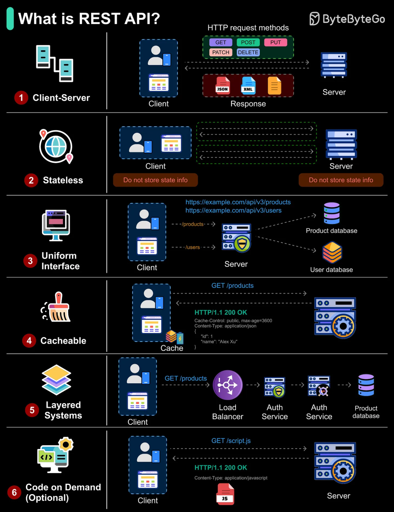

# 谈谈什么是 REST API


> 原文地址: [https://mp.weixin.qq.com/s/y0bBW1VrsaFVeqHK\_7fEWg](https://mp.weixin.qq.com/s/y0bBW1VrsaFVeqHK_7fEWg)



这张图在回答一个核心问题：**REST API 不是“某个具体协议/框架”，而是一套基于 Web（通常是 HTTP）的架构风格（Representational State Transfer）**。它强调把系统里的“东西”当成**资源（Resource）**，用统一的方式（HTTP 方法 + URI + 表示形式）去访问和操作这些资源，并遵循一组约束，让系统更可扩展、更易缓存、更易演进。

图里按 1~6 列出了 REST 的 6 条经典约束（其中第 6 条是可选）。

* * *

## 0）REST API 到底是什么（用一句话讲清）

**REST API = 用 URL 定位资源，用 HTTP 方法表达动作，用响应表示（JSON/XML等）传递资源状态，并保持无状态、可缓存、分层等约束的接口设计方式。**

图上也点了几个关键词：

-   HTTP request methods：GET / POST / PUT / PATCH / DELETE
    
-   Response 表示：JSON、XML（以及其他格式）
    
-   Client ↔ Server 的交互
    

* * *

## 1）Client–Server（客户端-服务器分离）

图的第一行强调：客户端只负责 UI/交互，服务器负责业务与数据。

**好处：**

-   前端/移动端/第三方调用都能复用同一套 API
    
-   服务端可以独立扩容与演进
    

**直觉例子：**

-   客户端请求 `GET /products`
    
-   服务器返回产品列表的 JSON（“资源的表示”）
    

* * *

## 2）Stateless（无状态）

图第二行写了 “Do not store state info”：**每次请求都必须带齐服务端处理所需的信息**，服务器不依赖“上一次你请求到哪了”。

**意味着：**

-   登录态通常通过 **Token/JWT** 放在请求头里（如 `Authorization: Bearer ...`）
    
-   分页、过滤、排序都放在 URL 查询参数里（如 `?page=2&pageSize=20`）
    
-   不要把“会话状态”塞在某台服务器内存里当唯一真相
    

**好处：**

-   易于水平扩展（随便打到哪台机器都能处理）
    
-   故障恢复更简单
    

* * *

## 3）Uniform Interface（统一接口）

图第三行给了示例：`/api/v3/products`、`/api/v3/users`。核心思想是：

-   资源用名词表示：`/products`、`/users`
    
-   动作用 HTTP 方法表达：
    

-   GET /products：查询列表
    
-   GET /products/{id}：查询单个
    
-   POST /products：创建
    
-   PUT /products/{id}：整体替换
    
-   PATCH /products/{id}：部分更新
    
-   DELETE /products/{id}：删除
    
      
    

同时还包括：

-   用 **状态码**表达结果（200/201/204/400/401/403/404/409/422/500…）
    
-   用 **Content-Type** 表示数据格式（如 `application/json`）
    

* * *

## 4）Cacheable（可缓存）

图第四行展示了 `GET /products` 返回 `HTTP/1.1 200 OK`，并带缓存相关头：`Cache-Control: public, max-age=3600`。

**要点：**

-   REST 鼓励让响应“可被缓存”（尤其是 GET）
    
-   缓存可以在浏览器、CDN、反向代理、客户端本地发生
    

**好处：**

-   降延迟、降带宽、降后端压力
    

* * *

## 5）Layered System（分层系统）

图第五行：Client → Load Balancer → Auth Service → … → Database

**要点：**

-   客户端不需要知道后面到底有几层，只要对外接口一致即可
    
-   你可以在中间加：网关、鉴权、限流、日志、缓存、服务拆分、服务网格等
    

**好处：**

-   更容易扩展、治理、安全隔离
    

* * *

## 6）Code on Demand（按需代码，可选）

图第六行：`GET /script.js` 返回 JavaScript。

**含义：**

-   服务器可以下发可执行代码给客户端来扩展能力（最常见就是网页下载 JS）
    
-   这条在纯“业务 REST API”里不常用，所以 REST 把它标为 optional
    

* * *

## 把图里的思想落到一个“最小 REST”例子

-   获取列表：`GET /api/v3/products`
    
-   创建产品：`POST /api/v3/products`（请求体 JSON）
    
-   获取单个：`GET /api/v3/products/123`
    
-   更新：`PATCH /api/v3/products/123`
    
-   删除：`DELETE /api/v3/products/123`
    
-   返回：状态码 + JSON + 合理的缓存/鉴权头
    

**示例：Web→PDF / PDF→Markdown 这种“转换服务”**

给出一套典型 REST 设计：把“转换任务”当成资源（有生命周期），把“输入/输出文件”也当成资源。

* * *

## 1) 资源模型（核心思路）

-   Job（转换任务）：`/v1/jobs/{jobId}`
    
-   Input（输入资源/文件）：可以是 URL、也可以是上传文件
    
-   Output（产物）：PDF / MD / HTML / 图片等：`/v1/jobs/{jobId}/artifacts/{name}`
    
-   Logs（日志）：`/v1/jobs/{jobId}/logs`
    
-   Events（进度事件，可选）：`/v1/jobs/{jobId}/events`（SSE/长轮询/Webhook）
    

* * *

## 2) 端点设计（最常用的一套）

### A. 创建任务（异步）

**POST**`/v1/jobs`

```
POST /v1/jobsContent-Type: application/jsonIdempotency-Key: 8b6c...   ; 可选但强烈建议
```

  

```
{  "type": "web_to_pdf",  "input": { "url": "https://example.com/a" },  "options": {    "pageSize": "A4",    "scale": 1.0,    "printBackground": true  },  "callback": { "url": "https://client.com/webhook/job" }}
```

  

**201 Created**（返回 Job 资源）

```
Location: /v1/jobs/job_123 
```

  

```
{  "id": "job_123",  "status": "queued",  "createdAt": "2025-12-09T03:10:00Z",  "links": {    "self": "/v1/jobs/job_123",    "artifacts": "/v1/jobs/job_123/artifacts",    "logs": "/v1/jobs/job_123/logs"  }}
```

  

> 为啥异步：转换通常耗时，REST 推荐“任务资源化”：创建→排队/处理中→完成/失败。

* * *

### B. 查询任务状态（轮询）

**GET**`/v1/jobs/{jobId}`

返回：

```
{  "id": "job_123",  "status": "running",  "progress": 0.42,  "etaSeconds": 12,  "result": null,  "error": null}
```

  

典型状态：

-   queued → `running` → `succeeded` / `failed` / `canceled`
    

* * *

### C. 列出任务产物

**GET**`/v1/jobs/{jobId}/artifacts`

```
[  { "name": "output.pdf", "type": "application/pdf", "size": 5823412,    "href": "/v1/jobs/job_123/artifacts/output.pdf" },  { "name": "output.md", "type": "text/markdown", "size": 231004,    "href": "/v1/jobs/job_123/artifacts/output.md" }]
```

  

* * *

### D. 下载产物（可缓存）

**GET**`/v1/jobs/{jobId}/artifacts/output.pdf`

建议返回头：

-   Content-Type: application/pdf
    
-   Content-Disposition: attachment; filename="output.pdf"
    
-   ETag / `Last-Modified`
    
-   Cache-Control: private, max-age=3600（按需）
    

* * *

### E. 取消任务（幂等）

**DELETE**`/v1/jobs/{jobId}`  
语义：请求取消（多次调用结果一致）

**204 No Content** 或返回 Job 状态 `canceled`

* * *

## 3) REST 约束怎么落地（对照你那张图）

### Client–Server

-   前端/调用方只管提交任务、查状态、拿结果
    
-   服务端负责排队、执行、存储、鉴权
    

### Stateless

-   每次请求带上 `Authorization`（JWT/Token）
    
-   分页、过滤写在 URL：`GET /v1/jobs?status=running&page=2`
    

### Uniform Interface

-   名词资源：`jobs / artifacts / logs`
    
-   动作靠方法：POST 创建、GET 查询、DELETE 取消
    

### Cacheable

-   GET 结果文件天然适合缓存（ETag/Cache-Control）
    
-   GET job 状态通常不缓存或短缓存（`Cache-Control: no-store` 或 very short）
    

### Layered System

-   典型链路：API Gateway → Auth → Job Service → Queue → Workers → Object Storage
    

### Code on Demand（可选）

-   通常不需要；除非你要下发脚本/模板给客户端
    

* * *

## 4) 实战细节（很关键，但很多人忽略）

### 幂等性（强烈建议）

-   创建任务用 `Idempotency-Key`，避免客户端重试导致重复下单
    
-   取消任务 DELETE 天然幂等
    

### 错误返回统一格式

```
{  "error": {    "code": "INVALID_URL",    "message": "The input.url is not reachable",    "details": { "field": "input.url" }  }}
```

  

### 状态码建议

-   201 创建成功（Location 指向 job）
    
-   200 查询成功
    
-   202 接受处理但尚未完成（也可用于创建后立即返回）
    
-   400/422 参数问题
    
-   401/403 鉴权/权限
    
-   404 job 不存在
    
-   409 状态冲突（比如已完成不能取消）
    
-   429 限流
    

* * *

## 5) 给你一套“最小可用”端点清单（你直接照着实现）

-   POST /v1/jobs 创建任务
    
-   GET /v1/jobs/{id} 查状态
    
-   GET /v1/jobs/{id}/artifacts 列产物
    
-   GET /v1/jobs/{id}/artifacts/{name} 下载
    
-   DELETE /v1/jobs/{id} 取消
    
-   （可选）`GET /v1/jobs/{id}/logs`
    
-   （可选）`POST /v1/jobs/{id}/retry`（严格说不够 REST，但很常见；更 REST 的做法是创建一个新 job 并引用 old job）
    

## 结论：

REST（Representational State Transfer，表述性状态转移）是一种软件架构风格，用于设计网络应用程序的 API（Application Programming Interface，应用程序接口）。它不是一个协议或标准，而是一套指导原则，由 Roy Fielding 在 2000 年博士论文中提出，主要用于 Web 服务，使客户端和服务器通过 HTTP 协议高效交互。REST API 强调资源（resources）的表示（如用户、产品），使用标准 HTTP 方法操作这些资源，常用于现代 Web 和移动应用的后端服务。

结合图片的 6 大原则，详细解释如下：

1.  Client-Server（客户端-服务器）： REST 将客户端（前端，如浏览器或 App）和服务器（后端）严格分离。客户端负责用户界面和请求，服务器处理逻辑和数据存储。这种分离允许两者独立开发和扩展。例如，图片中客户端发送请求，服务器返回响应，而不耦合具体实现。
    
2.  Stateless（无状态）： 每个请求必须自包含所有信息，服务器不存储客户端的会话状态（如登录信息必须每次带在请求头中）。这提高了可伸缩性和可靠性，因为任何服务器都能处理请求，而无需依赖特定实例。图片中强调双方都不存储状态，避免了复杂的状态管理。
    
3.  Uniform Interface（统一接口）： 通过标准化接口简化交互。核心包括：
    

-   资源标识：用 URI（如 /api/v3/users）表示资源。
    
-   资源操作：用 HTTP 方法：GET（读取）、POST（创建）、PUT（更新）、PATCH（部分更新）、DELETE（删除）。
    
-   自描述消息：响应包含元数据，如 HTTP 状态码（200 OK 表示成功）。
    
-   HATEOAS
    
    （Hypermedia as the Engine of Application State，可选）：响应中包含链接引导下一步操作。 图片示例了 URL 和数据库交互，展示了统一性带来的可预测性。
    
      
    

5.  Cacheable（可缓存）： 响应可以被标记为可缓存，客户端或中间代理（如 CDN）可存储副本，减少重复请求。图片显示了缓存头（如 Cache-Control），示例 JSON 数据可被缓存，提高性能和减少服务器负载。
    
6.  Layered Systems（分层系统）： 系统可由多层组成（如负载均衡器、认证层、API 网关），客户端无需知道内部结构，只需与入口交互。这支持 scalability 和 security。图片展示了请求经过多层到达数据库的流程。
    
7.  Code on Demand（按需代码，可选）： 服务器可发送可执行代码（如 JavaScript）给客户端，扩展客户端功能。但这不是必需的，图片标记为“Optional”，示例了返回 JS 文件的场景。
    

#### REST API 的优势和实际应用

-   优势：简单、灵活、可扩展，支持多种数据格式（JSON 最常见，XML 次之）。它利用 HTTP 的现有特性，无需额外协议。
    
-   与其它 API 的区别：不同于 SOAP（更复杂、基于 XML），REST 更轻量，适合微服务和云环境。GraphQL 是另一种替代，允许客户端指定数据，但 REST 更注重资源导向。
    
-   示例：一个电商 REST API：
    

-   GET /products：获取产品列表。
    
-   POST /products：添加新产品（body 中 JSON 数据）。
    
-   PUT /products/1：更新 ID 为 1 的产品。 响应示例：HTTP 200 OK, {"id":1, "name":"Product A"}。
    
      
    

REST API 广泛用于 Twitter API、GitHub API 等。如果严格遵守这些原则，则称为 RESTful API。图片很好地可视化了这些抽象概念，使其易懂。