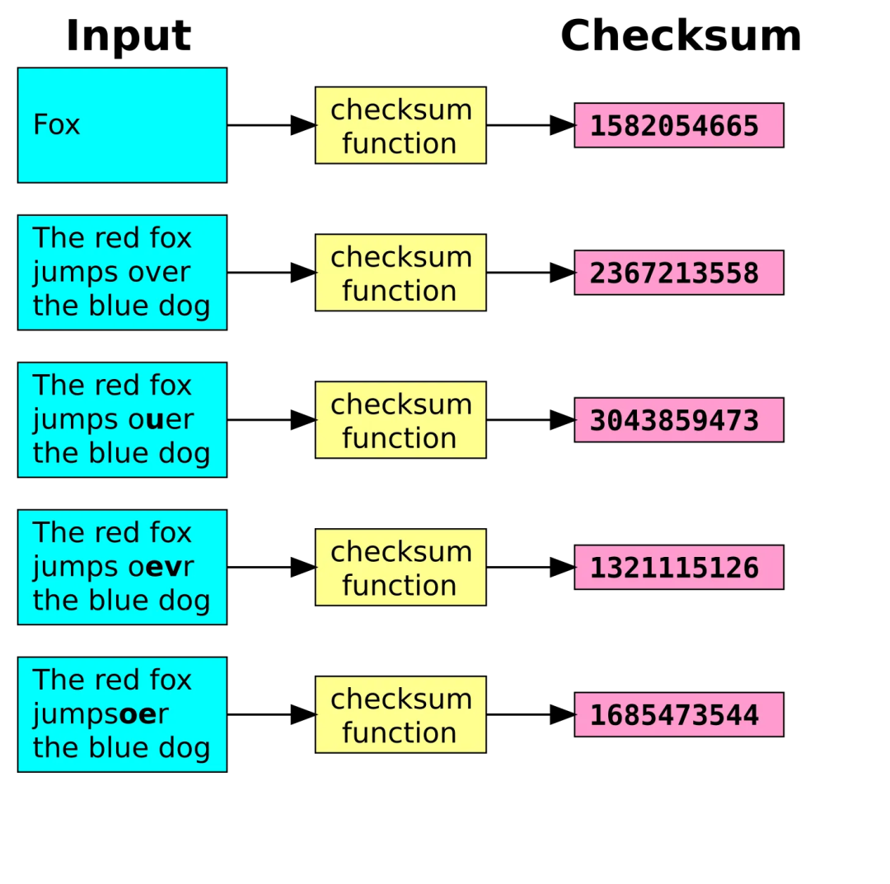

# 谈谈什么是checksum

> 原文地址: [https://mp.weixin.qq.com/s/pvZ7h\_eKqpZAZcZbQNyrsA](https://mp.weixin.qq.com/s/pvZ7h_eKqpZAZcZbQNyrsA)

此图描绘了一个表格或一系列带标签的方框，其中展示了各种文本字符串及其对应的“校验和函数”值。具体来说，它显示了：

-   字符串“Fox”，校验和为 1582054665。
    
-   字符串“红狐狸跳过蓝狗”，校验和为 2367213558。
    
-   一个有拼写错误的变体：“红狐狸跳过蓝狗”（其中“over”拼写错误为“ouer”），校验和为 3043859473。
    
-   另一个变体：“红狐狸跳过蓝狗”（“over”拼写错误为“oevr”），校验和为 1321115126。
    
-   还有一条：“红狐狸跳过蓝狗”（“over”拼写错误为“oEvr”，注意大小写），校验和为 1685473544。（文本渲染显示粘贴的文本块存在一些细微的不一致，例如最后一个文本块中的“jumpsoEr”，这似乎是格式错误或“jumps oEr”中的另一个拼写错误。）
    

  
视觉布局中，字符串用青色方框表示，“校验和函数”用黄色方框表示，数值用粉色方框表示，并以垂直列表的形式排列。这种设置似乎旨在演示即使输入文本发生微小的改变——例如单个字母的更改、大小写互换或位置颠倒——也会导致校验和输出完全不同。这是一个校验和敏感性的实际示例，很可能是为了突出其在检测数据错误或修改方面的作用。

  
校验和是使用数学算法从数据块（例如字符串、文件或消息）计算得出的值，主要用于验证数据的完整性。它就像数字指纹：如果数据被传输、存储或复制，您可以重新计算接收版本的校验和，并将其与原始校验和进行比较。如果两者匹配，则数据很可能未发生更改；如果不匹配，则表明发生了错误、损坏或篡改。常用的算法包括用于网络/存储错误检测的 CRC（循环冗余校验）、用于文件验证的 MD5 或 SHA-256，以及更简单的校验和算法，例如 Adler-32。在此图中，“校验和函数”似乎是一个特定的（可能是自定义的或经过哈希处理的）实现，因为其值是较大的整数，并且会随着输入的微小变化而发生显著变化——这是优秀校验和/哈希函数中称为“雪崩效应”的特性，可确保将微小的差异放大，从而实现可靠的检测。校验和在计算机领域被广泛用于验证下载、确保数据传输准确性（例如在 TCP/IP 中）或检测文件中的意外更改等任务。

# CRC 校验和算法

### 什么是 CRC？

循环冗余校验码 (CRC) 是一种常用的错误检测码，用于数字网络和存储设备中，以识别数据中的意外更改或损坏。当数据被发送或存储时，系统会计算一个短校验值（CRC）并将其附加到数据末尾。接收或检索数据时，系统会重新计算 CRC；如果重新计算后的值原始值匹配，则数据很可能完好无损。如果不匹配，则表示发生了错误，需要重新传输数据或采取其他修复措施。

### 数学基础

CRC（循环校验码）源于循环码理论，循环码是一种纠错码。它将数据视为一个表示多项式的大型二进制数，其中每一位都是一个系数（0 或 1）。计算过程涉及将该多项式除以伽罗瓦域 GF(2) 中的一个固定生成多项式，其中算术运算模 2（加法/减法使用异或运算，无进位）。对于 n 位 CRC，生成多项式为 n 次多项式，除法的余数即为校验。这创建了一种系统化的码，其中原始数据保持不变，CRC 附加到原始数据上形成一个可被生成多项式整除的码字。

### CRC 是如何计算的

该算法模拟二进制多项式长除法：

1.  在数据位串的末尾附加 n 个零位（其中 n 是 CRC 长度，与生成器的阶数相匹配）。
    
2.  将生成多项式（n+1 位）与填充数据的最左侧位对齐。
    
3.  执行除法：对于每个位置，如果当前被除数段的首位为 1，则将其与生成元异或；将生成元右移一位并重复此操作。如果首位为 0，则直接右移。
    
4.  继续执行，直到生成器移过整个填充字符串。最后的 n 位（余数）即为 CRC 值。
    
5.  一些变体包括预处理（例如，将寄存器初始化为全 1）、位反转（反射）或将最终余数与常量进行异或运算。
    

  
验证方法：将 CRC 校验码附加到原始数据，然后将结果除以生成器。余数为零表示未检测到错误

### 公共生成多项式

选择生成器时，应考虑其良好的误差检测特性，通常是本原多项式。例如：

CRC 类型

多项式（十六进制）

  

多项式表示

常见用途

CRC-32

0x04C11DB7

x³² + x²⁶ + x²³ + x²² + x¹⁶ + x¹² + x¹¹ + x¹⁰ + x⁸ + x⁷ + x⁵ + x⁴ + x² + x + 1

以太网、PNG、ZIP 文件

CRC-32C（Castagnoli）

0x1EDC6F41

x³² + x²⁸ + x²⁷ + x²⁶ + x²⁵ + x²³ + x²² + x²⁰ + x¹⁹ + x¹⁸ + x¹⁴ + x¹³ + x¹¹ + x¹⁰ + x⁹ + x⁸ + x⁶ + 1

iSCSI、SCTP 协议

CRC-16-CCITT

0x1021

x¹⁶ + x¹² + x⁵ + 1

X.25、HDLC、蓝牙

CRC-8

0xD5

x⁸ + x⁷ + x⁶ + x⁴ + x² + 1

ATM、小数据包

  
表示方法（正向、反向、库普曼表示法）和实现细节（例如位顺序）存在多种变体

### 简单示例

  
考虑使用生成多项式 x³ + x + 1（二进制 1011 ）对 14 位消息 11010011101100 进行 3 位 CRC 编码。

-   **步骤 1：**
    
     添加 3 个零： 11010011101100 000
    
-   **步骤 2：**
    
     除以 1011 （执行基于异或的长除法）：
    

-   从最左边开始：将 1101 与 1011 进行异或运算 → 0110
    
-   移位并继续：逐位进行，当首位为 1 时进行异或运算。
    
-   经过所有步骤后，余数为 100 。
    

-   **步骤 3：**
    
     附加 CRC：最终码字 = 11010011101100 100
    

  
验证方法：将 11010011101100100 除以 1011 ；如果计算无误，余数应为 000 。

如果发生比特翻转（例如，一位发生变化），重新计算会产生非零余数，从而检测到错误

###   
错误检测能力

CRC 擅长检测常见错误：

-   全部为单比特错误。
    
-   所有长度不超过 n 位的突发错误。
    
-   大多数较长的突发（随机错误导致的未检测到概率约为 2⁻ⁿ）。
    

它利用生成器的性质来确保微小的变化会产生不同的余数。例如，本原多项式可以检测出 2ⁿ - 1 位以下的所有单错误/双错误

### 局限性

-   CRC 不是加密算法；它容易受到蓄意篡改，因为攻击者可以调整数据并重新计算有效的 CRC。
    
-   它无法纠正错误，只能检测错误。
    
-   线性性质允许进行某些操作（例如，在特定条件下 CRC(x ⊕ y) = CRC(x) ⊕ CRC(y)），从而导致某些协议出现漏洞。
    
-   实现上的不一致（例如，初始值、反射）会导致系统之间不匹配。
    
-   选择不当的多项式可能会忽略特定的误差模式
    

  
之前的图片，显示的校验和值（例如，“Fox”的校验和为 1582054665）与使用常见 CRC-32 或 CRC-32/ZIP 等算法的标准 CRC-32 计算结果不符。它可能使用了不同的校验和算法，例如 Adler-32 或自定义哈希函数，以说明其对输入更改的敏感性。