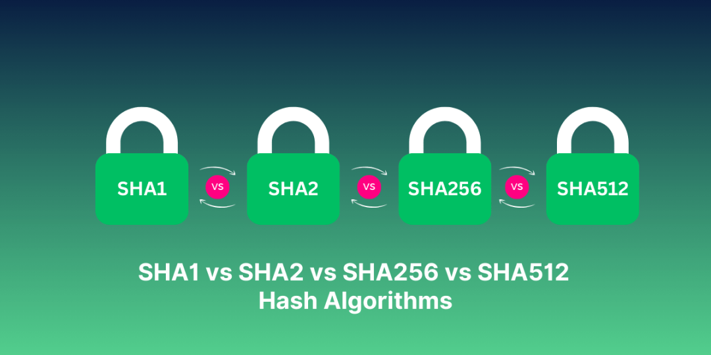

# 谈谈几种哈希算法的作用和差异


> 原文地址: [https://mp.weixin.qq.com/s/SazIftleCLBFqFBP9iWYMQ](https://mp.weixin.qq.com/s/SazIftleCLBFqFBP9iWYMQ)

   
编辑

## 哈希算法的作用（它不是加密）

哈希的核心用途通常有四类：

1.  完整性校验：下载文件后比对 SHA256 值，确认没被篡改。
    
2.  数字签名的“被签名对象”：签名通常是“先哈希再签名”（如 ECDSA/RSA + SHA-256）。
    
3.  消息认证码（MAC）：用 **HMAC-SHA256** 这类方式做“带密钥的完整性 + 身份确认”。
    
4.  指纹/索引/去重：内容寻址、去重存储等。
    

  

⚠️ 重要：**不要用纯 SHA1/SHA256 来存密码**。密码存储应使用 **bcrypt / scrypt / Argon2 / PBKDF2**（带盐、慢哈希/抗 GPU）。

## 四者差异一眼看懂

### 1) SHA1

-   输出长度：160 bit（20 字节）
    
-   现状：**已不安全（碰撞攻击被实用化）**，不应再用于证书签名、文件校验、安全相关指纹。
    
-   还能见到的地方：历史系统、旧 Git 仓库、兼容性遗留。
    

###   

### 2) SHA2（不是一个算法，是一整个家族）

-   SHA-224 / **SHA-256** / SHA-384 / **SHA-512** 都属于 SHA-2 家族。
    
-   图里把 “SHA2” 单独列出来，更多是在强调“**SHA-1 → SHA-2** 这一代际升级”。
    

###   

### 3) SHA-256（SHA2 的成员）

-   输出长度：256 bit（32 字节）
    
-   安全性：目前主流安全选择（普遍用于 TLS、证书、软件发布校验等）
    
-   常见用途：文件校验、证书指纹、签名哈希、区块链等。
    

###   

### 4) SHA-512（SHA2 的成员）

-   输出长度：512 bit（64 字节）
    
-   安全性：同样很强（输出更长）
    
-   性能特点：在很多 **64 位 CPU** 上，SHA-512 反而可能比 SHA-256 **更快**（内部以 64 位运算为主）。
    
-   代价：摘要更长，存储/传输多一倍；如果你只需要 256 bit 强度，可能“够用但偏大”。
    

##   

## 选择建议（按场景）

-   文件/接口数据完整性校验：优先 **SHA-256**（最通用），或在 64 位高吞吐场景用 **SHA-512**。
    
-   签名（证书/代码签名）：用 **SHA-256 / SHA-384**（现代生态最常见）。
    
-   带密钥校验（防篡改 + 防伪造）：用 **HMAC-SHA256**（别用“SHA256(密钥||消息)”这种拼接，容易踩长度扩展等坑）。
    
-   密码存储：用 **Argon2/bcrypt/scrypt/PBKDF2**（不要用 SHA 家族直接哈希）。
    

  

一句话总结：**SHA1 已淘汰；SHA2 是家族；SHA256 最通用；SHA512 更长、在 64 位上常更快但摘要更大。**

###   

### 几种哈希算法的作用和差异

哈希算法（Hash Algorithms）是一种将任意长度的数据输入映射为固定长度输出（称为哈希值或摘要）的函数，主要作用包括：

-   数据完整性验证：检测数据是否被篡改（如文件下载校验）。
    
-   密码存储：安全存储密码（哈希后不可逆转）。
    
-   数字签名和认证：用于区块链、SSL/TLS证书、软件分发等，确保来源真实性和非否认性。
    
-   其他应用：如消息认证码（MAC）、随机数生成、数据库索引等。
    

  

这些算法的核心属性是：确定性（相同输入总是相同输出）、不可逆（难以从哈希值反推原数据）、碰撞抵抗（不同输入产生相同输出的概率极低）。

图片中提到的SHA1、SHA2、SHA256和SHA512属于SHA（Secure Hash Algorithm）系列，由NSA设计、NIST标准化。注意，SHA2是一个家族，包括SHA-224、SHA-256、SHA-384和SHA-512等变体；图片中单独列出的SHA256和SHA512实际上是SHA2的特定成员，可能为了强调常见变体。以下是它们的比较（基于安全性、性能和应用）：

算法

输出位长

安全性水平

主要差异和作用

常见应用

现状和推荐

**SHA1**

160位

低（已不安全）

最早的SHA版本，基于MD5设计，但易受碰撞攻击（2017年已证明实际碰撞）。作用：早期用于数字签名和证书，但现在被弃用。差异：计算速度快，但哈希空间小，碰撞风险高。

Git版本控制（历史遗留）、旧SSL证书

不推荐使用；浏览器和系统已弃用（如Chrome标记为不安全）。

**SHA2**

变体（如224/256/384/512位）

高

SHA1的继任者，改进内部结构（更多轮次、更大常量），抵抗已知攻击。作用：通用哈希，提供更好碰撞抵抗。差异：作为家族，平衡速度和安全；比SHA1慢但更robust。

数字证书、密码哈希（如bcrypt结合）、文件校验

仍是标准，但推荐其更长位变体。

**SHA256**

256位

高

SHA2家族中最流行变体，输出更长，提供2^128级碰撞抵抗。作用：区块链和加密货币核心（如Bitcoin块哈希）。差异：比SHA1安全得多，比SHA512快（适合资源有限设备）；轮次为64。

Bitcoin、Ethereum、HTTPS证书、Docker镜像校验

广泛推荐；NIST批准，用于大多数现代应用。

**SHA512**

512位

最高

SHA2家族中最安全变体，使用64位字块，提供2^256级碰撞抵抗。作用：高安全需求场景，如政府加密。差异：输出最长，计算更慢（需更多CPU周期），适合64位处理器；轮次为80。

密码存储（PBKDF2结合）、Linux密码（/etc/shadow）、大文件哈希

推荐用于未来证明的安全，但对性能敏感应用可能过重。

**总体差异总结**：

-   安全性演进：SHA1已被破解（碰撞时间可行），SHA2系列未有实际碰撞，SHA256/SHA512提供指数级更高抵抗力。差异源于内部轮次、字大小和常量设计。
    
-   性能：SHA1最快，SHA256次之，SHA512最慢（因位长增加计算复杂度）。在现代硬件上，差异不大，但移动设备上明显。
    
-   兼容性：SHA1遗留系统多，但迁移到SHA256是趋势（如TLS 1.3要求）。
    
-   选择建议：对于一般用途，用SHA256；高安全需求，用SHA512。避免SHA1，除非兼容旧系统。
    

###   

### SHA系列哈希算法伪代码示例

哈希算法的伪代码通常描述其核心步骤，包括消息填充、块处理、压缩函数和最终哈希计算。下面我提供SHA1、SHA2（以SHA-256为例）和SHA-512的简化伪代码示例。这些是高层次的伪代码，不是完整实现（完整代码会很复杂，通常用编程语言如Python实现）。它们基于NIST标准，强调算法的结构差异。

注意：

-   所有SHA算法都处理消息为512位（SHA1/SHA2）或1024位（SHA3变体，但SHA512是SHA2的1024位变体）块。
    
-   输入：任意长度消息（字节数组）。
    
-   输出：固定长度哈希值。
    
-   差异：SHA1使用160位状态，易碰撞；SHA-256使用256位，64轮压缩；SHA-512使用512位，80轮，针对64位字优化。
    

####   

#### 1\. SHA1 伪代码

SHA1是较旧算法，使用5个32位字的状态（A-E），80轮压缩。

text

```
function SHA1(message):    # 步骤1: 消息填充    pad message to multiple of 512 bits: append '1' bit, zeros, and 64-bit length    # 步骤2: 初始化状态    h0 = 0x67452301    h1 = 0xEFCDAB89    h2 = 0x98BADCFE    h3 = 0x10325476    h4 = 0xC3D2E1F0    # 步骤3: 处理每个512位块    for each 512-bit block M:        # 扩展M到80个32位字W[0..79]        for i=0 to 15: W[i] = M[i*32..(i+1)*32]        for i=16 to 79: W[i] = ROTL(W[i-3] XOR W[i-8] XOR W[i-14] XOR W[i-16], 1)        # 初始化工作变量        a = h0, b = h1, c = h2, d = h3, e = h4        # 80轮压缩        for t=0 to 79:            if 0 <= t <= 19: f = (b AND c) OR ((NOT b) AND d); k = 0x5A827999            elif 20 <= t <= 39: f = b XOR c XOR d; k = 0x6ED9EBA1            elif 40 <= t <= 59: f = (b AND c) OR (b AND d) OR (c AND d); k = 0x8F1BBCDC            else: f = b XOR c XOR d; k = 0xCA62C1D6            temp = ROTL(a, 5) + f + e + k + W[t]            e = d            d = c            c = ROTL(b, 30)            b = a            a = temp        # 更新状态        h0 += a, h1 += b, h2 += c, h3 += d, h4 += e    # 步骤4: 输出哈希 (160位)    return concat(h0, h1, h2, h3, h4)  # as hex string
```

  

#### 2\. SHA-256 (SHA2家族) 伪代码

SHA-256使用8个32位字的状态（A-H），64轮压缩，更安全的常量和函数。

text

```
function SHA256(message):    # 步骤1: 消息填充    pad message to multiple of 512 bits: append '1' bit, zeros, and 64-bit length    # 步骤2: 初始化状态 (使用特定常量)    h = [0x6a09e667, 0xbb67ae85, 0x3c6ef372, 0xa54ff53a, 0x510e527f, 0x9b05688c, 0x1f83d9ab, 0x5be0cd19]    # 步骤3: 处理每个512位块 M    for each 512-bit block M:        # 扩展M到64个32位字W[0..63]        for i=0 to 15: W[i] = M[i*32..(i+1)*32]        for i=16 to 63:            s0 = ROTR(W[i-15], 7) XOR ROTR(W[i-15], 18) XOR (W[i-15] >> 3)            s1 = ROTR(W[i-2], 17) XOR ROTR(W[i-2], 19) XOR (W[i-2] >> 10)            W[i] = W[i-16] + s0 + W[i-7] + s1        # 初始化工作变量        a..h = h[0]..h[7]        # 64轮压缩 (使用64个常量K[0..63], 如0x428a2f98等)        for t=0 to 63:            maj = (a AND b) XOR (a AND c) XOR (b AND c)            ch = (e AND f) XOR ((NOT e) AND g)            s0 = ROTR(a, 2) XOR ROTR(a, 13) XOR ROTR(a, 22)            s1 = ROTR(e, 6) XOR ROTR(e, 11) XOR ROTR(e, 25)            temp1 = h + s1 + ch + K[t] + W[t]            temp2 = s0 + maj            h = g            g = f            f = e            e = d + temp1            d = c            c = b            b = a            a = temp1 + temp2        # 更新状态        for i=0 to 7: h[i] += work_var[i]  # work_var是a..h    # 步骤4: 输出哈希 (256位)    return concat(h[0]..h[7])  # as hex string
```

  

#### 3\. SHA-512 (SHA2家族) 伪代码

SHA-512类似于SHA-256，但使用64位字、1024位块、80轮，针对更高安全性。

text

```
function SHA512(message):    # 步骤1: 消息填充    pad message to multiple of 1024 bits: append '1' bit, zeros, and 128-bit length    # 步骤2: 初始化状态 (64位常量)    h = [0x6a09e667f3bcc908, 0xbb67ae8584caa73b, 0x3c6ef372fe94f82b, 0xa54ff53a5f1d36f1,         0x510e527fade682d1, 0x9b05688c2b3e6c1f, 0x1f83d9abfb41bd6b, 0x5be0cd19137e2179]    # 步骤3: 处理每个1024位块 M    for each 1024-bit block M:        # 扩展M到80个64位字W[0..79]        for i=0 to 15: W[i] = M[i*64..(i+1)*64]        for i=16 to 79:            s0 = ROTR(W[i-15], 1) XOR ROTR(W[i-15], 8) XOR (W[i-15] >> 7)            s1 = ROTR(W[i-2], 19) XOR ROTR(W[i-2], 61) XOR (W[i-2] >> 6)            W[i] = W[i-16] + s0 + W[i-7] + s1        # 初始化工作变量        a..h = h[0]..h[7]        # 80轮压缩 (使用80个常量K[0..79], 如0x428a2f98d728ae22等)        for t=0 to 79:            maj = (a AND b) XOR (a AND c) XOR (b AND c)            ch = (e AND f) XOR ((NOT e) AND g)            s0 = ROTR(a, 28) XOR ROTR(a, 34) XOR ROTR(a, 39)            s1 = ROTR(e, 14) XOR ROTR(e, 18) XOR ROTR(e, 41)            temp1 = h + s1 + ch + K[t] + W[t]            temp2 = s0 + maj            h = g            g = f            f = e            e = d + temp1            d = c            c = b            b = a            a = temp1 + temp2        # 更新状态        for i=0 to 7: h[i] += work_var[i]    # 步骤4: 输出哈希 (512位)    return concat(h[0]..h[7])  # as hex string
```

  

**说明**：

-   ROTL(x, n): 左循环移位n位；ROTR(x, n): 右循环移位n位。
    
-   \>>: 右移（无符号）。
    
-   常量（如K数组）在实际实现中是预定义的（参考NIST FIPS 180-4）。
    
-   这些伪代码是简化版；完整实现需处理大端序、溢出等。
    
-   如果你想测试，可以用Python的hashlib库：hashlib.sha256(message.encode()).hexdigest()。