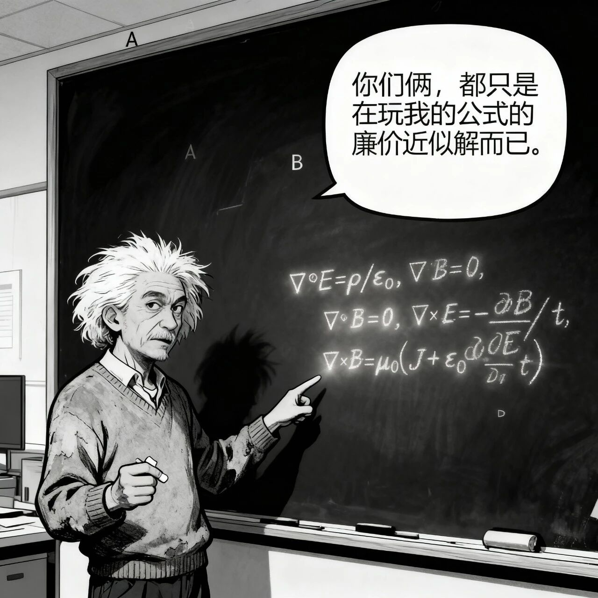

# FOC还是方波？这是个问题。

原创 电磁散人 2025-10-19 07:06 广东

> 原文地址: [https://mp.weixin.qq.com/s/dj80mer4s7jqPMVcrd0MiQ](https://mp.weixin.qq.com/s/dj80mer4s7jqPMVcrd0MiQ)

#FOC控制技术#方波控制技术  
面对无刷直流电机，究竟是采用FOC控制还是方波控制？这种抉择过程完美地揭示了工程学中两种根本性的设计哲学：  
1\. 中心化控制（FOC）：  
目标：追求最优性能。无论是对电机的平稳转矩，还是高效率、宽调速范围。  
代价：复杂度高、成本高，对中央处理器的要求极高，系统更“脆弱”。  
适用场景：对性能有苛刻要求的场合，如高性能伺服驱动、家用电器变频控制、需要静音和平稳运行的场合。  
2\. 去中心化/涌现控制（方波）：  
目标：追求可靠性、简单性和成本效益。系统能够自动适应环境（负载变化），并在部分单元（如一个传感器信号有噪声）出现问题时仍能工作。  
代价：性能有天花板（转矩脉动、噪音、效率在低速时较低）。  
适用场景：对成本敏感、可靠性要求高、性能要求不极致的场合，如风机、水泵、电动工具、 drones 等。

图1

图2

图3