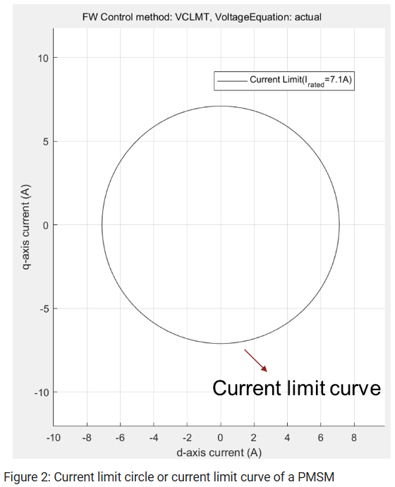
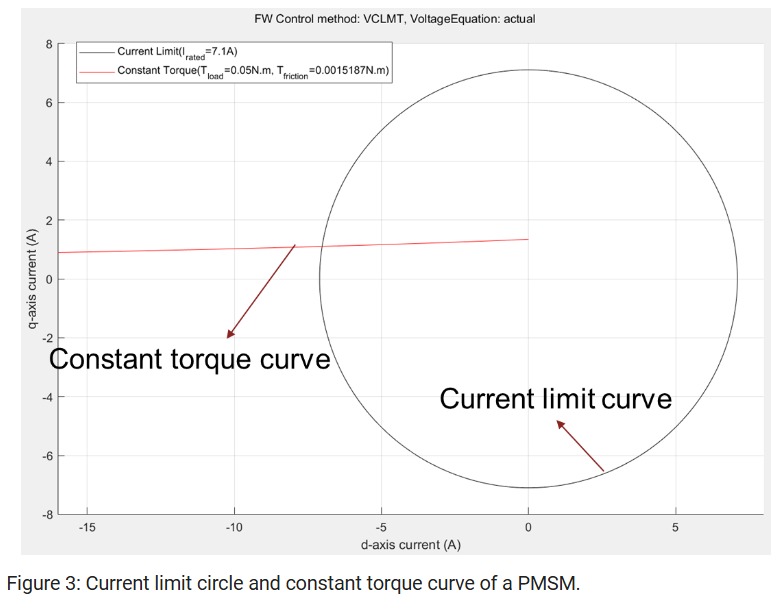
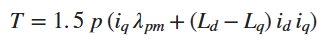
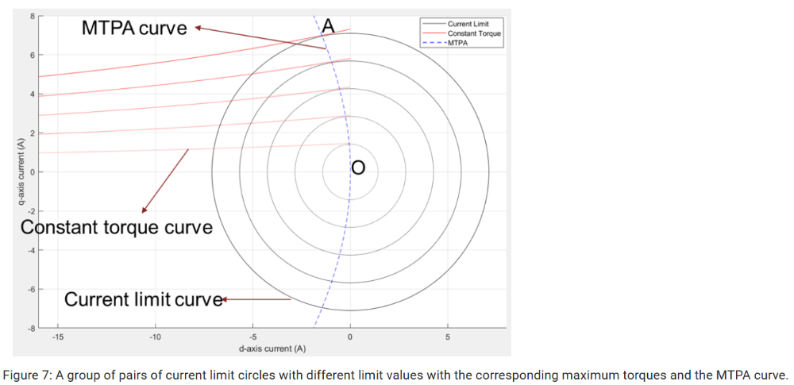
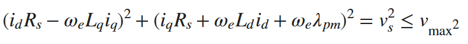
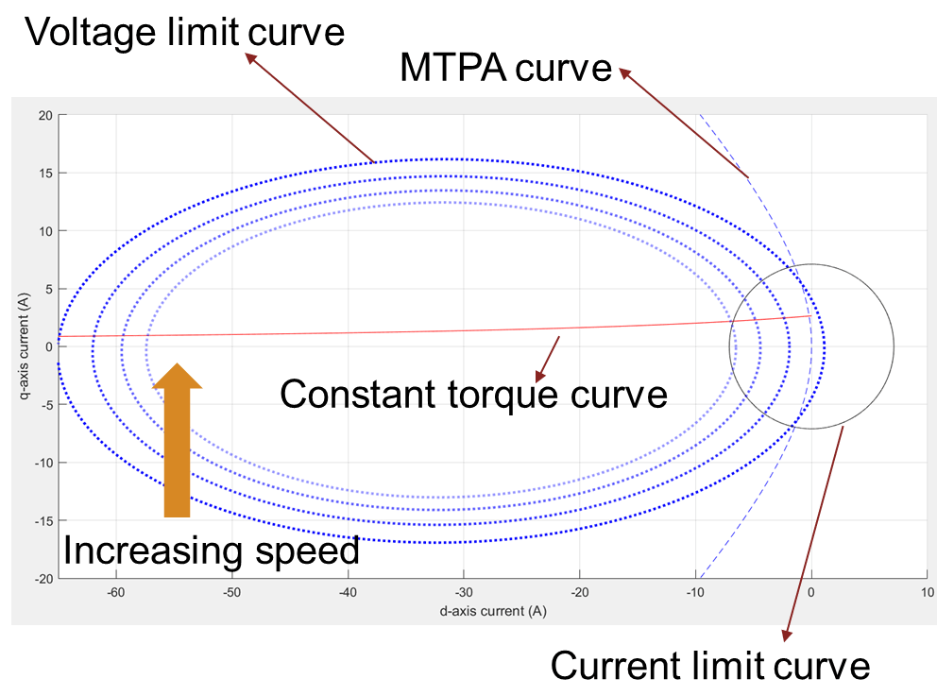
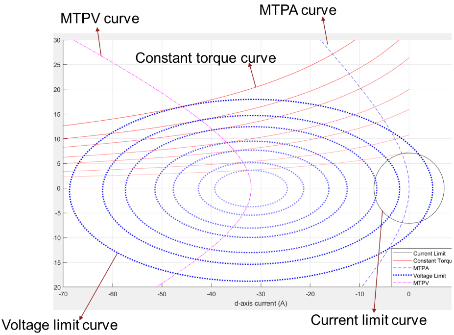

# PMSM世界的“五指山”：孙悟空也逃不出的物理法则

原创 傅存敬 电磁散人 2025-10-28 07:06 广东

> 原文地址: [https://mp.weixin.qq.com/s/OH4L0e8NXrpil4-MWyBPcw](https://mp.weixin.qq.com/s/OH4L0e8NXrpil4-MWyBPcw)

从今天起，咱们继续昨天的引子开启一个全新的系列讲座！咱们要深入一个既熟悉又神秘的世界——电动汽车的核心，那颗强劲的“心脏”：永磁同步电机（PMSM）。

咱们上次聊了，要让电机跑得又快又省电，得给它一本“通关秘籍”，也就是查表（LUT）。但那本秘籍是怎么来的呢？它不是从天上掉下来的，是基于深刻的物理规律和数学计算得来的。今天，咱们就来刨根问底，看看这秘籍的“理论基础”！

这绝对是一篇能打通你“任督二脉”的文章，不管你是搞算法的、搞硬件的，还是设计电机本体的，听完保证你对PMSM有全新的认识！

好！下面我们就先来上第一讲：到底是什么限制了我们电机的性能？也就是这压在电机头上的“五指山”——五大约束曲线！

第一座山：电流极限圆(Current Limit Circle)——“你家的电闸”

各位同仁，我们先来看第一个，也是最容易理解的限制。它是什么呢？就是电流极限。

这就像你家里的总电闸，或者说保险丝。你不能同时开8个空调、10个电磁炉，为什么？因为电流太大了，超过电闸的额定值，它就“啪”地一下跳了，保护电路嘛！

咱们的电机控制器也是一样！负责给电机供电的那个叫“逆变器”的东西，里面的功率器件（MOSFET、IGBT），都是有承受极限的。

硬件工程师同仁，这到你发挥了！你选的那个芯片，datasheet上白纸黑字写着“Maximum Continuous Current: 7.1A”。这就是一个死规定，绝对不能超！

那么这个规定，在我们的“电机地图”（d-q坐标系）上长什么样呢？

请看图！

我们知道，总的定子电流is，可以分解成id和iq两个分量。根据勾股定理，它们的关系就是：

id² + iq² = is²

既然总电流is不能超过最大值ismax，那么我们的约束条件就是：

id² + iq²≤ismax²

同仁们看到这公式，DNA是不是动了？这不就是圆的方程嘛！

所以，在我们的d-q地图上，电流极限就是一个以原点为中心，半径为ismax的大圆圈。我们所有的操作，都必须在这个圈圈里面进行，出去了，硬件就要“GG”了。这就是第一座山，简单、粗暴、但不可逾越！

第二座山：恒转矩曲线(Constant Torque Curve)——“等高线”

好，我们再来看第二个。假如现在用户需要一个0.1Nm的转矩，把他的电动车往前推。我们要怎么给他这个力呢？

这就像爬山。我们要爬到海拔100米的高度，是不是可以从南坡上，也可以从北坡上？有很多条路可以选。对于PMSM来说，要输出一个恒定的转矩，也有很多种id和iq的电流组合。我们把所有能产生同样转矩的点连起来，就形成了一条线。

请看图！ 

上图中红色的线叫恒转矩曲线，你看它长得像不像地图上的“等高线”？在这条线上的任何一个点，海拔（转矩）都是一样的！

电机设计工程师同仁，注意了！这条线长什么样，完全取决于你！它的数学方程是：

你看，这里面有你设计的极对数p、永磁体磁链λpm，还有你最关心的直轴和交轴电感Ld, Lq！你把电机设计成什么样，这些“等高线”的形状就完全不一样。数学上，它是一条双曲线。

第三座山：MTPA曲线——“最省油的路”

有了“等高线”，问题就来了。同样是爬到100米，哪条路最近？哪条路最省劲？

从经济性来说，我们当然希望用最小的电流（最省电），来产生用户想要的那个转矩。这条最省电的路径，就叫MTPA (Maximum Torque Per Ampere)曲线。

请看图！

大家看，这条蓝色的MTPA曲线，就是一系列“等高线”（恒转矩曲线）和“电流圈圈”（电流极限圆）的切点的连线！在每个切点上，我们都用刚好那么大的电流，实现了那个转矩，一丁点儿都没浪费！所以，在不考虑其他限制的情况下，沿着这条路走，就是效率最高的！

第四座山：电压极限曲线(Voltage Limit Curve)——“移动的墙”

前面三座山都好理解，现在，最关键、最动态、也是最有意思的一座山来了！那就是电压极限。

大家骑过自行车吧？你玩命蹬，速度越来越快，这时候你会感觉到什么？脸上的风越来越大！这个“风阻”，就是反抗你前进的力。当风阻和你腿能发出的力一样大的时候，你就再也快不上去了。

电机里也有这个“风阻”，叫反电动势（Back-EMF），它的大小和转速ωe成正比。转速越高，这个反电动势就越大。

而我们控制器能提供的“腿劲”，就是逆变器的电压Vmax。这是一个固定值。

当电机的“内部风阻”（反电动势）加上其他一些电压损耗，大到快要顶上我们的“腿劲”上限Vmax时，电机就跑不动了。这个边界，就构成了电压极限曲线。

它的方程比较复杂：

同仁们不要怕这个公式！我们不是要解它，而是要看懂它！你们发现没有，这个公式里，到处都是转速ωe！

这意味着什么？！

这意味着电压极限曲线不是一堵固定的墙，而是一堵移动的、正在向你挤压过来的墙！

请看图！

你看，随着速度增加（Increasing speed），这个蓝色的椭圆是不是越来越小，还在往左边跑？这就是电压极限！转速越高，留给我们操作的空间就越小！这就是为什么电动车不能无限提速的根本原因之一！它的形状是一个椭圆，因为我们电机的Ld和Lq不一样，把这个限制给“拉扁”了。

第五座山：MTPV曲线——“悬崖边上的极限冲刺”

当速度快到极致，电压这堵墙已经把你逼到角落里了，你还想再榨出一点点性能，怎么办？这时候就要沿着这堵墙的边缘跑，找到那个能产生最大转矩的点。所有这些极限点的集合，就叫MTPV (Maximum Torque Per Voltage)曲线。

请看图！

那条粉色的MTPV曲线，就是我们性能的“最后一道防线”。它定义了在电压受限的情况下，电机所能达到的性能边界。

总结：

今天我们认识了压在电机头上的“五指山”：

1.  电流极限圆：硬件的“保护罩”，绝对不能碰。
    
2.  恒转矩曲线：地图上的“等高线”，告诉我们有哪些路可以走。
    
3.  MTPA曲线：最省油的“高速公路”。
    
4.  电压极限椭圆：一堵随速度升高而不断收缩的“移动墙”。
    
5.  MTPV曲线：“悬崖边”的极限性能边界。
    

正是这五条曲线，共同构成了我们电机运行的完整“世界地图”和“游戏规则”。

那么，了解了规则之后，我们作为“玩家”（控制器），在任何一个给定的速度和转矩要求下，要如何在这张复杂的地图上，瞬间找到那个唯一正确的、最优的落脚点呢？

这就是我们下次分享的内容：如何在这些限制下找到最优工作点——曲线求交分析！

  

原文出处：

https://ww2.mathworks.cn/help/mcb/gs/pmsm-constraint-curves-and-their-application.html