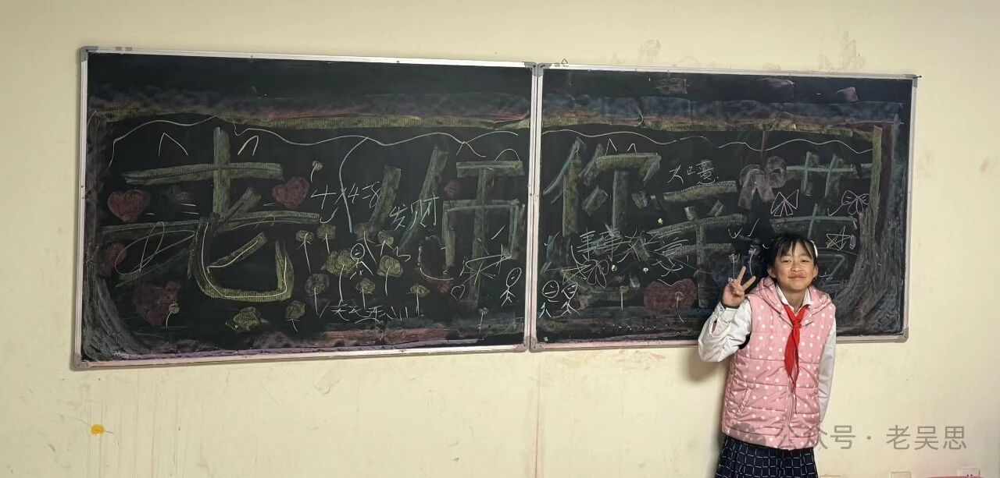

# 分享图片

> 原文地址: [https://mp.weixin.qq.com/s/H-t0oQN\_quQQBr7FQMgmaw](https://mp.weixin.qq.com/s/H-t0oQN_quQQBr7FQMgmaw)

今天四年级上课，我到教室的时候，黑板上的赞美诗已经画好，我赶快找了作者朱睿娴拍照留念。\[强\]有一颗感恩的心热乎乎地呈现在面前的画面感，让天寒心不寒。我直接可以把羽绒大衣脱了上课。  
韩郭骋的奶奶拿着塑料袋我把教室里的垃圾收了，她让我别管，忙我的。感恩啊，有一颗善良的心赤裸裸地撞到了眼前，若不是站在讲台，一定给奶奶深深鞠一躬。在此再次谢过。  
一位慕名而来的妈妈在课后，看见女儿写的习作，眼里有点湿润。小姑娘更是泪珠都要滚下来了。我的手很温暖，帮她挡住了要掉下的泪滴。“别哭……”，当我听到妈妈说描述写作困难的一些极限词的时候，莫名心疼。我知道，身为妈妈在无法帮助孩子时的无力感，确实很绝望。学无止境，很多进步都要交给时间，但我们的相遇是一个缘分的开始吧。母女两走的时候，笑着轻松地和我告别。  
主动的感恩、流动的善良、温暖的承诺。  
今天的四年级就是这样❤️

图1