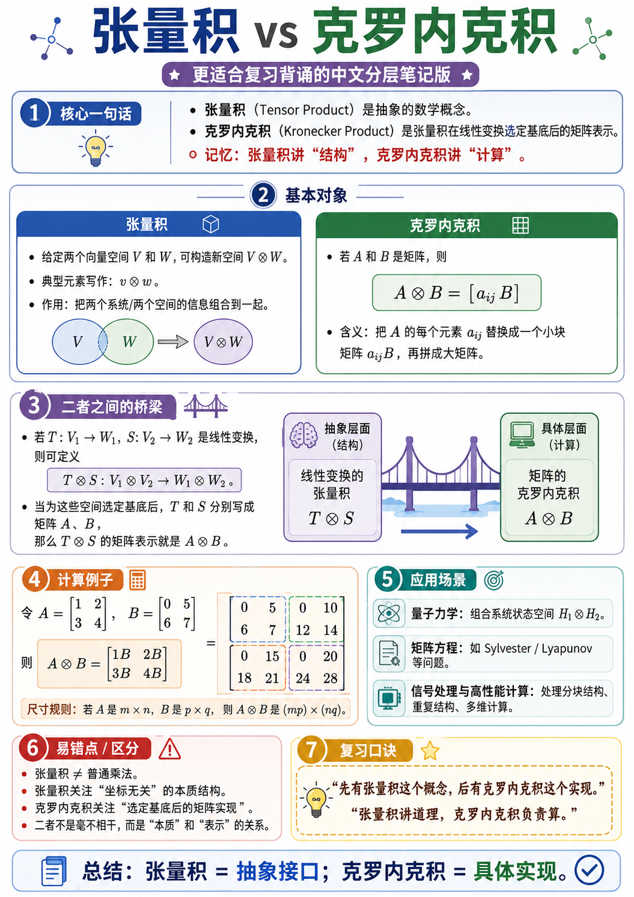

# 如何制作中文分层笔记海报

原创 sonadorje AI之Myth 2026-06-24 16:07 云南

> 原文地址: [https://mp.weixin.qq.com/s/8siSziBykdOKD4gtE-QYdg](https://mp.weixin.qq.com/s/8siSziBykdOKD4gtE-QYdg)

有读者留言问：“作者您好！能问一下您的文章中配图利用什么工具做出来的吗？真心不错。”

我就把这份制作教程分享给大家，希望可以在工作或教学中用到。以下面这份海报为例，一步一步进行制作！



要**手工做出这张“中文分层笔记海报”**，我最推荐你走这条路线：

**最省事方案：PowerPoint（或 WPS 演示） + 图标网站 + 数学公式输入**  
因为这类海报本质上不是“绘画”，而是**信息排版 + 卡片设计 + 少量公式**。  
用 PPT 做，最快、最稳、最好改。

* * *

# 一、先说结论：你需要哪些工具

## 方案 A：最适合新手，直接能做

### 必备

1.  **PowerPoint** 或 **WPS 演示**
    

-   用来排版整张海报
    
-   画圆角矩形、标题条、分栏、图标、阴影、边框
    
-   最后导出 PNG
    

3.  **公式输入工具**
    

-   `V \otimes W`
    
-   `A \otimes B = [a_{ij}B]`
    
-   `T \otimes S : V_1 \otimes V_2 \to W_1 \otimes W_2`
    

-   PPT 自带公式就够用
    
-   输入：
    

6.  **图标来源**
    

-   PPT 自带“插入 → 图标”
    
-   或阿里巴巴矢量图标库 / Flaticon / Iconfont
    
-   用来放：灯泡、桥、计算器、目标、警示、勾选等
    

### 可选但很好用

4.  **Canva（可画）**
    

-   适合找灵感、做配色、排小海报
    
-   但公式输入没 PPT 顺手
    

6.  **Figma**
    

-   如果你更在意精细对齐、组件复用、统一样式
    
-   比 PPT 更专业，但上手略慢
    

8.  **Photoshop**
    

-   只在你要做复杂纹理、精修、抠图时才需要
    
-   做这种知识海报，不是必须
    

* * *

# 二、最推荐的实操路线

我建议你就用：

**PPT/WPS + 图标 + 自带公式**

原因很简单：

-   做这种“分层笔记海报”，核心是**版式**
    
-   不是插画，不需要很强绘图能力
    
-   PPT 最适合：
    

-   分区卡片
    
-   统一圆角
    
-   加边框阴影
    
-   插公式
    
-   对齐元素
    
-   最终导出高清 PNG
    

* * *

# 三、先拆这张海报：它其实是由 7 个模块组成的

你要做的不是“一次性把整张图画出来”，而是把它拆成零件。

这张海报可以拆成：

1.  **大标题区**
    

-   张量积 vs 克罗内克积
    
-   副标题条
    

3.  **核心一句话区**
    

-   3 条最重要结论
    

5.  **基本对象区**
    

-   左：张量积
    
-   右：克罗内克积
    

7.  **桥梁区**
    

-   抽象层 → 具体层
    
-   中间用桥或箭头连接
    

9.  **计算例子区**
    

-   矩阵 + 分块结果
    

11.  **应用场景区**
     

-   3 个应用点
    

13.  **易错点 / 口诀 / 总结区**
     

-   适合复习背诵
    

你只要一个区一个区做，最后拼起来就行。

* * *

# 四、手把手教程：用 PPT 从零做出这张海报

下面我按**真正可操作**的方式写。

* * *

## 第 1 步：新建画布

### 操作

打开 PPT  
点击：

**设计 → 幻灯片大小 → 自定义幻灯片大小**

建议尺寸：

-   **竖版**
    
-   宽：**1080 px 对应比例**
    
-   如果 PPT 里用厘米，可设：
    

-   **宽 19.05 cm**
    
-   **高 33.87 cm**
    

这是接近 9:16 的竖版海报比例，适合做长图。

如果你想更相近这张图，也可以用：

-   **A4 竖版**
    
-   或者 **宽 20 cm，高 28 cm**
    

### 建议

为了导出清晰，宁可画布大一点。

* * *

## 第 2 步：先定整体风格

这张海报的风格不是花哨型，而是：

-   白底
    
-   彩色标题
    
-   卡片分区
    
-   圆角矩形
    
-   轻阴影
    
-   细边框
    
-   图标提示
    
-   层次清楚
    

### 配色建议

你可以直接照这个配色走：

-   **主蓝色**：标题“张量积”
    
-   **主绿色**：标题“克罗内克积”
    
-   **紫色**：桥梁 / 副标题
    
-   **橙色**：例题区
    
-   **青绿色**：应用区
    
-   **红色**：易错点
    
-   **金黄色**：口诀区
    

### 经验

不要每个模块乱换色。  
最好是：

-   一个区块一种主色
    
-   但底色都保持很浅
    
-   边框和标题条用更深的同色系
    

这样会很像“课堂笔记海报”。

* * *

## 第 3 步：做标题区

### 目标

做出最上方这三层：

1.  大标题
    
2.  vs
    
3.  副标题条
    

### 操作

插入 3 个文本框：

-   `张量积`
    
-   `vs`
    
-   `克罗内克积`
    

### 字体建议

中文标题推荐：

-   思源黑体
    
-   阿里巴巴普惠体
    
-   优设标题黑
    
-   微软雅黑 Bold
    

标题要粗、要稳。

### 样式建议

-   “张量积”设为蓝色
    
-   “克罗内克积”设为绿色
    
-   “vs”设为深灰色
    
-   加轻微阴影或发光都可以，但不要太重
    

### 副标题

再插入一个**圆角矩形** 填充紫色，文字白色：

**更适合复习背诵的中文分层笔记版**

两边可以加小星星图标。

* * *

## 第 4 步：先做“一个标准卡片”，后面全靠复制

这一招最重要。

不要每个区都从头画。  
你先做一个**通用卡片模板**：

### 卡片模板长这样

-   白色或极浅色填充
    
-   2–3 px 左右边框
    
-   圆角矩形
    
-   轻阴影
    
-   顶部一个彩色小标题条
    
-   左上角有编号圆点
    

### 操作

1.  插入 → 圆角矩形
    
2.  填充：白色
    
3.  边框：浅蓝或灰色
    
4.  阴影：柔和外阴影
    
5.  再插入一个小圆形，写上数字 `1`
    
6.  再插一个标题条，写“核心一句话”
    

做好以后，**整组复制**，改颜色和内容即可。

这会让整张图风格统一。

* * *

## 第 5 步：做“核心一句话”模块

这是顶部第一块。

### 内容建议

直接放 3 条：

-   张量积（Tensor Product）是抽象的数学概念。
    
-   克罗内克积（Kronecker Product）是张量积在线性变换选定基底后的矩阵表示。
    
-   记忆：张量积讲“结构”，克罗内克积讲“计算”。
    

### 操作建议

-   左边放一个灯泡图标
    
-   右边放正文
    
-   关键字加粗、改色：
    

-   抽象
    
-   矩阵表示
    
-   结构
    
-   计算
    

### 版式诀窍

不要一整段。  
一定拆成**短句 + 项目符号**，更像复习卡。

* * *

## 第 6 步：做“基本对象”双栏区

这是整张海报最核心的“左右对照”。

### 左边：张量积

放这些内容：

-   给定两个向量空间  和 ，可构造新空间 。
    
-   典型元素写作：。
    
-   作用：把两个系统/两个空间的信息组合到一起。
    

### 右边：克罗内克积

放这些内容：

-   若  和  是矩阵，则
    
-   含义：把  的每个元素  替换成一个小块矩阵 ，再拼成大矩阵。
    

### 操作方法

把页面中间划成两栏：

-   左卡片蓝色主题
    
-   右卡片绿色主题
    

### 小图示怎么做

左边可以画 3 个圆：

-   一个圆写 
    
-   一个圆写 
    
-   箭头指向 
    

这不是严格数学图，但很适合教学。

### 公式怎么输入

PPT 中按：

**插入 → 公式**

输入：

```
V \otimes Wv \otimes wA \otimes B = [a_{ij}B]
```

* * *

## 第 7 步：做“桥梁”区

这一块是灵魂。

### 你要表达的不是复杂，而是“关系”

左边写：

-   若 ， 是线性变换，
    
-   则可定义
    

下面再写：

-   选定基底后， 分别写成矩阵 
    
-   那么  的矩阵表示就是 
    

### 视觉上怎么做

中间放一个“桥”图标，或者直接画：

-   左框：抽象层面（结构）
    
-   中间箭头/桥
    
-   右框：具体层面（计算）
    

左框文字：

**线性变换的张量积** 

右框文字：

**矩阵的克罗内克积** 

### 为什么这样做

因为看海报的人第一眼是看图，不是读长证明。  
先让他视觉上明白：

**抽象 → 选基底 → 具体矩阵**

* * *

## 第 8 步：做“计算例子”区

这部分最容易让海报“落地”。

### 推荐直接用这个例子

然后写：

再展开成：

### 这块怎么排最好

左边：

-   原始矩阵 
    

中间：

右边：

-   4×4 展开结果
    

### 很关键的一个技巧

用**虚线框**把 4×4 结果分成四个 2×2 小块：

-   左上块：
    
-   右上块：
    
-   左下块：
    
-   右下块：
    

这样别人一眼就懂“每个元素替换成一个块矩阵”。

* * *

## 第 9 步：做“应用场景”区

这块别写太多，3 条就够。

### 推荐文案

-   量子力学：组合系统状态空间 
    
-   矩阵方程：如 Sylvester / Lyapunov 等问题
    
-   信号处理与高性能计算：处理分块结构、重复结构、多维计算
    

### 操作

每一条左边配一个小图标：

-   原子图标
    
-   文档/矩阵图标
    
-   电脑/芯片图标
    

每一条做成一条浅色小条框，会更整洁。

* * *

## 第 10 步：做“易错点 / 口诀 / 总结”区

这部分最适合背诵。

### 易错点区

内容放：

-   张量积 ≠ 普通乘法
    
-   张量积关注“坐标无关”的本质结构
    
-   克罗内克积关注“选定基底后的矩阵实现”
    
-   二者不是毫不相干，而是“本质”和“表示”的关系
    

这块用红色标题最醒目。

* * *

### 口诀区

单独做一个黄色或橙黄色记忆卡：

-   先有张量积这个概念，后有克罗内克积这个实现。
    
-   张量积讲道理，克罗内克积负责算。
    

这块可以加灯泡或者星星图标。

* * *

### 底部总结条

整张图最下方做一个长条：

**总结：张量积 = 抽象接口；克罗内克积 = 具体实现。**

这里适合：

-   左边蓝色
    
-   右边绿色
    
-   最右边放一个勾选图标
    

* * *

# 五、做这种海报时，最常用的 8 个 PPT 功能

你基本就靠这几个：

## 1\. 圆角矩形

做所有卡片底板

## 2\. 对齐

菜单：

**形状格式 → 对齐**

常用：

-   左右对齐
    
-   顶部对齐
    
-   横向分布
    
-   纵向分布
    

这个决定整张图高级不高级。

## 3\. 组合

把“数字圆点 + 标题条 + 卡片”组合起来，方便复制

## 4\. 阴影

轻微就好，别太重

## 5\. 图标

插入 → 图标

## 6\. 文本框

一块内容一个文本框，方便后期微调

## 7\. 公式

插入 → 公式

## 8\. 导出 PNG

文件 → 导出 → PNG

* * *

# 六、这类海报最容易翻车的地方

## 1\. 字太多

海报不是论文。  
一块卡片最多 3–5 条，单条尽量不超过两行。

## 2\. 颜色太杂

最好 5–6 种主色封顶。  
不是每句话都换颜色。

## 3\. 边框太粗

会显得笨重。  
轻边框 + 浅底色最干净。

## 4\. 公式太小

数学海报的公式必须一眼能看清。

## 5\. 对齐不齐

这是最毁质感的一点。  
一定用“对齐”和“分布”。

## 6\. 模块没有留白

卡片和卡片之间要有呼吸感。

* * *

# 七、给你一套直接能照着做的制作顺序

你实际操作时，按这个顺序最省时间：

### 第一天 30–60 分钟版本

1.  新建竖版画布
    
2.  先写完整文案
    
3.  做标题区
    
4.  做一个标准卡片模板
    
5.  复制出 7 个区块
    
6.  先填文字，不管美化
    
7.  最后统一配色、边框、图标、阴影
    
8.  导出 PNG
    

* * *

# 八、如果你想做得像“专业教学海报”，再加这几个细节

## 1\. 统一圆角

所有卡片圆角保持一致

## 2\. 标题条统一高度

例如每个标题条都高 0.8 cm

## 3\. 正文字号统一

例如：

-   大标题：28–36 pt
    
-   小标题：16–20 pt
    
-   正文：11–14 pt
    
-   公式：14–18 pt
    

## 4\. 同类区块颜色一致

-   蓝：概念
    
-   绿：矩阵
    
-   紫：桥梁
    
-   橙：例子
    
-   红：易错
    
-   黄：口诀
    

## 5\. 图标风格一致

尽量都选线性图标，别一会儿扁平，一会儿 3D

* * *

# 九、如果你完全没做过设计，我建议你直接这样选工具

## 新手最稳组合

-   **WPS 演示 / PowerPoint**
    
-   **PPT 自带图标**
    
-   **PPT 自带公式**
    
-   **最后导出 PNG**
    

这是最现实、成功率最高的方案。

## 如果你想更漂亮

-   版式：**Figma**
    
-   数学公式：LaTeX 截图或公式插件
    
-   精修：Photoshop
    

但这个更费时间。

* * *

# 十、我给你的最终建议

如果你的目标是：

-   自己能复用
    
-   以后继续做“数学分层笔记海报”
    
-   能稳定产出
    

那你就建立一个自己的模板库：

1.  标题模板
    
2.  双栏对照模板
    
3.  例题模板
    
4.  应用场景模板
    
5.  易错点模板
    
6.  总结条模板
    

以后你做别的主题，比如：

-   张量 vs 向量
    
-   梯度 vs 散度 vs 旋度
    
-   傅里叶级数 vs 傅里叶变换
    

都可以直接套版。

* * *

# 实操教程

我直接给你一份 **“照着点就能做”的 PPT 实操版教程**。  
你可以把它当成一份**制作清单 + 操作手册**。

下面默认用 **PowerPoint** 讲；如果你用 **WPS 演示**，绝大多数菜单名字都差不多。

* * *

# 一、先准备 4 样东西

## 1\. 软件

-   PowerPoint 或 WPS 演示
    

## 2\. 字体

推荐准备这 3 类字体：

-   **标题字体**：思源黑体 Heavy / 阿里巴巴普惠体 Bold / 优设标题黑
    
-   **正文字体**：思源黑体 / 微软雅黑 / HarmonyOS Sans
    
-   **公式字体**：PPT 自带公式即可
    

## 3\. 图标

你需要这些小图标：

-   灯泡
    
-   立方体
    
-   表格 / 网格
    
-   桥
    
-   计算器
    
-   靶心 / 目标
    
-   警告
    
-   星星
    
-   对勾
    
-   原子 / 电脑 / 文档
    

来源：

-   PPT：`插入 → 图标`
    
-   或 Iconfont / Flaticon 下载 SVG
    

## 4\. 文案

先把海报所有文字整理好，后面直接复制进去。你可以用下面这版：

* * *

### 标题

**张量积 vs 克罗内克积**

### 副标题

**更适合复习背诵的中文分层笔记版**

### 模块 1：核心一句话

-   张量积（Tensor Product）是抽象的数学概念。
    
-   克罗内克积（Kronecker Product）是张量积在线性变换选定基底后的矩阵表示。
    
-   记忆：张量积讲“结构”，克罗内克积讲“计算”。
    

### 模块 2：基本对象

**张量积**

-   给定两个向量空间 V 和 W，可构造新空间 V ⊗ W。
    
-   典型元素写作：v ⊗ w。
    
-   作用：把两个系统 / 两个空间的信息组合到一起。
    

**克罗内克积**

-   若 A 和 B 是矩阵，则  
    A ⊗ B = \[aᵢⱼB\]
    
-   含义：把 A 的每个元素 aᵢⱼ 替换成一个小块矩阵 aᵢⱼB，再拼成大矩阵。
    

### 模块 3：二者之间的桥梁

-   若 T: V₁ → W₁，S: V₂ → W₂ 是线性变换，则可定义  
    T ⊗ S : V₁ ⊗ V₂ → W₁ ⊗ W₂
    
-   当为这些空间选定基底后，T 和 S 分别写成矩阵 A、B，
    
-   那么 T ⊗ S 的矩阵表示就是 A ⊗ B。
    

### 模块 4：计算例子

-   令  
    A = \[\[1,2\],\[3,4\]\]  
    B = \[\[0,5\],\[6,7\]\]
    
-   则  
    A ⊗ B = \[\[1B,2B\],\[3B,4B\]\]
    
-   展开为  
    \[\[0,5,0,10\],  
    \[6,7,12,14\],  
    \[0,15,0,20\],  
    \[18,21,24,28\]\]
    
-   尺寸规则：若 A 是 m×n，B 是 p×q，则 A ⊗ B 是 (mp)×(nq)。
    

### 模块 5：应用场景

-   量子力学：组合系统状态空间 H₁ ⊗ H₂
    
-   矩阵方程：如 Sylvester / Lyapunov 等问题
    
-   信号处理与高性能计算：处理分块结构、重复结构、多维计算
    

### 模块 6：易错点 / 区分

-   张量积 ≠ 普通乘法
    
-   张量积关注“坐标无关”的本质结构
    
-   克罗内克积关注“选定基底后的矩阵实现”
    
-   二者不是毫不相干，而是“本质”和“表示”的关系
    

### 模块 7：复习口诀

-   先有张量积这个概念，后有克罗内克积这个实现。
    
-   张量积讲道理，克罗内克积负责算。
    

### 底部总结

**总结：张量积 = 抽象接口；克罗内克积 = 具体实现。**

* * *

# 二、先把 PPT 画布设好

## 第 1 步：新建空白页

打开 PPT → 新建空白演示文稿

## 第 2 步：改页面尺寸

点击：

`设计 → 幻灯片大小 → 自定义幻灯片大小`

输入建议：

-   宽：**19.2 cm**
    
-   高：**27.2 cm**
    

这是比较适合做竖版海报的比例。  
也可以用：

-   宽 20 cm
    
-   高 28.3 cm
    

然后选择：

**确保适合**

## 第 3 步：打开参考线

点击：

`视图 → 勾选 标尺 / 网格线 / 参考线`

这一步非常重要，不然你后面很容易摆歪。

* * *

# 三、先做全局样式，后面复制最省时间

这一步决定你后面是不是轻松。

## 第 4 步：设置背景

点击空白页 → 右键 → `设置背景格式`

-   填充：纯色填充
    
-   颜色：白色 或 很浅的灰白色
    

建议纯白就行。

* * *

## 第 5 步：先定 6 个主色

建议你手动记住这套配色，后面所有模块都用它：

-   蓝色：#2457C5
    
-   绿色：#1E8A48
    
-   紫色：#7A4FC8
    
-   橙色：#F39A2B
    
-   青绿色：#2AA6A4
    
-   红色：#D94B45
    
-   金黄色：#E0A521
    

不会输色号也没关系，选接近的就行。

* * *

## 第 6 步：做一个“通用卡片”

先做一个，后面全靠复制。

### 操作

点击：

`插入 → 形状 → 圆角矩形`

拖一个大卡片出来。

### 设置样式

右键形状 → 设置形状格式：

-   填充：白色
    
-   线条：浅灰蓝，1.5 磅
    
-   阴影：外阴影，模糊一点，透明度高一点
    
-   圆角：直接拖黄色控制点，别太圆也别太直
    

这就是你的基础卡片模板。

* * *

# 四、做标题区

* * *

## 第 7 步：插入大标题

点击：

`插入 → 文本框`

输入：

**张量积**

设置：

-   字体：粗体黑体
    
-   大小：28–36
    
-   颜色：蓝色
    

再插一个文本框：

**vs**

-   深灰色
    
-   大小略小一点
    

再插一个文本框：

**克罗内克积**

-   绿色
    
-   大小和“张量积”一致
    

### 排列方式

让三者居中排成一行。

然后全选这 3 个文本框：

`形状格式 → 对齐 → 顶端对齐` 再： `形状格式 → 对齐 → 横向分布`

* * *

## 第 8 步：插入两侧小装饰图标

点击：

`插入 → 图标`

搜索：

-   molecule
    
-   network
    
-   nodes
    

左边放一个蓝色小装饰，右边放一个绿色小装饰。

这一步不是必须，但会让标题更完整。

* * *

## 第 9 步：做副标题条

点击：

`插入 → 形状 → 圆角矩形`

在标题下方画一个横条。

设置：

-   填充：紫色
    
-   轮廓：无轮廓
    

在里面输入：

**更适合复习背诵的中文分层笔记版**

文字：

-   白色
    
-   加粗
    
-   居中
    

两边可以各加一个星星图标。

* * *

# 五、做第 1 块：核心一句话

* * *

## 第 10 步：复制通用卡片

把刚才做好的卡片复制一个，放到标题下面。

高度不用太高，横向铺开即可。

* * *

## 第 11 步：做编号圆点

点击：

`插入 → 形状 → 椭圆`

按住 Shift 画一个正圆。

设置：

-   填充：蓝色
    
-   线条：无
    
-   文字：白色
    
-   输入：`1`
    

放在卡片左上角。

* * *

## 第 12 步：做标题小条

插入一个小圆角矩形，放在圆点右边，输入：

**核心一句话**

设置：

-   填充：蓝色
    
-   文字白色
    
-   加粗
    

左边再插一个灯泡图标。

* * *

## 第 13 步：填正文

插入文本框，写入 3 条内容。  
注意：

-   每条前面加圆点
    
-   行距 1.2–1.3
    
-   关键字改色
    

建议这样突出：

-   “抽象” 用蓝色或红色
    
-   “矩阵表示” 用绿色
    
-   “结构” “计算” 用红色加粗
    

* * *

# 六、做第 2 块：基本对象（左右双栏）

* * *

## 第 14 步：做“模块标题”

先在下面插入一个模块标题：

-   中间放数字圆点 `2`
    
-   后面写 **基本对象**
    
-   左右可以各画一条细线
    

这一步让页面层级更清楚。

* * *

## 第 15 步：做左卡片“张量积”

复制通用卡片，放左边。

顶部再放一个蓝色标题条，写：

**张量积**

左上角或右上角加一个立方体图标。

正文写：

-   给定两个向量空间 V 和 W，可构造新空间 V ⊗ W。
    
-   典型元素写作：v ⊗ w。
    
-   作用：把两个系统 / 两个空间的信息组合到一起。
    

* * *

## 第 16 步：插入公式

点击：

`插入 → 公式`

依次输入：

`V \otimes W`

`v \otimes w`

PPT 会自动排成数学公式。

* * *

## 第 17 步：做一个小示意图

在左卡片底部画 3 个圆：

-   左圆写 `V`
    
-   右圆写 `W`
    
-   箭头指向右边一个新圆，写 `V ⊗ W`
    

### 操作

-   插入 → 形状 → 椭圆
    
-   插入 → 形状 → 箭头
    

颜色：

-   V：蓝边
    
-   W：绿边
    
-   V ⊗ W：紫边
    

这一步能让内容更“图文化”。

* * *

## 第 18 步：做右卡片“克罗内克积”

复制左卡片，移到右边，改成绿色主题。

标题改成：

**克罗内克积**

图标改成网格 / 表格。

正文写：

-   若 A 和 B 是矩阵，则
    
-   A ⊗ B = \[aᵢⱼB\]
    
-   含义：把 A 的每个元素 aᵢⱼ 替换成一个小块矩阵 aᵢⱼB，再拼成大矩阵。
    

* * *

## 第 19 步：把公式单独做成“高亮框”

给公式外面再套一个浅绿色圆角矩形框。

设置：

-   浅绿色填充
    
-   绿色边框
    
-   公式居中
    

这样这块会更像“重点公式”。

* * *

# 七、做第 3 块：二者之间的桥梁

* * *

## 第 20 步：新建桥梁模块

复制一个大卡片，放到双栏下面，横向铺开。

左上角编号圆点改成 `3`，标题改：

**二者之间的桥梁**

颜色建议：紫色。

* * *

## 第 21 步：左边放文字

插入文本框，写：

-   若 T: V₁ → W₁，S: V₂ → W₂ 是线性变换，则可定义
    
-   T ⊗ S : V₁ ⊗ V₂ → W₁ ⊗ W₂
    
-   当为这些空间选定基底后，T 和 S 分别写成矩阵 A、B，
    
-   那么 T ⊗ S 的矩阵表示就是 A ⊗ B。
    

其中第二行公式建议单独放进淡紫色高亮框里。

* * *

## 第 22 步：右边做“桥梁图”

最简单的做法有两种。

### 方法 A：图标法

插入一个桥图标，放中间。

桥左边做一个小框，写：

**抽象层面（结构）**  
线性变换的张量积  
T ⊗ S

桥右边做一个小框，写：

**具体层面（计算）**  
矩阵的克罗内克积  
A ⊗ B

下面再放一个右箭头。

### 方法 B：纯文字箭头法

如果没有桥图标，也可以直接做：

`T ⊗ S → A ⊗ B`

上面小字写：

抽象 → 选定基底 → 具体矩阵表示

* * *

# 八、做第 4 块：计算例子

* * *

## 第 23 步：新建例子模块

复制大卡片，放到下方左半边。

编号改 `4`，标题改：

**计算例子**

颜色改橙色。

* * *

## 第 24 步：先放 A 和 B

插入公式：

`A=\begin{bmatrix}1&2\\3&4\end{bmatrix}`

`B=\begin{bmatrix}0&5\\6&7\end{bmatrix}`

左右排开。

* * *

## 第 25 步：放中间步骤

再插入一个公式框：

`A\otimes B=\begin{bmatrix}1B&2B\\3B&4B\end{bmatrix}`

这一步建议套一个浅橙色边框。

* * *

## 第 26 步：放最终展开矩阵

插入公式：

`=\begin{bmatrix}0&5&0&10\\6&7&12&14\\0&15&0&20\\18&21&24&28\end{bmatrix}`

放在右侧或下侧。

* * *

## 第 27 步：给 4×4 矩阵加“分块提示”

这是最加分的一步。

### 简单做法

不用真的把矩阵切开，只要在矩阵周围画 4 个虚线框即可：

-   左上框：蓝色虚线
    
-   右上框：绿色虚线
    
-   左下框：橙色虚线
    
-   右下框：紫色虚线
    

让人一眼看出它是由四个 2×2 小块拼起来的。

* * *

## 第 28 步：写尺寸规则

在卡片底部加一句：

**尺寸规则：若 A 是 m×n，B 是 p×q，则 A ⊗ B 是 (mp)×(nq)。**

可以放在一条浅橙色长条里。

* * *

# 九、做第 5 块：应用场景

* * *

## 第 29 步：新建应用模块

复制一张卡片，放到例子区右边。

编号改 `5`，标题改：

**应用场景**

颜色改青绿色。

* * *

## 第 30 步：做 3 条场景条目

每条都做成“图标 + 说明”的小横条。

### 第 1 条

图标：原子  
文字：量子力学：组合系统状态空间 H₁ ⊗ H₂

### 第 2 条

图标：文档 / 方程  
文字：矩阵方程：如 Sylvester / Lyapunov 等问题

### 第 3 条

图标：电脑 / 芯片  
文字：信号处理与高性能计算：处理分块结构、重复结构、多维计算

每一条都可以放进一个很浅的青色圆角框中。

* * *

# 十、做第 6 块：易错点 / 区分

* * *

## 第 31 步：新建易错点模块

复制卡片，放左下方。

编号改 `6`，标题改：

**易错点 / 区分**

颜色改红色。

* * *

## 第 32 步：填入 4 条内容

-   张量积 ≠ 普通乘法
    
-   张量积关注“坐标无关”的本质结构
    
-   克罗内克积关注“选定基底后的矩阵实现”
    
-   二者不是毫不相干，而是“本质”和“表示”的关系
    

左边加一个警告图标会很好看。

* * *

# 十一、做第 7 块：复习口诀

* * *

## 第 33 步：新建口诀模块

复制卡片，放右下方。

编号改 `7`，标题改：

**复习口诀**

颜色改金黄色。

* * *

## 第 34 步：做一个“记忆框”

在卡片内部再画一个虚线边框矩形，里面写：

-   先有张量积这个概念，后有克罗内克积这个实现。
    
-   张量积讲道理，克罗内克积负责算。
    

旁边加灯泡或者星星图标。

* * *

# 十二、做最底部总结条

* * *

## 第 35 步：画底部长条

插入一个长圆角矩形，横跨整个页面底部。

填充白色或浅蓝色，边框略深。

输入：

**总结：张量积 = 抽象接口；克罗内克积 = 具体实现。**

建议：

-   “张量积” 和 “抽象接口” 用蓝色
    
-   “克罗内克积” 和 “具体实现” 用绿色
    

右边加一个对勾图标。

* * *

# 十三、最后统一排版，这是最关键的美化步骤

* * *

## 第 36 步：统一对齐

每做完一个大区块，都执行一次：

`形状格式 → 对齐`

常用：

-   左对齐
    
-   顶端对齐
    
-   横向分布
    
-   纵向分布
    

### 经验

如果你觉得“怎么总差一点点不好看”，十有八九就是没对齐。

* * *

## 第 37 步：统一字号

推荐统一成这套：

-   大标题：30–36 pt
    
-   副标题：14–18 pt
    
-   模块标题：16–20 pt
    
-   正文：11–13 pt
    
-   公式：14–18 pt
    
-   底部总结：18–22 pt
    

* * *

## 第 38 步：统一圆角、边框、阴影

检查 3 件事：

-   所有卡片圆角是不是差不多
    
-   所有边框粗细是不是一致
    
-   所有阴影是不是轻微、统一
    

如果不统一，整张图就会显得“拼出来的”。

* * *

## 第 39 步：统一图标风格

确保图标不要混用：

-   一部分是线性图标
    
-   一部分是 3D 彩色图标
    

尽量统一为一种风格，推荐线性图标。

* * *

# 十四、导出高清 PNG

* * *

## 第 40 步：导出

点击：

`文件 → 导出 → 更改文件类型 → PNG`

或者：

`文件 → 另存为 → PNG`

如果 PPT 弹出提示：

-   导出当前页
    
-   还是全部幻灯片
    

选择：**仅当前幻灯片**

* * *

## 第 41 步：如果导出不够清晰

有两种解决方法：

### 方法 1

把幻灯片尺寸一开始设大一点

### 方法 2

导出 PDF，再转高分辨率 PNG

如果你对清晰度要求高，第二种更稳。

* * *

# 十五、给你一个最快的“1小时成品法”

如果你今天就想做出来，不求极致美化，按这个顺序：

## 0–10 分钟

-   建画布
    
-   定配色
    
-   写标题
    

## 10–20 分钟

-   做一个通用卡片模板
    
-   复制出所有模块位置
    

## 20–35 分钟

-   先把全部文字放进去
    
-   先不管图标、阴影、花纹
    

## 35–45 分钟

-   插公式
    
-   做左右双栏
    
-   做桥梁和例子区
    

## 45–55 分钟

-   插图标
    
-   改颜色
    
-   调对齐
    

## 55–60 分钟

-   导出 PNG
    
-   检查有没有字太小、边距太挤、公式被遮挡
    

* * *

# 十六、你最容易遇到的 6 个实际问题

## 1\. 公式总是不居中

办法：

-   把公式放进单独文本框或单独公式框
    
-   再和外面的高亮框一起居中
    

## 2\. 卡片复制后大小不一致

办法：

-   先选中一个标准卡片
    
-   复制，不要每次重新画
    

## 3\. 文字太挤

办法：

-   减少句子长度
    
-   改成项目符号
    
-   增大行距
    

## 4\. 模块太乱

办法：

-   一行最多放 2 个大模块
    
-   上中下分层，不要到处塞
    

## 5\. 导出后发虚

办法：

-   画布做大
    
-   或导出 PDF 再转 PNG
    

## 6\. 看起来不“高级”

办法：

-   少用花里胡哨渐变
    
-   保持白底
    
-   统一圆角、边框、阴影、图标风格
    

* * *

# 十七、最适合你长期复用的方法

你以后肯定不止做这一张。  
所以建议你做完以后，保留一个 **PPT 模板文件**，里面留好这些母版：

1.  大标题模板
    
2.  核心一句话模板
    
3.  左右对照模板
    
4.  桥梁模板
    
5.  计算例子模板
    
6.  应用场景模板
    
7.  易错点模板
    
8.  口诀模板
    
9.  底部总结条模板
    

以后你做别的主题，只要替换文字和公式就行。