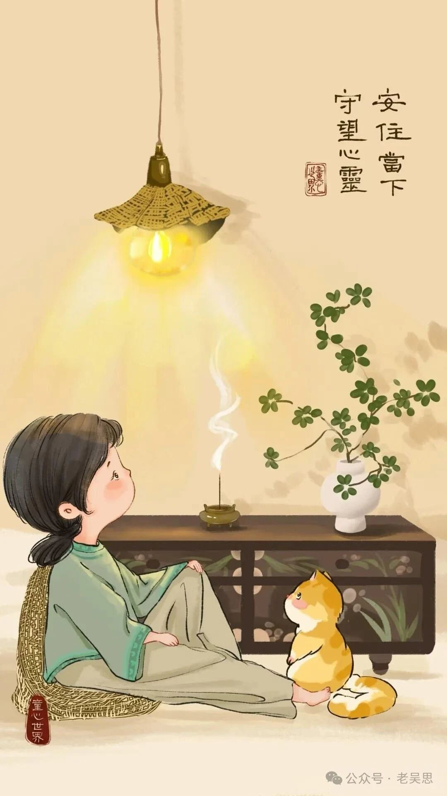

# 我的散尾葵

> 原文地址: [https://mp.weixin.qq.com/s/OoDmAMijYhIqzPxBRStzYA](https://mp.weixin.qq.com/s/OoDmAMijYhIqzPxBRStzYA)

我的书房里很多绿植，和植物相处让我平和而安静。有一棵散尾葵，从茂盛慢慢变得稀疏，然后下垂恹恹没有生气。我想了很多办法救治，它还是不行。只能把高大修长的叶子全剪了，光秃秃的盆陪着星星点点的绿意重新生长。房间的那个角落就因为散尾葵的退出而变得差了感觉。  
昨天，顺丰到了一棵散尾葵。朋友送的。惊喜来得意外，这种意外逼着慢慢生长的散尾葵必须退场了。我费劲地把原来的大根刨出来，把绿意盎然的新朋友移栽了进旧盆。  
角落里的绿意回来了，阳光从纱窗里筛进来的时候，更好的散尾葵抖动着绿意。我才惊觉，每个人都值得拥有生命中更好的，不必在叹息中等待所谓成长。  
相遇何其有幸，相守又何其困难，相知太漫长了，中途的退场有时也不是黯然神伤，只是一种“让”吧，把位置让给更好更适合的。  
和散尾葵做过彼此生命中照亮过对方的陪伴，精神明亮世界明亮。在告别的时候，我们只能正视内心的精神感受和需求，允许快乐发生，也允许告别发生。  
我把刨出来的散尾葵根块归还于大自然，在家门口的空地里让它重新安家落户，让它没有了点缀空间的任务，只静静地重新感受生命的意义。  
就像我们生命里的很多人，当一段关系过于消耗心力，及时停止不失为明智之举，颠簸的生活里有各种闪闪放光的瞬间。接纳人生里的相遇和别离，你值得更好的。  
做彼此生命里最合适的遇见，栉风沐雨就都能挺住，做彼此生命里的光，任何黑暗都无所畏惧。  
早安，我的朋友们。❤️  
愿你的生活里有茁壮成长散尾葵，有欣欣向荣的力量。  
  
——导航作文•花语

图1